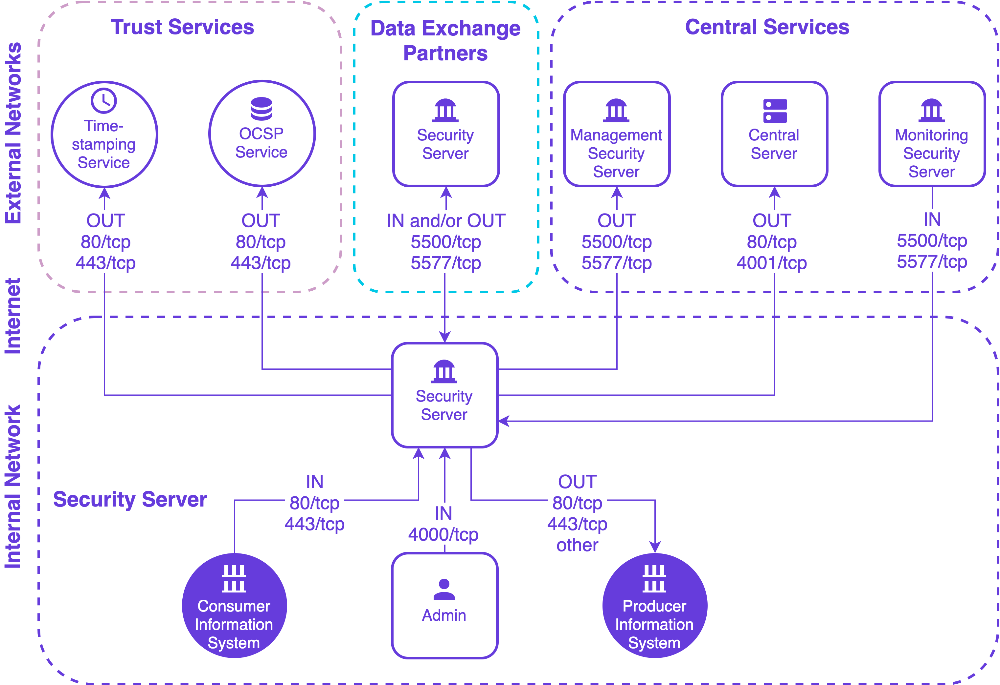

************ig-ss_x-road_v6_security_server_installation_guide*******************
16,74c16,70
<  Date      | Version | Description                                                     | Author
<  --------- | ------- | --------------------------------------------------------------- | --------------------
<  01.12.2014 | 1.0     | Initial version                                                 |
<  19.01.2015 | 1.1     | License information added                                       |
<  18.03.2015 | 1.2     | Meta-package for security server added. Legacy securelog module removed |
<  02.04.2015 | 1.3     | “sdsb” change to “xroad”                                        |
<  27.05.2015 | 1.4     | Some typos fixed                                                |
<  30.06.2015 | 1.5     | Minor corrections done                                          |
<  06.07.2015 | 1.6     | New repository address                                          |
<  18.09.2015 | 1.7     | Reference data in [3.2](#32-reference-data) updated                                   |
<  18.09.2015 | 2.0     | Editorial changes made                                          |
<  13.10.2015 | 2.1     | Editorial changes made                                          |
<  10.12.2015 | 2.2     | Updated the installing of the support for hardware tokens ([2.7](#27-installing-the-support-for-hardware-tokens)) |
<  17.12.2015 | 2.3     | Added *xroad-addon-wsdlvalidator* package                       |
<  19.05.2016 | 2.4     | Merged changes from xtee6-doc repo. Updated table [2.2](#22-reference-data) with p 1.12, added chapter [2.8](#28-installing-support-for-monitoring) and updated [3.2](#32-reference-data). |
<  30.09.2016 | 2.5     | Added chapter „[Different versions of xroad-\* package after successful upgrade](#45-different-versions-of-xroad--packages-after-successful-upgrade)“. |
<  07.12.2016 | 2.6     | Added operational data monitoring packages. 2 GB RAM -&gt; 3 GB RAM |
<  23.02.2017 | 2.7     | Converted to Github flavoured Markdown, added license text, adjusted tables for better output in PDF | Toomas Mölder
<  13.04.2017 | 2.8     | Added token ID formatting                                       | Cybernetica AS
<  22.01.2018 | 2.8.1   | Added NEE and NGO member classes                                | Jürgen Šuvalov
<  25.08.2017 | 2.9     | Update environmental monitoring installation information | Ilkka Seppälä
<  15.09.2017 | 2.10    | Added package with configuration specific to Estonia xroad-securityserver-ee | Cybernetica AS
<  05.03.2018 | 2.11    | Added terms and abbreviations reference and document links | Tatu Repo
<  10.04.2018 | 2.12    | Updated chapter "[Installing the Support for Hardware Tokens](#27-installing-the-support-for-hardware-tokens)" with configurable parameters described in the configuration file 'devices.ini' | Cybernetica AS
<  07.06.2018 | 2.12.1  | Updated repository information with x-tee.ee domain             | Jürgen Šuvalov
<  03.07.2018 | 2.12.2  | Added network diagram and reference data for monitoring servers | Jürgen Šuvalov
<  08.08.2018 | 2.12.3  | Editorial changes												| Jan Raik
<  13.08.2018 | 2.12.4  | Package name fix											    | Taavi Meinberg
<  14.10.2018 | 2.13    | Update package repository address | Petteri Kivimäki
<  25.10.2018 | 2.14    | Add RHEL7 as supported platform, update section 2.2 Reference data | Petteri Kivimäki
<  15.11.2018 | 2.15    | Add Ubuntu 18 installation instructions | Jarkko Hyöty
<  28.01.2018 | 2.16    | Update port 2080 documentation | Petteri Kivimäki
<  30.05.2019 | 2.17    | Added package installation instructions on chapter "[2.4 Preparing OS](#24-preparing-os)" | Raul Martinez
<  11.09.2019 | 2.18    | Remove Ubuntu 14.04 from supported platforms | Jarkko Hyöty
<  20.09.2019 | 2.19    | Add instructions for using remote databases | Ilkka Seppälä
<  12.04.2020 | 2.20    | Add note about the default value of the *connector-host* property in the EE-package | Petteri Kivimäki
<  29.04.2020 | 2.21    | Add instructions how to use remote database located in Microsoft Azure | Ilkka Seppälä
<  12.06.2020 | 2.22    | Update reference data regarding JMX listening ports | Petteri Kivimäki
<  24.06.2020 | 2.23    | Add repository sign key details in section [2.2 Reference data](#22-reference-data) | Petteri Kivimäki
<  24.06.2020 | 2.24    | Remove environmental and operational monitoring daemon JMX listening ports from section [2.2 Reference data](#22-reference-data) | Petteri Kivimäki
<  09.08.2020 | 2.25    | Update ports information in section [2.2 Reference data](#22-reference-data), add section [2.2.1 Network Diagram](#221-network-diagram) | Petteri Kivimäki
<  17.08.2020 | 2.26    | Update for RHEL 8. | Jarkko Hyöty
<  08.09.2020 | 2.27    | Fix minimum RAM requirement. | Ilkka Seppälä
<  16.09.2020 | 2.28    | Describe deployment options and database customization options. | Ilkka Seppälä
<  29.09.2020 | 2.29    | Add instructions for creating database structure and roles manually. | Ilkka Seppälä
<  19.01.2021 | 2.30    | Add instructions for using an alternative Java distribution. | Jarkko Hyöty
<  04.02.2021 | 2.31    | Minor updates. | Ilkka Seppälä
<  13.04.2021 | 2.32    | Update minimum requirements in section [2.2 Reference data](#22-reference-data) | Petteri Kivimäki
<  16.04.2021 | 2.33    | Update remote database installation instructions                | Jarkko Hyöty
<  18.05.2021 | 2.34    | Update error handling section | Ilkka Seppälä
<  02.06.2021 | 2.35    | Add backup encryption information | Andres Allkivi
<  01.07.2021 | 2.36    | Update 3rd party key server | Petteri Kivimäki
<  11.08.2021 | 2.37    | Minor updates | Petteri Kivimäki
<  18.08.2021 | 2.38    | Minor updates to Annex D | Ilkka Seppälä
<  25.08.2021 | 2.39    | Update X-Road references from version 6 to 7 | Caro Hautamäki
<  26.08.2021 | 2.40    | Add instructions how to disable the messagelog addon before installing, add section [2.7 Disable the Messagelog Addon before Installation (optional)](#27-disable-the-messagelog-addon-before-installation-optional) | Caro Hautamäki
<  03.08.2021 | 2.41    | Minor fixes | Ilkka Seppälä
<  06.09.2021 | 2.42    | Update list of running services | Jarkko Hyöty
<  26.09.2022 | 2.43    | Remove Ubuntu 18.04 support  
---
> | Date       | Version | Description                                                                                                                                                                                                          | Author           |
> |------------|---------|----------------------------------------------------------------------------------------------------------------------------------------------------------------------------------------------------------------------|------------------|
> | 01.12.2014 | 1.0     | Initial version                                                                                                                                                                                                      |                  |
> | 19.01.2015 | 1.1     | License information added                                                                                                                                                                                            |                  |
> | 18.03.2015 | 1.2     | Meta-package for security server added. Legacy securelog module removed                                                                                                                                              |                  |
> | 02.04.2015 | 1.3     | “sdsb” change to “xroad”                                                                                                                                                                                             |                  |
> | 27.05.2015 | 1.4     | Some typos fixed                                                                                                                                                                                                     |                  |
> | 30.06.2015 | 1.5     | Minor corrections done                                                                                                                                                                                               |                  |
> | 06.07.2015 | 1.6     | New repository address                                                                                                                                                                                               |                  |
> | 18.09.2015 | 1.7     | Reference data in [3.2](#32-reference-data) updated                                                                                                                                                                  |                  |
> | 18.09.2015 | 2.0     | Editorial changes made                                                                                                                                                                                               |                  |
> | 13.10.2015 | 2.1     | Editorial changes made                                                                                                                                                                                               |                  |
> | 10.12.2015 | 2.2     | Updated the installing of the support for hardware tokens ([2.7](#27-installing-the-support-for-hardware-tokens))                                                                                                    |                  |
> | 17.12.2015 | 2.3     | Added *xroad-addon-wsdlvalidator* package                                                                                                                                                                            |                  |
> | 19.05.2016 | 2.4     | Merged changes from xtee6-doc repo. Updated table [2.2](#22-reference-data) with p 1.12, added chapter [2.8](#28-installing-support-for-monitoring) and updated [3.2](#32-reference-data).                           |                  |
> | 30.09.2016 | 2.5     | Added chapter „[Different versions of xroad-\* package after successful upgrade](#45-different-versions-of-xroad--packages-after-successful-upgrade)“.                                                               |                  |
> | 07.12.2016 | 2.6     | Added operational data monitoring packages. 2 GB RAM -&gt; 3 GB RAM                                                                                                                                                  |                  |
> | 23.02.2017 | 2.7     | Converted to Github flavoured Markdown, added license text, adjusted tables for better output in PDF                                                                                                                 | Toomas Mölder    |
> | 13.04.2017 | 2.8     | Added token ID formatting                                                                                                                                                                                            | Cybernetica AS   |
> | 25.08.2017 | 2.9     | Update environmental monitoring installation information                                                                                                                                                             | Ilkka Seppälä    |
> | 15.09.2017 | 2.10    | Added package with configuration specific to Estonia xroad-securityserver-ee                                                                                                                                         | Cybernetica AS   |
> | 05.03.2018 | 2.11    | Added terms and abbreviations reference and document links                                                                                                                                                           | Tatu Repo        |
> | 10.04.2018 | 2.12    | Updated chapter "[Installing the Support for Hardware Tokens](#27-installing-the-support-for-hardware-tokens)" with configurable parameters described in the configuration file 'devices.ini'                        | Cybernetica AS   |
> | 14.10.2018 | 2.13    | Update package repository address                                                                                                                                                                                    | Petteri Kivimäki |
> | 25.10.2018 | 2.14    | Add RHEL7 as supported platform, update section 2.2 Reference data                                                                                                                                                   | Petteri Kivimäki |
> | 15.11.2018 | 2.15    | Add Ubuntu 18 installation instructions                                                                                                                                                                              | Jarkko Hyöty     |
> | 28.01.2018 | 2.16    | Update port 2080 documentation                                                                                                                                                                                       | Petteri Kivimäki |
> | 30.05.2019 | 2.17    | Added package installation instructions on chapter "[2.4 Preparing OS](#24-preparing-os)"                                                                                                                            | Raul Martinez    |
> | 11.09.2019 | 2.18    | Remove Ubuntu 14.04 from supported platforms                                                                                                                                                                         | Jarkko Hyöty     |
> | 20.09.2019 | 2.19    | Add instructions for using remote databases                                                                                                                                                                          | Ilkka Seppälä    |
> | 12.04.2020 | 2.20    | Add note about the default value of the *connector-host* property in the EE-package                                                                                                                                  | Petteri Kivimäki |
> | 29.04.2020 | 2.21    | Add instructions how to use remote database located in Microsoft Azure                                                                                                                                               | Ilkka Seppälä    |
> | 12.06.2020 | 2.22    | Update reference data regarding JMX listening ports                                                                                                                                                                  | Petteri Kivimäki |
> | 24.06.2020 | 2.23    | Add repository sign key details in section [2.2 Reference data](#22-reference-data)                                                                                                                                  | Petteri Kivimäki |
> | 24.06.2020 | 2.24    | Remove environmental and operational monitoring daemon JMX listening ports from section [2.2 Reference data](#22-reference-data)                                                                                     | Petteri Kivimäki |
> | 09.08.2020 | 2.25    | Update ports information in section [2.2 Reference data](#22-reference-data), add section [2.2.1 Network Diagram](#221-network-diagram)                                                                              | Petteri Kivimäki |
> | 17.08.2020 | 2.26    | Update for RHEL 8.                                                                                                                                                                                                   | Jarkko Hyöty     |
> | 08.09.2020 | 2.27    | Fix minimum RAM requirement.                                                                                                                                                                                         | Ilkka Seppälä    |
> | 16.09.2020 | 2.28    | Describe deployment options and database customization options.                                                                                                                                                      | Ilkka Seppälä    |
> | 29.09.2020 | 2.29    | Add instructions for creating database structure and roles manually.                                                                                                                                                 | Ilkka Seppälä    |
> | 19.01.2021 | 2.30    | Add instructions for using an alternative Java distribution.                                                                                                                                                         | Jarkko Hyöty     |
> | 04.02.2021 | 2.31    | Minor updates.                                                                                                                                                                                                       | Ilkka Seppälä    |
> | 13.04.2021 | 2.32    | Update minimum requirements in section [2.2 Reference data](#22-reference-data)                                                                                                                                      | Petteri Kivimäki |
> | 16.04.2021 | 2.33    | Update remote database installation instructions                                                                                                                                                                     | Jarkko Hyöty     |
> | 18.05.2021 | 2.34    | Update error handling section                                                                                                                                                                                        | Ilkka Seppälä    |
> | 02.06.2021 | 2.35    | Add backup encryption information                                                                                                                                                                                    | Andres Allkivi   |
> | 01.07.2021 | 2.36    | Update 3rd party key server                                                                                                                                                                                          | Petteri Kivimäki |
> | 11.08.2021 | 2.37    | Minor updates                                                                                                                                                                                                        | Petteri Kivimäki |
> | 18.08.2021 | 2.38    | Minor updates to Annex D                                                                                                                                                                                             | Ilkka Seppälä    |
> | 25.08.2021 | 2.39    | Update X-Road references from version 6 to 7                                                                                                                                                                         | Caro Hautamäki   |
> | 26.08.2021 | 2.40    | Add instructions how to disable the messagelog addon before installing, add section [2.7 Disable the Messagelog Addon before Installation (optional)](#27-disable-the-messagelog-addon-before-installation-optional) | Caro Hautamäki   |
> | 03.08.2021 | 2.41    | Minor fixes                                                                                                                                                                                                          | Ilkka Seppälä    |
> | 06.09.2021 | 2.42    | Update list of running services                                                                                                                                                                                      | Jarkko Hyöty     |
> | 26.09.2022 | 2.43    | Remove Ubuntu 18.04 support                                                                                                                                                                                          | Andres Rosenthal |
> 
94d89
<     - [2.3.1 RIA IP's for Whitelisting](#231-ria-ips-for-whitelisting)
147c142
< 1.  <a id="Ref_UG-SS" class="anchor"></a>\[UG-SS\] Cybernetica AS. X-Road 7. Security Server User Guide. Document ID: [UG-SS](ug-ss_x-road_7_security_server_user_guide.md)
---
> 1.  <a id="Ref_UG-SS" class="anchor"></a>\[UG-SS\] Cybernetica AS. X-Road 7. Security Server User Guide. Document ID: [UG-SS](ug-ss_x-road_6_security_server_user_guide.md)
149c144
< 2.  <a id="Ref_TERMS" class="anchor"></a>\[TA-TERMS\] X-Road Terms and Abbreviations. Document ID: [TA-TERMS](../terms_x-road_docs.md).
---
> 2.  <a id="Ref_TERMS" class="anchor"></a>\[TA-TERMS\] X-Road Terms and Abbreviations. Document ID: [TA-TERMS](terms_x-road_docs.md).
152c147
< [UG-SYSPAR](ug-syspar_x-road_v7_system_parameters.md).
---
> [UG-SYSPAR](ug-syspar_x-road_v6_system_parameters.md).
155c150
< [IG-XLB](LoadBalancing/ig-xlb_x-road_external_load_balancer_installation_guide.md).
---
> [IG-XLB](ig-xlb_x-road_external_load_balancer_installation_guide.md).
168,170c163
< * Red Hat Enterprise Linux (RHEL) 7 and 8 (x86-64).
< 
< NB: RIA provides support only for Security Servers which are installed on the Ubuntu operating system.
---
> * Red Hat Enterprise Linux (RHEL) 7 and 8 (x86-64). See [IG-SS-RHEL](ig-ss_x-road_v6_security_server_installation_guide_for_rhel.md) for more information.
182,187c175,179
<  **Ref** |                                        | **Explanation**
<  ------ | --------------------------------------- | ----------------------------------------------------------
<  1.0    | Ubuntu 18.04, Ubuntu 20.04 (x86-64)<br>3 GB RAM, 3 GB free disk space | Minimum requirements without the `monitoring` and `op-monitoring` add-ons. With the add-ons minimum of 4 GB of RAM is required.
<  1.1    | http://x-tee.ee/packages/live/xroad                                                                                  | X-Road stable package repository
<  &nbsp; | http://x-tee.ee/packages/test/xroad                                                                                  | X-Road test package repository
<  1.2    | https://x-tee.ee/packages/live/xroad/xroad.pub                                                                             | The repository key
---
>  **Ref** |                                                                                                                      | **Explanation**
>  ------ |----------------------------------------------------------------------------------------------------------------------| ----------------------------------------------------------
>  1.0    | Ubuntu 20.04, Ubuntu 22.04 (x86-64)<br>3 GB RAM, 3 GB free disk space                                                | Minimum requirements without the `monitoring` and `op-monitoring` add-ons. With the add-ons minimum of 4 GB of RAM is required.
>  1.1    | https://artifactory.niis.org/xroad-release-deb                                                                       | X-Road package repository
>  1.2    | https://artifactory.niis.org/api/gpg/key/public                                                                      | The repository key.<br /><br />Hash: `935CC5E7FA5397B171749F80D6E3973B`<br  />Fingerprint: `A01B FE41 B9D8 EAF4 872F  A3F1 FB0D 532C 10F6 EC5B`<br  />3rd party key server: [Ubuntu key server](https://keyserver.ubuntu.com/pks/lookup?search=0xfb0d532c10f6ec5b&fingerprint=on&op=index)
189,207c181,197
<  1.4    | **Inbound ports from external network** | Ports for inbound connections from the external network to the security server
<  &nbsp; | TCP 5500                                                                                                             | Message exchange between security servers. Recommended to use IP filtering (**whitelisting only [RIA IP's](#231-ria-ips-for-whitelisting) and partners**).
<  &nbsp; | TCP 5577                                                                                                             | Querying of OCSP responses between security servers. Recommended to use IP filtering (**whitelisting only [RIA IP's](#231-ria-ips-for-whitelisting) and partners**)
<  1.5    | **Outbound ports to external network**  | Ports for outbound connections from the security server to the external network
<  &nbsp; | TCP 5500                                | Message exchange between security servers
<  &nbsp; | TCP 5577                                | Querying of OCSP responses between security servers
<  &nbsp; | TCP 4001                                | Communication with the central server
<  &nbsp; | TCP 80                                  | Downloading global configuration from the central server
<  &nbsp; | TCP 80,443                              | Most common OCSP and time-stamping services
<  1.6    | **Inbound ports from internal network** | Ports for inbound connections from the internal network to the security server
<  &nbsp; | TCP 4000                                | User interface and management REST API (local network). **Must not be accessible from the internet!**
<  &nbsp; | TCP 80, 443                             | Information system access points (in the local network). **Must not be accessible from the external network without strong authentication. If open to the external network, IP filtering is strongly recommended.**
<  &nbsp; | TCP 9011                                                                                                             | Operational data monitoring daemon JMX listening port
<  &nbsp; | TCP 9999                                                                                                             | Environmental monitoring daemon JMX listening port
<  1.7    | **Outbound ports to internal network**  | Ports for inbound connections from the internal network to the security server
<  &nbsp; | TCP 80, 443, *other*                    | Producer information system endpoints
<  &nbsp; | TCP 2080                                | Message exchange between security server and operational data monitoring daemon (by default on localhost)
<  1.8  |                                           | Security server internal IP address(es) and hostname(s)
<  1.9  |                                           | Security server public IP address, NAT address
---
>  1.4    | **Inbound ports from external network**                                                                              | Ports for inbound connections from the external network to the security server
>  &nbsp; | TCP 5500                                                                                                             | Message exchange between security servers
>  &nbsp; | TCP 5577                                                                                                             | Querying of OCSP responses between security servers
>  1.5    | **Outbound ports to external network**                                                                               | Ports for outbound connections from the security server to the external network
>  &nbsp; | TCP 5500                                                                                                             | Message exchange between security servers
>  &nbsp; | TCP 5577                                                                                                             | Querying of OCSP responses between security servers
>  &nbsp; | TCP 4001                                                                                                             | Communication with the central server
>  &nbsp; | TCP 80                                                                                                               | Downloading global configuration from the central server
>  &nbsp; | TCP 80,443                                                                                                           | Most common OCSP and time-stamping services
>  1.6    | **Inbound ports from internal network**                                                                              | Ports for inbound connections from the internal network to the security server
>  &nbsp; | TCP 4000                                                                                                             | User interface and management REST API (local network). **Must not be accessible from the internet!**
>  &nbsp; | TCP 80, 443                                                                                                          | Information system access points (in the local network). **Must not be accessible from the external network without strong authentication. If open to the external network, IP filtering is strongly recommended.**
>  1.7    | **Outbound ports to internal network**                                                                               | Ports for inbound connections from the internal network to the security server
>  &nbsp; | TCP 80, 443, *other*                                                                                                 | Producer information system endpoints
>  &nbsp; | TCP 2080                                                                                                             | Message exchange between security server and operational data monitoring daemon (by default on localhost)
>  1.8  |                                                                                                                      | Security server internal IP address(es) and hostname(s)
>  1.9  |                                                                                                                      | Security server public IP address, NAT address
212a203,209
> 
> #### 2.2.1 Network Diagram
> 
> The network diagram below provides an example of a basic Security Server setup. Allowing incoming connections from the Monitoring Security Server on ports 5500/tcp and 5577/tcp is necessary for the X-Road Operator to be able to monitor the ecosystem and provide statistics and support for Members.
> 
> 
> 
228,245d224
< It is strongly recommended to protect the security server from unwanted access using a firewall (hardware or software based). The firewall can be applied to both incoming and outgoing connections depending on the security requirements of the environment where the security server is deployed. It is recommended to allow incoming traffic to specific ports only from explicitly defined sources using IP filtering. **Special attention should be paid with the firewall configuration since incorrect configuration may leave the security server vulnerable to exploits and attacks.**
< 
<  #### 2.2.1 Network Diagram
<  The following network diagram is an example of a simple stand-alone Security Server setup. Attention should be paid when configuring the firewall of your Security Server, as misconfigurations (e.g. exposing port 80/tcp to the public internet) can leave your server vulnerable. **IP whitelisting should be used for all ports that are open to the external network.**
<  
<  Allowing incoming connections from the Monitoring Security Server on ports 5500/tcp and 5577/tcp ([monitoring server IP's](#231-ria-ips-for-whitelisting)) is necessary for the X-Road Center to be able to monitor the ecosystem and provide statistics and support for Members.
< 
< 
<  **Caution**: The enabling of auxiliary services which are necessary for the functioning and management of the operating system (such as DNS, NTP, and SSH) stay outside the scope of this guide.
< 
<  
< 
<  #### 2.3.1 RIA IP's for Whitelisting
<  Type | **EE - production** | **ee-test**	| **ee-dev**
< -------------------------- | --------------------| -------------- | -------------
<  Central Server 			| cs1.ee.x-tee.ee <br> cs2.ee.x-tee.ee <br> cs3.ee.x-tee.ee | cs1.test.x-tee.ee <br> cs2.test.x-tee.ee <br> cs3.test.x-tee.ee | cs1.dev.x-tee.ee <br> cs2.dev.x-tee.ee <br> cs3.dev.x-tee.ee
<  Central Monitoring Server 	| mon.ee.x-tee.ee | mon.test.x-tee.ee | mon.dev.x-tee.ee
<  Management Security Server 			| ht1.ee.x-tee.ee <br> ht2.ee.x-tee.ee <br> ht3.ee.x-tee.ee | ht1.test.x-tee.ee <br> ht2.test.x-tee.ee <br> ht3.test.x-tee.ee | ht1.dev.x-tee.ee <br> ht2.dev.x-tee.ee <br> ht3.dev.x-tee.ee
289c268
< wget -O -  https://x-tee.ee/packages/live/xroad/xroad.pub | apt-key add -
---
> curl https://artifactory.niis.org/api/gpg/key/public | sudo apt-key add -
294c273
< echo "deb http://x-tee.ee/packages/live/xroad $(lsb_release -sc)-current main" > /etc/apt/sources.list.d/xroad.list
---
> sudo apt-add-repository -y "deb https://artifactory.niis.org/xroad-release-deb $(lsb_release -sc)-current main"
362,363c341
<   sudo apt-get update
<   sudo apt-get install xroad-securityserver-ee
---
> sudo apt install xroad-securityserver
479,480c457,458
<  2.1  | <https://x-tee.ee/anchors/>&lt;anchor file&gt;<br> ee-dev - development environment<br> ee-test - test environment<br> EE - production environment | Global configuration anchor file
<  2.2  | GOV - government<br> COM - commercial<br> NGO - non-profit<br> NEE - not Estonian | Member class of the security server's owner
---
>  2.1  | &lt;global configuration anchor file&gt; or &lt;URL&gt; | Global configuration anchor file
>  2.2  | E.g.<br>GOV - government<br> COM - commercial     | Member class of the security server's owner
505,530c483
< -   The security server owner’s member code (**reference data: 2.3**).
<     If the member class and member code are correctly entered, the system displays the security server owner’s name as registered in the X-Road center.
<     - **NB! If the security server owner  or hosted client is a foreign organization (not Estonian), then the "NEE" Member Class must be selected in the security server.**
< 
<         The Member Code must be formed as follows:
< 
<         **"NTRCONTRYCODE-ORGANIZATIONREGISTRYCODE"** - without whitespaces
< 
<         Where:
<         * "NTR" - Prefix of the legal entity identifier according to ETSI EN 319 412-1 clause 5.1.4.
<         * COUNTRY CODE - Country code according to ISO 3166 (Alpha 2)
<         * `-` hyphen
<         * ORGANIZATION REGISTRY CODE - Organizational registry code in the organization's country.
< 
<         Example:
<         * Lexbyte Digital Limited, a registered organization in Malta
<         * Member Name: **Lexbyte Digital Limited**
<         * Member Class: **NEE**
<         * Member Code: **NTRMT-C56249**
< 
<         Such requirements to the NEE Member Code are necessary to ensure the uniqueness of the Member Code of foreign organizations on X-Road (X-tee). In addition, the Member Code of X-Road members must correspond to the Organization Identifier (2.5.4.97) field in the SK ID Solutions AS e-Seal certificate profile.
< 
<         References:
<         * SK ID Solutions AS certificate profile: https://sk.ee/upload/files/SK-CPR-KLASS3-EN-v8_0-20171130.pdf
<         * ETSI EN 319 412-1: http://www.etsi.org/deliver/etsi_en/319400_319499/31941201/01.01.00_30/en_31941201v010100v.pdf  
<         * Alpha 2 country code: https://www.iso.org/obp/ui/#search  
---
>   If the member class and member code are correctly entered, the system displays the security server owner’s name as registered in the X-Road center.
649c602
< Sometimes, after using `sudo apt-get upgrade` command, some of the packages are not upgraded. In the following example `xroad-securityserver-ee` package version is still 6.8.3 although other packages are upgraded to 6.8.5:
---
> Sometimes, after using `sudo apt-get upgrade` command, some of the packages are not upgraded. In the following example `xroad-securityserver` package version is still 6.8.3 although other packages are upgraded to 6.8.5:
658c611
<     ii xroad-securityserver-ee 6.8.3-3-201605131138
---
>     ii xroad-securityserver 6.8.3-3-201605131138
672c625,672
< A guide to upgrading from an older version of X-Road can be found [here](https://abi.ria.ee/xtee/en/turvaserveri-haldus/turvaserveri-uuendamine). Follow the chapter which contains your current X-Road version.
---
> For example, the following security server packages are currently installed.
> 
> ```bash
> root@test-ss:~# dpkg -l | grep xroad
> ii  xroad-addon-messagelog          7.1.2-1.ubuntu20.04 all          X-Road AddOn: messagelog
> ii  xroad-addon-metaservices        7.1.2-1.ubuntu20.04 all          X-Road AddOn: metaservices
> ii  xroad-addon-proxymonitor        7.1.2-1.ubuntu20.04 all          X-Road AddOn: proxy monitoring metaservice
> ii  xroad-addon-wsdlvalidator       7.1.2-1.ubuntu20.04 all          X-Road AddOn: wsdlvalidator
> ii  xroad-base                      7.1.2-1.ubuntu20.04 amd64        X-Road base components
> ii  xroad-confclient                7.1.2-1.ubuntu20.04 amd64        X-Road configuration client components
> ii  xroad-database-local            7.1.2-1.ubuntu20.04 all          Meta-package for X-Road local database dependencies
> ii  xroad-monitor                   7.1.2-1.ubuntu20.04 all          X-Road monitoring service
> ii  xroad-proxy                     7.1.2-1.ubuntu20.04 all          X-Road security server
> ii  xroad-proxy-ui-api              7.1.2-1.ubuntu20.04 all          X-Road proxy UI REST API
> ii  xroad-securityserver            7.1.2-1.ubuntu20.04 all          X-Road security server
> ii  xroad-signer                    7.1.2-1.ubuntu20.04 amd64        X-Road signer component
> ```
> 
> The following packages are available in the repository.
> 
> ```bash
> root@test-ss:~# apt-cache madison xroad-securityserver
> xroad-securityserver | 7.3.0-1.ubuntu20.04 | https://artifactory.niis.org/xroad-release-deb focal-current/main amd64 Packages
> xroad-securityserver | 7.1.2-1.ubuntu20.04 | https://artifactory.niis.org/xroad-release-deb focal-current/main amd64 Packages
> ```
> 
> Now trying to upgrade the security server packages directly will produce the following error.
> 
> ```bash
> root@test-ss:~# apt-get upgrade xroad-securityserver
> ...
> Preparing to unpack .../0-xroad-securityserver_7.3.0-1.ubuntu20.04_all.deb ...
> ERROR: Upgrade supported from version 7.1.2 or newer.
> ```
> 
> The fix is to upgrade the security server in two separate steps. First, upgrade to 7.1.x with the following command.
> 
> ```bash
> apt install xroad-securityserver=7.1.2-1.ubuntu20.04 xroad-proxy=7.1.2-1.ubuntu20.04 xroad-monitor=7.1.2-1.ubuntu20.04 xroad-addon-metaservices=7.1.2-1.ubuntu20.04 xroad-addon-messagelog=7.1.2-1.ubuntu20.04 xroad-addon-proxymonitor=7.1.2-1.ubuntu20.04 xroad-addon-wsdlvalidator=7.1.2-1.ubuntu20.04 xroad-proxy-ui-api=7.1.2-1.ubuntu20.04 xroad-confclient=7.1.2-1.ubuntu20.04 xroad-signer=7.1.2-1.ubuntu20.04 xroad-database-local=7.1.2-1.ubuntu20.04 xroad-base=7.1.2-1.ubuntu20.04
> ```
> 
> An alternative approach to the previous command is to temporarily configure the server to use a repository that contains only the specific version of X-Road software we want to upgrade to. For example, configure the repository as `deb https://artifactory.niis.org/xroad-release-deb focal-7.1.2 main` and then use the `apt update` and `apt upgrade xroad-centralserver` commands.
> 
> Finally, we can upgrade to our target version 7.3.x as follows.
> 
> ```bash
> apt upgrade xroad-securityserver
> ```
************ug-syspar_x-road_v6_system_parameters*******************
137,138c137,138
< 1. <a id="Ref_INI"></a>\[INI\] INI file, [http://en.wikipedia.org/wiki/INI_file](http://en.wikipedia.org/wiki/INI_file).
< 2. <a id="Ref_CRON"></a>\[CRON\] Quartz Scheduler
---
> 1.  <a id="Ref_INI"></a>\[INI\] INI file, [http://en.wikipedia.org/wiki/INI_file](http://en.wikipedia.org/wiki/INI_file).
> 2.  <a id="Ref_CRON"></a>\[CRON\] Quartz Scheduler
140,147c140,148
< 3. <a id="Ref_PR-MESS"></a>\[PR-MESS\] [X-Road Message Protocol v. 4.0](pr-mess_x-road_message_protocol.md).
< 4. <a id="Ref_PR-TARGETSS"></a>\[PR-TARGETSS\] [Security Server Targeting Extension for the X-Road Message Protocol](pr-targetss_security_server_targeting_extension_for_the_x-road_protocol.md).
< 5. <a id="Ref_PR-SECTOKEN"></a>\[PR-SECTOKEN\] [Security Token Extension for the X-Road Message Protocol](https://github.com/nordic-institute/X-Road/blob/6.20.0/doc/Protocols/SecurityTokenExtension/pr-sectoken_security_token_extension_for_the_x-road_protocol.md).
< 6. <a id="Ref_TERMS" class="anchor"></a>\[TA-TERMS\] [X-Road Terms and Abbreviations](terms_x-road_docs.md).
< 7. <a id="Ref_CRONMAN"></a>\[CRONMAN\] [http://linux.die.net/man/8/cron](http://linux.die.net/man/8/cron).
< 8. <a id="Ref_CRONHOW"></a>\[CRONHOW\] Cron format specifications [https://help.ubuntu.com/community/CronHowto](https://help.ubuntu.com/community/CronHowto).
< 9. <a id="Ref_PR-REST"></a>\[PR-REST\] [X-Road Message Protocol for REST v. 1.0](pr-rest_x-road_message_protocol_for_rest.md).
< 10. <a id="Ref_UG_SS" class="anchor">\[UG-SS\]</a> X-Road 7. Security Server User Guide. Document ID: [UG-SS](ug-ss_x-road_7_security_server_user_guide.md)
---
> 3.  <a id="Ref_PR-MESS"></a>\[PR-MESS\] [X-Road Message Protocol v. 4.0](pr-mess_x-road_message_protocol.md).
> 4.  <a id="Ref_PR-TARGETSS"></a>\[PR-TARGETSS\] [Security Server Targeting Extension for the X-Road Message Protocol](pr-targetss_security_server_targeting_extension_for_the_x-road_protocol.md).
> 5.  <a id="Ref_PR-SECTOKEN"></a>\[PR-SECTOKEN\] [Security Token Extension for the X-Road Message Protocol](../Protocols/SecurityTokenExtension/pr-sectoken_security_token_extension_for_the_x-road_protocol.md).
> 6.  <a id="Ref_TERMS" class="anchor"></a>\[TA-TERMS\] [X-Road Terms and Abbreviations](terms_x-road_docs.md).
> 7.  <a id="Ref_CRONMAN"></a>\[CRONMAN\] [http://linux.die.net/man/8/cron](http://linux.die.net/man/8/cron).
> 8.  <a id="Ref_CRONHOW"></a>\[CRONHOW\] Cron format specifications [https://help.ubuntu.com/community/CronHowto](https://help.ubuntu.com/community/CronHowto).
> 9.  <a id="Ref_PR-REST"></a>\[PR-REST\] [X-Road Message Protocol for REST v. 1.0](pr-rest_x-road_message_protocol_for_rest.md).
> 10. <a id="Ref_IG-CSHA" class="anchor"></a>\[IG-CSHA\] X-Road 7. Central Server High Availability Installation Guide. Document ID: [IG-CSHA](ig-csha_x-road_6_ha_installation_guide.md)
> 11. <a id="Ref_UG_SS" class="anchor">\[UG-SS\]</a> X-Road 7. Security Server User Guide. Document ID: [UG-SS](ug-ss_x-road_6_security_server_user_guide.md)
************ig-xlb_x-road_external_load_balancer_installation_guide*******************
103,108c103,108
< | Document Id    | Document                                                                                                                       |
< |:--------------:|:-------------------------------------------------------------------------------------------------------------------------------|
< | \[SS-CLUSTER\] | [Readme: Security server cluster setup with Ansible](https://github.com/nordic-institute/X-Road/tree/7.0.1/ansible/ss_cluster) |
< | \[IG-SS\] | [X-Road: Security Server Installation Guide](ig-ss_x-road_v7_security_server_installation_guide.md)                            |
< | \[UG-SS\] | [X-Road 7 Security Server User Guide](ug-ss_x-road_7_security_server_user_guide.md)                                            |
< | <a name="Ref_TERMS"></a>\[TA-TERMS\] | [X-Road Terms and Abbreviations](terms_x-road_docs.md)                                                                         
---
> | Document Id    |  Document                                                                                |
> |:--------------:|:-----------------------------------------------------------------------------------------|
> | \[SS-CLUSTER\] | [Readme: Security server cluster setup with Ansible](../../../ansible/ss_cluster/README.md) |
> | \[IG-SS\] | [X-Road: Security Server Installation Guide](ig-ss_x-road_v6_security_server_installation_guide.md) |
> | \[UG-SS\] | [X-Road 7 Security Server User Guide](ug-ss_x-road_6_security_server_user_guide.md) |
> | <a name="Ref_TERMS"></a>\[TA-TERMS\] | [X-Road Terms and Abbreviations](terms_x-road_docs.md)
312d311
<    * `xroad-security-officer`
336c335
< 11. It is possible to use the autologin-package with secondary nodes to enable automatic PIN-code insertion, however the autologin-package default implementation stores PIN-codes in plain text and should not be used in production environments. Instructions on how to configure the autologin-package to use a more secure custom PIN-code storing implementation can be found in [autologin documentation](../Utils/ug-autologin_x-road_v6_autologin_user_guide.md)
---
> 11. It is possible to use the autologin-package with secondary nodes to enable automatic PIN-code insertion, however the autologin-package default implementation stores PIN-codes in plain text and should not be used in production environments. Instructions on how to configure the autologin-package to use a more secure custom PIN-code storing implementation can be found in [autologin documentation](ug-autologin_x-road_v6_autologin_user_guide.md)
896c895
< \[[UG-SS](#13-references)\] chapter on [System services](ug-ss_x-road_7_security_server_user_guide.md#161-system-services).
---
> \[[UG-SS](#13-references)\] chapter on [System services](../ug-ss_x-road_6_security_server_user_guide.md#161-system-services).
959c958
<    \[[UG-SS](#13-references)\] chapter on [System services](ug-ss_x-road_7_security_server_user_guide.md#161-system-services).
---
>    \[[UG-SS](#13-references)\] chapter on [System services](../ug-ss_x-road_6_security_server_user_guide.md#161-system-services).
************ug-ss_x-road_6_security_server_user_guide*******************
52d51
< 22.01.2018 | 2.16.1  | Added NEE member class info [4.2](#42-adding-a-security-server-client)| Jürgen Šuvalov
307c306
< 7.  <a id="Ref_SPEC-AL" class="anchor"></a>\[SPEC-AL\] Cybernetica AS. X-Road: Audit log events. Document ID: SPEC-AL
---
> 7.  <a id="Ref_SPEC-AL" class="anchor"></a>\[SPEC-AL\] Cybernetica AS. X-Road: Audit log events. Document ID: [SPEC-AL](https://github.com/nordic-institute/X-Road/blob/master/doc/Architecture/spec-al_x-road_audit_log_events_1.7_Y-883-17.docx?raw=true)
309c308
< 8.  <a id="Ref_PR-OPMON" class="anchor"></a>\[PR-OPMON\] Cybernetica AS. X-Road: Operational Monitoring Protocol. Document ID: [PR-OPMON](pr-opmon_x-road_operational_monitoring_protocol.md)
---
> 8.  <a id="Ref_PR-OPMON" class="anchor"></a>\[PR-OPMON\] Cybernetica AS. X-Road: Operational Monitoring Protocol. Document ID: [PR-OPMON](pr-opmon_x-road_operational_monitoring_protocol_Y-1096-2.md)
311c310
< 9.  <a id="Ref_PR-OPMONJMX" class="anchor"></a>\[PR-OPMONJMX\] Cybernetica AS. X-Road: Operational Monitoring JMX Protocol. Document ID: [PR-OPMONJMX](pr-opmonjmx_x-road_operational_monitoring_jmx_protocol.md)
---
> 9.  <a id="Ref_PR-OPMONJMX" class="anchor"></a>\[PR-OPMONJMX\] Cybernetica AS. X-Road: Operational Monitoring JMX Protocol. Document ID: [PR-OPMONJMX](pr-opmonjmx_x-road_operational_monitoring_jmx_protocol_Y-1096-3.md)
313c312
< 10. <a id="Ref_UG-OPMONSYSPAR" class="anchor"></a>\[UG-OPMONSYSPAR\] Cybernetica AS. X-Road: Operational Monitoring System Parameters. Document ID: [PR-OPMONSYSPAR](ug-opmonsyspar_x-road_operational_monitoring_system_parameters.md)
---
> 10. <a id="Ref_UG-OPMONSYSPAR" class="anchor"></a>\[UG-OPMONSYSPAR\] Cybernetica AS. X-Road: Operational Monitoring System Parameters. Document ID: [PR-OPMONSYSPAR](ug-opmonsyspar_x-road_operational_monitoring_system_parameters_Y-1099-1.md)
315c314
< 11. <a id="Ref_IG-SS" class="anchor"></a>\[IG-SS\] Cybernetica AS. X-Road: Security Server Installation Guide. Document ID: [IG-SS](ig-ss_x-road_v7_security_server_installation_guide.md)
---
> 11. <a id="Ref_IG-SS" class="anchor"></a>\[IG-SS\] Cybernetica AS. X-Road: Security Server Installation Guide. Document ID: [IG-SS](ig-ss_x-road_v6_security_server_installation_guide.md)
329c328
< 16. <a id="Ref_ARC-ENVMON" class="anchor"></a>\[ARC-ENVMON\] X-Road: Environmental Monitoring Architecture. Document ID: [ARC-ENVMON](arc-envmon_environmental_monitoring_architecture.md).
---
> 16. <a id="Ref_ARC-ENVMON" class="anchor"></a>\[ARC-ENVMON\] X-Road: Environmental Monitoring Architecture. Document ID: [ARC-ENVMON](Monitoring-architecture.md).
331c330
< 17. <a id="Ref_PR-ENVMONMES" class="anchor"></a>\[PR-ENVMONMES\] X-Road: Environmental Monitoring Messages. Document ID: [PR-ENVMONMES](pr-envmonmes_environmental_monitoring_messages.md).
---
> 17. <a id="Ref_PR-ENVMONMES" class="anchor"></a>\[PR-ENVMONMES\] X-Road: Environmental Monitoring Messages. Document ID: [PR-ENVMONMES](Monitoring-messages.md).
333c332
< 18. <a id="Ref_MONITORING_XSD" class="anchor"></a>\[MONITORING_XSD\] X-Road XML schema for monitoring extension. [monitoring.xsd](monitoring.xsd).
---
> 18. <a id="Ref_MONITORING_XSD" class="anchor"></a>\[MONITORING_XSD\] X-Road XML schema for monitoring extension. [monitoring.xsd](../../src/addons/proxymonitor/common/src/main/resources/monitoring.xsd).
************ug-sc_x-road_signer-console_user_guide*******************
************ug-sigdoc_x-road_signed_document_download_and_verification_manual*******************
68c68
< 2.  [UG-SS] Security Server User Guide. Document ID: [UG-SS](ug-ss_x-road_7_security_server_user_guide.md)
---
> 2.  [UG-SS] Security Server User Guide. Document ID: [UG-SS](ug-ss_x-road_6_security_server_user_guide.md)
************pr-meta_x-road_service_metadata_protocol*******************
101c101
< [UG-SYSPAAR](ug-syspar_x-road_v7_system_parameters.md).
---
> [UG-SYSPAAR](ug-syspar_x-road_v6_system_parameters.md).
************pr-mrest_x-road_service_metadata_protocol_for_rest*******************
67c67
<    ID: [TA-TERMS](../terms_x-road_docs.md).
---
>    ID: [TA-TERMS](terms_x-road_docs.md).
************pr-mserv_x-road_protocol_for_management_services*******************
92c92
< - <a name="Ref_DM-CS"></a>[DM-CS] X-Road: Central Server Data Model. Document ID: [DM-CS](https://github.com/nordic-institute/X-Road/blob/6.20.0/doc/DataModels/dm-cs_x-road_central_server_configuration_data_model.md)
---
> - <a name="Ref_DM-CS"></a>[DM-CS] X-Road: Central Server Data Model. Document ID: [DM-CS](../DataModels/dm-cs_x-road_central_server_configuration_data_model.md)
************pr-mess_x-road_message_protocol*******************
125c125
< [PR-SECTOKEN](https://github.com/nordic-institute/X-Road/blob/7.0.1/doc/Protocols/SecurityTokenExtension/pr-sectoken_security_token_extension_for_the_x-road_protocol.md)\.
---
> [PR-SECTOKEN](./SecurityTokenExtension/pr-sectoken_security_token_extension_for_the_x-road_protocol.md)\.
************pr-third_party_representation_extension_for_the_x-road_protocol*******************
************pr-opmon_x-road_operational_monitoring_protocol_Y-1096-2*******************
************pr-opmonjmx_x-road_operational_monitoring_jmx_protocol_Y-1096-3*******************
************ug-opmonsyspar_x-road_operational_monitoring_system_parameters_Y-1099-1*******************
************Monitoring-architecture*******************
************Monitoring-messages*******************
