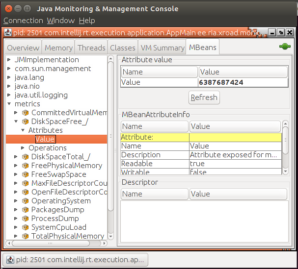

ig-ss_x-road_v6_security_server_installation_guide NIIS	      |	EE.txt
=============================================================================
| Date       | Version | Description                          |	 Date      | Version | Description                           
|------------|---------|------------------------------------- |	 --------- | ------- | --------------------------------------
| 01.12.2014 | 1.0     | Initial version                      |	 01.12.2014 | 1.0     | Initial version                      
| 19.01.2015 | 1.1     | License information added            |	 19.01.2015 | 1.1     | License information added            
| 18.03.2015 | 1.2     | Meta-package for security server add |	 18.03.2015 | 1.2     | Meta-package for security server adde
| 02.04.2015 | 1.3     | “sdsb” change to “xroad”             |	 02.04.2015 | 1.3     | “sdsb” change to “xroad”             
| 27.05.2015 | 1.4     | Some typos fixed                     |	 27.05.2015 | 1.4     | Some typos fixed                     
| 30.06.2015 | 1.5     | Minor corrections done               |	 30.06.2015 | 1.5     | Minor corrections done               
| 06.07.2015 | 1.6     | New repository address               |	 06.07.2015 | 1.6     | New repository address               
| 18.09.2015 | 1.7     | Reference data in [3.2](#32-referenc |	 18.09.2015 | 1.7     | Reference data in [3.2](#32-reference
| 18.09.2015 | 2.0     | Editorial changes made               |	 18.09.2015 | 2.0     | Editorial changes made               
| 13.10.2015 | 2.1     | Editorial changes made               |	 13.10.2015 | 2.1     | Editorial changes made               
| 10.12.2015 | 2.2     | Updated the installing of the suppor |	 10.12.2015 | 2.2     | Updated the installing of the support
| 17.12.2015 | 2.3     | Added *xroad-addon-wsdlvalidator* pa |	 17.12.2015 | 2.3     | Added *xroad-addon-wsdlvalidator* pac
| 19.05.2016 | 2.4     | Merged changes from xtee6-doc repo.  |	 19.05.2016 | 2.4     | Merged changes from xtee6-doc repo. U
| 30.09.2016 | 2.5     | Added chapter „[Different versions o |	 30.09.2016 | 2.5     | Added chapter „[Different versions of
| 07.12.2016 | 2.6     | Added operational data monitoring pa |	 07.12.2016 | 2.6     | Added operational data monitoring pac
| 23.02.2017 | 2.7     | Converted to Github flavoured Markdo |	 23.02.2017 | 2.7     | Converted to Github flavoured Markdow
| 13.04.2017 | 2.8     | Added token ID formatting            |	 13.04.2017 | 2.8     | Added token ID formatting            
| 25.08.2017 | 2.9     | Update environmental monitoring inst |	 22.01.2018 | 2.8.1   | Added NEE and NGO member classes     
| 15.09.2017 | 2.10    | Added package with configuration spe |	 25.08.2017 | 2.9     | Update environmental monitoring insta
| 05.03.2018 | 2.11    | Added terms and abbreviations refere |	 15.09.2017 | 2.10    | Added package with configuration spec
| 10.04.2018 | 2.12    | Updated chapter "[Installing the Sup |	 05.03.2018 | 2.11    | Added terms and abbreviations referen
| 14.10.2018 | 2.13    | Update package repository address    |	 10.04.2018 | 2.12    | Updated chapter "[Installing the Supp
| 25.10.2018 | 2.14    | Add RHEL7 as supported platform, upd |	 07.06.2018 | 2.12.1  | Updated repository information with x
| 15.11.2018 | 2.15    | Add Ubuntu 18 installation instructi |	 03.07.2018 | 2.12.2  | Added network diagram and reference d
| 28.01.2018 | 2.16    | Update port 2080 documentation       |	 08.08.2018 | 2.12.3  | Editorial changes		
| 30.05.2019 | 2.17    | Added package installation instructi |	 13.08.2018 | 2.12.4  | Package name fix		
| 11.09.2019 | 2.18    | Remove Ubuntu 14.04 from supported p |	 14.10.2018 | 2.13    | Update package repository address | P
| 20.09.2019 | 2.19    | Add instructions for using remote da |	 25.10.2018 | 2.14    | Add RHEL7 as supported platform, upda
| 12.04.2020 | 2.20    | Add note about the default value of  |	 15.11.2018 | 2.15    | Add Ubuntu 18 installation instructio
| 29.04.2020 | 2.21    | Add instructions how to use remote d |	 28.01.2018 | 2.16    | Update port 2080 documentation | Pett
| 12.06.2020 | 2.22    | Update reference data regarding JMX  |	 30.05.2019 | 2.17    | Added package installation instructio
| 24.06.2020 | 2.23    | Add repository sign key details in s |	 11.09.2019 | 2.18    | Remove Ubuntu 14.04 from supported pl
| 24.06.2020 | 2.24    | Remove environmental and operational |	 20.09.2019 | 2.19    | Add instructions for using remote dat
| 09.08.2020 | 2.25    | Update ports information in section  |	 12.04.2020 | 2.20    | Add note about the default value of t
| 17.08.2020 | 2.26    | Update for RHEL 8.                   |	 29.04.2020 | 2.21    | Add instructions how to use remote da
| 08.09.2020 | 2.27    | Fix minimum RAM requirement.         |	 12.06.2020 | 2.22    | Update reference data regarding JMX l
| 16.09.2020 | 2.28    | Describe deployment options and data |	 24.06.2020 | 2.23    | Add repository sign key details in se
| 29.09.2020 | 2.29    | Add instructions for creating databa |	 24.06.2020 | 2.24    | Remove environmental and operational 
| 19.01.2021 | 2.30    | Add instructions for using an altern |	 09.08.2020 | 2.25    | Update ports information in section [
| 04.02.2021 | 2.31    | Minor updates.                       |	 17.08.2020 | 2.26    | Update for RHEL 8. | Jarkko Hyöty
| 13.04.2021 | 2.32    | Update minimum requirements in secti |	 08.09.2020 | 2.27    | Fix minimum RAM requirement. | Ilkka 
| 16.04.2021 | 2.33    | Update remote database installation  |	 16.09.2020 | 2.28    | Describe deployment options and datab
| 18.05.2021 | 2.34    | Update error handling section        |	 29.09.2020 | 2.29    | Add instructions for creating databas
| 02.06.2021 | 2.35    | Add backup encryption information    |	 19.01.2021 | 2.30    | Add instructions for using an alterna
| 01.07.2021 | 2.36    | Update 3rd party key server          |	 04.02.2021 | 2.31    | Minor updates. | Ilkka Seppälä
| 11.08.2021 | 2.37    | Minor updates                        |	 13.04.2021 | 2.32    | Update minimum requirements in sectio
| 18.08.2021 | 2.38    | Minor updates to Annex D             |	 16.04.2021 | 2.33    | Update remote database installation i
| 25.08.2021 | 2.39    | Update X-Road references from versio |	 18.05.2021 | 2.34    | Update error handling section | Ilkka
| 26.08.2021 | 2.40    | Add instructions how to disable the  |	 02.06.2021 | 2.35    | Add backup encryption information | A
| 03.08.2021 | 2.41    | Minor fixes                          |	 01.07.2021 | 2.36    | Update 3rd party key server | Petteri
| 06.09.2021 | 2.42    | Update list of running services      |	 11.08.2021 | 2.37    | Minor updates | Petteri Kivimäki
| 26.09.2022 | 2.43    | Remove Ubuntu 18.04 support          |	 18.08.2021 | 2.38    | Minor updates to Annex D | Ilkka Sepp
							      |	 25.08.2021 | 2.39    | Update X-Road references from version
							      >	 26.08.2021 | 2.40    | Add instructions how to disable the m
							      >	 03.08.2021 | 2.41    | Minor fixes | Ilkka Seppälä
							      >	 06.09.2021 | 2.42    | Update list of running services | Jar
							      >	 26.09.2022 | 2.43    | Remove Ubuntu 18.04 support  
							      >	    - [2.3.1 RIA IP's for Whitelisting](#231-ria-ips-for-whit
1.  <a id="Ref_UG-SS" class="anchor"></a>\[UG-SS\] Cybernetic |	1.  <a id="Ref_UG-SS" class="anchor"></a>\[UG-SS\] Cybernetic
2.  <a id="Ref_TERMS" class="anchor"></a>\[TA-TERMS\] X-Road  |	2.  <a id="Ref_TERMS" class="anchor"></a>\[TA-TERMS\] X-Road 
[UG-SYSPAR](ug-syspar_x-road_v6_system_parameters.md).	      |	[UG-SYSPAR](ug-syspar_x-road_v7_system_parameters.md).
[IG-XLB](ig-xlb_x-road_external_load_balancer_installation_gu |	[IG-XLB](LoadBalancing/ig-xlb_x-road_external_load_balancer_i
* Red Hat Enterprise Linux (RHEL) 7 and 8 (x86-64). See [IG-S |	* Red Hat Enterprise Linux (RHEL) 7 and 8 (x86-64).
							      >
							      >	NB: RIA provides support only for Security Servers which are 
 **Ref** |                                                    |	 **Ref** |                                        | **Explana
 ------ |---------------------------------------------------- |	 ------ | --------------------------------------- | ---------
 1.0    | Ubuntu 20.04, Ubuntu 22.04 (x86-64)<br>3 GB RAM, 3  |	 1.0    | Ubuntu 18.04, Ubuntu 20.04 (x86-64)<br>3 GB RAM, 3 
 1.1    | https://artifactory.niis.org/xroad-release-deb      |	 1.1    | http://x-tee.ee/packages/live/xroad                
 1.2    | https://artifactory.niis.org/api/gpg/key/public     |	 &nbsp; | http://x-tee.ee/packages/test/xroad                
							      >	 1.2    | https://x-tee.ee/packages/live/xroad/xroad.pub     
 1.4    | **Inbound ports from external network**             |	 1.4    | **Inbound ports from external network** | Ports for
 &nbsp; | TCP 5500                                            |	 &nbsp; | TCP 5500                                           
 &nbsp; | TCP 5577                                            |	 &nbsp; | TCP 5577                                           
 1.5    | **Outbound ports to external network**              |	 1.5    | **Outbound ports to external network**  | Ports for
 &nbsp; | TCP 5500                                            |	 &nbsp; | TCP 5500                                | Message e
 &nbsp; | TCP 5577                                            |	 &nbsp; | TCP 5577                                | Querying 
 &nbsp; | TCP 4001                                            |	 &nbsp; | TCP 4001                                | Communica
 &nbsp; | TCP 80                                              |	 &nbsp; | TCP 80                                  | Downloadi
 &nbsp; | TCP 80,443                                          |	 &nbsp; | TCP 80,443                              | Most comm
 1.6    | **Inbound ports from internal network**             |	 1.6    | **Inbound ports from internal network** | Ports for
 &nbsp; | TCP 4000                                            |	 &nbsp; | TCP 4000                                | User inte
 &nbsp; | TCP 80, 443                                         |	 &nbsp; | TCP 80, 443                             | Informati
 1.7    | **Outbound ports to internal network**              |	 &nbsp; | TCP 9011                                           
 &nbsp; | TCP 80, 443, *other*                                |	 &nbsp; | TCP 9999                                           
 &nbsp; | TCP 2080                                            |	 1.7    | **Outbound ports to internal network**  | Ports for
 1.8  |                                                       |	 &nbsp; | TCP 80, 443, *other*                    | Producer 
 1.9  |                                                       |	 &nbsp; | TCP 2080                                | Message e
							      >	 1.8  |                                           | Security 
							      >	 1.9  |                                           | Security 
							      <
#### 2.2.1 Network Diagram				      <
							      <
The network diagram below provides an example of a basic Secu <
							      <
      <
							      <
							      >	It is strongly recommended to protect the security server fro
							      >
							      >	 #### 2.2.1 Network Diagram
							      >	 The following network diagram is an example of a simple stan
							      >	 
							      >	 Allowing incoming connections from the Monitoring Security S
							      >
							      >
							      >	 **Caution**: The enabling of auxiliary services which are ne
							      >
							      >	 
							      >
							      >	 #### 2.3.1 RIA IP's for Whitelisting
							      >	 Type | **EE - production** | **ee-test**	| **ee-dev**
							      >	-------------------------- | --------------------| ----------
							      >	 Central Server 			| cs1.ee.x-tee.ee <br
							      >	 Central Monitoring Server 	| mon.ee.x-tee.ee | mon.test.
							      >	 Management Security Server 			| ht1.ee.x-te
curl https://artifactory.niis.org/api/gpg/key/public | sudo a |	wget -O -  https://x-tee.ee/packages/live/xroad/xroad.pub | a
sudo apt-add-repository -y "deb https://artifactory.niis.org/ |	echo "deb http://x-tee.ee/packages/live/xroad $(lsb_release -
sudo apt install xroad-securityserver			      |	  sudo apt-get update
							      >	  sudo apt-get install xroad-securityserver-ee
 2.1  | &lt;global configuration anchor file&gt; or &lt;URL&g |	 2.1  | <https://x-tee.ee/anchors/>&lt;anchor file&gt;<br> ee
 2.2  | E.g.<br>GOV - government<br> COM - commercial     | M |	 2.2  | GOV - government<br> COM - commercial<br> NGO - non-p
  If the member class and member code are correctly entered,  |	-   The security server owner’s member code (**reference data
							      >	    If the member class and member code are correctly entered
							      >	    - **NB! If the security server owner  or hosted client is
							      >
							      >	        The Member Code must be formed as follows:
							      >
							      >	        **"NTRCONTRYCODE-ORGANIZATIONREGISTRYCODE"** - withou
							      >
							      >	        Where:
							      >	        * "NTR" - Prefix of the legal entity identifier accor
							      >	        * COUNTRY CODE - Country code according to ISO 3166 (
							      >	        * `-` hyphen
							      >	        * ORGANIZATION REGISTRY CODE - Organizational registr
							      >
							      >	        Example:
							      >	        * Lexbyte Digital Limited, a registered organization 
							      >	        * Member Name: **Lexbyte Digital Limited**
							      >	        * Member Class: **NEE**
							      >	        * Member Code: **NTRMT-C56249**
							      >
							      >	        Such requirements to the NEE Member Code are necessar
							      >
							      >	        References:
							      >	        * SK ID Solutions AS certificate profile: https://sk.
							      >	        * ETSI EN 319 412-1: http://www.etsi.org/deliver/etsi
							      >	        * Alpha 2 country code: https://www.iso.org/obp/ui/#s
Sometimes, after using `sudo apt-get upgrade` command, some o |	Sometimes, after using `sudo apt-get upgrade` command, some o
    ii xroad-securityserver 6.8.3-3-201605131138	      |	    ii xroad-securityserver-ee 6.8.3-3-201605131138
For example, the following security server packages are curre |	A guide to upgrading from an older version of X-Road can be f
							      <
```bash							      <
root@test-ss:~# dpkg -l | grep xroad			      <
ii  xroad-addon-messagelog          7.1.2-1.ubuntu20.04 all   <
ii  xroad-addon-metaservices        7.1.2-1.ubuntu20.04 all   <
ii  xroad-addon-proxymonitor        7.1.2-1.ubuntu20.04 all   <
ii  xroad-addon-wsdlvalidator       7.1.2-1.ubuntu20.04 all   <
ii  xroad-base                      7.1.2-1.ubuntu20.04 amd64 <
ii  xroad-confclient                7.1.2-1.ubuntu20.04 amd64 <
ii  xroad-database-local            7.1.2-1.ubuntu20.04 all   <
ii  xroad-monitor                   7.1.2-1.ubuntu20.04 all   <
ii  xroad-proxy                     7.1.2-1.ubuntu20.04 all   <
ii  xroad-proxy-ui-api              7.1.2-1.ubuntu20.04 all   <
ii  xroad-securityserver            7.1.2-1.ubuntu20.04 all   <
ii  xroad-signer                    7.1.2-1.ubuntu20.04 amd64 <
```							      <
							      <
The following packages are available in the repository.	      <
							      <
```bash							      <
root@test-ss:~# apt-cache madison xroad-securityserver	      <
xroad-securityserver | 7.3.0-1.ubuntu20.04 | https://artifact <
xroad-securityserver | 7.1.2-1.ubuntu20.04 | https://artifact <
```							      <
							      <
Now trying to upgrade the security server packages directly w <
							      <
```bash							      <
root@test-ss:~# apt-get upgrade xroad-securityserver	      <
...							      <
Preparing to unpack .../0-xroad-securityserver_7.3.0-1.ubuntu <
ERROR: Upgrade supported from version 7.1.2 or newer.	      <
```							      <
							      <
The fix is to upgrade the security server in two separate ste <
							      <
```bash							      <
apt install xroad-securityserver=7.1.2-1.ubuntu20.04 xroad-pr <
```							      <
							      <
An alternative approach to the previous command is to tempora <
							      <
Finally, we can upgrade to our target version 7.3.x as follow <
							      <
```bash							      <
apt upgrade xroad-securityserver			      <
```							      <
ug-syspar_x-road_v6_system_parameters NIIS		      |	EE.txt
=============================================================================
1.  <a id="Ref_INI"></a>\[INI\] INI file, [http://en.wikipedi |	1. <a id="Ref_INI"></a>\[INI\] INI file, [http://en.wikipedia
2.  <a id="Ref_CRON"></a>\[CRON\] Quartz Scheduler	      |	2. <a id="Ref_CRON"></a>\[CRON\] Quartz Scheduler
3.  <a id="Ref_PR-MESS"></a>\[PR-MESS\] [X-Road Message Proto |	3. <a id="Ref_PR-MESS"></a>\[PR-MESS\] [X-Road Message Protoc
4.  <a id="Ref_PR-TARGETSS"></a>\[PR-TARGETSS\] [Security Ser |	4. <a id="Ref_PR-TARGETSS"></a>\[PR-TARGETSS\] [Security Serv
5.  <a id="Ref_PR-SECTOKEN"></a>\[PR-SECTOKEN\] [Security Tok |	5. <a id="Ref_PR-SECTOKEN"></a>\[PR-SECTOKEN\] [Security Toke
6.  <a id="Ref_TERMS" class="anchor"></a>\[TA-TERMS\] [X-Road |	6. <a id="Ref_TERMS" class="anchor"></a>\[TA-TERMS\] [X-Road 
7.  <a id="Ref_CRONMAN"></a>\[CRONMAN\] [http://linux.die.net |	7. <a id="Ref_CRONMAN"></a>\[CRONMAN\] [http://linux.die.net/
8.  <a id="Ref_CRONHOW"></a>\[CRONHOW\] Cron format specifica |	8. <a id="Ref_CRONHOW"></a>\[CRONHOW\] Cron format specificat
9.  <a id="Ref_PR-REST"></a>\[PR-REST\] [X-Road Message Proto |	9. <a id="Ref_PR-REST"></a>\[PR-REST\] [X-Road Message Protoc
10. <a id="Ref_IG-CSHA" class="anchor"></a>\[IG-CSHA\] X-Road |	10. <a id="Ref_UG_SS" class="anchor">\[UG-SS\]</a> X-Road 7. 
11. <a id="Ref_UG_SS" class="anchor">\[UG-SS\]</a> X-Road 7.  <
ig-xlb_x-road_external_load_balancer_installation_guide NIIS  |	EE.txt
=============================================================================
| Document Id    |  Document                                  |	| Document Id    | Document                                  
|:--------------:|:------------------------------------------ |	|:--------------:|:------------------------------------------
| \[SS-CLUSTER\] | [Readme: Security server cluster setup wit |	| \[SS-CLUSTER\] | [Readme: Security server cluster setup wit
| \[IG-SS\] | [X-Road: Security Server Installation Guide](ig |	| \[IG-SS\] | [X-Road: Security Server Installation Guide](ig
| \[UG-SS\] | [X-Road 7 Security Server User Guide](ug-ss_x-r |	| \[UG-SS\] | [X-Road 7 Security Server User Guide](ug-ss_x-r
| <a name="Ref_TERMS"></a>\[TA-TERMS\] | [X-Road Terms and Ab |	| <a name="Ref_TERMS"></a>\[TA-TERMS\] | [X-Road Terms and Ab
							      >	   * `xroad-security-officer`
11. It is possible to use the autologin-package with secondar |	11. It is possible to use the autologin-package with secondar
\[[UG-SS](#13-references)\] chapter on [System services](../u |	\[[UG-SS](#13-references)\] chapter on [System services](ug-s
   \[[UG-SS](#13-references)\] chapter on [System services](. |	   \[[UG-SS](#13-references)\] chapter on [System services](u
ug-ss_x-road_6_security_server_user_guide NIIS		      |	EE.txt
=============================================================================
							      >	22.01.2018 | 2.16.1  | Added NEE member class info [4.2](#42-
7.  <a id="Ref_SPEC-AL" class="anchor"></a>\[SPEC-AL\] Cybern |	7.  <a id="Ref_SPEC-AL" class="anchor"></a>\[SPEC-AL\] Cybern
8.  <a id="Ref_PR-OPMON" class="anchor"></a>\[PR-OPMON\] Cybe |	8.  <a id="Ref_PR-OPMON" class="anchor"></a>\[PR-OPMON\] Cybe
9.  <a id="Ref_PR-OPMONJMX" class="anchor"></a>\[PR-OPMONJMX\ |	9.  <a id="Ref_PR-OPMONJMX" class="anchor"></a>\[PR-OPMONJMX\
10. <a id="Ref_UG-OPMONSYSPAR" class="anchor"></a>\[UG-OPMONS |	10. <a id="Ref_UG-OPMONSYSPAR" class="anchor"></a>\[UG-OPMONS
11. <a id="Ref_IG-SS" class="anchor"></a>\[IG-SS\] Cybernetic |	11. <a id="Ref_IG-SS" class="anchor"></a>\[IG-SS\] Cybernetic
16. <a id="Ref_ARC-ENVMON" class="anchor"></a>\[ARC-ENVMON\]  |	16. <a id="Ref_ARC-ENVMON" class="anchor"></a>\[ARC-ENVMON\] 
17. <a id="Ref_PR-ENVMONMES" class="anchor"></a>\[PR-ENVMONME |	17. <a id="Ref_PR-ENVMONMES" class="anchor"></a>\[PR-ENVMONME
18. <a id="Ref_MONITORING_XSD" class="anchor"></a>\[MONITORIN |	18. <a id="Ref_MONITORING_XSD" class="anchor"></a>\[MONITORIN
ug-sigdoc_x-road_signed_document_download_and_verification_ma |	EE.txt
=============================================================================
2.  [UG-SS] Security Server User Guide. Document ID: [UG-SS]( |	2.  [UG-SS] Security Server User Guide. Document ID: [UG-SS](
pr-meta_x-road_service_metadata_protocol NIIS		      |	EE.txt
=============================================================================
[UG-SYSPAAR](ug-syspar_x-road_v6_system_parameters.md).	      |	[UG-SYSPAAR](ug-syspar_x-road_v7_system_parameters.md).
pr-mserv_x-road_protocol_for_management_services NIIS	      |	EE.txt
=============================================================================
- <a name="Ref_DM-CS"></a>[DM-CS] X-Road: Central Server Data |	- <a name="Ref_DM-CS"></a>[DM-CS] X-Road: Central Server Data
pr-mess_x-road_message_protocol NIIS			      |	EE.txt
=============================================================================
[PR-SECTOKEN](./SecurityTokenExtension/pr-sectoken_security_t |	[PR-SECTOKEN](https://github.com/nordic-institute/X-Road/blob
pr-third_party_representation_extension_for_the_x-road_protoc |	EE.txt
=============================================================================
# Third Party Representation Extension for the X-Road Message <
							      <
Version: 1.1  						      <
Doc. ID: PR-THIRDPARTY					      <
							      <
## Version history					      <
							      <
| Date       | Version | Description                          <
|------------|---------|------------------------------------- <
|            | 1.0.1   | Initial version                      <
| 11.06.2018 | 1.0.2   | Converted to MD and updated referenc <
| 17.06.2022 | 1.1     | Copy from `ria-ee/X-Road-EE-docs` to <
							      <
## Table of Contents					      <
							      <
<!-- toc -->						      <
							      <
- [X-Road: Third Party Representation Extension](#x-road--thi <
    - [Version history](#version-history)		      <
    - [Table of Contents](#table-of-contents)		      <
    - [License](#license)				      <
    - [1 Introduction](#1-introduction)			      <
      - [1.1 Terms and abbreviations](#11-terms-and-abbreviat <
      - [1.2 References](#12-references)		      <
    - [2 Format of Messages](#2-format-of-messages)	      <
      - [2.1 Schema Header](#21-schema-header)		      <
      - [2.2 Represented Parties](#22-represented-parties)    <
      - [2.3 Message Headers](#23-message-headers)	      <
    - [Annex A XML Schema for Representation](#annex-a-xml-sc <
    - [Annex B Example WSDL](#annex-b-example-wsdl)	      <
    - [Annex C Example Messages](#annex-c-example-messages)   <
        - [C.1 Example Request](#c1-example-request)	      <
        - [C.1 Example Response](#c1-example-response)	      <
<!-- tocstop -->					      <
							      <
## License						      <
							      <
This work is licensed under the Creative Commons Attribution- <
							      <
## 1 Introduction					      <
							      <
This specification describes an extension to the X-Road Messa <
							      <
The purpose of this extension is to allow sending of addition <
							      <
The described scenario can be used by MISP and other portals  <
							      <
### 1.1 Terms and abbreviations				      <
							      <
See X-Road terms and abbreviations documentation \[[TA-TERMS] <
							      <
### 1.2 References					      <
							      <
| Document ID||						      <
| ------------- |-------------|				      <
| <a name="Ref_PR-MESS"></a>\[PR-MESS\] | [X-Road: Message Pr <
| <a name="Ref_TERMS"></a>\[TA-TERMS\] | [X-Road Terms and Ab <
							      <
## 2 Format of Messages					      <
							      <
This section describes XML-based data formats for expressing  <
							      <
### 2.1 Schema Header					      <
							      <
The following listing shows the header of the schema definiti <
							      <
```xml							      <
<?xml version="1.0" encoding="UTF-8"?>			      <
<xs:schema xmlns:xs="http://www.w3.org/2001/XMLSchema"	      <
    elementFormDefault="qualified"			      <
    targetNamespace="http://x-road.eu/xsd/representation.xsd" <
    xmlns="http://x-road.eu/xsd/representation.xsd">	      <
							      <
</xs:schema>						      <
```							      <
							      <
### 2.2 Represented Parties				      <
							      <
The `XRoadRepresentedPartyType` complex type is used to descr <
							      <
```xml							      <
<xs:complexType name="XRoadRepresentedPartyType">	      <
    <xs:sequence>					      <
        <xs:element minOccurs="0" ref="partyClass"/>	      <
        <xs:element minOccurs="1" ref="partyCode"/>	      <
    </xs:sequence>					      <
</xs:complexType>					      <
```							      <
							      <
Next, the elements used in the `XRoadRepresentedPartyType` ar <
							      <
Element `partyCode` is used to uniquely identify represented  <
							      <
```xml							      <
<xs:element name="partyClass" type="xs:string"/>	      <
<xs:element name="partyCode" type="xs:string"/>		      <
```							      <
							      <
Finally, the `representedParty` element is defined.	      <
							      <
```xml							      <
<xs:element name="representedParty" type="XRoadRepresentedPar <
```							      <
							      <
### 2.3 Message Headers					      <
							      <
This section describes the additional SOAP headers that are a <
							      <
<a name="Ref_Supported_header_fields" class="anchor"></a>     <
Table 1. Supported header fields			      <
							      <
Field           | Type                                      | <
---------------- | -----------------------------------------  <
representedParty| XRoadRepresentedPartyType                 | <
							      <
							      <
## Annex A XML Schema for Representation		      <
							      <
```xml							      <
<?xml version="1.0" encoding="UTF-8"?>			      <
<xs:schema xmlns:xs="http://www.w3.org/2001/XMLSchema" elemen <
    xmlns="http://x-road.eu/xsd/representation.xsd">	      <
    <xs:element name="partyClass" type="xs:string">	      <
        <xs:annotation>					      <
            <xs:documentation>Class of the represented party. <
        </xs:annotation>				      <
    </xs:element>					      <
    <xs:element name="partyCode" type="xs:string">	      <
        <xs:annotation>					      <
            <xs:documentation>Code of the represented party.< <
        </xs:annotation>				      <
    </xs:element>					      <
    <xs:complexType name="XRoadRepresentedPartyType">	      <
        <xs:sequence>					      <
            <xs:element minOccurs="0" ref="partyClass"/>      <
            <xs:element minOccurs="1" ref="partyCode"/>	      <
        </xs:sequence>					      <
    </xs:complexType>					      <
    <xs:element name="representedParty" type="XRoadRepresente <
        <xs:annotation>					      <
            <xs:documentation>Identifies a party that is bein <
represented in a service request.</xs:documentation>	      <
        </xs:annotation>				      <
    </xs:element>					      <
</xs:schema>						      <
```							      <
							      <
## Annex B Example WSDL					      <
							      <
```xml							      <
<?xml version="1.0" encoding="UTF-8"?>			      <
<wsdl:definitions xmlns:soap="http://schemas.xmlsoap.org/wsdl <
    xmlns:xrd="http://x-road.eu/xsd/xroad.xsd" 		      <
    xmlns:tns="http://v6Example.x-road.eu/producer" 	      <
    xmlns:wsdl="http://schemas.xmlsoap.org/wsdl/" 	      <
    xmlns:xsd="http://www.w3.org/2001/XMLSchema" 	      <
    xmlns:repr="http://x-road.eu/xsd/representation.xsd" targ <
    <wsdl:types>					      <
        <schema xmlns="http://www.w3.org/2001/XMLSchema" targ <
            <import namespace="http://x-road.eu/xsd/xroad.xsd <
            <import namespace="http://x-road.eu/xsd/represent <
            <element name="getRandom">			      <
                <complexType>				      <
                    <sequence>				      <
                        <element name="amount" type="positive <
                            <annotation>		      <
                                <appinfo>		      <
                                    <xrd:title xml:lang="en"> <
                                </appinfo>		      <
                            </annotation>		      <
                        </element>			      <
                    </sequence>				      <
                </complexType>				      <
            </element>					      <
            <element name="getRandomResponse">		      <
                <complexType>				      <
                    <sequence>				      <
                        <element name="randomValues" type="tn <
                            <annotation>		      <
                                <appinfo>		      <
                                    <xrd:title xml:lang="en"> <
of random values</xrd:title>				      <
                                </appinfo>		      <
                            </annotation>		      <
                        </element>			      <
                    </sequence>				      <
                </complexType>				      <
            </element>					      <
            <complexType name="randomValues">		      <
                <sequence>				      <
                    <element name="randomValue" type="xsd:dec <
                        <annotation>			      <
                            <appinfo>			      <
                                <xrd:title xml:lang="en">Rand <
value</xrd:title>					      <
                            </appinfo>			      <
                        </annotation>			      <
                    </element>				      <
                </sequence>				      <
            </complexType>				      <
        </schema>					      <
    </wsdl:types>					      <
    <wsdl:message name="requestHeader">			      <
        <wsdl:part name="client" element="xrd:client"/>	      <
        <wsdl:part name="service" element="xrd:service"/>     <
        <wsdl:part name="representedParty" element="repr:repr <
        <wsdl:part name="id" element="xrd:id"/>		      <
        <wsdl:part name="userId" element="xrd:userId"/>	      <
        <wsdl:part name="requestHash" element="xrd:requestHas <
        <wsdl:part name="issue" element="xrd:issue"/>	      <
        <wsdl:part name="protocolVersion" element="xrd:protoc <
</wsdl:message>						      <
    <wsdl:message name="getRandom">			      <
        <wsdl:part name="body" element="tns:getRandom"/>      <
    </wsdl:message>					      <
    <wsdl:message name="getRandomResponse">		      <
        <wsdl:part name="body" element="tns:getRandomResponse <
</wsdl:message>						      <
    <wsdl:portType name="v6ExamplePortType">		      <
        <wsdl:operation name="getRandom">		      <
            <wsdl:documentation>			      <
                <xrd:title>Random number generator</xrd:title <
                <xrd:notes>Operation is generating random num <
                <xrd:techNotes>Operation internally uses /dev <
for random number generation. Operation returns		      <
only up to 1000 random numbers.</xrd:techNotes>		      <
            </wsdl:documentation>			      <
            <wsdl:input message="tns:getRandom"/>	      <
            <wsdl:output message="tns:getRandomResponse"/>    <
        </wsdl:operation>				      <
    </wsdl:portType>					      <
    <wsdl:binding name="v6ExampleBinding" type="tns:v6Example <
        <soap:binding style="document" transport="http://sche <
        <wsdl:operation name="getRandom">		      <
            <soap:operation soapAction="" style="document"/>  <
            <xrd:version>v1</xrd:version>		      <
            <wsdl:input>				      <
                <soap:body use="literal"/>		      <
                <soap:header message="tns:requestHeader" part <
                <soap:header message="tns:requestHeader" part <
                <soap:header message="tns:requestHeader" part <
                <soap:header message="tns:requestHeader" part <
                <soap:header message="tns:requestHeader" part <
                <soap:header message="tns:requestHeader" part <
                <soap:header message="tns:requestHeader" part <
            </wsdl:input>				      <
            <wsdl:output>				      <
                <soap:body use="literal"/>		      <
                <soap:header message="tns:requestHeader" part <
                <soap:header message="tns:requestHeader" part <
                <soap:header message="tns:requestHeader" part <
                <soap:header message="tns:requestHeader" part <
                <soap:header message="tns:requestHeader" part <
                <soap:header message="tns:requestHeader" part <
                <soap:header message="tns:requestHeader" part <
                <soap:header message="tns:requestHeader" part <
</wsdl:output>						      <
        </wsdl:operation>				      <
    </wsdl:binding>					      <
    <wsdl:service name="v6ExampleService">		      <
        <wsdl:port binding="tns:v6ExampleBinding" name="v6Exa <
            <soap:address location="http://INSERT_CORRECT_SER <
</wsdl:port>						      <
    </wsdl:service>					      <
</wsdl:definitions>					      <
```							      <
							      <
## Annex C Example Messages				      <
							      <
### C.1 Example Request					      <
							      <
```xml							      <
<?xml version="1.0" encoding="UTF-8"?>			      <
<SOAP-ENV:Envelope xmlns:SOAP-ENV="http://schemas.xmlsoap.org <
    xmlns:xrd="http://x-road.eu/xsd/xroad.xsd" 		      <
    xmlns:id="http://x-road.eu/xsd/identifiers" 	      <
    xmlns:repr="http://x-road.eu/xsd/representation.xsd">     <
    <SOAP-ENV:Header>					      <
        <xrd:client id:objectType="SUBSYSTEM">		      <
            <id:xRoadInstance>EE</id:xRoadInstance>	      <
            <id:memberClass>GOV</id:memberClass>	      <
            <id:memberCode>MEMBER1</id:memberCode>	      <
            <id:subsystemCode>SUBSYSTEM1</id:subsystemCode>   <
        </xrd:client>					      <
        <xrd:service id:objectType="SERVICE">		      <
            <id:xRoadInstance>EE</id:xRoadInstance>	      <
            <id:memberClass>GOV</id:memberClass>	      <
            <id:memberCode>MEMBER2</id:memberCode>	      <
            <id:subsystemCode>SUBSYSTEM2</id:subsystemCode>   <
            <id:serviceCode>getRandom</id:serviceCode>	      <
            <id:serviceVersion>v1</id:serviceVersion>	      <
        </xrd:service>					      <
        <repr:representedParty>				      <
            <repr:partyClass>COM</repr:partyClass>	      <
            <repr:partyCode>MEMBER3</repr:partyCode>	      <
        </repr:representedParty>			      <
        <xrd:userId>EE1234567890</xrd:userId>		      <
        <xrd:id>4894e35d-bf0f-44a6-867a-8e51f1daa7e0</xrd:id> <
        <xrd:protocolVersion>4.0</xrd:protocolVersion>	      <
    </SOAP-ENV:Header>					      <
    <SOAP-ENV:Body>					      <
        <ns1:getRandom xmlns:ns1="http://v6Example.x-road.eu/ <
            <amount>2</amount>				      <
        </ns1:getRandom>				      <
    </SOAP-ENV:Body>					      <
</SOAP-ENV:Envelope>					      <
```							      <
							      <
### C.1 Example Response				      <
							      <
```xml							      <
<?xml version="1.0" encoding="UTF-8"?>			      <
<SOAP-ENV:Envelope xmlns:SOAP-ENV="http://schemas.xmlsoap.org <
    xmlns:xrd="http://x-road.eu/xsd/xroad.xsd" 		      <
    xmlns:id="http://x-road.eu/xsd/identifiers" 	      <
    xmlns:repr="http://x-road.eu/xsd/representation.xsd">     <
    <SOAP-ENV:Header>					      <
        <xrd:client id:objectType="SUBSYSTEM">		      <
            <id:xRoadInstance>EE</id:xRoadInstance>	      <
            <id:memberClass>GOV</id:memberClass>	      <
            <id:memberCode>MEMBER1</id:memberCode>	      <
            <id:subsystemCode>SUBSYSTEM1</id:subsystemCode>   <
        </xrd:client>					      <
        <xrd:service id:objectType="SERVICE">		      <
            <id:xRoadInstance>EE</id:xRoadInstance>	      <
            <id:memberClass>GOV</id:memberClass>	      <
            <id:memberCode>MEMBER2</id:memberCode>	      <
            <id:subsystemCode>SUBSYSTEM2</id:subsystemCode>   <
            <id:serviceCode>getRandom</id:serviceCode>	      <
            <id:serviceVersion>v1</id:serviceVersion>	      <
        </xrd:service>					      <
        <repr:representedParty>				      <
            <repr:partyClass>COM</repr:partyClass>	      <
            <repr:partyCode>MEMBER3</repr:partyCode>	      <
        </repr:representedParty>			      <
        <xrd:userId>EE1234567890</xrd:userId>		      <
        <xrd:id>4894e35d-bf0f-44a6-867a-8e51f1daa7e0</xrd:id> <
        <xrd:protocolVersion>4.0</xrd:protocolVersion>	      <
        <xrd:requestHash algorithmId="http://www.w3.org/2001/ <
    </SOAP-ENV:Header>					      <
    <SOAP-ENV:Body>					      <
        <xxprod:getRandomResponse xmlns:xxprod="http://v6Exam <
            <randomValues>				      <
                <randomValue>0.123456789</randomValue>	      <
                <randomValue>0.987654321</randomValue>	      <
            </randomValues>				      <
        </xxprod:getRandomResponse>			      <
    </SOAP-ENV:Body>					      <
</SOAP-ENV:Envelope>					      <
```							      <
pr-opmon_x-road_operational_monitoring_protocol_Y-1096-2 NIIS |	EE.txt
=============================================================================
							      <
| ![European Union / European Regional Development Fund / Inv <
| -------------------------: |				      <
							      <
# X-Road: Operational Monitoring Protocol <!-- omit in toc -- <
							      <
**Technical Specification**				      <
							      <
Version: 1.0  						      <
Doc. ID: PR-OPMON					      <
							      <
| Date | Version | Description | Author|		      <
|------|---------|-------------|-------|		      <
|            | 0.2 | Initial version |   |		      <
| 23.01.2017 | 0.3 | Added license text, table of contents an <
| 05.03.2018 | 0.4 | Added terms and abbreviations reference  <
| 04.12.2018 | 0.5 | More detailed descriptions for *[request <
| 18.02.2019 | 0.6 | Example response updated: added xRequest <
| 23.05.2019 | 0.7 | Add info about status_code, request_rest <
| 12.12.2019 | 1.0 | Update the protocol to the next major ve <
							      <
## Table of Contents <!-- omit in toc -->		      <
							      <
<!-- toc -->						      <
							      <
- [License](#license)					      <
- [1 Introduction](#1-introduction)			      <
    - [1.1 Terms and abbreviations](#11-terms-and-abbreviatio <
    - [1.2 References](#12-references)			      <
- [2 Retrieving Operational Data of Security Server](#2-retri <
- [3 Retrieving Health Data of Security Server](#3-retrieving <
- [Annex A WSDL for Operational Monitoring Messages](#annex-a <
- [Annex B JSON-Schema for Payload of getSecurityServerOperat <
- [Annex C Example Messages](#annex-c-example-messages)	      <
  - [C.1 getSecurityServerOperationalData Request](#c1-getsec <
  - [C.2 getSecurityServerOperationalData Response](#c2-getse <
    - [C.2.1 Example JSON-Payload of getSecurityServerOperati <
  - [C.3 getSecurityServerHealthData Request](#c3-getsecurity <
  - [C.4 getSecurityServerHealthData Response](#c4-getsecurit <
							      <
<!-- tocstop -->					      <
							      <
# License						      <
							      <
This document is licensed under the Creative Commons Attribut <
							      <
# 1 Introduction					      <
							      <
This specification describes services that can be used by X-R <
							      <
The operational monitoring services are the following:	      <
* *getSecurityServerOperationalData* - downloading operationa <
* *getSecurityServerHealthData* - downloading health data of  <
							      <
The operational monitoring services are implemented as standa <
							      <
This protocol builds on existing transport and message encodi <
							      <
The low-level technical details of the operational monitoring <
							      <
Chapters 2 and 3 together with annexes \[[Annex A](#AnnexA)\] <
							      <
This specification does not include option for partially impl <
							      <
The key words "MUST", "MUST NOT", "REQUIRED", "SHALL", "SHALL <
							      <
### 1.1 Terms and abbreviations				      <
							      <
See X-Road terms and abbreviations documentation \[[TA-TERMS] <
							      <
### 1.2 References					      <
							      <
<a name="PR-MESS"></a>**PR-MESS** -- Cybernetica AS. X-Road:  <
<a name="WSDL"></a>**WSDL** -- Web Services Description Langu <
<a name="SWAREF"></a>**SWAREF** -- Attachments Profile Versio <
<a name="RFC1952"></a>**RFC1952** -- GZIP file format specifi <
<a name="RFC2119"></a>**RFC2119** -- Key words for use in RFC <
<a name="Ref_TERMS" class="anchor"></a>**TA-TERMS** -- X-Road <
							      <
# 2 Retrieving Operational Data of Security Server	      <
							      <
Security server clients can retrieve operational data of the  <
							      <
The *service* SOAP header MUST contain the identifier of the  <
							      <
The body of the request MUST contain an XML element *getSecur <
* *searchCriteria* (mandatory) -- Determines the search crite <
 * *recordsFrom* (mandatory) -- Unix timestamp in seconds to  <
 * *recordsTo* (mandatory) -- Unix timestamp in seconds to de <
 * *client* (optional) -- Determines the client identifier of <
* *outputSpec* (optional) -- A sequence of optional *outputFi <
							      <
 * *monitoringDataTs*					      <
 * *securityServerInternalIp*				      <
 * *securityServerType*					      <
 * *requestInTs*					      <
 * *requestOutTs*					      <
 * *responseInTs*					      <
 * *responseOutTs*					      <
 * *clientXRoadInstance*				      <
 * *clientMemberClass*					      <
 * *clientMemberCode*					      <
 * *clientSubsystemCode*				      <
 * *serviceXRoadInstance*				      <
 * *serviceMemberClass*					      <
 * *serviceMemberCode*					      <
 * *serviceSubsystemCode*				      <
 * *serviceCode*					      <
 * *serviceVersion*					      <
 * *representedPartyClass*				      <
 * *representedPartyCode*				      <
 * *messageId*						      <
 * *messageUserId*					      <
 * *messageIssue*					      <
 * *messageProtocolVersion*				      <
 * *clientSecurityServerAddress*			      <
 * *serviceSecurityServerAddress*			      <
 * *requestSize*					      <
 * *requestMimeSize*					      <
 * *requestAttachmentCount*				      <
 * *responseSize*					      <
 * *responseMimeSize*					      <
 * *responseAttachmentCount*				      <
 * *succeeded*						      <
 * *serviceType*					      <
 * *faultCode*						      <
 * *faultString*					      <
 * *statusCode*						      <
 							      <
							      <
The fields are described in the JSON-schema of the response p <
							      <
The XML schema fragment of the operational data request body  <
							      <
```xml							      <
<xs:complexType name="GetSecurityServerOperationalDataType">  <
  <xs:sequence>						      <
    <xs:element name="searchCriteria" type="SearchCriteriaTyp <
    <xs:element name="outputSpec" type="OutputSpecType" minOc <
  </xs:sequence>					      <
</xs:complexType>					      <
<xs:complexType name="SearchCriteriaType">		      <
  <xs:sequence>						      <
    <xs:element name="recordsFrom" type="xs:long" />	      <
    <xs:element name="recordsTo" type="xs:long" />	      <
    <xs:element name="client" type="id:XRoadClientIdentifierT <
  </xs:sequence>					      <
</xs:complexType>					      <
<xs:complexType name="OutputSpecType">			      <
  <xs:sequence>						      <
    <xs:element name="outputField" type="xs:string"	      <
        minOccurs="0" maxOccurs="unbounded" />		      <
  </xs:sequence>					      <
</xs:complexType>					      <
```							      <
							      <
The example request message is presented in \[[Annex C.1](#An <
							      <
The response MUST be MIME multipart message with attachment u <
							      <
1. X-Road SOAP response message. The message MUST contain the <
 * *recordsCount* (mandatory) -- Number of records in the pay <
 * *records* (mandatory) -- The reference (CID URI) to the at <
 * *nextRecordsFrom* (optional) -- This element MUST be inclu <
							      <
 The content type of this part MUST be *text/xml*.	      <
							      <
2. Operational data (payload). This MIME part MUST contain qu <
							      <
The XML schema fragment of the operational data response body <
							      <
```xml							      <
<xs:complexType name="GetSecurityServerOperationalDataRespons <
  <xs:sequence>						      <
    <xs:element name="recordsCount" type="xs:int" />	      <
    <xs:element name="records" type="ref:swaRef" />	      <
    <xs:element name="nextRecordsFrom" type="xs:long" minOccu <
  </xs:sequence>					      <
</xs:complexType>					      <
```							      <
							      <
The example response message is presented in \[[Annex C.2](#A <
							      <
# 3 Retrieving Health Data of Security Server		      <
							      <
Security server clients can retrieve health data of the speci <
							      <
The *service* SOAP header MUST contain the identifier of the  <
							      <
The body of the request MUST contain an XML element *getSecur <
This element MAY contain XML element *filterCriteria* to dete <
							      <
The XML schema fragment of the health data request body is sh <
							      <
```xml							      <
<xs:complexType name="GetSecurityServerHealthDataType">	      <
  <xs:sequence>						      <
    <xs:element name="filterCriteria" type="FilterCriteriaTyp <
  </xs:sequence>					      <
</xs:complexType>					      <
<xs:complexType name="FilterCriteriaType">		      <
  <xs:sequence>						      <
  <xs:element name="client" type="id:XRoadClientIdentifierTyp <
  </xs:sequence>					      <
</xs:complexType>    					      <
```							      <
							      <
The example request message is presented in \[[Annex C.3](#An <
							      <
The response message MUST contain health data of the queried  <
 * *monitoringStartupTimestamp* -- The Unix timestamp in mill <
 * *statisticsPeriodSeconds* -- Duration of the statistics pe <
 * *servicesEvents* -- Health data of all (filtered) services <
							      <
  The XML element *servicesEvents* MUST contain list of items <
  * *service* (mandatory) -- The service identifier.	      <
  * *lastSuccessfulRequestTimestamp* (optional) -- The timest <
  * *lastUnsuccessfulRequestTimestamp* (optional)-- The times <
  * *serviceType* (optional) -- The type of the service.      <
  * *lastPeriodStatistics* (optional) -- The statistics of th <
    * *successfulRequestCount* (mandatory) -- The number of s <
    * *unsuccessfulRequestCount* (mandatory) -- The number of <
    * *requestMinDuration* (optional) -- The minimum duration <
    * *requestAverageDuration* (optional) -- The average dura <
    * *requestMaxDuration* (optional) -- The maximum duration <
    * *requestDurationStdDev* (optional) -- The standard devi <
    * *requestMinSize* (optional) -- The minimum message size <
    * *requestAverageSize* (optional) -- The average message  <
    * *requestMaxSize* (optional) -- The maximum message size <
    * *requestSizeStdDev* (optional) -- The standard deviatio <
    * *responseMinSize* (optional) -- The minimum message siz <
    * *responseAverageSize* (optional) -- The average message <
    * *responseMaxSize* (optional) -- The maximum message siz <
    * *responseSizeStdDev* (optional) -- The standard deviati <
							      <
The XML schema fragment of the health data response body is s <
							      <
```xml							      <
<xs:complexType name="GetSecurityServerHealthDataResponseType <
  <xs:sequence>						      <
    <xs:element name="monitoringStartupTimestamp" type="xs:lo <
    <xs:element name="statisticsPeriodSeconds" type="xs:int"  <
    <xs:element name="servicesEvents" type="ServicesEventsTyp <
  </xs:sequence>					      <
</xs:complexType>					      <
<xs:complexType name="ServicesEventsType">		      <
  <xs:sequence>						      <
    <xs:element name="serviceEvents" type="ServiceEventsType" <
        maxOccurs="unbounded" />			      <
  </xs:sequence>					      <
</xs:complexType>					      <
<xs:complexType name="ServiceEventsType">		      <
  <xs:sequence>						      <
    <xs:element name="service" type="id:XRoadServiceIdentifie <
    <xs:element name="lastSuccessfulRequestTimestamp" type="x <
        minOccurs="0" />				      <
    <xs:element name="lastUnsuccessfulRequestTimestamp" type= <
        minOccurs="0" />				      <
    <xs:element name="serviceType" type="xs:string" minOccurs <
    <xs:element name="lastPeriodStatistics" type="LastPeriodS <
  </xs:sequence>					      <
</xs:complexType>					      <
<xs:complexType name="LastPeriodStatisticsType">	      <
  <xs:sequence>						      <
    <xs:element name="successfulRequestCount" type="xs:int" / <
    <xs:element name="unsuccessfulRequestCount" type="xs:int" <
    <xs:element name="requestMinDuration" type="xs:long" minO <
    <xs:element name="requestAverageDuration" type="xs:double <
    <xs:element name="requestMaxDuration" type="xs:long" minO <
    <xs:element name="requestDurationStdDev" type="xs:double" <
    <xs:element name="requestMinSize" type="xs:long" minOccur <
    <xs:element name="requestAverageSize" type="xs:double" mi <
    <xs:element name="requestMaxSize" type="xs:long" minOccur <
    <xs:element name="requestSizeStdDev" type="xs:double" min <
    <xs:element name="responseMinSize" type="xs:long" minOccu <
    <xs:element name="responseAverageSize" type="xs:double" m <
    <xs:element name="responseMaxSize" type="xs:long" minOccu <
    <xs:element name="responseSizeStdDev" type="xs:double" mi <
  </xs:sequence>					      <
</xs:complexType>					      <
```							      <
							      <
The example response message is presented in \[[Annex C.4](#A <
							      <
<a name="AnnexA"/></a>					      <
# Annex A WSDL for Operational Monitoring Messages	      <
							      <
The XML-schema for operational monitoring messages is located <
							      <
The WSDL is located in the file *src/op-monitor-daemon/src/ma <
							      <
```xml							      <
<?xml version="1.0" encoding="UTF-8"?>			      <
<wsdl:definitions targetNamespace="http://op-monitor.x-road.e <
        xmlns:wsdl="http://schemas.xmlsoap.org/wsdl/"	      <
        xmlns:opm="http://x-road.eu/xsd/op-monitoring.xsd"    <
        xmlns:xrd="http://x-road.eu/xsd/xroad.xsd"	      <
        xmlns:id="http://x-road.eu/xsd/identifiers"	      <
        xmlns:soap="http://schemas.xmlsoap.org/wsdl/soap/"    <
        xmlns:mime="http://schemas.xmlsoap.org/wsdl/mime/"    <
        xmlns:tns="http://op-monitor.x-road.eu/">	      <
    <wsdl:types>					      <
        <xs:schema elementFormDefault="qualified"	      <
                targetNamespace="http://x-road.eu/xsd/identif <
                xmlns="http://x-road.eu/xsd/identifiers"      <
                xmlns:xs="http://www.w3.org/2001/XMLSchema">  <
            <xs:complexType name="XRoadIdentifierType">	      <
                <xs:annotation>				      <
                    <xs:documentation>Globally unique identif <
                        system. Identifier consists of object <
                        list of hierarchical codes (starting  <
                        identifiers the X-Road instance).     <
                    </xs:documentation>			      <
                </xs:annotation>			      <
                <xs:sequence>				      <
                    <xs:element minOccurs="0" ref="xRoadInsta <
                    <xs:element minOccurs="0" ref="memberClas <
                    <xs:element minOccurs="0" ref="memberCode <
                    <xs:element minOccurs="0" ref="subsystemC <
                    <xs:element minOccurs="0" ref="groupCode" <
                    <xs:element minOccurs="0" ref="serviceCod <
                    <xs:element minOccurs="0" ref="serviceVer <
                    <xs:element minOccurs="0" ref="securityCa <
                    <xs:element minOccurs="0" ref="serverCode <
                </xs:sequence>				      <
                <xs:attribute ref="objectType" use="required" <
            </xs:complexType>				      <
            <xs:simpleType name="XRoadObjectType">	      <
                <xs:annotation>				      <
                    <xs:documentation>Enumeration for X-Road  <
                    </xs:documentation>			      <
                </xs:annotation>			      <
                <xs:restriction base="xs:string">	      <
                    <xs:enumeration value="MEMBER"/>	      <
                    <xs:enumeration value="SUBSYSTEM"/>	      <
                    <xs:enumeration value="SERVER"/>	      <
                    <xs:enumeration value="GLOBALGROUP"/>     <
                    <xs:enumeration value="LOCALGROUP"/>      <
                    <xs:enumeration value="SECURITYCATEGORY"/ <
                    <xs:enumeration value="SERVICE"/>	      <
                    <xs:enumeration value="CENTRALSERVICE"/>  <
                </xs:restriction>			      <
            </xs:simpleType>				      <
            <xs:element name="xRoadInstance" type="xs:string" <
                <xs:annotation>				      <
                    <xs:documentation>Identifies the X-Road i <
                        is applicable to all identifier types <
                    </xs:documentation>			      <
                </xs:annotation>			      <
            </xs:element>				      <
            <xs:element name="memberClass" type="xs:string">  <
                <xs:annotation>				      <
                    <xs:documentation>Type of the member (com <
                        institution, private person, etc.)    <
                    </xs:documentation>			      <
                </xs:annotation>			      <
            </xs:element>				      <
            <xs:element name="memberCode" type="xs:string">   <
                <xs:annotation>				      <
                    <xs:documentation>Code that uniquely iden <
                        given member type.		      <
                    </xs:documentation>			      <
                </xs:annotation>			      <
            </xs:element>				      <
            <xs:element name="subsystemCode" type="xs:string" <
                <xs:annotation>				      <
                    <xs:documentation>Code that uniquely iden <
                        of given X-Road member.		      <
                    </xs:documentation>			      <
                </xs:annotation>			      <
            </xs:element>				      <
            <xs:element name="groupCode" type="xs:string">    <
                <xs:annotation>				      <
                    <xs:documentation>Code that uniquely iden <
                        group in			      <
                        given X-Road instance.		      <
                    </xs:documentation>			      <
                </xs:annotation>			      <
            </xs:element>				      <
            <xs:element name="serviceCode" type="xs:string">  <
                <xs:annotation>				      <
                    <xs:documentation>Code that uniquely iden <
                        offered by given X-Road member or sub <
                    </xs:documentation>			      <
                </xs:annotation>			      <
            </xs:element>				      <
            <xs:element name="serviceVersion" type="xs:string <
                <xs:annotation>				      <
                    <xs:documentation>Version of the service. <
                </xs:annotation>			      <
            </xs:element>				      <
            <xs:element name="securityCategoryCode" type="xs: <
                <xs:annotation>				      <
                    <xs:documentation>Code that uniquely iden <
                        category in a given X-Road instance.  <
                    </xs:documentation>			      <
                </xs:annotation>			      <
            </xs:element>				      <
            <xs:element name="serverCode" type="xs:string">   <
                <xs:annotation>				      <
                    <xs:documentation>Code that uniquely iden <
                        server offered by a given X-Road memb <
                    </xs:documentation>			      <
                </xs:annotation>			      <
            </xs:element>				      <
            <xs:attribute name="objectType" type="XRoadObject <
            <xs:complexType name="XRoadClientIdentifierType"> <
                <xs:complexContent>			      <
                    <xs:restriction base="XRoadIdentifierType <
                        <xs:sequence>			      <
                            <xs:element ref="xRoadInstance"/> <
                            <xs:element ref="memberClass"/>   <
                            <xs:element ref="memberCode"/>    <
                            <xs:element minOccurs="0" ref="su <
                        </xs:sequence>			      <
                        <xs:attribute ref="objectType" use="r <
                    </xs:restriction>			      <
                </xs:complexContent>			      <
            </xs:complexType>				      <
            <xs:complexType name="XRoadServiceIdentifierType" <
                <xs:complexContent>			      <
                    <xs:restriction base="XRoadIdentifierType <
                        <xs:sequence>			      <
                            <xs:element ref="xRoadInstance"/> <
                            <xs:element ref="memberClass"/>   <
                            <xs:element ref="memberCode"/>    <
                            <xs:element minOccurs="0" ref="su <
                            <xs:element ref="serviceCode"/>   <
                            <xs:element minOccurs="0" ref="se <
                        </xs:sequence>			      <
                        <xs:attribute ref="objectType" use="r <
                                fixed="SERVICE"/>	      <
                    </xs:restriction>			      <
                </xs:complexContent>			      <
            </xs:complexType>				      <
            <xs:complexType name="XRoadSecurityCategoryIdenti <
                <xs:complexContent>			      <
                    <xs:restriction base="XRoadIdentifierType <
                        <xs:sequence>			      <
                            <xs:element ref="xRoadInstance"/> <
                            <xs:element ref="securityCategory <
                        </xs:sequence>			      <
                        <xs:attribute ref="objectType" use="r <
                                fixed="SECURITYCATEGORY"/>    <
                    </xs:restriction>			      <
                </xs:complexContent>			      <
            </xs:complexType>				      <
            <xs:complexType name="XRoadCentralServiceIdentifi <
                <xs:complexContent>			      <
                    <xs:restriction base="XRoadIdentifierType <
                        <xs:sequence>			      <
                            <xs:element ref="xRoadInstance"/> <
                            <xs:element ref="serviceCode"/>   <
                        </xs:sequence>			      <
                        <xs:attribute ref="objectType" use="r <
                                fixed="CENTRALSERVICE"/>      <
                    </xs:restriction>			      <
                </xs:complexContent>			      <
            </xs:complexType>				      <
            <xs:complexType name="XRoadSecurityServerIdentifi <
                <xs:complexContent>			      <
                    <xs:restriction base="XRoadIdentifierType <
                        <xs:sequence>			      <
                            <xs:element ref="xRoadInstance"/> <
                            <xs:element ref="memberClass"/>   <
                            <xs:element ref="memberCode"/>    <
                            <xs:element ref="serverCode"/>    <
                        </xs:sequence>			      <
                        <xs:attribute ref="objectType" use="r <
                                fixed="SERVER"/>	      <
                    </xs:restriction>			      <
                </xs:complexContent>			      <
            </xs:complexType>				      <
            <xs:complexType name="XRoadGlobalGroupIdentifierT <
                <xs:complexContent>			      <
                    <xs:restriction base="XRoadIdentifierType <
                        <xs:sequence>			      <
                            <xs:element ref="xRoadInstance"/> <
                            <xs:element ref="groupCode"/>     <
                        </xs:sequence>			      <
                        <xs:attribute ref="objectType" use="r <
                                fixed="GLOBALGROUP"/>	      <
                    </xs:restriction>			      <
                </xs:complexContent>			      <
            </xs:complexType>				      <
            <xs:complexType name="XRoadLocalGroupIdentifierTy <
                <xs:complexContent>			      <
                    <xs:restriction base="XRoadIdentifierType <
                        <xs:sequence>			      <
                            <xs:element ref="groupCode"/>     <
                        </xs:sequence>			      <
                        <xs:attribute ref="objectType" use="r <
                                fixed="LOCALGROUP"/>	      <
                    </xs:restriction>			      <
                </xs:complexContent>			      <
            </xs:complexType>				      <
        </xs:schema>					      <
        <xs:schema elementFormDefault="qualified"	      <
                targetNamespace="http://x-road.eu/xsd/xroad.x <
                xmlns="http://x-road.eu/xsd/xroad.xsd"	      <
                xmlns:xs="http://www.w3.org/2001/XMLSchema">  <
            <xs:element name="version" type="xs:string"/>     <
							      <
            <!-- Header elements -->			      <
            <xs:element name="client" type="id:XRoadClientIde <
            <xs:element name="service" type="id:XRoadServiceI <
            <xs:element name="securityServer"		      <
                    type="id:XRoadSecurityServerIdentifierTyp <
            <xs:element name="userId" type="xs:string"/>      <
            <xs:element fixed="4.0" name="protocolVersion" ty <
            <xs:element name="id" type="xs:string"/>	      <
							      <
            <!-- Elements describing other elements and opera <
            <xs:element name="title">			      <
                <xs:annotation>				      <
                    <xs:documentation>Title</xs:documentation <
                </xs:annotation>			      <
                <xs:complexType>			      <
                    <xs:simpleContent>			      <
                        <xs:extension base="xs:string">	      <
                            <xs:attribute default="en" ref="x <
                        </xs:extension>			      <
                    </xs:simpleContent>			      <
                </xs:complexType>			      <
            </xs:element>				      <
            <xs:element name="notes">			      <
                <xs:annotation>				      <
                    <xs:documentation>Notes for user</xs:docu <
                </xs:annotation>			      <
                <xs:complexType>			      <
                    <xs:simpleContent>			      <
                        <xs:extension base="xs:string">	      <
                            <xs:attribute default="en" ref="x <
                        </xs:extension>			      <
                    </xs:simpleContent>			      <
                </xs:complexType>			      <
            </xs:element>				      <
        </xs:schema>					      <
        <xs:schema elementFormDefault="qualified"	      <
                targetNamespace="http://x-road.eu/xsd/op-moni <
                xmlns:xs="http://www.w3.org/2001/XMLSchema"   <
                xmlns="http://x-road.eu/xsd/op-monitoring.xsd <
                xmlns:id="http://x-road.eu/xsd/identifiers"   <
                xmlns:ref="http://ws-i.org/profiles/basic/1.1 <
            <xs:import namespace="http://ws-i.org/profiles/ba <
                    schemaLocation="http://ws-i.org/profiles/ <
                    id="ref"/>				      <
            <xs:complexType name="GetSecurityServerOperationa <
                <xs:annotation>				      <
                    <xs:documentation>Security server operati <
                    </xs:documentation>			      <
                </xs:annotation>			      <
                <xs:sequence>				      <
                    <xs:element name="searchCriteria" type="S <
                        <xs:annotation>			      <
                            <xs:documentation>Search criteria <
                        </xs:annotation>		      <
                    </xs:element>			      <
                    <xs:element name="outputSpec" type="Outpu <
                            minOccurs="0">		      <
                        <xs:annotation>			      <
                            <xs:documentation>The set of the  <
                                operational data fields	      <
                            </xs:documentation>		      <
                        </xs:annotation>		      <
                    </xs:element>			      <
                </xs:sequence>				      <
            </xs:complexType>				      <
            <xs:complexType name="SearchCriteriaType">	      <
                <xs:sequence>				      <
                    <xs:element name="recordsFrom" type="xs:l <
                        <xs:annotation>			      <
                            <xs:documentation>The beginning o <
                                of requested operational data <
                                seconds)		      <
                            </xs:documentation>		      <
                        </xs:annotation>		      <
                    </xs:element>			      <
                    <xs:element name="recordsTo" type="xs:lon <
                        <xs:annotation>			      <
                            <xs:documentation>The end of the  <
                                requested operational data (U <
                                seconds)		      <
                            </xs:documentation>		      <
                        </xs:annotation>		      <
                    </xs:element>			      <
                    <xs:element name="client"		      <
                            type="id:XRoadClientIdentifierTyp <
                            minOccurs="0">		      <
                        <xs:annotation>			      <
                            <xs:documentation>Client identifi <
                                partner to use for filtering  <
                            </xs:documentation>		      <
                        </xs:annotation>		      <
                    </xs:element>			      <
                </xs:sequence>				      <
            </xs:complexType>				      <
            <xs:complexType name="OutputSpecType">	      <
                <xs:sequence>				      <
                    <xs:element name="outputField" type="xs:s <
                            minOccurs="0" maxOccurs="unbounde <
                        <xs:annotation>			      <
                            <xs:documentation>Name of the ope <
                                field			      <
                            </xs:documentation>		      <
                        </xs:annotation>		      <
                    </xs:element>			      <
                </xs:sequence>				      <
            </xs:complexType>				      <
            <xs:complexType name="GetSecurityServerOperationa <
                <xs:annotation>				      <
                    <xs:documentation>Security server operati <
                        response			      <
                    </xs:documentation>			      <
                </xs:annotation>			      <
                <xs:sequence>				      <
                    <xs:element name="recordsCount" type="xs: <
                        <xs:annotation>			      <
                            <xs:documentation>The number of r <
                                the response		      <
                            </xs:documentation>		      <
                        </xs:annotation>		      <
                    </xs:element>			      <
                    <xs:element name="records" type="ref:swaR <
                        <xs:annotation>			      <
                            <xs:documentation>The reference t <
                                containing the records	      <
                            </xs:documentation>		      <
                        </xs:annotation>		      <
                    </xs:element>			      <
                    <xs:element name="nextRecordsFrom" type=" <
                            minOccurs="0">		      <
                        <xs:annotation>			      <
                            <xs:documentation>Unix timestamp  <
                                for field recordsFrom of the  <
                                element is present in case th <
                                response has been limited or  <
                                the field recordsTo was in th <
                            </xs:documentation>		      <
                        </xs:annotation>		      <
                    </xs:element>			      <
                </xs:sequence>				      <
            </xs:complexType>				      <
            <xs:complexType name="FilterCriteriaType">	      <
                <xs:sequence>				      <
                    <xs:element name="client"		      <
                            type="id:XRoadClientIdentifierTyp <
                            minOccurs="0">		      <
                        <xs:annotation>			      <
                            <xs:documentation>Client identifi <
                                partner to use for filtering  <
                            </xs:documentation>		      <
                        </xs:annotation>		      <
                    </xs:element>			      <
                </xs:sequence>				      <
            </xs:complexType>				      <
            <xs:complexType name="GetSecurityServerHealthData <
                <xs:annotation>				      <
                    <xs:documentation>Security server health  <
                    </xs:documentation>			      <
                </xs:annotation>			      <
                <xs:sequence>				      <
                    <xs:element name="filterCriteria" type="F <
                            minOccurs="0">		      <
                        <xs:annotation>			      <
                            <xs:documentation>Filter criteria <
                        </xs:annotation>		      <
                    </xs:element>			      <
                </xs:sequence>				      <
            </xs:complexType>				      <
            <xs:complexType name="GetSecurityServerHealthData <
                <xs:annotation>				      <
                    <xs:documentation>Security server health  <
                    </xs:documentation>			      <
                </xs:annotation>			      <
                <xs:sequence>				      <
                    <xs:element name="monitoringStartupTimest <
                            type="xs:long">		      <
                        <xs:annotation>			      <
                            <xs:documentation>The Unix timest <
                                when the operational monitori <
                                started			      <
                            </xs:documentation>		      <
                        </xs:annotation>		      <
                    </xs:element>			      <
                    <xs:element name="statisticsPeriodSeconds <
                        <xs:annotation>			      <
                            <xs:documentation>Duration of the <
                                in seconds		      <
                            </xs:documentation>		      <
                        </xs:annotation>		      <
                    </xs:element>			      <
                    <xs:element name="servicesEvents" type="S <
                        <xs:annotation>			      <
                            <xs:documentation>Health data of  <
                            </xs:documentation>		      <
                        </xs:annotation>		      <
                    </xs:element>			      <
                </xs:sequence>				      <
            </xs:complexType>				      <
            <xs:complexType name="ServicesEventsType">	      <
                <xs:sequence>				      <
                    <xs:element name="serviceEvents" type="Se <
                            minOccurs="0" maxOccurs="unbounde <
                        <xs:annotation>			      <
                            <xs:documentation>Health data of  <
                            </xs:documentation>		      <
                        </xs:annotation>		      <
                    </xs:element>			      <
                </xs:sequence>				      <
            </xs:complexType>				      <
            <xs:complexType name="ServiceEventsType">	      <
                <xs:sequence>				      <
                    <xs:element name="service"		      <
                            type="id:XRoadServiceIdentifierTy <
                        <xs:annotation>			      <
                            <xs:documentation>The service ide <
                            </xs:documentation>		      <
                        </xs:annotation>		      <
                    </xs:element>			      <
                    <xs:element name="lastSuccessfulRequestTi <
                            type="xs:long" minOccurs="0">     <
                        <xs:annotation>			      <
                            <xs:documentation>The timestamp o <
                                successful request (Unix time <
                                milliseconds)		      <
                            </xs:documentation>		      <
                        </xs:annotation>		      <
                    </xs:element>			      <
                    <xs:element name="lastUnsuccessfulRequest <
                            type="xs:long"		      <
                            minOccurs="0">		      <
                        <xs:annotation>			      <
                            <xs:documentation>The timestamp o <
                                unsuccessful request (Unix ti <
                                milliseconds)		      <
                            </xs:documentation>		      <
                        </xs:annotation>		      <
                    </xs:element>			      <
                    <xs:element name="serviceType" type="xs:s <
                        <xs:annotation>			      <
                            <xs:documentation>Type of the ser <
                        </xs:annotation>		      <
                    </xs:element>			      <
                    <xs:element name="lastPeriodStatistics"   <
                            type="LastPeriodStatisticsType">  <
                        <xs:annotation>			      <
                            <xs:documentation>The statistics  <
                                occurred during the last peri <
                            </xs:documentation>		      <
                        </xs:annotation>		      <
                    </xs:element>			      <
                </xs:sequence>				      <
            </xs:complexType>				      <
            <xs:complexType name="LastPeriodStatisticsType">  <
                <xs:sequence>				      <
                    <xs:element name="successfulRequestCount" <
                        <xs:annotation>			      <
                            <xs:documentation>The number of s <
                                occurred during the last peri <
                            </xs:documentation>		      <
                        </xs:annotation>		      <
                    </xs:element>			      <
                    <xs:element name="unsuccessfulRequestCoun <
                        <xs:annotation>			      <
                            <xs:documentation>The number of u <
                                requests occurred during the  <
                            </xs:documentation>		      <
                        </xs:annotation>		      <
                    </xs:element>			      <
                    <xs:element name="requestMinDuration" typ <
                            minOccurs="0">		      <
                        <xs:annotation>			      <
                            <xs:documentation>The minimum dur <
                                request in milliseconds	      <
                            </xs:documentation>		      <
                        </xs:annotation>		      <
                    </xs:element>			      <
                    <xs:element name="requestAverageDuration" <
                            minOccurs="0">		      <
                        <xs:annotation>			      <
                            <xs:documentation>The average dur <
                                request in milliseconds	      <
                            </xs:documentation>		      <
                        </xs:annotation>		      <
                    </xs:element>			      <
                    <xs:element name="requestMaxDuration" typ <
                            minOccurs="0">		      <
                        <xs:annotation>			      <
                            <xs:documentation>The maximum dur <
                                request in milliseconds	      <
                            </xs:documentation>		      <
                        </xs:annotation>		      <
                    </xs:element>			      <
                    <xs:element name="requestDurationStdDev"  <
                            minOccurs="0">		      <
                        <xs:annotation>			      <
                            <xs:documentation>The standard de <
                                duration of the requests      <
                            </xs:documentation>		      <
                        </xs:annotation>		      <
                    </xs:element>			      <
                    <xs:element name="requestMinSize" type="x <
                            minOccurs="0">		      <
                        <xs:annotation>			      <
                            <xs:documentation>The minimum mes <
                                the request in bytes	      <
                            </xs:documentation>		      <
                        </xs:annotation>		      <
                    </xs:element>			      <
                    <xs:element name="requestAverageSize" typ <
                            minOccurs="0">		      <
                        <xs:annotation>			      <
                            <xs:documentation>The average mes <
                                the request in bytes	      <
                            </xs:documentation>		      <
                        </xs:annotation>		      <
                    </xs:element>			      <
                    <xs:element name="requestMaxSize" type="x <
                            minOccurs="0">		      <
                        <xs:annotation>			      <
                            <xs:documentation>The maximum mes <
                                the request in bytes	      <
                            </xs:documentation>		      <
                        </xs:annotation>		      <
                    </xs:element>			      <
                    <xs:element name="requestSizeStdDev" type <
                            minOccurs="0">		      <
                        <xs:annotation>			      <
                            <xs:documentation>The standard de <
                                message size of the requests  <
                            </xs:documentation>		      <
                        </xs:annotation>		      <
                    </xs:element>			      <
                    <xs:element name="responseMinSize" type=" <
                            minOccurs="0">		      <
                        <xs:annotation>			      <
                            <xs:documentation>The minimum mes <
                                the response in bytes	      <
                            </xs:documentation>		      <
                        </xs:annotation>		      <
                    </xs:element>			      <
                    <xs:element name="responseAverageSize" ty <
                            minOccurs="0">		      <
                        <xs:annotation>			      <
                            <xs:documentation>The average mes <
                                the response in bytes	      <
                            </xs:documentation>		      <
                        </xs:annotation>		      <
                    </xs:element>			      <
                    <xs:element name="responseMaxSize" type=" <
                            minOccurs="0">		      <
                        <xs:annotation>			      <
                            <xs:documentation>The maximum mes <
                                the response in bytes	      <
                            </xs:documentation>		      <
                        </xs:annotation>		      <
                    </xs:element>			      <
                    <xs:element name="responseSizeStdDev" typ <
                            minOccurs="0">		      <
                        <xs:annotation>			      <
                            <xs:documentation>The standard de <
                                message size of the responses <
                            </xs:documentation>		      <
                        </xs:annotation>		      <
                    </xs:element>			      <
                </xs:sequence>				      <
            </xs:complexType>				      <
            <xs:element name="getSecurityServerOperationalDat <
                    type="GetSecurityServerOperationalDataTyp <
            <xs:element name="getSecurityServerOperationalDat <
                    type="GetSecurityServerOperationalDataRes <
            <xs:element name="getSecurityServerHealthData"    <
                    type="GetSecurityServerHealthDataType"/>  <
            <xs:element name="getSecurityServerHealthDataResp <
                    type="GetSecurityServerHealthDataResponse <
        </xs:schema>					      <
    </wsdl:types>					      <
							      <
    <wsdl:message name="getSecurityServerOperationalDataRespo <
        <wsdl:part name="getSecurityServerOperationalDataResp <
                element="opm:getSecurityServerOperationalData <
    </wsdl:message>					      <
							      <
    <wsdl:message name="getSecurityServerOperationalData">    <
        <wsdl:part name="getSecurityServerOperationalData"    <
                element="opm:getSecurityServerOperationalData <
    </wsdl:message>					      <
							      <
    <wsdl:message name="getSecurityServerHealthDataResponse"> <
        <wsdl:part name="getSecurityServerHealthDataResponse" <
                element="opm:getSecurityServerHealthDataRespo <
    </wsdl:message>					      <
							      <
    <wsdl:message name="getSecurityServerHealthData">	      <
        <wsdl:part name="getSecurityServerHealthData"	      <
                element="opm:getSecurityServerHealthData"/>   <
    </wsdl:message>					      <
							      <
    <wsdl:message name="requestheader">			      <
        <wsdl:part name="client" element="xrd:client"/>	      <
        <wsdl:part name="service" element="xrd:service"/>     <
        <wsdl:part name="securityServer" element="xrd:securit <
        <wsdl:part name="id" element="xrd:id"/>		      <
        <wsdl:part name="protocolVersion" element="xrd:protoc <
    </wsdl:message>					      <
							      <
    <wsdl:portType name="opmServicePortType">		      <
        <wsdl:operation name="getSecurityServerHealthData">   <
            <wsdl:documentation>			      <
                <xrd:title>Security server health data</xrd:t <
            </wsdl:documentation>			      <
            <wsdl:input name="getSecurityServerHealthData"    <
                    message="tns:getSecurityServerHealthData" <
            <wsdl:output name="getSecurityServerHealthDataRes <
                    message="tns:getSecurityServerHealthDataR <
        </wsdl:operation>				      <
        <wsdl:operation name="getSecurityServerOperationalDat <
            <wsdl:documentation>			      <
                <xrd:title>Security server operational data</ <
            </wsdl:documentation>			      <
            <wsdl:input name="getSecurityServerOperationalDat <
                    message="tns:getSecurityServerOperational <
            <wsdl:output name="getSecurityServerOperationalDa <
                    message="tns:getSecurityServerOperational <
        </wsdl:operation>				      <
    </wsdl:portType>					      <
							      <
    <wsdl:binding name="opmSoap11Binding" type="tns:opmServic <
        <soap:binding style="document"			      <
                transport="http://schemas.xmlsoap.org/soap/ht <
        <wsdl:operation name="getSecurityServerOperationalDat <
            <soap:operation soapAction=""/>		      <
            <wsdl:input name="getSecurityServerOperationalDat <
                <soap:body use="literal"/>		      <
                <soap:header message="tns:requestheader" part <
                <soap:header message="tns:requestheader" part <
                <soap:header message="tns:requestheader" part <
                <soap:header message="tns:requestheader" part <
                <soap:header message="tns:requestheader" part <
            </wsdl:input>				      <
            <wsdl:output name="getSecurityServerOperationalDa <
                <soap:header message="tns:requestheader" part <
                <soap:header message="tns:requestheader" part <
                <soap:header message="tns:requestheader" part <
                <soap:header message="tns:requestheader" part <
                <soap:header message="tns:requestheader" part <
                <mime:multipartRelated>			      <
                    <mime:part>				      <
                        <soap:body use="literal"/>	      <
                    </mime:part>			      <
                </mime:multipartRelated>		      <
            </wsdl:output>				      <
        </wsdl:operation>				      <
        <wsdl:operation name="getSecurityServerHealthData">   <
            <soap:operation soapAction=""/>		      <
            <wsdl:input name="getSecurityServerHealthData">   <
                <soap:body use="literal"/>		      <
                <soap:header message="tns:requestheader" part <
                <soap:header message="tns:requestheader" part <
                <soap:header message="tns:requestheader" part <
                <soap:header message="tns:requestheader" part <
                <soap:header message="tns:requestheader" part <
            </wsdl:input>				      <
            <wsdl:output name="getSecurityServerHealthDataRes <
                <soap:body use="literal"/>		      <
                <soap:header message="tns:requestheader" part <
                <soap:header message="tns:requestheader" part <
                <soap:header message="tns:requestheader" part <
                <soap:header message="tns:requestheader" part <
                <soap:header message="tns:requestheader" part <
            </wsdl:output>				      <
        </wsdl:operation>				      <
    </wsdl:binding>					      <
							      <
    <wsdl:service name="opmService">			      <
        <wsdl:port name="opmServiceSoap11Port" binding="tns:o <
            <soap:address location="https://SECURITYSERVER/"/ <
        </wsdl:port>					      <
    </wsdl:service>					      <
</wsdl:definitions>					      <
```							      <
							      <
<a name="AnnexB"/></a>					      <
# Annex B JSON-Schema for Payload of getSecurityServerOperati <
							      <
The schema is located in the file *src/op-monitor-daemon/src/ <
							      <
```yaml							      <
title: Query Operational Data Response Payload Schema	      <
type: object						      <
properties:						      <
  records:						      <
    description: Operational Data Records		      <
    type: array						      <
    items:						      <
      type: object					      <
      properties:					      <
        monitoringDataTs:				      <
          description: The Unix timestamp in seconds when the <
          type: integer					      <
          minimum: 0					      <
        securityServerInternalIp:			      <
          description: Internal IP address of the security se <
          type: string					      <
          format: ipv4					      <
          maxLength: 255				      <
        securityServerType:				      <
          description: Type of the security server	      <
          type: string					      <
          enum:						      <
          - Client					      <
          - Producer					      <
        requestInTs:					      <
          description: 'In the client''s security server: the <
          type: integer					      <
          minimum: 0					      <
        requestOutTs:					      <
          description: 'In the client''s security server: the <
          type: integer					      <
          minimum: 0					      <
        responseInTs:					      <
          description: 'In the client''s security server: the <
          type: integer					      <
          minimum: 0					      <
        responseOutTs:					      <
          description: 'In the client''s security server: the <
          type: integer					      <
          minimum: 0					      <
        clientXRoadInstance:				      <
          description: Instance identifier of the instance us <
          type: string					      <
          maxLength: 255				      <
        clientMemberClass:				      <
          description: Member class of the X-Road member (cli <
          type: string					      <
          maxLength: 255				      <
        clientMemberCode:				      <
          description: Member code of the X-Road member (clie <
          type: string					      <
          maxLength: 255				      <
        clientSubsystemCode:				      <
          description: Subsystem code of the X-Road member (c <
          type: string					      <
          maxLength: 255				      <
        serviceXRoadInstance:				      <
          description: Instance identifier of the instance us <
          type: string					      <
          maxLength: 255				      <
        serviceMemberClass:				      <
          description: Member class of the X-Road member (ser <
          type: string					      <
          maxLength: 255				      <
        serviceMemberCode:				      <
          description: Member code of the X-Road member (serv <
          type: string					      <
          maxLength: 255				      <
        serviceSubsystemCode:				      <
          description: Subsystem code of the X-Road member (s <
          type: string					      <
          maxLength: 255				      <
        serviceCode:					      <
          description: Code of the service		      <
          type: string					      <
          maxLength: 255				      <
        serviceVersion:					      <
          description: Version of the service		      <
          type: string					      <
          maxLength: 255				      <
        representedPartyClass:				      <
          description: Class of the represented party	      <
          type: string					      <
          maxLength: 255				      <
        representedPartyCode:				      <
          description: Code of the represented party	      <
          type: string					      <
          maxLength: 255				      <
        messageId:					      <
          description: Unique identifier of the message	      <
          type: string					      <
          maxLength: 255				      <
        messageUserId:					      <
          description: Personal code of the client that initi <
          type: string					      <
          maxLength: 255				      <
        messageIssue:					      <
          description: Client's internal identifier of a file <
          type: string					      <
          maxLength: 255				      <
        messageProtocolVersion:				      <
          description: X-Road message protocol version	      <
          type: string					      <
          maxLength: 255				      <
        clientSecurityServerAddress:			      <
          description: External address of client's security  <
          type: string					      <
          maxLength: 255				      <
        serviceSecurityServerAddress:			      <
          description: External address of service provider's <
          type: string					      <
          maxLength: 255				      <
        requestMimeSize:				      <
          description: Size of the MIME-container of the requ <
          type: integer					      <
          minimum: 0					      <
        requestAttachmentCount:				      <
          description: Number of attachments of the request   <
          type: integer					      <
          minimum: 0					      <
        responseMimeSize:				      <
          description: Size of the MIME-container of the resp <
          type: integer					      <
          minimum: 0					      <
        responseAttachmentCount:			      <
          description: Number of attachments of the response  <
          type: integer					      <
          minimum: 0					      <
        succeeded:					      <
          description: True, if request mediation succeeded,  <
          type: boolean					      <
        faultCode:					      <
          description: fault code in case error received      <
          type: string					      <
          maxLength: 255				      <
        faultString:					      <
          description: fault reason in case error received    <
          type: string					      <
          maxLength: 2048				      <
        requestSize:					      <
          description: Size of the request (bytes)	      <
          type: integer					      <
          minimum: 0					      <
        responseSize:					      <
          description: Size of the response (bytes)	      <
          type: integer					      <
          minimum: 0					      <
        statusCode:					      <
          description: HTTP status code for the rest response <
          type: integer					      <
          minimum: 0					      <
        serviceType:					      <
            description: Type of the service WSDL, REST or OP <
            type: string				      <
            minimum: 0					      <
required:						      <
- records						      <
```							      <
							      <
<a name="AnnexC"/></a>					      <
# Annex C Example Messages				      <
							      <
<a name="AnnexC.1"/></a>				      <
## C.1 getSecurityServerOperationalData Request		      <
							      <
```xml							      <
<?xml version="1.0" encoding="utf-8"?>			      <
<SOAP-ENV:Envelope					      <
    xmlns:SOAP-ENV="http://schemas.xmlsoap.org/soap/envelope/ <
    xmlns:xroad="http://x-road.eu/xsd/xroad.xsd"	      <
    xmlns:om="http://x-road.eu/xsd/op-monitoring.xsd"	      <
    xmlns:id="http://x-road.eu/xsd/identifiers">	      <
  <SOAP-ENV:Header>					      <
    <xroad:client id:objectType="SUBSYSTEM">		      <
      <id:xRoadInstance>EE</id:xRoadInstance>		      <
      <id:memberClass>GOV</id:memberClass>		      <
      <id:memberCode>00000001</id:memberCode>		      <
      <id:subsystemCode>System1</id:subsystemCode>	      <
    </xroad:client>					      <
    <xroad:service id:objectType="SERVICE">		      <
      <id:xRoadInstance>EE</id:xRoadInstance>		      <
      <id:memberClass>GOV</id:memberClass>		      <
      <id:memberCode>00000001</id:memberCode>		      <
      <id:serviceCode>getSecurityServerOperationalData</id:se <
    </xroad:service>					      <
    <xroad:securityServer id:objectType="SERVER">	      <
      <id:xRoadInstance>EE</id:xRoadInstance>		      <
      <id:memberClass>GOV</id:memberClass>		      <
      <id:memberCode>00000001</id:memberCode>		      <
      <id:serverCode>00000001_1</id:serverCode>		      <
    </xroad:securityServer>				      <
    <xroad:id>1KNtf07U6qIyOcJnkirRaE0hRe4bM7WF</xroad:id>     <
    <xroad:protocolVersion>4.0</xroad:protocolVersion>	      <
  </SOAP-ENV:Header>					      <
  <SOAP-ENV:Body>					      <
    <om:getSecurityServerOperationalData>		      <
      <om:searchCriteria>				      <
        <om:recordsFrom>1480512828</om:recordsFrom>	      <
        <om:recordsTo>1480512832</om:recordsTo>		      <
      </om:searchCriteria>				      <
    </om:getSecurityServerOperationalData>		      <
  </SOAP-ENV:Body>					      <
</SOAP-ENV:Envelope>					      <
```							      <
							      <
<a name="AnnexC.2"/></a>				      <
## C.2 getSecurityServerOperationalData Response	      <
							      <
```xml							      <
Content-Type: multipart/related; type="text/xml"; charset=UTF <
boundary=xroadfngEfgBlxyLszDaqXiFfDxVzvvlbhU		      <
Content-Length: 7298					      <
							      <
--xroadfngEfgBlxyLszDaqXiFfDxVzvvlbhU			      <
content-type:text/xml					      <
							      <
<?xml version="1.0" encoding="utf-8"?>			      <
<SOAP-ENV:Envelope					      <
    xmlns:SOAP-ENV="http://schemas.xmlsoap.org/soap/envelope/ <
    xmlns:xroad="http://x-road.eu/xsd/xroad.xsd"	      <
    xmlns:om="http://x-road.eu/xsd/op-monitoring.xsd"	      <
    xmlns:id="http://x-road.eu/xsd/identifiers">	      <
  <SOAP-ENV:Header>					      <
    <xroad:client id:objectType="SUBSYSTEM">		      <
      <id:xRoadInstance>EE</id:xRoadInstance>		      <
      <id:memberClass>GOV</id:memberClass>		      <
      <id:memberCode>00000001</id:memberCode>		      <
      <id:subsystemCode>System1</id:subsystemCode>	      <
    </xroad:client>					      <
    <xroad:service id:objectType="SERVICE">		      <
      <id:xRoadInstance>EE</id:xRoadInstance>		      <
      <id:memberClass>GOV</id:memberClass>		      <
      <id:memberCode>00000001</id:memberCode>		      <
      <id:serviceCode>getSecurityServerOperationalData</id:se <
    </xroad:service>					      <
    <xroad:securityServer id:objectType="SERVER">	      <
      <id:xRoadInstance>EE</id:xRoadInstance>		      <
      <id:memberClass>GOV</id:memberClass>		      <
      <id:memberCode>00000001</id:memberCode>		      <
      <id:serverCode>00000001_1</id:serverCode>		      <
    </xroad:securityServer>				      <
    <xroad:id>1KNtf07U6qIyOcJnkirRaE0hRe4bM7WF</xroad:id>     <
    <xroad:requestHash algorithmId="http://www.w3.org/2001/04 <
      r+GNfQVRJ82RMpaRMO/K/2z97zEr1jiSL4m7clAEogiZiaSTnylksQZ <
    </xroad:requestHash>				      <
    <xroad:protocolVersion>4.0</xroad:protocolVersion>	      <
  </SOAP-ENV:Header>					      <
  <SOAP-ENV:Body>					      <
    <om:getSecurityServerOperationalDataResponse>	      <
      <om:recordsCount>122</om:recordsCount>		      <
      <om:records>cid:operational-monitoring-data.json.gz</om <
    </om:getSecurityServerOperationalDataResponse>	      <
  </SOAP-ENV:Body>					      <
</SOAP-ENV:Envelope>					      <
--xroadfngEfgBlxyLszDaqXiFfDxVzvvlbhU			      <
content-type:application/gzip				      <
content-transfer-encoding: binary			      <
content-id: <operational-monitoring-data.json.gz>	      <
							      <
(binary data)						      <
--xroadfngEfgBlxyLszDaqXiFfDxVzvvlbhU--			      <
```							      <
							      <
### C.2.1 Example JSON-Payload of getSecurityServerOperationa <
							      <
```json							      <
{							      <
  "records": [						      <
    {							      <
      "clientMemberClass": "GOV",			      <
      "clientMemberCode": "00000001",			      <
      "clientSecurityServerAddress": "ss1.ci.kit",	      <
      "clientSubsystemCode": "subsystem1",		      <
      "clientXRoadInstance": "EE",			      <
      "messageId": "1TzYPstxXyYPtNsos4TNEAPykJh50aJz",	      <
      "messageIssue": "453465",				      <
      "messageProtocolVersion": "4.0",			      <
      "messageUserId": "EE37701010101",			      <
      "monitoringDataTs": 1477633845,			      <
      "representedPartyClass": "COM",			      <
      "representedPartyCode": "MEMBER123",		      <
      "requestAttachmentCount": 0,			      <
      "requestInTs": 1477633844973,			      <
      "requestOutTs": 1477633844986,			      <
      "requestSize": 1629,				      <
      "responseAttachmentCount": 0,			      <
      "responseInTs": 1477633845222,			      <
      "responseOutTs": 1477633845243,			      <
      "responseSize": 1518,				      <
      "securityServerInternalIp": "192.168.1.1",	      <
      "securityServerType": "Client",			      <
      "serviceCode": "xroadGetRandom",			      <
      "serviceType": "WSDL",				      <
      "serviceMemberClass": "GOV",			      <
      "serviceMemberCode": "00000000",			      <
      "serviceSecurityServerAddress": "ss0.ci.kit",	      <
      "serviceSubsystemCode": "subsystem1",		      <
      "serviceVersion": "v1",				      <
      "serviceXRoadInstance": "EE",			      <
      "succeeded": true,				      <
      "xRequestId": "fd83f20e-bc19-4eb4-9602-e37f94c09fbe"    <
    }							      <
  ]							      <
}							      <
```							      <
<a name="AnnexC.3"/></a>				      <
## C.3 getSecurityServerHealthData Request		      <
							      <
```xml							      <
<?xml version="1.0" encoding="utf-8"?>			      <
<SOAP-ENV:Envelope					      <
    xmlns:SOAP-ENV="http://schemas.xmlsoap.org/soap/envelope/ <
    xmlns:xroad="http://x-road.eu/xsd/xroad.xsd"	      <
    xmlns:om="http://x-road.eu/xsd/op-monitoring.xsd"	      <
    xmlns:id="http://x-road.eu/xsd/identifiers">	      <
  <SOAP-ENV:Header>					      <
    <xroad:client id:objectType="SUBSYSTEM">		      <
      <id:xRoadInstance>EE</id:xRoadInstance>		      <
      <id:memberClass>GOV</id:memberClass>		      <
      <id:memberCode>00000000</id:memberCode>		      <
      <id:subsystemCode>System1</id:subsystemCode>	      <
    </xroad:client>					      <
    <xroad:service id:objectType="SERVICE">		      <
      <id:xRoadInstance>EE</id:xRoadInstance>		      <
      <id:memberClass>GOV</id:memberClass>		      <
      <id:memberCode>00000001</id:memberCode>		      <
      <id:serviceCode>getSecurityServerHealthData</id:service <
    </xroad:service>					      <
    <xroad:securityServer id:objectType="SERVER">	      <
      <id:xRoadInstance>EE</id:xRoadInstance>		      <
      <id:memberClass>GOV</id:memberClass>		      <
      <id:memberCode>00000001</id:memberCode>		      <
      <id:serverCode>00000001_1</id:serverCode>		      <
    </xroad:securityServer>				      <
    <xroad:id>0PebOv6afaFEMVqPcwwtzIZCuRiRBu6T</xroad:id>     <
    <xroad:protocolVersion>4.0</xroad:protocolVersion>	      <
  </SOAP-ENV:Header>					      <
  <SOAP-ENV:Body>					      <
    <om:getSecurityServerHealthData>			      <
      <om:filterCriteria>				      <
        <om:client id:objectType="SUBSYSTEM">		      <
          <id:xRoadInstance>EE</id:xRoadInstance>	      <
          <id:memberClass>GOV</id:memberClass>		      <
          <id:memberCode>00000001</id:memberCode>	      <
          <id:subsystemCode>System2</id:subsystemCode>	      <
        </om:client>					      <
      </om:filterCriteria>				      <
    </om:getSecurityServerHealthData>			      <
  </SOAP-ENV:Body>					      <
</SOAP-ENV:Envelope>					      <
```							      <
							      <
<a name="AnnexC.3"/></a>				      <
## C.4 getSecurityServerHealthData Response		      <
							      <
```xml							      <
<?xml version="1.0" encoding="utf-8"?>			      <
<SOAP-ENV:Envelope					      <
    xmlns:SOAP-ENV="http://schemas.xmlsoap.org/soap/envelope/ <
    xmlns:xroad="http://x-road.eu/xsd/xroad.xsd"	      <
    xmlns:om="http://x-road.eu/xsd/op-monitoring.xsd"	      <
    xmlns:id="http://x-road.eu/xsd/identifiers">	      <
  <SOAP-ENV:Header>					      <
    <xroad:client id:objectType="SUBSYSTEM">		      <
      <id:xRoadInstance>EE</id:xRoadInstance>		      <
      <id:memberClass>GOV</id:memberClass>		      <
      <id:memberCode>00000000</id:memberCode>		      <
      <id:subsystemCode>System1</id:subsystemCode>	      <
    </xroad:client>					      <
    <xroad:service id:objectType="SERVICE">		      <
      <id:xRoadInstance>EE</id:xRoadInstance>		      <
      <id:memberClass>GOV</id:memberClass>		      <
      <id:memberCode>00000001</id:memberCode>		      <
      <id:serviceCode>getSecurityServerHealthData</id:service <
    </xroad:service>					      <
    <xroad:securityServer id:objectType="SERVER">	      <
      <id:xRoadInstance>EE</id:xRoadInstance>		      <
      <id:memberClass>GOV</id:memberClass>		      <
      <id:memberCode>00000001</id:memberCode>		      <
      <id:serverCode>00000001_1</id:serverCode>		      <
    </xroad:securityServer>				      <
    <xroad:id>0PebOv6afaFEMVqPcwwtzIZCuRiRBu6T</xroad:id>     <
    <xroad:requestHash algorithmId="http://www.w3.org/2001/04 <
      QzekAiZVOaz3p1IGCrWkjc3bGRPGg9XN3SWEsF5onsTdzZ5w+chgOSn <
    </xroad:requestHash>				      <
    <xroad:protocolVersion>4.0</xroad:protocolVersion>	      <
  </SOAP-ENV:Header>					      <
  <SOAP-ENV:Body>					      <
    <om:getSecurityServerHealthDataResponse>		      <
      <om:monitoringStartupTimestamp>1480512900441	      <
          </om:monitoringStartupTimestamp>		      <
      <om:statisticsPeriodSeconds>600</om:statisticsPeriodSec <
      <om:servicesEvents>				      <
        <om:serviceEvents>				      <
          <om:service id:objectType="SERVICE">		      <
            <id:xRoadInstance>EE</id:xRoadInstance>	      <
            <id:memberClass>GOV</id:memberClass>	      <
            <id:memberCode>00000001</id:memberCode>	      <
            <id:subsystemCode>System2</id:subsystemCode>      <
            <id:serviceCode>xroadGetRandom</id:serviceCode>   <
            <id:serviceVersion>v1</id:serviceVersion>	      <
          </om:service>					      <
          <om:lastSuccessfulRequestTimestamp>1480512901824    <
              </om:lastSuccessfulRequestTimestamp>	      <
          <om:serviceType>WSDL</om:serviceType>		      <
          <om:lastPeriodStatistics>			      <
            <om:successfulRequestCount>1</om:successfulReques <
            <om:unsuccessfulRequestCount>0</om:unsuccessfulRe <
            <om:requestMinDuration>42</om:requestMinDuration> <
            <om:requestAverageDuration>42.0</om:requestAverag <
            <om:requestMaxDuration>42</om:requestMaxDuration> <
            <om:requestDurationStdDev>0.0</om:requestDuration <
            <om:requestMinSize>1629</om:requestMinSize>	      <
            <om:requestAverageSize>1629.0</om:requestAverageS <
            <om:requestMaxSize>1629</om:requestMaxSize>	      <
            <om:requestSizeStdDev>0.0</om:requestSizeStdDev>  <
            <om:responseMinSize>1519</om:responseMinSize>     <
            <om:responseAverageSize>1519.0</om:responseAverag <
            <om:responseMaxSize>1519</om:responseMaxSize>     <
            <om:responseSizeStdDev>0.0</om:responseSizeStdDev <
          </om:lastPeriodStatistics>			      <
        </om:serviceEvents>				      <
      </om:servicesEvents>				      <
    </om:getSecurityServerHealthDataResponse>		      <
  </SOAP-ENV:Body>					      <
</SOAP-ENV:Envelope>					      <
```							      <
pr-opmonjmx_x-road_operational_monitoring_jmx_protocol_Y-1096 |	EE.txt
=============================================================================
							      <
| ![European Union / European Regional Development Fund / Inv <
| -------------------------: |				      <
							      <
# X-Road: Operational Monitoring JMX Protocol <!-- omit in to <
							      <
**Technical Specification**				      <
							      <
Version: 1.1  						      <
Doc. ID: PR-OPMONJMX					      <
							      <
| Date       | Version     | Description                      <
|------------|-------------|--------------------------------- <
|  | 0.2       | Initial version               |          |   <
| 23.01.2017 | 0.3       | Added license text, table of conte <
| 05.03.2018 | 0.4       | Added terms and abbreviations refe <
| 12.12.2019 | 1.0       | Add description of serviceType gau <
| 25.06.2020 | 1.1       | Add note about JMX being disabled  <
							      <
## Table of Contents <!-- omit in toc -->		      <
							      <
<!-- toc -->						      <
							      <
- [License](#license)					      <
- [1 Introduction](#1-introduction)			      <
  - [1.1 Terms and Abbreviations](#11-terms-and-abbreviations <
  - [1.2 References](#12-references)			      <
- [2 Encoding X-Road Service Identifiers in Object Names](#2- <
- [3 Objects, Attributes and Operations Exposed over JMXMP](# <
  - [3.1 Gauge Metrics](#31-gauge-metrics)		      <
  - [3.2 Counter Metrics](#32-counter-metrics)		      <
  - [3.3 Histogram Metrics](#33-histogram-metrics)	      <
							      <
<!-- tocstop -->					      <
							      <
# License						      <
							      <
This document is licensed under the Creative Commons Attribut <
							      <
# 1 Introduction					      <
							      <
This document specifies the format and protocol for exchangin <
							      <
The Java Management Extensions define and architecture, the d <
							      <
The JMX Messaging Protocol (JMXMP) connector is a configurati <
							      <
In this document, the standard Managed Beans (`MBeans`) expos <
							      <
All the sections of this specification contain normative info <
							      <
This specification does not include option for partially impl <
							      <
**By default, operational monitoring JMX interface is disable <
							      <
## 1.1 Terms and Abbreviations				      <
							      <
See X-Road terms and abbreviations documentation \[[TA-TERMS] <
							      <
## 1.2 References					      <
							      <
<a name="Ref_PR-MESS"></a>**PR-MESS** -- Cybernetica AS. X-Ro <
<a name="Ref_JMX"></a>**JMX** -- Java Management Extensions ( <
<a name="Ref_JMXMP"></a>**JMXMP** -- Using JMX Connectors to  <
<a name="Ref_METRICS"></a>**METRICS** -- GitHub - dropwizard/ <
<a name="Ref_ZABBIX"></a>**ZABBIX** -- Zabbix Documentation 3 <
<a name="Ref_TERMS"></a>**TA-TERMS** -- X-Road Terms and Abbr <
<a name="Ref_ARC-OPMOND"></a>**ARC-OPMOND** -- X-Road: Operat <
							      <
<a name="section_2"></a>				      <
# 2 Encoding X-Road Service Identifiers in Object Names	      <
							      <
In the object names of exposed MBeans, X-Road service identif <
							      <
* The full string form of the identifier of the service is us <
* If no subsystem is associated with the service, two forward <
* Also for being able to extract the parts of the identifier, <
* Because the JMXMP protocol imposes the XML character set on <
* In order to provide compatibility with the Zabbix monitorin <
							      <
# 3 Objects, Attributes and Operations Exposed over JMXMP     <
							      <
The `MBean` objects exposed by the operational monitoring dae <
							      <
* `com.codahale.metrics.Gauge`  			      <
* `com.codahale.metrics.Counter`  			      <
* `com.codahale.metrics.Histogram`  			      <
							      <
For each `MBean` object there is an associated `MBeanInfo` ob <
							      <
## 3.1 Gauge Metrics					      <
							      <
The value of the `ClassName` attribute of the `MBeanInfo` obj <
							      <
All gauge metrics expose the `Value` attribute and the `objec <
							      <
The operational monitoring daemon provides the following gene <
* `metrics:name=monitoringStartupTimestamp` -- timestamp of t <
* `metrics:name=statisticsPeriodSeconds` -- the configured pe <
							      <
For each service mediated during the configured statistics pe <
* `metrics:name=lastSuccessfulRequestTimestamp(<service ID>)` <
* `metrics:name=lastUnsuccessfulRequestTimestamp(<service ID> <
* `metrics:name=serviceType(<service ID>)`		      <
							      <
where `<service ID>` will be replaced by the full ID of the s <
							      <
## 3.2 Counter Metrics					      <
							      <
The value of the `ClassName` attribute of the `MBeanInfo` obj <
							      <
All counter metrics expose the `Count` attribute and the `obj <
							      <
For each service mediated during the configured statistics pe <
* `metrics:name=successfulRequestCount(<service ID>)`  	      <
* `metrics:name=unsuccessfulRequestCount(<service ID>)`       <
							      <
where `<service ID>` will be replaced by the full ID of the s <
							      <
## 3.3 Histogram Metrics				      <
							      <
The value of the `ClassName` attribute of the `MBeanInfo` obj <
							      <
All the histogram metrics expose the following attributes:    <
* `50thPercentile`  					      <
* `75thPercentile`  					      <
* `95thPercentile`  					      <
* `98thPercentile`  					      <
* `99thPercentile`  					      <
* `999thPercentile`  					      <
* `Count`  						      <
* `Max`  						      <
* `Min`  						      <
* `Mean`  						      <
* `StdDev`  						      <
							      <
The operations exposed by histogram metrics are `objectName() <
							      <
For each service mediated during the configured statistics pe <
							      <
* `metrics:name=requestDuration(<service ID>)`  	      <
* `metrics:name=requestSoapSize(<service ID>)`  	      <
* `metrics:name=responseSoapSize(<service ID>)`  	      <
							      <
where `<service ID>` will be replaced by the full ID of the s <
ug-opmonsyspar_x-road_operational_monitoring_system_parameter |	EE.txt
=============================================================================
							      <
| ![European Union / European Regional Development Fund / Inv <
| -------------------------: |				      <
							      <
# X-Road: Operational Monitoring System Parameters	      <
							      <
# User Guide						      <
							      <
Version: 0.5  						      <
Doc ID: UG-OPMONSYSPAR					      <
							      <
| Date       | Version | Description                          <
|------------|---------|------------------------------------- <
|            | 0.2     | Initial version                      <
| 23.01.2017 | 0.3     | Added license text, table of content <
| 17.03.2017 | 0.4     | Added new parameters *op-monitor-buf <
| 05.03.2018 | 0.5     | Added reference to terms and abbrevi <
							      <
## Table of Contents					      <
							      <
<!-- toc -->						      <
							      <
- [License](#license)					      <
- [1 Introduction](#1-introduction)			      <
  * [1.1 Terms and abbreviations](#11-terms-and-abbreviations <
  * [1.2 References](#12-references)			      <
- [2 Operational Monitoring System Parameters](#2-operational <
							      <
<!-- tocstop -->					      <
							      <
## License						      <
							      <
This document is licensed under the Creative Commons Attribut <
							      <
							      <
## 1 Introduction					      <
							      <
This document describes the system parameters of the X-Road o <
							      <
### 1.1 Terms and abbreviations				      <
							      <
See X-Road terms and abbreviations documentation \[[TA-TERMS] <
							      <
### 1.2 References					      <
							      <
<a name="UG-SYSPAR"></a>**UG-SYSPAR** -- Cybernetica AS. X-Ro <
<a name="UG-SS"></a>**UG-SS** -- Cybernetica AS. X-Road: Secu <
<a name="CRON"></a>**CRON** -- Quartz Scheduler Cron Trigger  <
<a name="Ref_TERMS" class="anchor"></a>**TA-TERMS** -- X-Road <
							      <
## 2 Operational Monitoring System Parameters		      <
							      <
This chapter describes the system parameters used by the X-Ro <
							      <
* To change the parameter values for the server component *op <
* The service *xroad-proxy* must be restarted after changing  <
  * *op-monitor.host*  					      <
  * *op-monitor.port*					      <
  * *op-monitor.scheme*					      <
  * *op-monitor.tls-certificate*.  			      <
							      <
 When changing the previous parameter values of an external m <
* To change the parameter values for the server components *o <
							      <
Server Component  | Parameter                 | Default Value <
----------------- | ------------------------- | ------------- <
op-monitor        | clean-interval            | 0 0 0/12 1/1  <
op-monitor        | client-tls-certificate    | /etc/xroad/ss <
op-monitor        | health-statistics-period-seconds | 600    <
op-monitor        | host                      | localhost     <
op-monitor        | keep-records-for-days     | 7             <
op-monitor        | max-records-in-payload    | 10000         <
op-monitor        | port                      | 2080          <
op-monitor        | records-available-timestamp-offset-second <
op-monitor        | scheme                    | http          <
op-monitor        | tls-certificate           |/etc/xroad/ssl <
op-monitor-buffer | connection-timeout-seconds| 30            <
op-monitor-buffer | max-records-in-message    | 100           <
op-monitor-buffer | sending-interval-seconds  | 5             <
op-monitor-buffer | socket-timeout-seconds    | 60            <
op-monitor-buffer | size                      | 20000         <
op-monitor-service| connection-timeout-seconds| 30            <
op-monitor-service| socket-timeout-seconds    | 60            <
Monitoring-architecture NIIS				      |	EE.txt
=============================================================================
# X-Road: Environmental Monitoring Architecture		      <
							      <
Version: 1.8  						      <
Doc. ID: ARC-ENVMON					      <
							      <
| Date       | Version  | Description                         <
|------------|----------|------------------------------------ <
| 15.12.2015 | 1.0      | Initial version               | Ilk <
| 04.01.2017 | 1.1      | Fix documentation links | Ilkka Sep <
| 20.01.2017 | 1.2      | Added license text, table of conten <
| 23.2.2017  | 1.3      | Added reference to the Security Ser <
| 18.8.2017  | 1.4      | Added details about the security se <
| 18.10.2017 | 1.5      |  | Joni Laurila |		      <
| 02.03.2018 | 1.6      | Added numbering, terms document ref <
| 20.01.2020 | 1.7      | Update XroadProcessLister descripti <
| 25.06.2020 | 1.8      | Add chapter [2.2.1 JMX interface](# <
							      <
							      <
# Table of Contents					      <
<!-- toc -->						      <
							      <
  * [License](#license)					      <
- [1 Overview](#1-overview)				      <
  * [1.1 Terms and abbreviations](#11-terms-and-abbreviations <
  * [1.2 References](#12-references)			      <
- [2 Components](#2-components)				      <
  * [2.1 Monitoring metaservice (proxymonitor add-on)](#21-mo <
  * [2.2 Monitoring service (xroad-monitor)](#22-monitoring-s <
      * [2.2.1 JMX interface](#221-jmx-interface)	      <
  * [2.3 Central monitoring client](#23-central-monitoring-cl <
  * [2.4 Central monitoring data collector](#24-central-monit <
  * [2.5 Central server admin user interface](#25-central-ser <
- [3 Monitoring in action](#3-monitoring-in-action)	      <
  * [3.1 Pull messaging model](#31-pull-messaging-model)      <
  * [3.2 Modified X-Road message protocol](#32-modified-x-roa <
  * [3.3 Access control](#33-access-control)		      <
    * [3.3.1 Limiting central monitoring client access for en <
							      <
<!-- tocstop -->					      <
							      <
## License						      <
							      <
This document is licensed under the Creative Commons Attribut <
							      <
							      <
## 1 Overview						      <
							      <
X-Road monitoring is conceptually split into two parts: _envi <
							      <
* **Environmental monitoring** is the monitoring of the X-Roa <
* **Operational monitoring** is the monitoring of operational <
							      <
This document describes environmental monitoring architecture <
							      <
### 1.1 Terms and abbreviations				      <
							      <
See X-Road terms and abbreviations documentation \[[TA-TERMS] <
							      <
### 1.2 References					      <
							      <
| Document ID||						      <
| ------------- |-------------|				      <
| PR-GCONF      | [Cybernetica AS. X-Road: Protocol for Downl <
| UC-GCONF      | [Cybernetica AS. X-Road: Use Case Model for <
| PR-MESS | [Cybernetica AS.X-Road: Message Protocol v4.0](pr <
| PR-TARGETSS | [Security Server targeting extension for the  <
| <a id="Ref_TERMS" class="anchor"></a> TA-TERMS | [X-Road Te <
							      <
## 2 Components						      <
							      <
		      <
							      <
### 2.1 Monitoring metaservice (proxymonitor add-on)	      <
							      <
Monitoring metaservice responds to queries for monitoring dat <
							      <
Monitoring service handles authorization of the requests, see <
							      <
Monitoring metaservice is installed as a proxy add-on, with n <
							      <
### 2.2 Monitoring service (xroad-monitor)		      <
							      <
Monitoring service is responsible for collecting the monitori <
							      <
Monitoring service uses several _sensors_ to collect the data <
							      <
The following sensors produce monitoring data:		      <
- `SystemMetricsSensor`					      <
  - data:						      <
    - system CPU load percentage (0-100)		      <
    - free memory					      <
    - total memory					      <
    - free swap space					      <
    - total swap space					      <
    - open file descriptor count			      <
    - maximum file descriptor count			      <
    - committed virtual memory				      <
  - metrics are collected from [UnixOperatingSystemMXBean](ht <
  - data is refreshed every 5 seconds and analyzed in a 60s s <
- `DiskSpaceSensor`					      <
  - data: total and free disk space for all filesystem roots  <
  - data is refreshed once per minute			      <
- `OsInfoLister`					      <
  - data: operating system information from `/proc/version`   <
  - for example `Linux version 3.13.0-70-generic (buildd@lgw0 <
  - data is refreshed once per minute			      <
- `ProcessLister`					      <
  - data: list of running processes from command `ps -aew -o  <
  - data is refreshed once per minute			      <
- `XroadProcessLister`					      <
  - data: like ProcessLister, but lists only java processes r <
  - data is refreshed once per minute			      <
- `PackageLister`					      <
  - data: list of installed packages and their versions	      <
  - data is refreshed once per minute			      <
- `CertificateInfoSensor`				      <
  - data: information about certificates associated with this <
    - certificate SHA-1 hash				      <
    - validity period: not before (ISO 8601 date)	      <
    - validity period: not after (ISO 8601 date)	      <
    - the type of the certificate:			      <
       - `AUTH_OR_SIGN` for the Security Server member certif <
       - `INTERNAL_IS_CLIENT_TLS` for the client Information  <
       - `SECURITY_SERVER_TLS` for the TLS certificate of the <
    - is the certificate active (true/false)		      <
  - data is refreshed once per day			      <
							      <
							      <
Monitoring service is installed as a separate package, with n <
							      <
#### 2.2.1 JMX interface				      <
							      <
The service also publishes the monitoring data via JMX. Local <
							      <
		      <
							      <
JMX is enabled by adding the required configuration in `/etc/ <
							      <
The example configuration below enables JMX, binds it to port <
							      <
```properties						      <
XROAD_MONITOR_PARAMS=-Djava.rmi.server.hostname=0.0.0.0 -Dcom <
```							      <
							      <
### 2.3 Central monitoring client			      <
							      <
Central monitoring client is a specific security server, whic <
							      <
### 2.4 Central monitoring data collector		      <
							      <
Central monitoring data collector is responsible for collecti <
							      <
Data collector has not been implemented yet.		      <
							      <
### 2.5 Central server admin user interface		      <
							      <
Identity of central monitoring client (if any) is configured  <
							      <
```xml							      <
<tns:conf xmlns:id="http://x-road.eu/xsd/identifiers"	      <
          xmlns:tns="http://x-road.eu/xsd/xroad.xsd"	      <
          xmlns:xsi="http://www.w3.org/2001/XMLSchema-instanc <
          xsi:schemaLocation="http://x-road.eu/xsd/xroad.xsd" <
    <monitoringClient>					      <
        <monitoringClientId id:objectType="SUBSYSTEM">	      <
            <id:xRoadInstance>fdev</id:xRoadInstance>	      <
            <id:memberClass>GOV</id:memberClass>	      <
            <id:memberCode>1710128-9</id:memberCode>	      <
            <id:subsystemCode>LIPPIS</id:subsystemCode>	      <
        </monitoringClientId>				      <
    </monitoringClient>					      <
</tns:conf>						      <
```							      <
One can configure either one member or a member's subsystem t <
							      <
The optional configuration for monitoring parameters is taken <
							      <
To disable central monitoring client altogether, update confi <
							      <
```xml							      <
<tns:conf xmlns:id="http://x-road.eu/xsd/identifiers"	      <
          xmlns:tns="http://x-road.eu/xsd/xroad.xsd"	      <
          xmlns:xsi="http://www.w3.org/2001/XMLSchema-instanc <
          xsi:schemaLocation="http://x-road.eu/xsd/xroad.xsd" <
    <monitoringClient>					      <
    </monitoringClient>					      <
</tns:conf>						      <
```							      <
							      <
## 3 Monitoring in action				      <
							      <
### 3.1 Pull messaging model				      <
							      <
Currently central monitoring data collection is done using _p <
							      <
An alternative to this would be model where security servers  <
							      <
To support clustered configurations, monitoring queries use a <
							      <
### 3.2 Using an extension of the X-Road message protocol     <
							      <
Fetching security server metrics uses the X-Road protocol. Th <
							      <
```xml							      <
<SOAP-ENV:Envelope					      <
xmlns:SOAP-ENV="http://schemas.xmlsoap.org/soap/envelope/"    <
xmlns:xrd="http://x-road.eu/xsd/xroad.xsd"		      <
xmlns:id="http://x-road.eu/xsd/identifiers"		      <
xmlns:prod="http://vrk-test.x-road.fi/producer">	      <
   <SOAP-ENV:Header>					      <
      <xrd:protocolVersion>4.0</xrd:protocolVersion>	      <
      <xrd:id>1234</xrd:id>				      <
      <xrd:userId>EE1234567890</xrd:userId>		      <
      <xrd:client id:objectType="MEMBER">		      <
         <id:xRoadInstance>fdev</id:xRoadInstance>	      <
         <id:memberClass>GOV</id:memberClass>		      <
         <id:memberCode>1710128-9</id:memberCode>	      <
      </xrd:client>					      <
      <xrd:service id:objectType="SERVICE">		      <
         <id:xRoadInstance>fdev</id:xRoadInstance>	      <
         <id:memberClass>GOV</id:memberClass>		      <
         <id:memberCode>1710128-9</id:memberCode>	      <
         <id:serviceCode>getRandom</id:serviceCode>	      <
         <id:serviceVersion>v1</id:serviceVersion>	      <
      </xrd:service>					      <
   </SOAP-ENV:Header>					      <
   <SOAP-ENV:Body>					      <
      <prod:getRandom></prod:getRandom>			      <
   </SOAP-ENV:Body>					      <
</SOAP-ENV:Envelope>					      <
```							      <
							      <
For monitoring queries this is not enough. In a clustered sec <
							      <
```xml							      <
<SOAP-ENV:Envelope					      <
	xmlns:SOAP-ENV="http://schemas.xmlsoap.org/soap/envel <
	xmlns:id="http://x-road.eu/xsd/identifiers"	      <
	xmlns:xrd="http://x-road.eu/xsd/xroad.xsd"	      <
	xmlns:m="http://x-road.eu/xsd/monitoring">	      <
    <SOAP-ENV:Header>					      <
        <xrd:client id:objectType="MEMBER">		      <
            <id:xRoadInstance>fdev</id:xRoadInstance>	      <
            <id:memberClass>GOV</id:memberClass>	      <
            <id:memberCode>1710128-9</id:memberCode>	      <
        </xrd:client>					      <
        <xrd:service id:objectType="SERVICE">		      <
            <id:xRoadInstance>fdev</id:xRoadInstance>	      <
            <id:memberClass>GOV</id:memberClass>	      <
            <id:memberCode>1710128-9</id:memberCode>	      <
            <id:serviceCode>getSecurityServerMetrics</id:serv <
        </xrd:service>					      <
        <xrd:securityServer id:objectType="SERVER">	      <
            <id:xRoadInstance>fdev</id:xRoadInstance>	      <
            <id:memberClass>GOV</id:memberClass>	      <
            <id:memberCode>1710128-9</id:memberCode>	      <
            <id:serverCode>fdev-ss1.i.palveluvayla.com</id:se <
        </xrd:securityServer>				      <
        <xrd:id>ID11234</xrd:id>			      <
        <xrd:protocolVersion>4.0</xrd:protocolVersion>	      <
    </SOAP-ENV:Header>					      <
    <SOAP-ENV:Body>					      <
        <m:getSecurityServerMetrics/>			      <
    </SOAP-ENV:Body>					      <
</SOAP-ENV:Envelope>					      <
```							      <
							      <
The response looks like:				      <
							      <
```xml							      <
<SOAP-ENV:Envelope					      <
    xmlns:SOAP-ENV="http://schemas.xmlsoap.org/soap/envelope/ <
    xmlns:id="http://x-road.eu/xsd/identifiers"		      <
    xmlns:m="http://x-road.eu/xsd/monitoring"		      <
    xmlns:xrd="http://x-road.eu/xsd/xroad.xsd">		      <
   <SOAP-ENV:Header>					      <
      <xrd:client id:objectType="MEMBER">		      <
         <id:xRoadInstance>fdev</id:xRoadInstance>	      <
         <id:memberClass>GOV</id:memberClass>		      <
         <id:memberCode>1710128-9</id:memberCode>	      <
      </xrd:client>					      <
      <xrd:service id:objectType="SERVICE">		      <
         <id:xRoadInstance>fdev</id:xRoadInstance>	      <
         <id:memberClass>GOV</id:memberClass>		      <
         <id:memberCode>1710128-9</id:memberCode>	      <
         <id:serviceCode>getSecurityServerMetrics</id:service <
      </xrd:service>					      <
      <xrd:securityServer id:objectType="SERVER">	      <
         <id:xRoadInstance>fdev</id:xRoadInstance>	      <
         <id:memberClass>GOV</id:memberClass>		      <
         <id:memberCode>1710128-9</id:memberCode>	      <
         <id:serverCode>fdev-ss1.i.palveluvayla.com</id:serve <
      </xrd:securityServer>				      <
      <xrd:id>ID11234</xrd:id>				      <
      <xrd:protocolVersion>4.0</xrd:protocolVersion>	      <
      <xrd:requestHash algorithmId="http://www.w3.org/2001/04 <
   </SOAP-ENV:Header>					      <
   <SOAP-ENV:Body>					      <
      <m:getSecurityServerMetricsResponse>		      <
         <m:metricSet>					      <
            <m:name>SERVER:fdev/GOV/1710128-9/fdev-ss1.i.palv <
            <m:stringMetric>				      <
               <m:name>proxyVersion</m:name>		      <
               <m:value>6.7.7-1.20151201075839gitb72b28e</m:v <
            </m:stringMetric>				      <
            <m:metricSet>				      <
               <m:name>systemMetrics</m:name>		      <
               <m:stringMetric>				      <
                  <m:name>OperatingSystem</m:name>	      <
                  <m:value>Linux version 3.13.0-70-generic</m <
               </m:stringMetric>			      <
               <m:numericMetric>			      <
                  <m:name>TotalPhysicalMemory</m:name>	      <
                  <m:value>2097684480</m:value>		      <
               </m:numericMetric>			      <
               <m:numericMetric>			      <
                  <m:name>TotalSwapSpace</m:name>	      <
                  <m:value>2097684480</m:value>		      <
               </m:numericMetric>			      <
            </m:metricSet>				      <
            ...          				      <
         </m:metricSet>					      <
      </m:getSecurityServerMetricsResponse>		      <
   </SOAP-ENV:Body>					      <
</SOAP-ENV:Envelope>					      <
```							      <
							      <
The schema for the monitoring response is defined in `monitor <
							      <
```xml							      <
<?xml version="1.0" encoding="UTF-8"?>			      <
<schema xmlns="http://www.w3.org/2001/XMLSchema"	      <
        xmlns:tns="http://x-road.eu/xsd/monitoring" xmlns:xs= <
        targetNamespace="http://x-road.eu/xsd/monitoring"     <
        elementFormDefault="qualified">			      <
    <xs:complexType name="MetricType" abstract="true">	      <
        <xs:sequence>					      <
            <xs:element name="name" type="xs:string"/>	      <
        </xs:sequence>					      <
    </xs:complexType>					      <
    <xs:complexType name="NumericMetricType">		      <
        <xs:complexContent>				      <
            <xs:extension base="tns:MetricType">	      <
                <xs:sequence>				      <
                    <xs:element name="value" type="xs:decimal <
                </xs:sequence>				      <
            </xs:extension>				      <
        </xs:complexContent>				      <
    </xs:complexType>					      <
    <xs:complexType name="StringMetricType">		      <
        <xs:complexContent>				      <
            <xs:extension base="tns:MetricType">	      <
                <xs:sequence>				      <
                    <xs:element name="value" type="xs:string" <
                </xs:sequence>				      <
            </xs:extension>				      <
        </xs:complexContent>				      <
    </xs:complexType>					      <
    <xs:complexType name="HistogramMetricType">		      <
        <xs:complexContent>				      <
            <xs:extension base="tns:MetricType">	      <
                <xs:sequence>				      <
                    <xs:element name="updated" type="xs:dateT <
                    <xs:element name="min" type="xs:decimal"/ <
                    <xs:element name="max" type="xs:decimal"/ <
                    <xs:element name="mean" type="xs:decimal" <
                    <xs:element name="median" type="xs:decima <
                    <xs:element name="stddev" type="xs:decima <
                </xs:sequence>				      <
            </xs:extension>				      <
        </xs:complexContent>				      <
    </xs:complexType>					      <
    <xs:complexType name="MetricSetType">		      <
        <xs:complexContent>				      <
            <xs:extension base="tns:MetricType">	      <
                <xs:sequence>				      <
                    <xs:choice maxOccurs="unbounded">	      <
                        <xs:element name="metricSet" type="tn <
                        <xs:element name="numericMetric" type <
                        <xs:element name="stringMetric" type= <
                        <xs:element name="histogramMetric" ty <
                    </xs:choice>			      <
                </xs:sequence>				      <
            </xs:extension>				      <
        </xs:complexContent>				      <
    </xs:complexType>					      <
    <xs:element name="getSecurityServerMetricsResponse">      <
        <xs:complexType>				      <
            <xs:sequence>				      <
                <xs:element name="metricSet" type="tns:Metric <
            </xs:sequence>				      <
        </xs:complexType>				      <
    </xs:element>					      <
</schema>						      <
```							      <
							      <
### 3.3 Access control					      <
							      <
Monitoring queries are allowed from			      <
- client that is the _owner_ of the security server	      <
- central monitoring client (if any have been configured)     <
							      <
Central monitoring client is configured using central server  <
							      <
Attempts to query monitoring data from other clients results  <
							      <
JMX API, in case port and network access is enabled, will pro <
							      <
#### 3.3.1 Limiting central monitoring client access for envi <
							      <
Request for monitor data can be set for limiting optional par <
							      <
If request parameters are used and flag is set for limiting,  <
Monitoring-messages NIIS				      |	EE.txt
=============================================================================
# X-Road: Environmental Monitoring Messages		      <
							      <
Version: 1.5  						      <
Doc. ID: PR-ENVMONMES					      <
							      <
| Date       | Version     | Description                      <
|------------|-------------|--------------------------------- <
| 15.12.2015 | 1.0         | Initial version                  <
| 04.01.2017 | 1.1         | Fix documentation links          <
| 20.01.2017 | 1.2         | Added license text, table of con <
| 23.02.2017 | 1.3         | Added reference to security serv <
| 24.08.2017 | 1.4         | Added outputSpec parameter to ge <
| 06.03.2018 | 1.5         | Added terms and abbreviations re <
							      <
## Table of Contents					      <
							      <
<!-- toc -->						      <
							      <
- [License](#license)					      <
- [1 Introduction](#1-introduction)			      <
  * [1.1 Terms and abbreviations](#11-terms-and-abbreviations <
  * [1.2 References](#12-references)			      <
- [2 Fetching security server metrics](#2-fetching-security-s <
  * [2.1 Request](#21-request)				      <
  * [2.2 Response](#22-response)			      <
  * [2.3 Response Schema](#23-response-schema)		      <
							      <
<!-- tocstop -->					      <
							      <
## License						      <
							      <
This document is licensed under the Creative Commons Attribut <
							      <
## 1 Introduction					      <
							      <
This document describes the request and response messages for <
							      <
### 1.1 Terms and abbreviations				      <
							      <
See X-Road terms and abbreviations documentation \[[TA-TERMS] <
							      <
### 1.2 References					      <
							      <
| Document ID||						      <
| ------------- |-------------|				      <
| <a name="Ref_PR-TARGETSS"></a>\[PR-TARGETSS\] | [Security s <
| <a name="Ref_TERMS"></a>\[TA-TERMS\] | [X-Road Terms and Ab <
							      <
							      <
## 2 Fetching security server metrics			      <
							      <
### 2.1 Request						      <
							      <
Fetching security server metrics uses the X-Road protocol. Th <
							      <
`Body` element must contain the `getSecurityServerMetrics` el <
							      <
An optional `outputSpec` child element can be used to request <
							      <
```xml							      <
<SOAP-ENV:Envelope					      <
	xmlns:SOAP-ENV="http://schemas.xmlsoap.org/soap/envel <
	xmlns:id="http://x-road.eu/xsd/identifiers"	      <
	xmlns:xrd="http://x-road.eu/xsd/xroad.xsd"	      <
	xmlns:m="http://x-road.eu/xsd/monitoring">	      <
							      <
    <SOAP-ENV:Header>					      <
							      <
        <xrd:client id:objectType="MEMBER">		      <
            <id:xRoadInstance>fdev</id:xRoadInstance>	      <
            <id:memberClass>GOV</id:memberClass>	      <
            <id:memberCode>1710128-9</id:memberCode>	      <
        </xrd:client>					      <
        <xrd:service id:objectType="SERVICE">		      <
            <id:xRoadInstance>fdev</id:xRoadInstance>	      <
            <id:memberClass>GOV</id:memberClass>	      <
            <id:memberCode>1710128-9</id:memberCode>	      <
            <id:serviceCode>getSecurityServerMetrics</id:serv <
        </xrd:service>					      <
        <xrd:securityServer id:objectType="SERVER">	      <
            <id:xRoadInstance>fdev</id:xRoadInstance>	      <
            <id:memberClass>GOV</id:memberClass>	      <
            <id:memberCode>1710128-9</id:memberCode>	      <
            <id:serverCode>fdev-ss1.i.palveluvayla.com</id:se <
        </xrd:securityServer>				      <
							      <
        <xrd:id>ID11234</xrd:id>			      <
        <xrd:protocolVersion>4.0</xrd:protocolVersion>	      <
							      <
    </SOAP-ENV:Header>					      <
							      <
    <SOAP-ENV:Body>					      <
        <m:getSecurityServerMetrics>			      <
            <m:outputSpec>				      <
                <m:outputField>OperatingSystem</m:outputField <
                <m:outputField>TotalPhysicalMemory</m:outputF <
            </m:outputSpec>				      <
        </m:getSecurityServerMetrics>			      <
    </SOAP-ENV:Body>					      <
							      <
</SOAP-ENV:Envelope>					      <
```							      <
							      <
### 2.2 Response					      <
							      <
The response `Body` contains one `getSecurityServerMetricsRes <
							      <
```xml							      <
<SOAP-ENV:Envelope					      <
    xmlns:SOAP-ENV="http://schemas.xmlsoap.org/soap/envelope/ <
    xmlns:id="http://x-road.eu/xsd/identifiers"		      <
    xmlns:m="http://x-road.eu/xsd/monitoring"		      <
    xmlns:xrd="http://x-road.eu/xsd/xroad.xsd">		      <
							      <
   <SOAP-ENV:Header>					      <
      <xrd:client id:objectType="MEMBER">		      <
         <id:xRoadInstance>fdev</id:xRoadInstance>	      <
         <id:memberClass>GOV</id:memberClass>		      <
         <id:memberCode>1710128-9</id:memberCode>	      <
      </xrd:client>					      <
      <xrd:service id:objectType="SERVICE">		      <
         <id:xRoadInstance>fdev</id:xRoadInstance>	      <
         <id:memberClass>GOV</id:memberClass>		      <
         <id:memberCode>1710128-9</id:memberCode>	      <
         <id:serviceCode>getSecurityServerMetrics</id:service <
      </xrd:service>					      <
      <xrd:securityServer id:objectType="SERVER">	      <
         <id:xRoadInstance>fdev</id:xRoadInstance>	      <
         <id:memberClass>GOV</id:memberClass>		      <
         <id:memberCode>1710128-9</id:memberCode>	      <
         <id:serverCode>fdev-ss1.i.palveluvayla.com</id:serve <
      </xrd:securityServer>				      <
      <xrd:id>ID11234</xrd:id>				      <
      <xrd:protocolVersion>4.0</xrd:protocolVersion>	      <
      <xrd:requestHash algorithmId="http://www.w3.org/2001/04 <
   </SOAP-ENV:Header>					      <
   <SOAP-ENV:Body>					      <
      <m:getSecurityServerMetricsResponse>		      <
         <m:metricSet>					      <
            <m:name>SERVER:fdev/GOV/1710128-9/fdev-ss1.i.palv <
            <m:stringMetric>				      <
               <m:name>proxyVersion</m:name>		      <
               <m:value>6.7.7-1.20151201075839gitb72b28e</m:v <
            </m:stringMetric>				      <
            <m:metricSet>				      <
               <m:name>systemMetrics</m:name>		      <
               <m:stringMetric>				      <
                  <m:name>OperatingSystem</m:name>	      <
                  <m:value>Linux version 3.13.0-70-generic</m <
               </m:stringMetric>			      <
               <m:numericMetric>			      <
                  <m:name>TotalPhysicalMemory</m:name>	      <
                  <m:value>2097684480</m:value>		      <
               </m:numericMetric>			      <
            </m:metricSet>				      <
         </m:metricSet>					      <
      </m:getSecurityServerMetricsResponse>		      <
   </SOAP-ENV:Body>					      <
</SOAP-ENV:Envelope>					      <
```							      <
							      <
### 2.3 Response Schema					      <
							      <
```xml							      <
<?xml version="1.0" encoding="UTF-8"?>			      <
<schema xmlns="http://www.w3.org/2001/XMLSchema"	      <
        xmlns:tns="http://x-road.eu/xsd/monitoring" xmlns:xs= <
        targetNamespace="http://x-road.eu/xsd/monitoring"     <
        elementFormDefault="qualified">			      <
    <xs:complexType name="MetricType" abstract="true">	      <
        <xs:sequence>					      <
            <xs:element name="name" type="xs:string"/>	      <
        </xs:sequence>					      <
    </xs:complexType>					      <
    <xs:complexType name="NumericMetricType">		      <
        <xs:complexContent>				      <
            <xs:extension base="tns:MetricType">	      <
                <xs:sequence>				      <
                    <xs:element name="value" type="xs:decimal <
                </xs:sequence>				      <
            </xs:extension>				      <
        </xs:complexContent>				      <
    </xs:complexType>					      <
    <xs:complexType name="StringMetricType">		      <
        <xs:complexContent>				      <
            <xs:extension base="tns:MetricType">	      <
                <xs:sequence>				      <
                    <xs:element name="value" type="xs:string" <
                </xs:sequence>				      <
            </xs:extension>				      <
        </xs:complexContent>				      <
    </xs:complexType>					      <
    <xs:complexType name="HistogramMetricType">		      <
        <xs:complexContent>				      <
            <xs:extension base="tns:MetricType">	      <
                <xs:sequence>				      <
                    <xs:element name="updated" type="xs:dateT <
                    <xs:element name="min" type="xs:decimal"/ <
                    <xs:element name="max" type="xs:decimal"/ <
                    <xs:element name="mean" type="xs:decimal" <
                    <xs:element name="median" type="xs:decima <
                    <xs:element name="stddev" type="xs:decima <
                </xs:sequence>				      <
            </xs:extension>				      <
        </xs:complexContent>				      <
    </xs:complexType>					      <
    <xs:complexType name="MetricSetType">		      <
        <xs:complexContent>				      <
            <xs:extension base="tns:MetricType">	      <
                <xs:sequence>				      <
                    <xs:choice maxOccurs="unbounded">	      <
                        <xs:element name="metricSet" type="tn <
                        <xs:element name="numericMetric" type <
                        <xs:element name="stringMetric" type= <
                        <xs:element name="histogramMetric" ty <
                    </xs:choice>			      <
                </xs:sequence>				      <
            </xs:extension>				      <
        </xs:complexContent>				      <
    </xs:complexType>					      <
    <xs:element name="getSecurityServerMetricsResponse">      <
        <xs:complexType>				      <
            <xs:sequence>				      <
                <xs:element name="metricSet" type="tns:Metric <
            </xs:sequence>				      <
        </xs:complexType>				      <
    </xs:element>					      <
    <xs:complexType name="getSecurityServerMetricsType">      <
        <xs:sequence/>					      <
    </xs:complexType>					      <
    <xs:element name="getSecurityServerMetrics" type="tns:get <
</schema>						      <
```							      <
