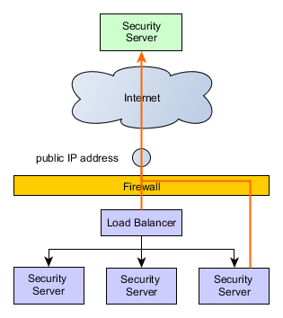

ig-ss_x-road_v6_security_server_installation_guide: *NIIS     |	*EE*
========================================================================================
							      >
							      >	| ![European Union / European Regional Development Fund / Inv
							      >	| -------------------------: |
							      >
							      >	# Security Server Installation Guide for Ubuntu <!-- omit in 
							      >
							      >	**X-ROAD 7**
							      >
							      >	Version: 2.43  
							      >	Doc. ID: IG-SS
							      >
							      >	---
							      >
							      >	## Version history <!-- omit in toc -->
							      >
							      >	| Date       | Version | Description                         
							      >	|------------|---------|-------------------------------------
							      >	| 01.12.2014 | 1.0     | Initial version                     
							      >	| 19.01.2015 | 1.1     | License information added           
							      >	| 18.03.2015 | 1.2     | Meta-package for security server add
							      >	| 02.04.2015 | 1.3     | “sdsb” change to “xroad”            
							      >	| 27.05.2015 | 1.4     | Some typos fixed                    
							      >	| 30.06.2015 | 1.5     | Minor corrections done              
							      >	| 06.07.2015 | 1.6     | New repository address              
							      >	| 18.09.2015 | 1.7     | Reference data in [3.2](#32-referenc
							      >	| 18.09.2015 | 2.0     | Editorial changes made              
							      >	| 13.10.2015 | 2.1     | Editorial changes made              
							      >	| 10.12.2015 | 2.2     | Updated the installing of the suppor
							      >	| 17.12.2015 | 2.3     | Added *xroad-addon-wsdlvalidator* pa
							      >	| 19.05.2016 | 2.4     | Merged changes from xtee6-doc repo. 
							      >	| 30.09.2016 | 2.5     | Added chapter „[Different versions o
							      >	| 07.12.2016 | 2.6     | Added operational data monitoring pa
							      >	| 23.02.2017 | 2.7     | Converted to Github flavoured Markdo
							      >	| 13.04.2017 | 2.8     | Added token ID formatting           
							      >	|22.01.2018  | 2.8.1   | Added NEE and NGO member classes    
							      >	| 25.08.2017 | 2.9     | Update environmental monitoring inst
							      >	| 15.09.2017 | 2.10    | Added package with configuration spe
							      >	| 05.03.2018 | 2.11    | Added terms and abbreviations refere
							      >	| 10.04.2018 | 2.12    | Updated chapter "[Installing the Sup
							      >	| 07.06.2018 | 2.12.1  | Updated repository information with 
							      >	| 03.07.2018 | 2.12.2  | Added network diagram and reference 
							      >	| 08.08.2018 | 2.12.3  | Editorial changes		
							      >	| 13.08.2018 | 2.12.4  | Package name fix		
							      >	| 14.10.2018 | 2.13    | Update package repository address   
							      >	| 25.10.2018 | 2.14    | Add RHEL7 as supported platform, upd
							      >	| 15.11.2018 | 2.15    | Add Ubuntu 18 installation instructi
							      >	| 28.01.2018 | 2.16    | Update port 2080 documentation      
							      >	| 30.05.2019 | 2.17    | Added package installation instructi
							      >	| 11.09.2019 | 2.18    | Remove Ubuntu 14.04 from supported p
							      >	| 20.09.2019 | 2.19    | Add instructions for using remote da
							      >	| 12.04.2020 | 2.20    | Add note about the default value of 
							      >	| 29.04.2020 | 2.21    | Add instructions how to use remote d
							      >	| 12.06.2020 | 2.22    | Update reference data regarding JMX 
							      >	| 24.06.2020 | 2.23    | Add repository sign key details in s
							      >	| 24.06.2020 | 2.24    | Remove environmental and operational
							      >	| 09.08.2020 | 2.25    | Update ports information in section 
							      >	| 17.08.2020 | 2.26    | Update for RHEL 8.                  
							      >	| 08.09.2020 | 2.27    | Fix minimum RAM requirement.        
							      >	| 16.09.2020 | 2.28    | Describe deployment options and data
							      >	| 29.09.2020 | 2.29    | Add instructions for creating databa
							      >	| 19.01.2021 | 2.30    | Add instructions for using an altern
							      >	| 04.02.2021 | 2.31    | Minor updates.                      
							      >	| 13.04.2021 | 2.32    | Update minimum requirements in secti
							      >	| 16.04.2021 | 2.33    | Update remote database installation 
							      >	| 18.05.2021 | 2.34    | Update error handling section       
							      >	| 02.06.2021 | 2.35    | Add backup encryption information   
							      >	| 01.07.2021 | 2.36    | Update 3rd party key server         
							      >	| 11.08.2021 | 2.37    | Minor updates                       
							      >	| 18.08.2021 | 2.38    | Minor updates to Annex D            
							      >	| 25.08.2021 | 2.39    | Update X-Road references from versio
							      >	| 26.08.2021 | 2.40    | Add instructions how to disable the 
							      >	| 03.08.2021 | 2.41    | Minor fixes                         
							      >	| 06.09.2021 | 2.42    | Update list of running services     
							      >	| 26.09.2022 | 2.43    | Remove Ubuntu 18.04 support         
							      >
							      >	## License
							      >
							      >	This document is licensed under the Creative Commons Attribut
							      >
							      >	## Table of Contents <!-- omit in toc -->
							      >
							      >	<!-- toc -->
							      >	<!-- vim-markdown-toc GFM -->
							      >
							      >	- [License](#license)
							      >	- [1 Introduction](#1-introduction)
							      >	  - [1.1 Target Audience](#11-target-audience)
							      >	  - [1.2 Terms and abbreviations](#12-terms-and-abbreviations
							      >	  - [1.3 References](#13-references)
							      >	- [2 Installation](#2-installation)
							      >	  - [2.1 Prerequisites to Installation](#21-prerequisites-to-
							      >	  - [2.2 Reference Data](#22-reference-data)
							      >	    - [2.2.1 Network Diagram](#221-network-diagram)
							      >	    - [2.3.1 RIA IP's for Whitelisting](#231-ria-ips-for-whit
							      >	  - [2.3 Requirements for the Security Server](#23-requiremen
							      >	  - [2.4 Preparing OS](#24-preparing-os)
							      >	  - [2.5 Setup Package Repository](#25-setup-package-reposito
							      >	  - [2.6 Remote Database Setup (optional)](#26-remote-databas
							      >	  - [2.7 Disable the Messagelog Addon before Installation (op
							      >	  - [2.8 Security Server Installation](#28-security-server-in
							      >	  - [2.9 Post-Installation Checks](#29-post-installation-chec
							      >	  - [2.10 Installing the Support for Hardware Tokens](#210-in
							      >	  - [2.11 Installing the Support for Environmental Monitoring
							      >	- [3 Security Server Initial Configuration](#3-security-serve
							      >	  - [3.1 Prerequisites](#31-prerequisites)
							      >	  - [3.2 Reference Data](#32-reference-data)
							      >	  - [3.3 Configuration](#33-configuration)
							      >	  - [3.4 Configuring configuration backup encryption](#34-con
							      >	- [4 Installation Error handling](#4-installation-error-handl
							      >	  - [4.1 Cannot Set LC\_ALL to Default Locale](#41-cannot-set
							      >	  - [4.2 PostgreSQL Is Not UTF8 Compatible](#42-postgresql-is
							      >	  - [4.3 Could Not Create Default Cluster](#43-could-not-crea
							      >	  - [4.4 Is Postgres Running On Port 5432?](#44-is-postgres-r
							      >	  - [4.5 Different versions of xroad-\* packages after succes
							      >	  - [4.6 ERROR: Upgrade supported from version X.Y.Z or newer
							      >	- [Annex A Security Server Default Database Properties](#anne
							      >	- [Annex B Default Database Users](#annex-b-default-database-
							      >	- [Annex C Deployment Options](#annex-c-deployment-options)
							      >	  - [C.1 General](#c1-general)
							      >	  - [C.2 Local Database](#c2-local-database)
							      >	  - [C.3 Remote Database](#c3-remote-database)
							      >	  - [C.4 High Availability Setup](#c4-high-availability-setup
							      >	  - [C.5 Load Balancing Setup](#c5-load-balancing-setup)
							      >	  - [C.6 Summary](#c6-summary)
							      >	- [Annex D Create Database Structure Manually](#annex-d-creat
							      >
							      >	<!-- vim-markdown-toc -->
							      >	<!-- tocstop -->
							      >
							      >	## 1 Introduction
							      >
							      >
							      >	### 1.1 Target Audience
							      >
							      >	The intended audience of this Installation Guide are X-Road S
							      >
							      >	The document is intended for readers with a moderate knowledg
							      >
							      >
							      >	### 1.2 Terms and abbreviations
							      >
							      >	See X-Road terms and abbreviations documentation \[[TA-TERMS]
							      >
							      >
							      >	### 1.3 References
							      >
							      >	1.  <a id="Ref_UG-SS" class="anchor"></a>\[UG-SS\] Cybernetic
							      >
							      >	2.  <a id="Ref_TERMS" class="anchor"></a>\[TA-TERMS\] X-Road 
							      >
							      >	3. <a name="Ref_UG-SYSPAR" class="anchor"></a>\[UG-SYSPAR\] X
							      >	[UG-SYSPAR](ug-syspar_x-road_v7_system_parameters.md).
							      >
							      >	4. <a name="Ref_IG-XLB" class="anchor"></a>\[IG-XLB\] X-Road:
							      >	[IG-XLB](LoadBalancing/ig-xlb_x-road_external_load_balancer_i
							      >
							      >
							      >	## 2 Installation
							      >
							      >
							      >	### 2.1 Prerequisites to Installation
							      >
							      >	There are multiple alternatives how the security server can b
							      >
							      >	The security server is officially supported on the following 
							      >
							      >	* Ubuntu Server 20.04 or 22.04 Long-Term Support (LTS) operat
							      >	* Red Hat Enterprise Linux (RHEL) 7 and 8 (x86-64).
							      >
							      >	NB: RIA provides support only for Security Servers which are 
							      >
							      >	The software can be installed both on physical and virtualize
							      >
							      >
							      >	### 2.2 Reference Data
							      >
							      >	*Note*: The information in empty cells should be determined b
							      >
							      >	**Caution**: Data necessary for the functioning of the operat
							      >
							      >
							      >	 **Ref** |                                        | **Explana
							      >	 ------ | --------------------------------------- | ---------
							      >	 1.0    | Ubuntu 18.04, Ubuntu 20.04 (x86-64)<br>3 GB RAM, 3 
							      >	 1.1    | http://x-tee.ee/packages/live/xroad                
							      >	 &nbsp; | http://x-tee.ee/packages/test/xroad                
							      >	 1.2    | https://x-tee.ee/packages/live/xroad/xroad.pub     
							      >	 1.3    |                                                    
							      >	 1.4    | **Inbound ports from external network** | Ports for
							      >	 &nbsp; | TCP 5500                                           
							      >	 &nbsp; | TCP 5577                                           
							      >	 1.5    | **Outbound ports to external network**  | Ports for
							      >	 &nbsp; | TCP 5500                                | Message e
							      >	 &nbsp; | TCP 5577                                | Querying 
							      >	 &nbsp; | TCP 4001                                | Communica
							      >	 &nbsp; | TCP 80                                  | Downloadi
							      >	 &nbsp; | TCP 80,443                              | Most comm
							      >	 1.6    | **Inbound ports from internal network** | Ports for
							      >	 &nbsp; | TCP 4000                                | User inte
							      >	 &nbsp; | TCP 80, 443                             | Informati
							      >	 &nbsp; | TCP 9011                                           
							      >	 &nbsp; | TCP 9999                                           
							      >	 1.7    | **Outbound ports to internal network**  | Ports for
							      >	 &nbsp; | TCP 80, 443, *other*                    | Producer 
							      >	 &nbsp; | TCP 2080                                | Message e
							      >	 1.8  |                                           | Security 
							      >	 1.9  |                                           | Security 
							      >	 1.10 | &lt;by default, the server’s IP addresses and names a
							      >	 1.11 | &lt;by default, the server’s IP addresses and names a
							      >
							      >	It is strongly recommended to protect the security server fro
							      >
							      >	The table below lists the required connections between differ
							      >
							      >	**Connection Type** | **Source** | **Target** | **Target Port
							      >	-----------|------------|-----------|-----------|-----------|
							      >	Out | Security Server | Central Server | 80, 4001 | tcp | |
							      >	Out | Security Server | Management Security Server | 5500, 55
							      >	Out | Security Server | OCSP Service | 80 / 443 | tcp | |
							      >	Out | Security Server | Timestamping Service | 80 / 443 | tcp
							      >	Out | Security Server | Data Exchange Partner Security Server
							      >	Out | Security Server | Producer Information System | 80, 443
							      >	In  | Monitoring Security Server | Security Server | 5500, 55
							      >	In  | Data Exchange Partner Security Server (Service Consumer
							      >	In | Consumer Information System | Security Server | 80, 443 
							      >	In | Admin | Security Server | 4000 | tcp | Source in the int
							      >
							      >	It is strongly recommended to protect the security server fro
							      >
							      >	 #### 2.2.1 Network Diagram
							      >	 The following network diagram is an example of a simple stan
							      >	 
							      >	 Allowing incoming connections from the Monitoring Security S
							      >
							      >
							      >	 **Caution**: The enabling of auxiliary services which are ne
							      >
							      >	 
							      >
							      >	 #### 2.3.1 RIA IP's for Whitelisting
							      >	 Type | **EE - production** | **ee-test**	| **ee-dev**
							      >	-------------------------- | --------------------| ----------
							      >	 Central Server 			| cs1.ee.x-tee.ee <br
							      >	 Central Monitoring Server 	| mon.ee.x-tee.ee | mon.test.
							      >	 Management Security Server 			| ht1.ee.x-te
							      >
							      >	### 2.3 Requirements for the Security Server
							      >
							      >	Minimum recommended hardware parameters:
							      >
							      >	* the server’s hardware (motherboard, CPU, network interface 
							      >	* a 64-bit dual-core Intel, AMD or compatible CPU; AES instru
							      >	* 4 GB RAM;
							      >	* a 100 Mbps network interface card;
							      >	* if necessary, interfaces for the use of hardware tokens.
							      >
							      >	Requirements to software and settings:
							      >
							      >	* an installed and configured Ubuntu 20.04 LTS or 22.04 LTS x
							      >	* if the security server is separated from other networks by 
							      >	* if the security server has a private IP address, a correspo
							      >
							      >
							      >	### 2.4 Preparing OS
							      >
							      >	* Add an X-Road system administrator user (**reference data: 
							      >
							      >	        sudo adduser <username>
							      >
							      >	    User roles are discussed in detail in X-Road Security Ser
							      >
							      >	* Set the operating system locale. Add following line to the 
							      >
							      >	        LC_ALL=en_US.UTF-8
							      >
							      >	* Ensure that the packages `locales` and `software-properties
							      >
							      >	        sudo apt-get install locales software-properties-comm
							      >
							      >	* Ensure that the locale is available
							      >
							      >	        sudo locale-gen en_US.UTF-8
							      >
							      >
							      >	### 2.5 Setup Package Repository
							      >
							      >	Add the X-Road repository’s signing key to the list of truste
							      >	```bash
							      >	wget -O -  https://x-tee.ee/packages/live/xroad/xroad.pub | a
							      >	```
							      >
							      >	Add X-Road package repository (**reference data: 1.1**)
							      >	```bash
							      >	echo "deb http://x-tee.ee/packages/live/xroad $(lsb_release -
							      >	```
							      >
							      >	Update package repository metadata:
							      >	```bash
							      >	sudo apt update
							      >	```
							      >
							      >	If you are installing the default setup with local PostgreSQL
							      >
							      >	### 2.6 Remote Database Setup (optional)
							      >
							      >	*This is an optional step.* 
							      >
							      >	Optionally, the security server can use a remote database ser
							      >	```bash
							      >	sudo apt install xroad-database-remote
							      >	```
							      >
							      >	For the application level backup and restore feature to work 
							      >	```bash
							      >	psql --version
							      >	psql (PostgreSQL) 12.6 (Ubuntu 12.6-0ubuntu0.20.04.1)
							      >
							      >	psql -h <database host> -U <superuser> -tAc 'show server_vers
							      >	10.16 (Ubuntu 10.16-0ubuntu0.18.04.1)
							      >	```
							      >
							      >	The security server installer can create the database and use
							      >
							      >	For advanced setup, e.g. when using separate servers for the 
							      >
							      >	Create the property file:
							      >	```bash
							      >	sudo touch /etc/xroad.properties
							      >	sudo chown root:root /etc/xroad.properties
							      >	sudo chmod 600 /etc/xroad.properties
							      >	```
							      >
							      >	Edit `/etc/xroad.properties`. See the example below. Replace 
							      >	```properties
							      >	postgres.connection.password = <database superuser password>
							      >	postgres.connection.user = <database superuser name, postgres
							      >	```
							      >	Note. If Microsoft Azure database for PostgreSQL is used, the
							      >
							      >	Before continuing, test that the connection to the database w
							      >	```bash
							      >	psql -h <database host> -U <superuser> -tAc 'show server_vers
							      >	```
							      >
							      >	For additional security, the `postgresql.connection.*` proper
							      >
							      >	### 2.7 Disable the Messagelog Addon before Installation (opt
							      >
							      >	It is possible to preconfigure the Security Server installati
							      >
							      >	In order to skip messagelog database creation and disable the
							      >
							      >	```bash
							      >	sudo debconf-set-selections <<< 'xroad-addon-messagelog xroad
							      >	```
							      >
							      >	### 2.8 Security Server Installation
							      >
							      >	Issue the following command to install the security server pa
							      >
							      >	```bash
							      >	  sudo apt-get update
							      >	  sudo apt-get install xroad-securityserver-ee
							      >	```
							      >
							      >	Upon the first installation of the packages, the system asks 
							      >
							      >	* Account name for the user who will be granted the rights to
							      >	* Database server URL. Locally installed database is suggeste
							      >	* The Distinguished Name of the owner of the **user interface
							      >	  The name and IP addresses detected from the operating syste
							      >
							      >	  * The *Subject DN* must be entered in the format:
							      >
							      >	            /CN=server.domain.tld
							      >
							      >	  * All IP addresses and domain names in use must be entered 
							      >
							      >	            IP:1.2.3.4,IP:4.3.2.1,DNS:servername,DNS:serverna
							      >
							      >	* The Distinguished Name of the owner of the TLS certificate 
							      >	    The name and IP addresses detected from the system are su
							      >
							      >	    * The *Subject DN* must be entered in the format:
							      >
							      >	            /CN=server.domain.tld
							      >
							      >	    * All IP addresses and domain names in use must be entere
							      >
							      >	            IP:1.2.3.4,IP:4.3.2.1,DNS:servername,DNS:serverna
							      >
							      >	The meta-package `xroad-securityserver` also installs metaser
							      >
							      >	**N.B.** In case configuration specific to Estonia (package `
							      >
							      >	### 2.9 Post-Installation Checks
							      >
							      >	The installation is successful if system services are started
							      >
							      >	* Ensure from the command line that X-Road services are in th
							      >	  ```bash
							      >	  sudo systemctl list-units "xroad-*"
							      >
							      >	  UNIT                           LOAD   ACTIVE SUB     DESCRI
							      >	  xroad-addon-messagelog.service loaded active running X-Road
							      >	  xroad-base.service             loaded active exited  X-Road
							      >	  xroad-confclient.service       loaded active running X-Road
							      >	  xroad-monitor.service          loaded active running X-Road
							      >	  xroad-proxy-ui-api.service     loaded active running X-Road
							      >	  xroad-proxy.service            loaded active running X-Road
							      >	  xroad-signer.service           loaded active running X-Road
							      >	  ```
							      >	* Ensure that the security server user interface at https://S
							      >
							      >	### 2.10 Installing the Support for Hardware Tokens
							      >
							      >	To configure support for hardware security tokens (smartcard,
							      >
							      >	1.  Install the hardware token support module using the follo
							      >
							      >	        sudo apt-get install xroad-addon-hwtokens
							      >
							      >	2.  Install and configure a PKCS\#11 driver for the hardware 
							      >
							      >	3.  Add the path to the PKCS\#11 driver to the file `/etc/xro
							      >
							      >	4.  After installing and configuring the driver, the `xroad-s
							      >
							      >	        sudo service xroad-signer restart
							      >
							      >	If you are running a high availability (HA) hardware token se
							      >
							      >	Depending on the hardware token there may be a need for more 
							      >
							      >	Parameter   | Type    | Default Value | Explanation
							      >	----------- | ------- |-------------- | ---------------------
							      >	*enabled*     | BOOLEAN | *true* | Indicates whether this dev
							      >	*library*     | STRING  |      | The path to the pkcs#11 libr
							      >	*library_cant_create_os_threads* | BOOLEAN | *false* | Indica
							      >	*os_locking_ok* | BOOLEAN | *false* | Indicates whether the p
							      >	*sign_verify_pin* | BOOLEAN | *false* | Indicates whether the
							      >	*token_id_format* | STRING | *{moduleType}{slotIndex}{serialN
							      >	*sign_mechanism*  | STRING | *CKM_RSA_PKCS* | Specifies the s
							      >	*pub_key_attribute_encrypt*  | BOOLEAN | *true* | Indicates w
							      >	*pub_key_attribute_verify* | BOOLEAN | *true* | Indicates whe
							      >	*pub_key_attribute_wrap* | BOOLEAN | | Indicates whether publ
							      >	*pub_key_attribute_allowed_mechanisms* | STRING LIST | | Spec
							      >	*priv_key_attribute_sensitive* | BOOLEAN | *true* | Indicates
							      >	*priv_key_attribute_decrypt* | BOOLEAN | *true* | Indicates w
							      >	*priv_key_attribute_sign* | BOOLEAN | *true* | Indicates whet
							      >	*priv_key_attribute_unwrap* | BOOLEAN | | Indicates whether p
							      >	*priv_key_attribute_allowed_mechanisms* | STRING LIST | | Spe
							      >
							      >	**Note 1:** Only parameter *library* is mandatory, all the ot
							      >	**Note 2:** The item separator of the type STRING LIST is ","
							      >
							      >	### 2.11 Installing the Support for Environmental Monitoring
							      >
							      >	The support for environmental monitoring functionality on a s
							      >
							      >	## 3 Security Server Initial Configuration
							      >
							      >	During the security server initial configuration, the server’
							      >
							      >
							      >	### 3.1 Prerequisites
							      >
							      >	Configuring the security server assumes that the security ser
							      >
							      >
							      >	### 3.2 Reference Data
							      >
							      >	ATTENTION: Reference items 2.1 - 2.3 in the reference data ar
							      >
							      >	The security server code and the software token’s PIN will be
							      >
							      >	 Ref  |                                                   | E
							      >	 ---- | ------------------------------------------------- | -
							      >	 2.1  | <https://x-tee.ee/anchors/>&lt;anchor file&gt;<br> ee
							      >	 2.2  | GOV - government<br> COM - commercial<br> NGO - non-p
							      >	 2.3  | &lt;security server owner register code&gt;       | M
							      >	 2.4  | &lt;choose security server identificator name&gt; | S
							      >	 2.5  | &lt;choose PIN for software token&gt;             | S
							      >
							      >
							      >	### 3.3 Configuration
							      >
							      >	To perform the initial configuration, open the address
							      >
							      >	    https://SECURITYSERVER:4000/
							      >
							      >	in a Web browser (**reference data: 1.8; 1.6**). To log in, u
							      >
							      >	Upon first log-in, the system asks for the following informat
							      >
							      >	* The global configuration anchor file (**reference data: 2.1
							      >
							      >	    **Please verify anchor hash value with the published valu
							      >
							      >	If the configuration is successfully downloaded, the system a
							      >
							      >	* The security server owner’s member class (**reference data:
							      >	* The security server owner’s member code (**reference data: 
							      >
							      >	-   The security server owner’s member code (**reference data
							      >	    If the member class and member code are correctly entered
							      >	    - **NB! If the security server owner  or hosted client is
							      >
							      >	        The Member Code must be formed as follows:
							      >
							      >	        **"NTRCONTRYCODE-ORGANIZATIONREGISTRYCODE"** - withou
							      >
							      >	        Where:
							      >	        * "NTR" - Prefix of the legal entity identifier accor
							      >	        * COUNTRY CODE - Country code according to ISO 3166 (
							      >	        * `-` hyphen
							      >	        * ORGANIZATION REGISTRY CODE - Organizational registr
							      >
							      >	        Example:
							      >	        * Lexbyte Digital Limited, a registered organization 
							      >	        * Member Name: **Lexbyte Digital Limited**
							      >	        * Member Class: **NEE**
							      >	        * Member Code: **NTRMT-C56249**
							      >
							      >	        Such requirements to the NEE Member Code are necessar
							      >
							      >	        References:
							      >	        * SK ID Solutions AS certificate profile: https://sk.
							      >	        * ETSI EN 319 412-1: http://www.etsi.org/deliver/etsi
							      >	        * Alpha 2 country code: https://www.iso.org/obp/ui/#s
							      >
							      >	* Security server code (**reference data: 2.4**), which is ch
							      >	* Software token’s PIN (**reference data: 2.5**). The PIN wil
							      >
							      >	### 3.4 Configuring configuration backup encryption
							      >
							      >	It is possible to automatically encrypt security server confi
							      >	for backup encryption and verification. Backups are always si
							      >	To turn encryption on, please override the default configurat
							      >
							      >	    [proxy]
							      >	    backup-encrypted=true
							      >	    backup-public-key-path=/etc/xroad/backupkeys
							      >
							      >	To turn backup encryption on, please change the `backup-encry
							      >	By default, additional encryption keys are stored in the `/et
							      >	The default directory can be changed by modifying the `backup
							      >
							      >	By default, backups are encrypted using security server's bac
							      >	is strongly recommended to copy additional GPG public keys to
							      >	encrypt backups so that ANY of these keys can decrypt the bac
							      >	consistency and decrypting backups in case security server's 
							      >	Do not place any other files into backup keys folder, otherwi
							      >
							      >	To externally verify a backup archive's consistency, security
							      >	and imported into external GPG keyring. Note that this can be
							      >	security server backup encryption key is generated during ini
							      >
							      >	To export security server's backup encryption public key use 
							      >
							      >	    gpg --homedir /etc/xroad/gpghome --armor --output server-
							      >
							      >	where `AA/GOV/TS1OWNER/TS1` is the security server id.
							      >
							      >	The key can then be moved to an external host and imported to
							      >
							      >	    gpg --homedir /your_gpg_homedir_here --import server-publ
							      >
							      >
							      >	## 4 Installation Error handling
							      >
							      >
							      >	### 4.1 Cannot Set LC\_ALL to Default Locale
							      >
							      >	If running the locale command results in the error message
							      >
							      >	    locale: Cannot set LC_ALL to default locale: No such file
							      >
							      >	then the support for this particular language has not been in
							      >
							      >	    sudo apt-get install language-pack-en
							      >
							      >	Then, to update the system’s locale files, run the following 
							      >
							      >	    sudo locale-gen en_US.UTF-8
							      >	    sudo update-locale en_US.UTF-8
							      >
							      >	Set operating system locale. Add following line to `/etc/envi
							      >
							      >	    LC_ALL=en_US.UTF-8
							      >
							      >	After updating the system’s locale settings, it is recommende
							      >
							      >
							      >	### 4.2 PostgreSQL Is Not UTF8 Compatible
							      >
							      >	If the security server installation is aborted with the error
							      >
							      >	    postgreSQL is not UTF8 compatible,
							      >
							      >	then the PostgreSQL package is installed with a wrong locale.
							      >
							      >	**WARNING**: All data in the database will be erased!
							      >
							      >	    sudo pg_dropcluster --stop 10 main
							      >	    LC_ALL="en_US.UTF-8" sudo pg_createcluster --start 10 mai
							      >
							      >	To complete the interrupted installation, run the command
							      >
							      >	    sudo apt-get -f install
							      >
							      >
							      >	### 4.3 Could Not Create Default Cluster
							      >
							      >	If the following error message is displayed during PostgreSQL
							      >
							      >	    Error: The locale requested by the environment is invalid
							      >	    Error: could not create default cluster. Please create it
							      >
							      >	use the following command to create the PostgreSQL data clust
							      >
							      >	    LC_ALL="en_US.UTF-8" sudo pg_createcluster --start 10 mai
							      >
							      >	The interrupted installation can be finished using
							      >
							      >	    sudo apt-get -f install
							      >
							      >
							      >	### 4.4 Is Postgres Running On Port 5432?
							      >
							      >	If the following error message appears during installation
							      >
							      >	    Is postgres running on port 5432 ?
							      >	    Aborting installation! please fix issues and rerun with a
							      >
							      >	check if any of the following errors occurred during the inst
							      >
							      >	* Error installing the data cluster. Refer to section [“Could
							      >
							      >	* The PostgreSQL data cluster installed during the installati
							      >
							      >	The interrupted installation can be finished using
							      >
							      >	    sudo apt-get -f install
							      >
							      >
							      >	### 4.5 Different versions of xroad-\* packages after success
							      >
							      >	Sometimes, after using `sudo apt-get upgrade` command, some o
							      >
							      >	    # sudo dpkg -l | grep xroad-
							      >	    ii xroad-addon-messagelog 6.8.5.20160929134539gitfe60f90
							      >	    ii xroad-addon-metaservices 6.8.5.20160929134539gitfe60f9
							      >	    ii xroad-addon-wsdlvalidator 6.8.5.20160929134539gitfe60f
							      >	    ii xroad-common 6.8.5.20160929134539gitfe60f90
							      >	    ii xroad-jetty9 6.8.5.20160929134539gitfe60f90
							      >	    ii xroad-proxy 6.8.5.20160929134539gitfe60f90
							      >	    ii xroad-securityserver-ee 6.8.3-3-201605131138
							      >
							      >	`apt-get upgrade` command doesn’t install new packages - in t
							      >
							      >	To be sure that packages are installed correctly please use `
							      >
							      >	### 4.6 ERROR: Upgrade supported from version X.Y.Z or newer
							      >
							      >	The following error message may come up during the security s
							      >
							      >	`ERROR: Upgrade supported from version X.Y.Z or newer`
							      >
							      >	Upgrading the packages from the current version to the target
							      >
							      >	A guide to upgrading from an older version of X-Road can be f
							      >
							      >
							      >	## Annex A Security Server Default Database Properties
							      >
							      >	`/etc/xroad/db.properties`
							      >
							      >	```properties
							      >	# connection.url format: jdbc:postgresql://<hostname>:<port>/
							      >
							      >	serverconf.hibernate.connection.url = jdbc:postgresql://127.0
							      >	serverconf.hibernate.connection.username = serverconf
							      >	serverconf.hibernate.connection.password = <randomly generate
							      >	serverconf.hibernate.connection.driver_class = org.postgresql
							      >	serverconf.hibernate.dialect = ee.ria.xroad.common.db.CustomP
							      >	serverconf.hibernate.hikari.dataSource.currentSchema = server
							      >	serverconf.hibernate.jdbc.use_streams_for_binary = true
							      >
							      >	messagelog.hibernate.connection.url = jdbc:postgresql://127.0
							      >	messagelog.hibernate.connection.username = messagelog
							      >	messagelog.hibernate.connection.password = <randomly generate
							      >	messagelog.hibernate.connection.driver_class = org.postgresql
							      >	messagelog.hibernate.dialect = ee.ria.xroad.common.db.CustomP
							      >	messagelog.hibernate.hikari.dataSource.currentSchema = messag
							      >	messagelog.hibernate.jdbc.use_streams_for_binary = true
							      >
							      >	op-monitor.hibernate.connection.url = jdbc:postgresql://127.0
							      >	op-monitor.hibernate.connection.username = opmonitor
							      >	op-monitor.hibernate.connection.password = <randomly generate
							      >	op-monitor.hibernate.connection.driver_class = org.postgresql
							      >	op-monitor.hibernate.hikari.dataSource.currentSchema = opmoni
							      >	op-monitor.hibernate.jdbc.use_streams_for_binary = true
							      >	```
							      >
							      >
							      >	## Annex B Default Database Users
							      >
							      >	| User             | Database   | Privileges               | 
							      >	| ---------------- | ---------- | ------------------------ | 
							      >	| serverconf       | serverconf | TEMPORARY,CONNECT        | 
							      >	| serverconf_admin | serverconf | CREATE,TEMPORARY,CONNECT | 
							      >	| messagelog       | messagelog | TEMPORARY,CONNECT        | 
							      >	| messagelog_admin | messagelog | CREATE,TEMPORARY,CONNECT | 
							      >	| opmonitor        | op-monitor | TEMPORARY,CONNECT        | 
							      >	| opmonitor_admin  | op-monitor | CREATE,TEMPORARY,CONNECT | 
							      >	| postgres         | ALL        | ALL                      | 
							      >
							      >
							      >	## Annex C Deployment Options
							      >
							      >
							      >	### C.1 General
							      >
							      >	X-Road security server has multiple deployment options. The s
							      >
							      >
							      >	### C.2 Local Database
							      >
							      >	The simplest deployment option is to use a single security se
							      >
							      >	![Security server with local database](img/ig-ss_local_db.svg
							      >
							      >
							      >	### C.3 Remote Database
							      >
							      >	It is possible to use a remote database with security server.
							      >
							      >	Security server supports a variety of cloud databases includi
							      >
							      >	![Security server with remote database](img/ig-ss_remote_db.s
							      >
							      >
							      >	### C.4 High Availability Setup
							      >
							      >	In production systems it's rarely acceptable to have a single
							      >
							      >	![Security server high-availability setup](img/ig-ss_high_ava
							      >
							      >
							      >	### C.5 Load Balancing Setup
							      >
							      >	Busy production systems may need scalable performance in addi
							      >
							      >	
							      >
							      >	These databases can be hosted on one database server (default
							      >
							      >	Login to the database server(s) as the superuser (`postgres` 
							      >	```bash
							      >	psql -h <database host>:<port> -U <superuser> -d postgres
							      >	```
							      >
							      >	Run the following commands to create the necessary database s
							      >
							      >	**serverconf** (required)
							      >	```sql
							      >	CREATE DATABASE serverconf ENCODING 'UTF8';
							      >	REVOKE ALL ON DATABASE serverconf FROM PUBLIC;
							      >	CREATE ROLE serverconf_admin LOGIN PASSWORD '<serverconf_admi
							      >	GRANT serverconf_admin to <superuser>;
							      >	GRANT CREATE,TEMPORARY,CONNECT ON DATABASE serverconf TO serv
							      >	\c serverconf
							      >	CREATE EXTENSION hstore;
							      >	CREATE SCHEMA serverconf AUTHORIZATION serverconf_admin;
							      >	REVOKE ALL ON SCHEMA public FROM PUBLIC;
							      >	GRANT USAGE ON SCHEMA public to serverconf_admin;
							      >	CREATE ROLE serverconf LOGIN PASSWORD '<serverconf password>'
							      >	GRANT serverconf to <superuser>;
							      >	GRANT TEMPORARY,CONNECT ON DATABASE serverconf TO serverconf;
							      >	GRANT USAGE ON SCHEMA public to serverconf;
							      >	```
							      >
							      >	**messagelog** (required by xroad-addon-messagelog)
							      >	```sql
							      >	CREATE DATABASE messagelog ENCODING 'UTF8';
							      >	REVOKE ALL ON DATABASE messagelog FROM PUBLIC;
							      >	CREATE ROLE messagelog_admin LOGIN PASSWORD '<messagelog_admi
							      >	GRANT messagelog_admin to <superuser>;
							      >	GRANT CREATE,TEMPORARY,CONNECT ON DATABASE messagelog TO mess
							      >	\c messagelog
							      >	CREATE SCHEMA messagelog AUTHORIZATION messagelog_admin;
							      >	REVOKE ALL ON SCHEMA public FROM PUBLIC;
							      >	GRANT USAGE ON SCHEMA public to messagelog_admin;
							      >	CREATE ROLE messagelog LOGIN PASSWORD '<messagelog password>'
							      >	GRANT messagelog to <superuser>;
							      >	GRANT TEMPORARY,CONNECT ON DATABASE messagelog TO messagelog;
							      >	GRANT USAGE ON SCHEMA public to messagelog;
							      >	```
							      >
							      >	**op-monitor** (optional, required by xroad-opmonitor)
							      >
							      >	If operational monitoring is going to be installed, run addit
							      >
							      >	```sql
							      >	CREATE DATABASE "op-monitor" ENCODING 'UTF8';
							      >	REVOKE ALL ON DATABASE "op-monitor" FROM PUBLIC;
							      >	CREATE ROLE opmonitor_admin LOGIN PASSWORD '<opmonitor_admin 
							      >	GRANT opmonitor_admin to <superuser>;
							      >	GRANT CREATE,TEMPORARY,CONNECT ON DATABASE "op-monitor" TO op
							      >	\c "op-monitor"
							      >	CREATE SCHEMA opmonitor AUTHORIZATION opmonitor_admin;
							      >	REVOKE ALL ON SCHEMA public FROM PUBLIC;
							      >	GRANT USAGE ON SCHEMA public to opmonitor_admin;
							      >	CREATE ROLE opmonitor LOGIN PASSWORD '<opmonitor password>';
							      >	GRANT opmonitor to <superuser>;
							      >	GRANT TEMPORARY,CONNECT ON DATABASE "op-monitor" TO opmonitor
							      >	GRANT USAGE ON SCHEMA public to opmonitor;
							      >	```
							      >
							      >	Lastly, customize the database connection properties to match
							      >
							      >	Note. When using Microsoft Azure PostgreSQL, the user names n
							      >
							      >	Create the configuration file `/etc/xroad.properties`.
							      >	```bash
							      >	sudo touch /etc/xroad.properties
							      >	sudo chown root:root /etc/xroad.properties
							      >	sudo chmod 600 /etc/xroad.properties
							      >	```
							      >
							      >	Edit `/etc/xroad.properties` and add/update the following pro
							      >	```properties
							      >	serverconf.database.admin_user = serverconf_admin
							      >	serverconf.database.admin_password = <serverconf_admin passwo
							      >	op-monitor.database.admin_user = opmonitor_admin
							      >	op-monitor.database.admin_password = <opmonitor_admin passwor
							      >	messagelog.database.admin_user = messagelog_admin
							      >	messagelog.database.admin_password = <messagelog_admin passwo
							      >	```
							      >
							      >	Create the `/etc/xroad/db.properties` file
							      >	```bash
							      >	sudo mkdir /etc/xroad
							      >	sudo chown xroad:xroad /etc/xroad
							      >	sudo chmod 751 /etc/xroad
							      >	sudo touch /etc/xroad/db.properties
							      >	sudo chmod 0640 /etc/xroad/db.properties
							      >	sudo chown xroad:xroad /etc/xroad/db.properties
							      >	```
							      >
							      >	Edit the `/etc/xroad/db.properties` file and add/update the f
							      >	The database connection url format is `jdbc:postgresql://<dat
							      >	```properties
							      >	serverconf.hibernate.connection.url = jdbc:postgresql://<data
							      >	serverconf.hibernate.connection.username = serverconf
							      >	serverconf.hibernate.connection.password = <serverconf passwo
							      >	serverconf.hibernate.hikari.dataSource.currentSchema = server
							      >
							      >	messagelog.hibernate.connection.url = jdbc:postgresql://<data
							      >	messagelog.hibernate.connection.username = messagelog
							      >	messagelog.hibernate.connection.password = <messagelog passwo
							      >	messagelog.hibernate.hikari.dataSource.currentSchema = messag
							      >
							      >	op-monitor.hibernate.connection.url = jdbc:postgresql://<data
							      >	op-monitor.hibernate.connection.username = opmonitor
							      >	op-monitor.hibernate.connection.password = <opmonitor passwor
							      >	op-monitor.hibernate.hikari.dataSource.currentSchema = opmoni
							      >	```
ug-syspar_x-road_v6_system_parameters: *NIIS		      |	*EE*
========================================================================================
							      >	# X-Road: System Parameters User Guide
							      >
							      >	Version: 2.67  
							      >	Doc. ID: UG-SYSPAR
							      >
							      >	| Date       | Version  | Description                        
							      >	|------------|----------|------------------------------------
							      >	| 29.05.2015 | 1.0      | First draft                        
							      >	| 01.06.2015 | 1.1      | Some corrections done, typos fixed 
							      >	| 30.06.2015 | 1.2      | Minor corrections done             
							      >	| 26.08.2015 | 1.3      | Corrections regarding SQL done     
							      >	| 09.09.2015 | 2.0      | Editorial changes made             
							      >	| 11.09.2015 | 2.1      | Global configuration generation int
							      >	| 20.09.2015 | 2.2      | Editorial changes made             
							      >	| 23.09.2015 | 2.3      | Warning added about changing system
							      >	| 24.09.2015 | 2.4      | Note added about setting the *timeS
							      >	| 07.10.2015 | 2.5      | Default value of the parameter *acc
							      >	| 8.12.2015  | 2.6      | New parameters for configuring sign
							      >	| 8.12.2015  | 2.7      | Added parameters for toggling SOAP 
							      >	| 17.12.2015 | 2.8      | Added monitoring parameters        
							      >	| 28.1.2016  | 2.9      | Added configuration client admin po
							      >	| 04.10.2016 | 2.10     | Converted to markdown format | Sami
							      >	| 05.10.2016 | 2.11     | Added options for proxy client and 
							      >	| 02.11.2016 | 2.12     | Fix ocspFreshnessSeconds descriptio
							      >	| 01.12.2017 | 2.13     | Added documentation for minimum glo
							      >	| 20.01.2017 | 2.14     | Added license text and version hist
							      >	| 08.02.2017 | 2.15     | Updated documentation with new envi
							      >	| 23.02.2017 | 2.16     | Added documentation for OCSP-respon
							      >	| 03.03.2017 | 2.17     | Added new parameter *jetty-ocsp-res
							      >	| 07.03.2017 | 2.18     | Added new parameters *ocsp-responde
							      >	| 11.04.2017 | 2.19     | Changed default values of the proxy
							      >	| 06.06.2017 | 2.20     | Removed parameter *default-signatur
							      >	| 14.06.2017 | 2.21     | Added new parameter *allowed-federa
							      >	| 11.07.2017 | 2.22     | Changed connector SO-linger values 
							      >	| 18.08.2017 | 2.23     | Update wsdl-validator-command descr
							      >	| 31.08.2017 | 2.24     | Moved ocsp-cache-path and enforce-t
							      >	| 17.10.2017 | 2.25     | Added new security server env-monit
							      >	| 20.10.2017 | 2.26     | Clarified the effects of disabling 
							      >	| 22.11.2017 | 2.27     | Default changed to vanilla. New col
							      >	| 02.01.2018 | 2.28     | Added proxy parameter allow-get-wsd
							      >	| 29.01.2018 | 2.29     | Removed proxy parameter client-fast
							      >	| 05.03.2018 | 2.30     | Added reference to terms and abbrev
							      >	| 06.04.2018 | 2.31     | Removed TLSv1.1 support (client-sid
							      >	| 18.08.2018 | 2.32     | Added new parameter *ocsp-retry-del
							      >	| 08.10.2018 | 2.33     | Added new parameter *xroad-tls-ciph
							      >	| 18.10.2018 | 2.34     | Default value of the parameter *sig
							      >	| 25.10.2018 | 2.35     | Update note regarding supported cip
							      >	| 26.10.2018 | 2.36     | Added new parameter *module-manager
							      >	| 08.11.2018 | 2.37     | Improved definition of *minimum-glo
							      >	| 19.12.2018 | 2.38     | Fixed the default value of trusted-
							      >	| 21.12.2018 | 2.39     | Add connector initial idle time par
							      >	| 23.01.2019 | 2.40     | Added new Central Server parameter 
							      >	| 31.01.2019 | 2.41     | REST message log parameters | Jarkk
							      >	| 03.02.2019 | 2.42     | Added new Central Server parameter 
							      >	| 27.03.2019 | 2.43     | Added management REST API parameter
							      >	| 02.04.2019 | 2.44     | Added new message log parameter *cl
							      >	| 08.04.2019 | 2.45     | Update REST related message log par
							      >	| 30.04.2019 | 2.46     | Added new parameter *timestamp-retr
							      >	| 02.07.2019 | 2.47     | Added new Central Server parameter 
							      >	| 26.11.2019 | 2.48     | Add proxy serverconf caching parame
							      >	| 05.12.2019 | 2.49     | Fix broken link in Table of Content
							      >	| 11.12.2019 | 2.50     | Added new Central Server parameter 
							      >	| 01.04.2020 | 2.51     | Added new management REST API param
							      >	| 03.04.2020 | 2.52     | Removed proxy parameter allow-get-w
							      >	| 12.04.2020 | 2.53     | Updated *connector-host* property E
							      >	| 30.04.2020 | 2.54     | Added new parameter *enforce-client
							      >	| 01.07.2020 | 2.55     | Updated *enforce-token-pin-policy* 
							      >	| 30.07.2020 | 2.56     | Moved proxy-ui parameters into prox
							      >	| 30.07.2020 | 2.57     | CS default database password is aut
							      >	| 13.10.2020 | 2.58     | Add new parameter *akka-use-secure-
							      >	| 11.02.2021 | 2.59     | Add new parameter *auto-update-time
							      >	| 01.06.2021 | 2.60     | Add new parameter *messagelog.archi
							      >	| 04.08.2021 | 2.61     | Add new parameters for messagelog a
							      >	| 25.08.2021 | 2.62     | Update X-Road references from versi
							      >	| 31.08.2021 | 2.63     | Update messagelog and proxy paramet
							      >	| 05.10.2021 | 2.64     | Added a new chapter about custom co
							      >	| 13.04.2022 | 2.65     | Corrected message logging max body 
							      >	| 28.04.2022 | 2.66     | Updated *max-loggable-message-body-
							      >	| 30.09.2022 | 2.67     | Updated *key-length* property EE- a
							      >
							      >	## Table of Contents
							      >
							      >	<!-- toc -->
							      >	  * [License](#license)
							      >	- [X-Road: System Parameters User Guide](#x-road-system-param
							      >	  - [Table of Contents](#table-of-contents)
							      >	  - [License](#license)
							      >	  - [1 Introduction](#1-introduction)
							      >	    - [1.1 Terms and abbreviations](#11-terms-and-abbreviatio
							      >	    - [1.2 References](#12-references)
							      >	  - [2 Changing the System Parameter Values](#2-changing-the-
							      >	    - [2.1 Changing the System Parameter Values in Configurat
							      >	    - [2.2 Changing the System Parameter Values in the Centra
							      >	    - [2.3 Changing the Global Configuration Generation Inter
							      >	  - [3 Security Server System Parameters](#3-security-server-
							      >	    - [3.1 Common parameters : `[common]`](#31-common-paramet
							      >	    - [3.2 Proxy parameters: `[proxy]`](#32-proxy-parameters-
							      >	    - [3.3 Proxy User Interface parameters: `[proxy-ui]`](#33
							      >	    - [3.4 Signer parameters: `[signer]`](#34-signer-paramete
							      >	    - [3.5 Anti-DOS parameters: `[anti-dos]`](#35-anti-dos-pa
							      >	    - [3.6 Configuration Client parameters: `[configuration-c
							      >	    - [3.7 Message log add-on parameters: `[message-log]`](#3
							      >	      - [3.7.1 Note on logged X-Road message headers](#371-no
							      >	    - [3.8 Environmental monitoring add-on configuration para
							      >	    - [3.9 Management REST API parameters: `[proxy-ui-api]`](
							      >	  - [4 Central Server System Parameters](#4-central-server-sy
							      >	    - [4.1 System Parameters in the Configuration File](#41-s
							      >	      - [4.1.1 Common parameters: `[common]`](#411-common-par
							      >	      - [4.1.2 Center parameters: `[center]`](#412-center-par
							      >	      - [4.1.3 Signer parameters: `[signer]`](#413-signer-par
							      >	    - [4.2 System Parameters in the Database](#42-system-para
							      >	    - [4.3 Global Configuration Generation Interval Parameter
							      >	  - [5 Configuration Proxy System Parameters](#5-configuratio
							      >	    - [5.1 Configuration proxy module parameters: `[configura
							      >	    - [5.2 Signer parameters: `[signer]`](#52-signer-paramete
							      >	  - [6 Adding command line arguments](#6-adding-command-line-
							      >	    - [6.1 The configuration file](#61-the-configuration-file
							      >	    - [6.2 Legacy configuration file support in X-Road v7](#6
							      >
							      >	<!-- tocstop -->
							      >
							      >	## License
							      >
							      >	This document is licensed under the Creative Commons Attribut
							      >
							      >	## 1 Introduction
							      >
							      >	This document describes the system parameters of the X-Road c
							      >	Please note the term 'vanilla' in the documentation. In X-Roa
							      >
							      >	### 1.1 Terms and abbreviations
							      >
							      >	See X-Road terms and abbreviations documentation \[[TA-TERMS]
							      >
							      >	### 1.2 References
							      >
							      >	1. <a id="Ref_INI"></a>\[INI\] INI file, [http://en.wikipedia
							      >	2. <a id="Ref_CRON"></a>\[CRON\] Quartz Scheduler
							      >	    CRON expression, [http://www.quartz-scheduler.org/documen
							      >	3. <a id="Ref_PR-MESS"></a>\[PR-MESS\] [X-Road Message Protoc
							      >	4. <a id="Ref_PR-TARGETSS"></a>\[PR-TARGETSS\] [Security Serv
							      >	5. <a id="Ref_PR-SECTOKEN"></a>\[PR-SECTOKEN\] [Security Toke
							      >	6. <a id="Ref_TERMS" class="anchor"></a>\[TA-TERMS\] [X-Road 
							      >	7. <a id="Ref_CRONMAN"></a>\[CRONMAN\] [http://linux.die.net/
							      >	8. <a id="Ref_CRONHOW"></a>\[CRONHOW\] Cron format specificat
							      >	9. <a id="Ref_PR-REST"></a>\[PR-REST\] [X-Road Message Protoc
							      >	10. <a id="Ref_UG_SS" class="anchor">\[UG-SS\]</a> X-Road 7. 
							      >
							      >	## 2 Changing the System Parameter Values
							      >
							      >	The system parameters specify various characteristics of the 
							      >
							      >	**Changing the values of the system parameters is strongly di
							      >
							      >	### 2.1 Changing the System Parameter Values in Configuration
							      >
							      >	The configuration files are INI files \[[INI](#Ref_INI)\], wh
							      >
							      >	In order to override the default values of system parameters,
							      >
							      >		/etc/xroad/conf.d/local.ini
							      >
							      >	Each system parameter affects a specific server component. To
							      >
							      >	The following format is used for the sections:
							      >
							      >		[ServerComponent]
							      >		SystemParameterName1=Value1
							      >		SystemParameterName2=Value2
							      >
							      >	For example, to configure the parameter *client-http-port* fo
							      >
							      >		[proxy]
							      >		client-http-port=1234
							      >
							      >	Multiple parameters can be configured under the same section:
							      >
							      >		[proxy]
							      >		client-http-port=1234
							      >		server-listen-port=20000
							      >
							      >	**NB! Changing the parameter values in the configuration file
							      >
							      >	**WARNING! The value of the parameter is not validated, thus 
							      >
							      >	### 2.2 Changing the System Parameter Values in the Central S
							      >
							      >	The central server database can be accessed with the psql uti
							      >
							      >		psql -U centerui -h localhost centerui_production
							      >
							      >	The default value of a system parameter can be overridden by 
							      >
							      >		INSERT INTO system_parameters (key, value, created_at
							      >
							      >	To edit the value of a system parameter already inserted into
							      >
							      >		UPDATE system_parameters SET value = '*parameter_valu
							      >
							      >	To restore the default value of a system parameter, delete th
							      >
							      >		DELETE FROM system_parameters WHERE key = 'parameter_
							      >
							      >	**NB! Modifying or deleting system parameters other than the 
							      >
							      >
							      >	### 2.3 Changing the Global Configuration Generation Interval
							      >
							      >	In order to override the default value of the global configur
							      >
							      >		/etc/cron.d/xroad-center
							      >
							      >	The default contents of the file are the following:
							      >
							      >		#!/bin/sh
							      >		* * * * * xroad curl http://127.0.0.1:8084/management
							      >
							      >	**NB!** Global configuration generation interval must be modi
							      >
							      >	The configuration generation interval must be shorter than th
							      >
							      >	## 3 Security Server System Parameters
							      >
							      >	This chapter describes the system parameters used by the comp
							      >
							      >	### 3.1 Common parameters : `[common]`
							      >
							      >	| **Parameter**                                    | **Vanill
							      >	|--------------------------------------------------|---------
							      >	| configuration-path                               | /etc/xro
							      >	| temp-files-path                                  | /var/tmp
							      >	| akka-use-secure-remote-transport                 | true    
							      >
							      >	### 3.2 Proxy parameters: `[proxy]`
							      >
							      >	| **Parameter**                                    | **Vanill
							      >	|--------------------------------------------------|---------
							      >	| client-http-port                                 | 80 <br/>
							      >	| client-https-port                                | 443 <br/
							      >	| client-timeout                                   | 30000   
							      >	| configuration-anchor-file                        | /etc/xro
							      >	| connector-host                                   | 0.0.0.0 
							      >	| database-properties                              | /etc/xro
							      >	| ocsp-responder-listen-address                    | 0.0.0.0 
							      >	| ocsp-responder-port                              | 5577    
							      >	| ocsp-responder-client-connect-timeout            | 20000   
							      >	| ocsp-responder-client-read-timeout               | 30000   
							      >	| server-listen-address                            | 0.0.0.0 
							      >	| server-listen-port                               | 5500    
							      >	| server-port                                      | 5500    
							      >	| jetty-clientproxy-configuration-file             | /etc/xro
							      >	| jetty-serverproxy-configuration-file             | /etc/xro
							      >	| jetty-ocsp-responder-configuration-file          | /etc/xro
							      >	| ssl-enabled                                      | true    
							      >	| client-tls-ciphers                               | See [1](
							      >	| xroad-tls-ciphers                                | See [2](
							      >	| client-tls-protocols                             | TLSv1.2 
							      >	| server-connector-initial-idle-time               | 30000   
							      >	| server-connector-max-idle-time                   | 0       
							      >	| server-connector-so-linger                       | -1      
							      >	| server-support-clients-pooled-connections        | false   
							      >	| client-connector-initial-idle-time               | 30000   
							      >	| client-connector-max-idle-time                   | 0       
							      >	| client-connector-so-linger                       | -1      
							      >	| client-httpclient-timeout                        | 0       
							      >	| client-httpclient-so-linger                      | -1      
							      >	| client-use-idle-connection-monitor               | true    
							      >	| client-idle-connection-monitor-interval          | 30000   
							      >	| client-idle-connection-monitor-timeout           | 60000   
							      >	| pool-total-max-connections                       | 10000   
							      >	| pool-total-default-max-connections-per-route     | 2500    
							      >	| pool-validate-connections-after-inactivity-of-millis | 2000
							      >	| pool-enable-connection-reuse                     | false   
							      >	| client-use-fastest-connecting-ssl-socket-autoclose | true  
							      >	| client-fastest-connecting-ssl-uri-cache-period      | 3600 
							      >	| health-check-port                                | 0 (disab
							      >	| health-check-interface                           | 0.0.0.0 
							      >	| actorsystem-port                                 | 5567    
							      >	| server-conf-cache-period                         | 60      
							      >	| server-conf-client-cache-size                    | 100     
							      >	| server-conf-service-cache-size                   | 1000    
							      >	| server-conf-acl-cache-size                       | 100000  
							      >	| enforce-client-is-cert-validity-period-check     | false   
							      >	| backup-encryption-enabled                        | false   
							      >	| backup-encryption-keyids                         |         
							      >
							      >	Note about `database-properties` file: Management REST API mo
							      >	limits the configuration parameters usage:
							      >
							      >	- `hibernate.dialect` cannot be changed, it is fixed to a cus
							      >	- out of `hibernate.connection.*` parameters, only `url`, `us
							      >
							      >	This in practice limits configurability to different kinds of
							      >	to use for example MySQL as a data store for REST API module.
							      >
							      >	### 3.3 Proxy User Interface parameters: `[proxy-ui]`
							      >
							      >	Proxy-ui has been removed in version 6.24 and it's parameters
							      >
							      >	[proxy-ui-api](#39-management-rest-api-parameters-proxy-ui-ap
							      >
							      >	### 3.4 Signer parameters: `[signer]`
							      >
							      >	| **Parameter**                                    | **Vanill
							      >	|--------------------------------------------------|---------
							      >	| ocsp-cache-path                                  | /var/cac
							      >	| enforce-token-pin-policy                         | false   
							      >	| client-timeout                                   | 60000   
							      >	| device-configuration-file                        | /etc/xro
							      >	| key-configuration-file                           | /etc/xro
							      >	| port                                             | 5556    
							      >	| key-length                                       | 2048    
							      >	| csr-signature-digest-algorithm                   | SHA-256 
							      >	| ocsp-retry-delay                                 | 60      
							      >	| module-manager-update-interval                   | 60      
							      >
							      >	### 3.5 Anti-DOS parameters: `[anti-dos]`
							      >
							      >	| **Parameter**                                    | **Vanill
							      >	|--------------------------------------------------|---------
							      >	| enabled                                          | true    
							      >	| max-cpu-load                                     | 1.1     
							      >	| max-heap-usage                                   | 1.1     
							      >	| max-parallel-connections                         | 5000    
							      >	| min-free-file-handles                            | 100     
							      >
							      >	### 3.6 Configuration Client parameters: `[configuration-clie
							      >
							      >	| **Parameter**                                    | **Vanill
							      >	|--------------------------------------------------|---------
							      >	| port                                             | 5665    
							      >	| update-interval                                  | 60      
							      >	| admin-port                                       | 5675    
							      >	| allowed-federations                              | none    
							      >
							      >	### 3.7 Message log add-on parameters: `[message-log]`
							      >
							      >	| **Parameter**                                    | **Vanill
							      >	|--------------------------------------------------|---------
							      >	| message-body-logging                             | true    
							      >	| soap-body-logging                                | true    
							      >	| enabled-body-logging-local-producer-subsystems   |         
							      >	| enabled-body-logging-remote-producer-subsystems  |         
							      >	| disabled-body-logging-local-producer-subsystems  |         
							      >	| disabled-body-logging-remote-producer-subsystems |         
							      >	| acceptable-timestamp-failure-period              | 14400   
							      >	| archive-interval                                 | 0 0 0/6 
							      >	| archive-max-filesize                             | 33554432
							      >	| archive-path                                     | /var/lib
							      >	| clean-interval                                   | 0 0 0/12
							      >	| hash-algo-id                                     | SHA-512 
							      >	| keep-records-for                                 | 30      
							      >	| timestamp-immediately                            | false   
							      >	| timestamp-records-limit                          | 10000   
							      >	| timestamper-client-connect-timeout               | 20000   
							      >	| timestamper-client-read-timeout                  | 60000   
							      >	| timestamp-retry-delay                            | 60      
							      >	| archive-transaction-batch                        | 10000   
							      >	| max-loggable-message-body-size                   | 10485760
							      >	| truncated-body-allowed                           | false   
							      >	| clean-transaction-batch                          | 10000   
							      >	| archive-grouping                                 | none    
							      >	| archive-transfer-command                         |         
							      >	| archive-encryption-enabled                       | false   
							      >	| archive-gpg-home-directory                       | /etc/xro
							      >	| archive-encryption-keys-config                   |         
							      >	| archive-default-encryption-key                   |         
							      >	| messagelog-encryption-enabled                    | false   
							      >	| messagelog-keystore                              |         
							      >	| messagelog-keystore-password                     |         
							      >	| messagelog-key-id                                |         
							      >
							      >	#### 3.7.1 Note on logged X-Road message headers
							      >
							      >	If the messagelog add-on has the message body logging disable
							      >	REST HTTP headers will be included in the message log.
							      >
							      >	**SOAP**
							      >
							      >	The logged SOAP headers are the X-Road message headers listed
							      >	the X-Road Message Protocol document \[[PR-MESS](#Ref_PR-MESS
							      >	extension's [XML schema](http://x-road.eu/xsd/representation.
							      >	\[[PR-TARGETSS](#Ref_PR-TARGETSS)\] or the Security Token Ext
							      >
							      >	**REST**
							      >
							      >	The logged HTTP headers are the X-Road HTTP headers listed in
							      >	the X-Road Message Protocol for REST document \[[PR-REST](#Re
							      >	extension for the X-Road message protocol \[[PR-TARGETSS](#Re
							      >	the message log.
							      >
							      >	### 3.8 Environmental monitoring add-on configuration paramet
							      >
							      >	| **Parameter**                                    | **Vanill
							      >	|--------------------------------------------------|---------
							      >	| port                                             | 2552    
							      >	| system-metrics-sensor-interval                   | 5       
							      >	| disk-space-sensor-interval                       | 60      
							      >	| exec-listing-sensor-interval                     | 60      
							      >	| certificate-info-sensor-interval                 | 86400   
							      >	| limit-remote-data-set                            | false   
							      >
							      >	### 3.9 Management REST API parameters: `[proxy-ui-api]`
							      >
							      >	| **Parameter**                                    | **Vanill
							      >	|--------------------------------------------------|---------
							      >	| ssl-properties                                   | /etc/xro
							      >	| key-management-api-whitelist                     | 127.0.0.
							      >	| regular-api-whitelist                            | 0.0.0.0/
							      >	| wsdl-validator-command                           |         
							      >	| auth-cert-reg-signature-digest-algorithm-id      | SHA-512 
							      >	| auto-update-timestamp-service-url                | false   
							      >
							      >	Configurable SSL connection parameters are those
							      >	[Spring Boot's common application properties](https://docs.sp
							      >	that start with `server.ssl`.
							      >
							      >	ssl.properties can be used to override any `server.ssl.*` pro
							      >	and overridden / new properties needs to be a functional comb
							      >
							      >	Default values for the SSL properties are
							      >
							      >	| **SSL Property**                                    | **Def
							      >	|--------------------------------------------------|---------
							      >	| server.ssl.key-store            | /etc/xroad/ssl/proxy-ui-a
							      >	| server.ssl.key-store-password   | proxy-ui-api             
							      >	| server.ssl.enabled              | true                     
							      >	| server.ssl.ciphers              | TLS_ECDHE_RSA_WITH_AES_12
							      >	| server.ssl.protocol             | TLS                      
							      >	| server.ssl.enabled-protocols    | TLSv1.2                  
							      >
							      >	Management REST API module uses `database-properties` configu
							      >	with some additional limitations on configurability (see deta
							      >
							      >	## 4 Central Server System Parameters
							      >
							      >	The system parameters described in this chapter are used by t
							      >
							      >	The values of *ocspFreshnessSeconds* and *timeStampingInterva
							      >
							      >	### 4.1 System Parameters in the Configuration File
							      >
							      >	For instructions on how to change the parameter values, see s
							      >
							      >	#### 4.1.1 Common parameters: `[common]`
							      >
							      >	| **Server component** | **Name**                | **Vanilla 
							      >	|----------------------|-------------------------|-----------
							      >	| common               | temp-files-path         | /var/tmp/x
							      >
							      >	#### 4.1.2 Center parameters: `[center]`
							      >
							      >	| **Name**                | **Vanilla value**                
							      >	|-------------------------|----------------------------------
							      >	| conf-backup-path        | /var/lib/xroad/backup/           
							      >	| database-properties     | /etc/xroad/db.properties         
							      >	| external-directory      | externalconf                     
							      >	| generated-conf-dir      | /var/lib/xroad/public            
							      >	| internal-directory      | internalconf                     
							      >	| trusted-anchors-allowed | true                             
							      >	| minimum-global-configuration-version | 2                   
							      >	| auto-approve-auth-cert-reg-requests | false                
							      >	| auto-approve-client-reg-requests | false                   
							      >	| auto-approve-owner-change-requests | false                 
							      >	| ha-node-name            |                                  
							      >
							      >	#### 4.1.3 Signer parameters: `[signer]`
							      >
							      >	| **Name**                | **Vanilla value**                
							      >	|-------------------------|----------------------------------
							      >	| ocsp-response-retrieval-active | false <br/> _(see Descript
							      >	| ocsp-cache-path                | /var/cache/xroad          
							      >	| enforce-token-pin-policy       | false                     
							      >
							      >	### 4.2 System Parameters in the Database
							      >
							      >	This section describes the system parameters used by the X-Ro
							      >
							      >	| **Name**                    | **Value type** | **Vanilla va
							      >	|-----------------------------|----------------|-------------
							      >	| confExpireIntervalSeconds   | integer        | 600         
							      >	| confHashAlgoUri             | string         | http://www.w
							      >	| confSignDigestAlgoId        | string         | SHA-512     
							      >	| confSignCertHashAlgoUri     | string         | http://www.w
							      >	| ocspFreshnessSeconds        | integer        | 3600        
							      >	| timeStampingIntervalSeconds | integer        | 60          
							      >
							      >	### 4.3 Global Configuration Generation Interval Parameter
							      >
							      >	The global configuration generation interval parameter regula
							      >
							      >		/etc/cron.d/xroad-center
							      >
							      >	The file is deployed during X-Road installation and by defaul
							      >
							      >		#!/bin/sh
							      >		* * * * * xroad curl http://127.0.0.1:8084/management
							      >
							      >	The parameter regulating the timing of global configuration g
							      >
							      >	## 5 Configuration Proxy System Parameters
							      >
							      >	This chapter describes the system parameters used by the X-Ro
							      >
							      >	### 5.1 Configuration proxy module parameters: `[configuratio
							      >
							      >	| **Name**                       | **Vanilla value**         
							      >	|--------------------------------|---------------------------
							      >	| address                        | 0.0.0.0                   
							      >	| configuration-path             | /etc/xroad/configurationpr
							      >	| generated-conf-path            | /var/lib/xroad/public     
							      >	| signature-digest-algorithm-id  | SHA-512                   
							      >	| hash-algorithm-uri             | http://www.w3.org/2001/04/
							      >	| download-script                | /usr/share/xroad/scripts/d
							      >	| minimum-global-configuration-version | 2                   
							      >
							      >	### 5.2 Signer parameters: `[signer]`
							      >
							      >	| **Name**                       | **Vanilla value**         
							      >	|--------------------------------|---------------------------
							      >	| ocsp-response-retrieval-active | false <br/> _(see Descript
							      >	| ocsp-cache-path                | /var/cache/xroad          
							      >	| enforce-token-pin-policy       | false                     
							      >
							      >	<a id="Ref_note1"></a>[1] Default value for proxy.client-tls-
							      >	>TLS_ECDHE_RSA_WITH_AES_128_GCM_SHA256,
							      >	TLS_ECDHE_RSA_WITH_AES_128_CBC_SHA256,
							      >	TLS_ECDHE_RSA_WITH_AES_256_GCM_SHA384,
							      >	TLS_ECDHE_RSA_WITH_AES_256_CBC_SHA384,
							      >	TLS_DHE_RSA_WITH_AES_128_GCM_SHA256,
							      >	TLS_DHE_RSA_WITH_AES_128_CBC_SHA256,
							      >	TLS_DHE_RSA_WITH_AES_256_CBC_SHA256,
							      >	TLS_DHE_RSA_WITH_AES_256_GCM_SHA384
							      >
							      >	<a id="Ref_note2"></a>[2] Default value for proxy.xroad-tls-c
							      >	>TLS_ECDHE_RSA_WITH_AES_256_CBC_SHA384,
							      >	TLS_DHE_RSA_WITH_AES_256_CBC_SHA256
							      >
							      >	> (see [*https://docs.oracle.com/javase/8/docs/technotes/guid
							      >	>
							      >	> Note. OpenJDK 8 on RHEL 7 supports ECDHE key agreement prot
							      >
							      >	## 6 Adding command line arguments
							      >
							      >	Sometimes you may need to provide command line arguments for 
							      >
							      >	### 6.1 The configuration file
							      >
							      >	The file `/etc/xroad/services/local.properties` replaces the 
							      >
							      >	The `local.properties` file's contents consists of key-value 
							      >
							      >	Example of `/etc/xroad/services/local.properties` with modifi
							      >
							      >	```properties
							      >	XROAD_PROXY_PARAMS=-Xms200m -Xmx1024m
							      >	```
							      >
							      >	Example of `/etc/xroad/services/local.properties` with modifi
							      >
							      >	```properties
							      >	XROAD_JETTY_PARAMS=-Xms200m -Xmx1024m
							      >	```
							      >
							      >	All possible properties to adjust in this file:
							      >
							      >	| Property | Details |
							      >	|--------------------|---------|
							      >	| XROAD_PARAMS | Parameters for all processes |
							      >	| XROAD_SIGNER_PARAMS | Parameters for the Signer |
							      >	| XROAD_ADDON_PARAMS | Parameters for all addons |
							      >	| XROAD_CONFCLIENT_PARAMS | Parameters for the Configuration 
							      >	| XROAD_CONFPROXY_PARAMS | Parameters for the Configuration P
							      >	| XROAD_JETTY_PARAMS | Parameters for the Central Server |
							      >	| XROAD_MONITOR_PARAMS | Parameters for the Environmental Mon
							      >	| XROAD_OPMON_PARAMS | Parameters for the Operational Monitor
							      >	| XROAD_PROXY_PARAMS | Parameters for the Security Server |
							      >	| XROAD_PROXY_UI_API_PARAMS | Parameters for the Security Ser
							      >	| XROAD_SIGNER_CONSOLE_PARAMS | Parameters for the Signer Con
							      >
							      >	### 6.2 Legacy configuration file support in X-Road v7
							      >
							      >	If you have upgraded from X-Road version 6 to version 7, you 
							      >
							      >	The legacy file `local.conf` will still be supported along wi
ig-xlb_x-road_external_load_balancer_installation_guide: *NII |	*EE*
========================================================================================
							      >	# X-Road: External Load Balancer Installation Guide
							      >
							      >	Version: 1.16 
							      >	Doc. ID: IG-XLB
							      >
							      >
							      >	| Date       | Version | Description                         
							      >	|------------|---------|-------------------------------------
							      >	| 22.3.2017  | 1.0     | Initial version                     
							      >	| 27.4.2017  | 1.1     | Added slave node user group instruct
							      >	| 15.6.2017  | 1.2     | Added health check interface mainten
							      >	| 21.6.2017  | 1.3     | Added chapter 7 on [upgrading the se
							      >	| 02.03.2018 | 1.4     | Added uniform terms and conditions r
							      >	| 15.11.2018 | 1.5     | Updates for Ubuntu 18.04 support    
							      >	| 20.12.2018 | 1.6     | Update upgrade instructions         
							      >	| 11.09.2019 | 1.7     | Remove Ubuntu 14.04 support         
							      >	| 08.10.2020 | 1.8     | Added notes about API keys and cachi
							      >	| 19.10.2020 | 1.9     | Remove xroad-jetty and nginx mention
							      >	| 19.10.2020 | 1.10    | Added information about management R
							      >	| 23.12.2020 | 1.11    | Updates for Ubuntu 20.04 support    
							      >	| 02.07.2021 | 1.12    | Updates for state sync              
							      >	| 25.08.2021 | 1.13    | Update X-Road references from versio
							      >	| 17.09.2021 | 1.14    | Add note about the proxy health chec
							      >	| 17.06.2022 | 1.15    | Replace the word "replica" with "sec
							      >	| 26.09.2022 | 1.16    | Remove Ubuntu 18.04 support         
							      >
							      >	## Table of Contents
							      >
							      >	<!-- toc -->
							      >	<!-- vim-markdown-toc GFM -->
							      >
							      >	* [License](#license)
							      >	* [1. Introduction](#1-introduction)
							      >	  * [1.1 Target Audience](#11-target-audience)
							      >	  * [1.2 Terms and abbreviations](#12-terms-and-abbreviations
							      >	  * [1.3 References](#13-references)
							      >	* [2. Overview](#2-overview)
							      >	  * [2.1 Goals and assumptions](#21-goals-and-assumptions)
							      >	    * [2.1.1 Basic assumptions about the load balanced enviro
							      >	    * [2.1.2 Consequences of the selected implementation mode
							      >	  * [2.2 Communication with external servers and services: Th
							      >	  * [2.3 State replication from the primary to the secondarie
							      >	    * [2.3.1 Replicated state](#231-replicated-state)
							      >	      * [2.3.1.1 `serverconf` database replication](#2311-ser
							      >	      * [2.3.1.2 Key configuration and software token replica
							      >	      * [2.3.1.3 Other server configuration parameters from `
							      >	    * [2.3.2 Non-replicated state](#232-non-replicated-state)
							      >	      * [2.3.2.1 `messagelog` database](#2321-messagelog-data
							      >	      * [2.3.2.2 OCSP responses from `/var/cache/xroad/`](#23
							      >	* [3. X-Road Installation and configuration](#3-x-road-instal
							      >	  * [3.1 Prerequisites](#31-prerequisites)
							      >	  * [3.2 primary installation](#32-primary-installation)
							      >	  * [3.3 Secondary installation](#33-secondary-installation)
							      >	  * [3.4 Health check service configuration](#34-health-check
							      >	    * [3.4.1 Known check result inconsistencies vs. actual st
							      >	    * [3.4.2 Health check examples](#342-health-check-example
							      >	* [4. Database replication setup](#4-database-replication-set
							      >	  * [4.1 Setting up TLS certificates for database authenticat
							      >	  * [4.2 Creating a separate PostgreSQL instance for the `ser
							      >	    * [4.2.1 on RHEL](#421-on-rhel)
							      >	    * [4.2.2 on Ubuntu](#422-on-ubuntu)
							      >	  * [4.3 Configuring the primary instance for replication](#4
							      >	  * [4.4 Configuring the secondary instance for replication](
							      >	* [5. Configuring data replication with rsync over SSH](#5-co
							      >	  * [5.1 Set up SSH between secondaries and the primary](#51-
							      >	  * [5.2 Set up periodic configuration synchronization on the
							      >	    * [5.2.1 Use systemd for configuration synchronization](#
							      >	  * [5.3 Set up log rotation for the sync log on the secondar
							      >	* [6. Verifying the setup](#6-verifying-the-setup)
							      >	  * [6.1 Verifying rsync+ssh replication](#61-verifying-rsync
							      >	  * [6.2 Verifying database replication](#62-verifying-databa
							      >	  * [6.3 Verifying replication from the admin user interface]
							      >	* [7. Upgrading a clustered X-Road security server installati
							      >	  * [7.1 Offline upgrade](#71-offline-upgrade)
							      >	  * [7.2 Online rolling upgrade](#72-online-rolling-upgrade)
							      >	    * [7.2.1 Pausing the database and configuration synchroni
							      >	    * [7.2.2 Upgrading the primary](#722-upgrading-the-primar
							      >	    * [7.2.3 Upgrade a single secondary node](#723-upgrade-a-
							      >
							      >	<!-- vim-markdown-toc -->
							      >	<!-- tocstop -->
							      >
							      >	## License
							      >
							      >	This document is licensed under the Creative Commons Attribut
							      >	license, visit http://creativecommons.org/licenses/by-sa/3.0/
							      >
							      >	## 1. Introduction
							      >
							      >	### 1.1 Target Audience
							      >
							      >	The intended audience of this installation guide are the X-Ro
							      >	and configuring X-Road security servers to use external load 
							      >	knowledge of Linux server management, computer networks, data
							      >	functioning principles.
							      >
							      >	### 1.2 Terms and abbreviations
							      >
							      >	See X-Road terms and abbreviations documentation \[[TA-TERMS]
							      >
							      >	### 1.3 References
							      >
							      >	| Document Id    | Document                                  
							      >	|:--------------:|:------------------------------------------
							      >	| \[SS-CLUSTER\] | [Readme: Security server cluster setup wit
							      >	| \[IG-SS\] | [X-Road: Security Server Installation Guide](ig
							      >	| \[UG-SS\] | [X-Road 7 Security Server User Guide](ug-ss_x-r
							      >	| <a name="Ref_TERMS"></a>\[TA-TERMS\] | [X-Road Terms and Ab
							      >
							      >	## 2. Overview
							      >
							      >	This document describes the external load balancing support f
							      >	configure security servers to run as a cluster where each nod
							      >	certificates. X-Road security server configuration changes ar
							      >	servers.
							      >
							      >	Chapter [3. X-Road Installation and configuration](#3-x-road-
							      >	on a high level and as a whole. The later chapters cover the 
							      >	The last chapter briefly describes how the configuration can 
							      >
							      >	### 2.1 Goals and assumptions
							      >
							      >	The primary goal of the load balancing support is, as the nam
							      >	A clustered environment increases fault tolerance but some X-
							      >
							      >	The implementation does not include a load balancer component
							      >	component that supports HTTP-based health checks for the node
							      >	AWS ALB or Classic Load Balancer, or a hardware appliance). A
							      >	status, this is described in more detail in section [3.4 Heal
							      >
							      >	The load balancing support is implemented with a few assumpti
							      >	Carefully consider these assumptions before deciding if the s
							      >
							      >	#### 2.1.1 Basic assumptions about the load balanced environm
							      >	* Adding or removing nodes to or from the cluster is infreque
							      >	  time.
							      >	* Changes to the configuration files are relatively infrequen
							      >	  be tolerated.
							      >	* The cluster uses a primary-secondary model and the configur
							      >
							      >	#### 2.1.2 Consequences of the selected implementation model
							      >	* Changes to the `serverconf` database, authorization and sig
							      >	  a member of the cluster. The replication is one-way from pr
							      >	  as read-only.
							      >	* The cluster nodes can continue operation if the primary fai
							      >	  - the primary comes back online, or
							      >	  - some other node is manually promoted to be the primary.
							      >	* If a node fails, the messages being processed by that node 
							      >	  - It is the responsibility of the load balancer component t
							      >	    Because there potentially is some delay before the failur
							      >	  - Recovering lost messages is not supported.
							      >	* Configuration updates are asynchronous and the cluster stat
							      >	* If the primary node fails or communication is interrupted d
							      >	  configuration, but the cluster state can be inconsistent (s
							      >	  have received all the changes).
							      >
							      >	### 2.2 Communication with external servers and services: The
							      >
							      >	When external security servers communicate with the cluster, 
							      >	registered to the global configuration as the security server
							      >	to making a request to a single security server.
							      >
							      >	
							      >
							      >	When a security server makes a request to an external server 
							      >	external server sees only the public IP address. Note that de
							      >	might be different from the one used in the previous scenario
							      >	independently make requests to OCSP and TSA services as well 
							      >	as needed.
							      >
							      >	
							      >
							      >	### 2.3 State replication from the primary to the secondaries
							      >
							      >	![state replication](img/load_balancing_state_replication.png
							      >
							      >	#### 2.3.1 Replicated state
							      >
							      >	##### 2.3.1.1 `serverconf` database replication
							      >	| Data            | Replication          | Replication method
							      >	| ------------------- | -------------------- | --------------
							      >	| serverconf database | **replication required** | PostgreSQL
							      >
							      >	The serverconf database replication is done using streaming r
							      >	is all-or-nothing: it is not possible to exclude databases fr
							      >	non-replicated messagelog databases need to be separated to d
							      >
							      >	##### 2.3.1.2 Key configuration and software token replicatio
							      >	| Data                            | Replication          | Re
							      >	| ------------------------------- | -------------------- | --
							      >	| keyconf and the software token  | **replicated**       |  `
							      >
							      >	Previously, any external modification to `/etc/xroad/signer/k
							      >	it was running. Therefore, replicating the signer configurati
							      >	cluster members offline one-by-one. The load balancing suppor
							      >	keyconf.xml to be applied on secondary nodes without service 
							      >	rsync over ssh. This might take a few minutes so a slight del
							      >	clustered environment. A small delay should usually cause no 
							      >	immediately for X-Road messaging. Changes to the configuratio
							      >	the [basic assumptions](#211-basic-assumptions-about-the-load
							      >	Users should make sure this holds true for them.
							      >
							      >	The secondary nodes use the `keyconf.xml` in read-only mode: 
							      >	reload the configuration from disk periodically and apply the
							      >
							      >
							      >	##### 2.3.1.3 Other server configuration parameters from `/et
							      >	| Data                                  | Replication        
							      >	| ------------------------------------- | -------------------
							      >	| other server configuration parameters | **replicated**     
							      >
							      >	The following configurations are excluded from replication:
							      >	* `db.properties` (node-specific)
							      >	* `postgresql/*` (node-specific keys and certs)
							      >	* `globalconf/` (syncing globalconf could conflict with `conf
							      >	* `conf.d/node.ini` (specifies node type: primary or secondar
							      >
							      >
							      >	#### 2.3.2 Non-replicated state
							      >
							      >	##### 2.3.2.1 `messagelog` database
							      >
							      >	The messagelog database is not replicated. Each node has its 
							      >	support PostgreSQL streaming replication (hot standby mode) f
							      >	databases must be separated. This requires modifications to t
							      >	for the messagelog database) and has some implications on the
							      >	instance uses some memory.
							      >
							      >	##### 2.3.2.2 OCSP responses from `/var/cache/xroad/`
							      >
							      >	The OCSP responses are currently not replicated. Replicating 
							      >	replication cannot simultaneously create a single point of fa
							      >
							      >
							      >	## 3. X-Road Installation and configuration
							      >
							      >	This chapter details the complete installation on a high leve
							      >
							      >	You can set up the cluster manually, or use the provided Ansi
							      >	your purposes.
							      >
							      >	### 3.1 Prerequisites
							      >
							      >	In order to properly set up the data replication, the seconda
							      >	* the primary server using SSH (tcp port 22), and
							      >	* the primary `serverconf` database (e.g. tcp port 5433).
							      >
							      >
							      >	### 3.2 primary installation
							      >
							      >	1. Install the X-Road security server packages using the norm
							      >	2. Stop the xroad services.
							      >	3. Create a separate PostgreSQL instance for the `serverconf`
							      >	   [4. Database replication setup](#4-database-replication-se
							      >	4. Change `/etc/xroad/db.properties` to point to the separate
							      >	   * `serverconf.hibernate.connection.url` : Change the url p
							      >	5. If you are using an already configured server as the prima
							      >	   in step 3. Otherwise, proceed to configure the primary ser
							      >	   create authentication and signing keys and so on. See the 
							      >	   for help with the basic setup.
							      >	6. Set up the configuration file replication, see section
							      >	   [5. Configuring data replication with rsync over SSH](#5-c
							      >	   * Additionally, `rssh` shell can be used to restrict secon
							      >
							      >	7. Configure the node type as `master` in `/etc/xroad/conf.d/
							      >	      ```ini
							      >	      [node]
							      >	      type=master
							      >	      ```
							      >	      Change the owner and group of the file to `xroad:xroad`
							      >	8. Disable support for client-side pooled connections (HTTP c
							      >	    * Because the load balancing works at TCP level, disablin
							      >	      ```ini
							      >	      [proxy]
							      >	      server-support-clients-pooled-connections=false
							      >	      ```
							      >	9. Start the X-Road services.
							      >
							      >
							      >	### 3.3 Secondary installation
							      >	1. Install security server packages using the normal installa
							      >	   required for secondary nodes. `xroad-proxy-ui-api` package
							      >	   (which is provided by this package) can be handy for diagn
							      >	   configuration via the admin gui is not possible.
							      >	2. Stop the xroad services.
							      >	3. Create a separate PostgreSQL instance for the serverconf d
							      >	   [4. Database replication setup](#4-database-replication-se
							      >	4. Change `/etc/xroad/db.properties` to point to the separate
							      >	   defined in the primary database (the password is part of t
							      >	    * `serverconf.hibernate.connection.url` : Change the url 
							      >	    * `serverconf.hibernate.connection.password`: Change to m
							      >	5. Set up SSH between the primary and the secondary (the seco
							      >	   * Create an SSH keypair for `xroad` user and copy the publ
							      >	   (`/home/xroad-slave/.ssh/authorized_keys`)
							      >	6. Set up state synchronization using rsync+ssh. See section
							      >	   [5. Configuring data replication with rsync over SSH](#5-c
							      >	   * Make the initial synchronization between the primary and
							      >	   ```bash
							      >	   rsync -e ssh -avz --delete --exclude db.properties --exclu
							      >	   ```
							      >	   Where `<primary>` is the primary server's DNS or IP addres
							      >	7. Configure the node type as `slave` in `/etc/xroad/conf.d/n
							      >
							      >	      ```bash
							      >	      [node]
							      >	      type=slave
							      >	      ```
							      >	      Change the owner and group of the file to `xroad:xroad`
							      >	8. Start the X-Road services.
							      >	9. If you wish to use the secondary security server's admin u
							      >
							      >	   * `xroad-security-officer`
							      >	   * `xroad-registration-officer`
							      >	   * `xroad-service-administrator`
							      >	   * `xroad-system-administrator`
							      >	   
							      >	   Note: `xroad-security-officer` should remain, otherwise yo
							      >
							      >	   After removing these groups, the super user created during
							      >
							      >	   For more information on user groups and their effect on ad
							      >
							      >	   Also, the secondary security server's management REST API 
							      >
							      >	   For more information on the management REST API, see the  
							      >
							      >	10. Note about API keys and caching.
							      >	   If API keys have been created for primary node, those keys
							      >	   The keys that are associated with the `xroad-securityserve
							      >	   Instead, the keys that are not associated with the `xroad-
							      >	   To avoid this, secondary REST API should only be accessed 
							      >	   Furthermore, API keys are accessed through a cache that as
							      >	   If API keys are changed on primary, the changes are not re
							      >	   To address this issue, you should restart secondary nodes'
							      >	   Improvements to API key handling in clustered setups will 
							      >	11. It is possible to use the autologin-package with secondar
							      >
							      >	The configuration is now complete. If you do not want to set 
							      >	 to verify the setup.
							      >
							      >	### 3.4 Health check service configuration
							      >	The load balancing support includes a health check service th
							      >	it is healthy and likely to be able to send and receive messa
							      >	via configuration options.
							      >
							      >	| Proxy service configuration option | Default value | Descri
							      >	|---|---|---|
							      >	| health-check-interface | `0.0.0.0` (all network interfaces)
							      >	| health-check-port | `0` (disabled) | The tcp port the servi
							      >
							      >	Below is a configuration that can be added to  `/etc/xroad/co
							      >	service on all the nodes once the configuration has been repl
							      >	`xroad-proxy` service to take effect. This example enables li
							      >	port 5588.
							      >
							      >	```ini
							      >	[proxy]
							      >	health-check-interface=0.0.0.0
							      >	health-check-port=5588
							      >	```
							      >
							      >	The service can be accessed using plain HTTP. It will return 
							      >	and `HTTP 500 Internal Server Error` otherwise. A short messa
							      >	body of the response. The service runs as a part of the `xroa
							      >
							      >	In addition to implicitly verifying that the `xroad-proxy` se
							      >	* The server authentication key is accessible and that the OC
							      >	running `xroad-signer` service in good condition.
							      >	* The `serverconf` database is accessible.
							      >	* The `global configuration` is valid and not expired.
							      >
							      >	Each of these status checks has a separate timeout of 5 secon
							      >	time, it will be considered a health check failure and will c
							      >
							      >	In addition, each status check result will be cached for a sh
							      >	check result will be cached for 2 seconds before a new verifi
							      >	as fresh as possible while avoiding per-request verification.
							      >	seconds before a new verification is triggered. This should a
							      >	failure or possible reboot before the status is queried again
							      >
							      >	Security server's health check interface can also be manually
							      >	balancing solution that the security server will be undergoin
							      >
							      >	When in maintenance mode the health check interface will only
							      >	`Health check interface is in maintenance mode` and no actual
							      >	by default and will automatically reset to its default when t
							      >
							      >	Maintenance mode can be enabled or disabled by sending `HTTP 
							      >	The intended new state can be defined using the `targetState`
							      >
							      >	|Command|URI|
							      >	|---|---|
							      >	|Enable maintenance mode|`http://localhost:5566/maintenance?t
							      >	|Disable maintenance mode|`http://localhost:5566/maintenance?
							      >
							      >	Proxy admin port will respond with `200 OK` and a message det
							      >	e.g. `Maintenance mode set: false => true`. In case the maint
							      >	message will detail the reason.
							      >
							      >	#### 3.4.1 Known check result inconsistencies vs. actual stat
							      >	There is a known but rarely and not naturally occurring issue
							      >	limited time but sending some messages might not be possible.
							      >
							      >	The health check will detect if the tokens (the key container
							      >	It will however, not detect immediately when the tokens are m
							      >	process for a short while. As long as the authentication key 
							      >	the necessary signing context values for sending a message mi
							      >	even if the health check returns OK. As the authentication ke
							      >	health check will start returning failures. This is a feature
							      >	of a security server's keys should not occur by accident so i
							      >	after not having access to it's keys.
							      >
							      >
							      >	#### 3.4.2 Health check examples
							      >
							      >	Before testing with an actual load balancer, you can test the
							      >
							      >	Below is an example response from the Health check service wh
							      >	this node:
							      >	```bash
							      >	$ curl -i localhost:5588
							      >	   HTTP/1.1 200 OK
							      >	   Content-Length: 0
							      >	   Server: Jetty(8.y.z-SNAPSHOT)
							      >	```
							      >
							      >	And a health check service response on the same node when the
							      >	```bash
							      >	$ curl -i localhost:5588
							      >	HTTP/1.1 500 Server Error
							      >	Transfer-Encoding: chunked
							      >	Server: Jetty(8.y.z-SNAPSHOT)
							      >
							      >	Fetching health check response timed out for: Authentication 
							      >	```
							      >
							      >
							      >	Continue to [chapter 6](#6-verifying-the-setup) to verify the
							      >
							      >	## 4. Database replication setup
							      >
							      >	For technical details on the PostgreSQL replication, refer to
							      >	Note that the versions of PostgreSQL distributed with RHEL an
							      >	distributes PostgreSQL version 9.2, and RHEL 8 version 10; th
							      >	for these versions. On Ubuntu 20.04 using PostgreSQL version 
							      >
							      >	### 4.1 Setting up TLS certificates for database authenticati
							      >
							      >	This section describes how to create and set up certificate a
							      >
							      >	For further details on the certificate authentication, see th
							      >	[PostgreSQL documentation](https://www.postgresql.org/docs/10
							      >
							      >	1. Generate the Certificate Authority key and a self-signed c
							      >
							      >	   ```bash
							      >	   openssl req -new -x509 -days 7300 -nodes -sha256 -out ca.c
							      >	   ```
							      >	   The subject name does not really matter here. Remember to 
							      >
							      >	   Alternatively, an existing internal CA can be used for man
							      >	   root-of-trust and used for issuing the secondary and prima
							      >
							      >	2. Generate keys and certificates signed by the CA for each p
							      >	   certificate and key as the database certificate and key.
							      >
							      >	   Generate a key and the Certificate Signing Request for it:
							      >	   ```bash
							      >	   openssl req -new -nodes -days 7300 -keyout server.key -out
							      >	   ```
							      >
							      >	   **Note:** The `<nodename>` (the subject common name) will 
							      >	   it needs to match the replication user name that is added 
							      >	   database uses to connect to the primary. For example, in a
							      >	   could be `primary`, `replica1` and `replica2`. Other parts
							      >	   convenient.
							      >
							      >	   For more information on adding the replication user name t
							      >
							      >	   Configuring the username on the secondary nodes is detaile
							      >
							      >	   Sign the CSR with the CA, creating a certificate:
							      >
							      >	   ```bash
							      >	   openssl x509 -req -in server.csr -CAcreateserial -CA ca.cr
							      >	   ```
							      >	   Repeat the above steps for each node.
							      >
							      >	3. Copy the certificates and keys to the nodes:
							      >
							      >	   First, prepare a directory for them:
							      >
							      >	   ```bash
							      >	   sudo mkdir -p -m 0755 /etc/xroad/postgresql
							      >	   sudo chmod o+x /etc/xroad
							      >	   ```
							      >	   Then, copy the certificates (ca.crt, and the instance's se
							      >	   cluster instance.
							      >
							      >	   Finally, set the owner and access rights for the key and c
							      >
							      >	   ```bash
							      >	   sudo chown postgres /etc/xroad/postgresql/*
							      >	   sudo chmod 400 /etc/xroad/postgresql/*
							      >	   ```
							      >
							      >	### 4.2 Creating a separate PostgreSQL instance for the `serv
							      >
							      >	#### 4.2.1 on RHEL
							      >
							      >	Create a new `systemctl` service unit for the new database. A
							      >
							      >	```bash
							      >	cat <<EOF >/etc/systemd/system/postgresql-serverconf.service
							      >	.include /lib/systemd/system/postgresql.service
							      >	[Service]
							      >	Environment=PGPORT=5433
							      >	Environment=PGDATA=/var/lib/pgsql/serverconf
							      >	EOF
							      >	```
							      >	Create the database and configure SELinux:
							      >
							      >	```bash
							      >	PGSETUP_INITDB_OPTIONS="--auth-local=peer --auth-host=md5" po
							      >	semanage port -a -t postgresql_port_t -p tcp 5433
							      >	systemctl enable postgresql-serverconf
							      >	```
							      >
							      >	#### 4.2.2 on Ubuntu
							      >
							      >	```bash
							      >	sudo -u postgres pg_createcluster -p 5433 10 serverconf
							      >	```
							      >	In the above command, `10` is the postgresql major version. U
							      >
							      >	### 4.3 Configuring the primary instance for replication
							      >
							      >	Edit `postgresql.conf` and set the following options:
							      >	>On RHEL, PostgreSQL config files are located in the `PGDATA`
							      >	>Ubuntu keeps the config in `/etc/postgresql/<version>/<clust
							      >
							      >	```properties
							      >	ssl = on
							      >	ssl_ca_file   = '/etc/xroad/postgresql/ca.crt'
							      >	ssl_cert_file = '/etc/xroad/postgresql/server.crt'
							      >	ssl_key_file  = '/etc/xroad/postgresql/server.key'
							      >
							      >	listen_addresses  = '*'  # (default is localhost. Alternative
							      >
							      >	# PostgreSQL 9.2 (RHEL 7)
							      >	wal_level = hot_standby
							      >
							      >	# PostgreSQL 10 & 12 (RHEL 8, Ubuntu 20.04)
							      >	wal_level = replica
							      >
							      >	max_wal_senders   = 3   # should be ~ number of secondaries p
							      >	wal_keep_segments = 8   # keep some wal segments so that seco
							      >
							      >	# PostgreSQL >=14 (Ubuntu 22.04)
							      >	wal_level = replica
							      >
							      >	max_wal_senders = 3   # should be ~ number of secondaries plu
							      >	wal_keep_size   = 8   # keep some wal size so that secondarie
							      >	```
							      >
							      >	For more information about the streaming replication configur
							      >	see the [PostgreSQL documentation](https://www.postgresql.org
							      >
							      >	Edit `pg_hba.conf` and enable connections to the replication 
							      >	[4.1](#41-setting-up-tls-certificates-for-database-authentica
							      >
							      >	```
							      >	hostssl     replication     +slavenode  samenet     cert
							      >	```
							      >	**Note:** The CN field in the certificate subject must match 
							      >	See the [PostgreSQL documentation](https://www.postgresql.org
							      >
							      >	The `samenet` above assumes that the secondaries will be in t
							      >
							      >	Start the primary instance:
							      >
							      >	**Ubuntu 20.04:**
							      >
							      >	```bash
							      >	systemctl start postgresql@12-serverconf
							      >	```
							      >
							      >	**Ubuntu 22.04:**
							      >
							      >	```bash
							      >	systemctl start postgresql@14-serverconf
							      >	```
							      >
							      >	**RHEL:**
							      >
							      >	```bash
							      >	systemctl start postgresql-serverconf
							      >	```
							      >
							      >	Create the replication user(s) with password authentication d
							      >	```bash
							      >	sudo -u postgres psql -p 5433 -c "CREATE ROLE slavenode NOLOG
							      >	sudo -u postgres psql -p 5433 -c "CREATE USER "<nodename>" RE
							      >	```
							      >
							      >	Create a user named `serverconf` for local `serverconf` datab
							      >
							      >	```bash
							      >	sudo -u postgres psql -p 5433 -c "CREATE USER serverconf PASS
							      >	```
							      >
							      >	Copy the `serverconf` database from the default instance to t
							      >
							      >	```bash
							      >	sudo -u postgres pg_dump -C serverconf | sudo -u postgres psq
							      >	```
							      >
							      >	To avoid confusion, the *old* `serverconf` database on the pr
							      >	```bash
							      >	sudo -u postgres psql -p 5432 -c "ALTER DATABASE serverconf R
							      >	```
							      >
							      >	### 4.4 Configuring the secondary instance for replication
							      >
							      >	Prerequisites:
							      >	* A separate postgresql instance has been created.
							      >	* TLS keys and certificates have been configured in `/etc/xro
							      >	[4.1 Setting up TLS certificates for database authentication]
							      >
							      >	Go to the postgresql data directory:
							      >	 * RHEL: `/var/lib/pgsql/serverconf`
							      >	 * Ubuntu: `/var/lib/postgresql/<postgresql major version>/se
							      >
							      >	Clear the data directory:
							      >
							      >	```bash
							      >	 rm -rf *
							      >	```
							      >
							      >	Then, do a base backup with `pg_basebackup`:
							      >	```bash
							      >	sudo -u postgres PGSSLMODE=verify-ca PGSSLROOTCERT=/etc/xroad
							      >	```
							      >	Where `<primary>` is the DNS or IP address of the primary nod
							      >
							      >	**Note:** This warning by `pg_basebackup` can be ignored:
							      >	```
							      >	NOTICE: WAL archiving is not enabled; you must ensure that al
							      >	```
							      >
							      >	On *RHEL 7/8 (PostgreSQL <12)*, add the following `recovery.c
							      >	```properties
							      >	standby_mode = 'on'
							      >	primary_conninfo = 'host=<primary> port=5433 user=<nodename> 
							      >	trigger_file = '/var/lib/xroad/postgresql.trigger'
							      >	```
							      >	Where, as above, `<primary>` is the DNS or IP address of the 
							      >
							      >	On *Ubuntu 20.04 & 22.04 (PostgreSQL >=12)*, create an empty 
							      >
							      >	Next, modify `postgresql.conf`:
							      >	>On RHEL, PostgreSQL config files are located in the `PGDATA`
							      >	>Ubuntu keeps the config in `/etc/postgresql/<version>/<clust
							      >	```properties
							      >	ssl = on
							      >	ssl_ca_file   = '/etc/xroad/postgresql/ca.crt'
							      >	ssl_cert_file = '/etc/xroad/postgresql/server.crt'
							      >	ssl_key_file  = '/etc/xroad/postgresql/server.key'
							      >
							      >	listen_addresses = localhost
							      >
							      >	# no need to send WAL logs
							      >	# wal_level = minimal
							      >	# max_wal_senders = 0
							      >	# wal_keep_segments = 0
							      >
							      >	hot_standby = on
							      >	hot_standby_feedback = on
							      >	```
							      >
							      >	*On Ubuntu 20.04 & 22.04 (PostgreSQL >=12) only*, add the pri
							      >	```properties
							      >	primary_conninfo = 'host=<primary> port=5433 user=<nodename> 
							      >	```
							      >	Where, as above, `<primary>` is the DNS or IP address of the 
							      >
							      >	Notice that on RHEL, during `pg_basebackup` the `postgresql.c
							      >	parameters should be disabled. Also check that `listen_addres
							      >
							      >	Finally, start the database instance
							      >
							      >	**RHEL:**
							      >	```bash
							      >	systemctl start postgresql-serverconf
							      >	```
							      >
							      >	**Ubuntu 20.04:**
							      >	```bash
							      >	systemctl start postgresql@12-serverconf
							      >	```
							      >
							      >	**Ubuntu 22.04:**
							      >	```bash
							      >	systemctl start postgresql@14-serverconf
							      >	```
							      >
							      >	## 5. Configuring data replication with rsync over SSH
							      >
							      >	### 5.1 Set up SSH between secondaries and the primary
							      >
							      >	On the primary, set up a system user that can read `/etc/xroa
							      >	in normally.
							      >
							      >	**Ubuntu:**
							      >
							      >	```bash
							      >	adduser --system --shell /bin/bash --ingroup xroad xroad-slav
							      >	```
							      >	**RHEL:**
							      >
							      >	```bash
							      >	useradd -r -m -g xroad xroad-slave
							      >	```
							      >
							      >	Create an `.ssh` folder and the authorized keys file:
							      >	```bash
							      >	sudo mkdir -m 755 -p /home/xroad-slave/.ssh && sudo touch /ho
							      >	```
							      >	**Warning:**  The owner of the file should be `root` and `xro
							      >
							      >	On the secondary nodes, create an ssh key (`ssh-keygen`) with
							      >	the `/home/xroad-slave/.ssh/authorized_keys` of the primary n
							      >	using `ssh` and accept the host key.
							      >
							      >	### 5.2 Set up periodic configuration synchronization on the 
							      >
							      >	The following configuration, which will be set up on the seco
							      >	periodically (once per minute) and before the services are st
							      >	available, the configuration will be synchronized before the 
							      >	there will be a small delay before the services are started.
							      >
							      >	Note that only modifications to the signer keyconf will be ap
							      >	configuration files,  like `local.ini`, require restarting th
							      >
							      >	#### 5.2.1 Use systemd for configuration synchronization
							      >
							      >	First, add `xroad-sync` as a `systemd` service.
							      >
							      >	Create a new file `/etc/systemd/system/xroad-sync.service`:
							      >
							      >	```
							      >	[Unit]
							      >	Description=X-Road Sync Task
							      >	After=network.target
							      >	Before=xroad-proxy.service
							      >	Before=xroad-signer.service
							      >	Before=xroad-confclient.service
							      >	Before=xroad-proxy-ui-api.service
							      >	[Service]
							      >	User=xroad
							      >	Group=xroad
							      >	Type=oneshot
							      >	Environment=XROAD_USER=xroad-slave
							      >	Environment=MASTER=<primary_host>
							      >
							      >	ExecStartPre=/usr/bin/test ! -f /var/tmp/xroad/sync-disabled
							      >
							      >	ExecStart=/usr/bin/rsync -e "ssh -o ConnectTimeout=5 " -aqz -
							      >	[Install]
							      >	WantedBy=multi-user.target
							      >	WantedBy=xroad-proxy.service
							      >	```
							      >	Where `<primary_host>` is the DNS name or IP address of the p
							      >
							      >	The service will log `rsync` events to `/var/log/xroad/slave-
							      >
							      >	Then, add a timer for periodic updates.
							      >
							      >	Create a new file `/etc/systemd/system/xroad-sync.timer`:
							      >
							      >	```
							      >	[Unit]
							      >	Description=Sync X-Road configuration
							      >	[Timer]
							      >	OnBootSec=60
							      >	OnUnitActiveSec=60
							      >	[Install]
							      >	WantedBy=timers.target
							      >	```
							      >
							      >	RHEL only: Configure SELinux to allow `rsync` to be run as a 
							      >
							      >	```bash
							      >	setsebool -P rsync_client 1
							      >	setsebool -P rsync_full_access 1
							      >	```
							      >
							      >	Finally, enable the services:
							      >	```bash
							      >	systemctl enable xroad-sync.timer xroad-sync.service
							      >	systemctl start xroad-sync.timer
							      >	```
							      >
							      >	>**About the `rsync` options**
							      >	>
							      >	>* `--delay-updates` and `--delete-delay` make the sync more 
							      >	>  downloaded. It is not fully atomic, however, since the fil
							      >	>  is disrupted, no modifications will be made.
							      >	>* low connect timeout (5 seconds) and receive timeout (10 se
							      >	>  a network connection fails.
							      >
							      >
							      >	### 5.3 Set up log rotation for the sync log on the secondary
							      >
							      >	The configuration synchronization will log events to `/var/lo
							      >	configuration example rotates those logs daily and keeps them
							      >
							      >	Create a new file `/etc/logrotate.d/xroad-slave-sync` on the 
							      >
							      >	```
							      >	/var/log/xroad/slave-sync.log {
							      >	        daily
							      >	        rotate 7
							      >	        missingok
							      >	        compress
							      >	        su xroad xroad
							      >	        nocreate
							      >	}
							      >	```
							      >
							      >	## 6. Verifying the setup
							      >
							      >	This chapter briefly describes how to check that the replicat
							      >	connection to an X-Road instance test environment.
							      >
							      >	### 6.1 Verifying rsync+ssh replication
							      >
							      >	To test the configuration file replication, a new file can be
							      >	primary node and verify it has been replicated to the seconda
							      >	the group `xroad`.
							      >
							      >	Alternatively, check the sync log `/var/log/xroad/slave-sync.
							      >	transfers. A transfer of an added test file called `sync.test
							      >
							      >	```
							      >	2017/03/10 11:42:01 [10505] receiving file list
							      >	2017/03/10 11:42:01 [10507] .d..t...... signer/
							      >	2017/03/10 11:42:01 [10507] >f..t...... signer/keyconf.xml
							      >	2017/03/10 11:42:01 [10507] >f+++++++++ signer/sync.testfile
							      >	2017/03/10 11:42:01 [10505] sent 264 bytes  received 1,886 by
							      >	```
							      >
							      >	### 6.2 Verifying database replication
							      >
							      >	To see if the database replication is working, connect to the
							      >	that the secondary nodes are listed.
							      >	```bash
							      >	sudo -u postgres psql -p 5433 -c "select * from pg_stat_repli
							      >	```
							      >	A successful replication with two secondary nodes could look 
							      >
							      >	| pid  | usesysid | usename  | application_name |  client_add
							      >	|------|----------|----------|------------------|------------
							      >	| 1890 |    16719 | hdev-ss3 | walreceiver      | 172.31.128.
							      >	| 1891 |    16718 | hdev-ss2 | walreceiver      | 172.31.128.
							      >
							      >	For more information on the `pg_stat_replication` view, see t
							      >
							      >	### 6.3 Verifying replication from the admin user interface
							      >
							      >	Verifying the cluster setup via the admin interface requires 
							      >	`FI-DEV` or `FI-TEST` or using a custom, configured X-Road en
							      >	server cluster behind a load balancer.
							      >
							      >	To test the configuration file replication from the admin use
							      >	primary node. In addition, a certificate signing request can 
							      >	external CA and then uploaded back to the admin UI. For help 
							      >	\[[UG-SS](#13-references)\].
							      >
							      >	The keys and certificate changes should be propagated to the 
							      >
							      >	The `serverconf` database replication can also be tested on t
							      >	[3. X-Road Installation and configuration](#3-x-road-installa
							      >	to the primary node. A registration request can be sent to th
							      >	should appear on the secondary nodes immediately.
							      >
							      >	## 7. Upgrading a clustered X-Road security server installati
							      >
							      >	This chapter briefly discusses ways of upgrading the X-Road s
							      >	disrupt message delivery while the online option should allow
							      >
							      >	### 7.1 Offline upgrade
							      >	If the X-Road security server cluster can be shut down for an
							      >	1. Stop the X-Road services (`xroad-proxy`, `xroad-signer`, `
							      >	   the nodes. You can read more about the services in the Sec
							      >	\[[UG-SS](#13-references)\] chapter on [System services](ug-s
							      >	2. Upgrade the packages on the primary node to the new softwa
							      >	3. Let any database and configuration changes propagate to th
							      >	4. Upgrade the packages on the secondary nodes.
							      >	5. Start the X-Road services.
							      >
							      >
							      >	### 7.2 Online rolling upgrade
							      >	It is possible to upgrade the software in a cluster to a new 
							      >
							      >	The steps are in more detail below, but in short, the procedu
							      >
							      >	1. Pause the database and configuration synchronization on th
							      >	   potentially incompatible changes are not propagated to sec
							      >	2. Set the primary node to maintenance mode or manually disab
							      >	   then resume operation.
							      >	3. One by one, set a secondary node to maintenance mode or ma
							      >	   synchronization, upgrade it, then resume operation.
							      >
							      >	#### 7.2.1 Pausing the database and configuration synchroniza
							      >
							      >	1. Pause the database synchronization. Assuming that the `ser
							      >	    following command:
							      >
							      >	    ```bash
							      >	    # PostgreSQL version < 10
							      >	    sudo -u postgres psql -p 5433 -c 'select pg_xlog_replay_p
							      >	    ```
							      >
							      >	    ```bash
							      >	    # PostgreSQL version >= 10
							      >	    sudo -u postgres psql -p 5433 -c 'select pg_wal_replay_pa
							      >	    ```
							      >
							      >	2. Disable the configuration synchronization on the secondary
							      >	    ```bash
							      >	    sudo -u xroad touch /var/tmp/xroad/sync-disabled
							      >	    ```
							      >	    **Note:** Check that the synchronization service is confi
							      >	    [Setting up periodic configuration synchronization on the
							      >	    for more details.
							      >
							      >	#### 7.2.2 Upgrading the primary
							      >
							      >	1. <a name="primary-upgrade-step-1">Either</a> use the health
							      >	   A disabled node on the load balancer should be handled gra
							      >	   new requests are routed to other nodes (*connection draini
							      >
							      >	   You can read more about the health check maintenance mode 
							      >	   [health check service configuration](#34-health-check-serv
							      >
							      >	   In short, to enable the maintenance mode, on the primary n
							      >	   ```bash
							      >	   curl http://localhost:5566/maintenance?targetState=true
							      >	   ```
							      >	   The admin port should respond with:
							      >	   ```
							      >	   Maintenance mode set: false => true
							      >	   ```
							      >
							      >	2. <a name="primary-upgrade-step-2">Check</a> that the primar
							      >	   (`xroad-proxy`, `xroad-signer`, `xroad-confclient`, `xroad
							      >	   more about the services in the Security Server User Guide
							      >	   \[[UG-SS](#13-references)\] chapter on [System services](u
							      >
							      >	   To ensure that the node is no longer processing requests, 
							      >	   no more requests are arriving or check that there are no c
							      >	   ```bash
							      >	   watch -n1 ss -tn state established sport = :5500 or dport 
							      >	   ```
							      >	3. Upgrade the packages on the primary node to the new softwa
							      >
							      >	4. Start the X-Road services and wait until the primary node 
							      >
							      >	5. <a name="primary-upgrade-step-5">a)</a> If the maintenance
							      >	      port was cleared on startup of the `xroad-proxy` servic
							      >	      as soon as security server can process messages.
							      >
							      >	   b) If the primary node was disabled manually from the exte
							      >	      and enable it from the load balancer. To check if a nod
							      >	      ```bash
							      >	      curl -i http://localhost:<health-check-port>
							      >	      ```
							      >	      See [3.4 Health check service configuration](#34-health
							      >
							      >	#### 7.2.3 Upgrade a single secondary node
							      >
							      >	Repeat this process for each secondary node, one by one.
							      >
							      >	1. Gracefully disable the secondary node from the load balanc
							      >	   See [step 1 from the primary update instructions](#primary
							      >
							      >	2. Stop the X-Road services once the secondary has stopped pr
							      >	   for more details.
							      >
							      >	3. Enable database synchronization on the secondary:
							      >	   ```bash
							      >	   #PostgreSQL version < 10
							      >	   sudo -u postgres psql -p 5433 -c 'select pg_xlog_replay_re
							      >	   ```
							      >	   ```bash
							      >	   #PostgreSQL version >= 10
							      >	   sudo -u postgres psql -p 5433 -c 'select pg_wal_replay_res
							      >	   ```
							      >	   Note that the above command assumes that the `serverconf` 
							      >
							      >	   **Note:** Before proceeding, make sure that the database i
							      >	   ```bash
							      >	   #PostgreSQL < 10
							      >	   sudo -u postgres psql -p 5433 -c 'select pg_last_xlog_repl
							      >	   ```
							      >	   ```bash
							      >	   #PostgreSQL >= 10
							      >	   sudo -u postgres psql -p 5433 -c 'select pg_last_wal_repla
							      >	   ```
							      >	4. Upgrade the packages on the secondary node to the new soft
							      >
							      >	5. Enable the shared configuration synchronization on the sec
							      >	   ```bash
							      >	   sudo rm /var/tmp/xroad/sync-disabled
							      >	   ```
							      >	6. Wait for the primary node configuration changes to propaga
							      >
							      >	   The configuration synchronization can be forced, if necess
							      >
							      >	   ```bash
							      >	   service xroad-sync start
							      >	   ```
							      >	7. Restart the X-Road services and wait until the secondary n
							      >
							      >	8. After the node is healthy, enable the secondary node in th
							      >	   maintenance mode, it was cleared on `xroad-proxy` service 
							      >	   [step 5 from the primary update instructions](#primary-upg
ug-ss_x-road_6_security_server_user_guide: *NIIS	      |	*EE*
========================================================================================
							      >
							      >	| ![European Union / European Regional Development Fund / Inv
							      >	| -------------------------: |
							      >
							      >	# SECURITY SERVER USER GUIDE <!-- omit in toc -->
							      >
							      >	**X-ROAD 7**
							      >
							      >	Version: 2.72 
							      >	Doc. ID: UG-SS
							      >
							      >	---
							      >
							      >
							      >	## Version history <!-- omit in toc -->
							      >
							      >	 Date       | Version | Description                          
							      >	 ---------- |--------|---------------------------------------
							      >	 05.09.2014 | 0.1    | Initial draft                         
							      >	 24.09.2014 | 0.2    | Translation to English                
							      >	 10.10.2014 | 0.3    | Update                                
							      >	 14.10.2014 | 0.4    | Title page, header, footer added      
							      >	 16.10.2014 | 0.5    | Minor corrections done                
							      >	 12.11.2014 | 0.6    | Asynchronous messages section removed.
							      >	 1.12.2014  | 1.0    | Minor corrections done                
							      >	 19.01.2015 | 1.1    | License information added             
							      >	 27.01.2015 | 1.2    | Minor corrections done                
							      >	 30.04.2015 | 1.3    | "sdsb" changed to "xroad"             
							      >	 29.05.2015 | 1.4    | Message Log chapter added (Chapter [11
							      >	 30.06.2015 | 1.5    | Minor corrections done                
							      >	 3.07.2015  | 1.6    | Audit Log chapter added (Chapter [12](
							      >	 7.09.2015  | 1.7    | Message Log – how to use remote databa
							      >	 14.09.2015 | 1.8    | Reference to the audit log events adde
							      >	 18.09.2015 | 1.9    | Minor corrections done                
							      >	 21.09.2015 | 2.0    | References fixed                      
							      >	 07.10.2015 | 2.1    | Default value of the parameter *accept
							      >	 14.10.2015 | 2.2    | Instructions for using an external dat
							      >	 05.11.2015 | 2.3    | Updates related to backup and restore 
							      >	 30.11.2015 | 2.4    | X-Road concepts updated (Section [1.2]
							      >	 09.12.2015 | 2.5    | Security server client deletion update
							      >	 14.12.2015 | 2.6    | Message log updated (Chapter [11](#11-
							      >	 14.01.2016 | 2.7    | Logs updated (Chapter [16](#17-logs-an
							      >	 08.02.2016 | 2.8    | Corrections in chapter [16](#17-logs-a
							      >	 20.05.2016 | 2.9    | Merged changes from xtee6-doc repo. Ad
							      >	 29.11.2016 | 2.10   | User Management updated (Chapter [2](#
							      >	 19.12.2016 | 2.11   | Added Chapter [15](#15-operational-mon
							      >	 20.12.2016 | 2.12   | Minor corrections in Chapter [15](#15-
							      >	 22.12.2016 | 2.13   | Corrections in Chapter [15.2.5](#1525-
							      >	 04.01.2016 | 2.14   | Corrections in Chapter [15.2.5](#1525-
							      >	 20.02.2017 | 2.15   | Converted to Github flavoured Markdown
							      >	 16.03.2017 | 2.16   | Added observer role to Chapters [2.1](
							      >	22.01.2018 | 2.16.1  | Added NEE member class info [4.2](#42-
							      >	 15.06.2017 | 2.17   | Added [Chapter 17](#18-federation) on 
							      >	 25.09.2017 | 2.18   | Added chapter [16 Environmental Monito
							      >	 17.10.2017 | 2.19   | Added section [16.3 Limiting environme
							      >	 05.03.2018 | 2.20   | Added terms and abbreviations referenc
							      >	 10.04.2018 | 2.21   | Update internal server certificate doc
							      >	 25.05.2018 | 2.22   | Update system parameters documentation
							      >	 15.11.2018 | 2.23   | Minor updates for Ubuntu 18.04        
							      >	 06.02.2019 | 2.24   | Minor updates on security server clien
							      >	 15.03.2019 | 2.25   | Update documentation to cover REST ser
							      >	 26.03.2019 | 2.26   | Added chapter on API keys [19](#19-man
							      >	 16.04.2019 | 2.27   | Minor updates regarding REST services 
							      >	 30.06.2019 | 2.28   | Update the default connection type fro
							      >	 01.07.2019 | 2.29   | Changing the Security Server Owner cha
							      >	 14.08.2019 | 2.30   | Added automatic backups               
							      >	 29.09.2019 | 2.31   | Added chapter [19.3](#193-correlation-
							      >	 30.09.2019 | 2.32   | Added remote database migration guide 
							      >	 15.10.2019 | 2.33   | Updated REST services in chapter [6]  
							      >	 04.11.2019 | 2.34   | Added information about REST API reque
							      >	 07.11.2019 | 2.35   | Add more information about service des
							      >	 05.12.2019 | 2.36   | Add information about timestamping fai
							      >	 24.02.2020 | 2.37   | Updated notes about key caching after 
							      >	 26.03.2020 | 2.38   | Added chapter on updating API keys [19
							      >	 30.03.2020 | 2.39   | Added description of pre-restore backu
							      >	 01.04.2020 | 2.40   | Added notes about IP whitelists for RE
							      >	 03.06.2020 | 2.41   | Updated audit logging description     
							      >	 05.06.2020 | 2.42   | Added chapter about validation errors 
							      >	 25.06.2020 | 2.43   | Update environmental and operational m
							      >	 08.07.2020 | 2.44   | Update chapter on access rights [7](#7
							      >	 30.07.2020 | 2.45   | Added mention about proxy_ui_api.log t
							      >	 10.08.2020 | 2.46   | Added mention about unit start rate li
							      >	 21.09.2020 | 2.47   | Added a validation error example to [1
							      >	 29.09.2020 | 2.48   | Update chapters [3](#3-security-server
							      >	 30.09.2020 | 2.49   | Update chapters [3](#3-security-server
							      >	 10.10.2020 | 2.50   | Corrections in Chapter [19 Management 
							      >	 13.10.2020 | 2.51   | Added a section about the warning resp
							      >	 15.10.2020 | 2.52   | Added chapter [2.3 Managing API Keys](
							      >	 22.10.2020 | 2.53   | Added reference to management REST API
							      >	 01.12.2020 | 2.54   | Added endpoint for getting one API key
							      >	 25.02.2020 | 2.55   | Added information to find X-Road ID fr
							      >	 31.05.2021 | 2.56   | Added information about backup archive
							      >	 23.06.2021 | 2.57   | Fix incorrect link in Chapter [3.1](#3
							      >	 11.08.2021 | 2.58   | Minor updates to backup archive conten
							      >	 13.08.2021 | 2.59   | Add documentation about message log ar
							      >	 25.08.2021 | 2.60   | Update X-Road references from version 
							      >	 31.08.2021 | 2.61   | Describe new messagelog and message ar
							      >	 13.09.2021 | 2.62   | Added a new chapter about custom comma
							      >	 22.09.2021 | 2.63   | Update backup encryption instructions 
							      >	 05.10.2021 | 2.64   | Moved the chapter about command line a
							      >	 24.11.2021 | 2.65   | Updated anchors to match correct secti
							      >	 30.11.2021 | 2.66   | Added chapter about configuring accoun
							      >	 09.12.2021 | 2.67   | Added instructions for ensuring user a
							      >	 09.12.2021 | 2.68   | Updated chapter [22](#22-additional-se
							      >	 13.04.2022 | 2.69   | Updated max loggable body size paramet
							      >	 03.05.2022 | 2.70   | Minor updates to system services      
							      >	 17.05.2022 | 2.71   | Updates to Diagnostics section, minor 
							      >	 13.07.2022 | 2.72   | Updated chapter [21](#21-adding-comman
							      >
							      >	## Table of Contents <!-- omit in toc -->
							      >
							      >	<!-- toc -->
							      >	<!-- vim-markdown-toc GFM -->
							      >
							      >	* [License](#license)
							      >	* [1 Introduction](#1-introduction)
							      >	  * [1.1 The X-Road Security Server](#11-the-x-road-security-
							      >	  * [1.2 Terms and abbreviations](#12-terms-and-abbreviations
							      >	  * [1.3 References](#13-references)
							      >	* [2 User Management](#2-user-management)
							      >	  * [2.1 User Roles](#21-user-roles)
							      >	  * [2.2 Managing the Users](#22-managing-the-users)
							      >	    * [2.2.1 Adding and Removing Users](#221-adding-and-remov
							      >	  * [2.3 Managing API Keys](#23-managing-api-keys)
							      >	    * [2.3.1 Creating a new API key](#231-creating-a-new-api-
							      >	    * [2.3.2 Editing the roles of an API key](#232-editing-th
							      >	    * [2.3.3 Revoking an API key](#233-revoking-an-api-key)
							      >	* [3 Security Server Registration](#3-security-server-registr
							      >	  * [3.1 Configuring the Signing Key and Certificate for the 
							      >	    * [3.1.1 Generating a Signing Key and Certificate Signing
							      >	    * [3.1.2 Importing a Certificate from the Local File Syst
							      >	    * [3.1.3 Importing a Certificate from a Security Token](#
							      >	  * [3.2 Configuring the Authentication Key and Certificate f
							      >	    * [3.2.1 Generating an Authentication Key](#321-generatin
							      >	    * [3.2.2 Generating a Certificate Signing Request for an 
							      >	    * [3.2.3 Importing an Authentication Certificate from the
							      >	  * [3.3 Registering the Security Server in the X-Road Govern
							      >	    * [3.3.1 Registering an Authentication Certificate](#331-
							      >	  * [3.4 Changing the Security Server Owner](#34-changing-the
							      >	* [4 Security Server Clients](#4-security-server-clients)
							      >	  * [4.1 Security Server Client States](#41-security-server-c
							      >	  * [4.2 Adding a Security Server Client](#42-adding-a-securi
							      >	  * [4.3 Adding a Security Server Member Subsystem](#43-addin
							      >	  * [4.4 Configuring a Signing Key and Certificate for a Secu
							      >	  * [4.5 Registering a Security Server Client in the X-Road G
							      >	    * [4.5.1 Registering a Security Server Client](#451-regis
							      >	  * [4.6 Deleting a Client from the Security Server](#46-dele
							      >	    * [4.6.1 Unregistering a Client](#461-unregistering-a-cli
							      >	    * [4.6.2 Deleting a Client](#462-deleting-a-client)
							      >	* [5 Security Tokens, Keys, and Certificates](#5-security-tok
							      >	  * [5.1 Availability States of Security Tokens](#51-availabi
							      >	  * [5.2 Registration States of Certificates](#52-registratio
							      >	    * [5.2.1 Registration States of the Signing Certificate](
							      >	    * [5.2.2 Registration States of the Authentication Certif
							      >	  * [5.3 Validity States of Certificates](#53-validity-states
							      >	  * [5.4 Activating and Disabling the Certificates](#54-activ
							      >	  * [5.5 Configuring and Registering an Authentication key an
							      >	  * [5.6 Deleting a Certificate](#56-deleting-a-certificate)
							      >	    * [5.6.1 Unregistering an Authentication Certificate](#56
							      >	    * [5.6.2 Deleting a Certificate or a certificate Signing 
							      >	  * [5.7 Deleting a Key](#57-deleting-a-key)
							      >	* [6 X-Road Services](#6-x-road-services)
							      >	  * [6.1 Adding a service description](#61-adding-a-service-d
							      >	    * [6.1.1 SOAP](#611-soap)
							      >	    * [6.1.2 REST](#612-rest)
							      >	  * [6.2 Refreshing a service description](#62-refreshing-a-s
							      >	  * [6.3 Enabling and Disabling a service description](#63-en
							      >	  * [6.4 Changing the Address of a service description](#64-c
							      >	  * [6.5 Deleting a service description](#65-deleting-a-servi
							      >	  * [6.6 Changing the Parameters of a Service](#66-changing-t
							      >	  * [6.7 Managing REST Endpoints](#67-managing-rest-endpoints
							      >	* [7 Access Rights](#7-access-rights)
							      >	  * [7.1 Changing the Access Rights of a Service](#71-changin
							      >	  * [7.2 Adding a Service Client](#72-adding-a-service-client
							      >	  * [7.3 Changing the Access Rights of a Service Client](#73-
							      >	* [8 Local Access Right Groups](#8-local-access-right-groups)
							      >	  * [8.1 Adding a Local Group](#81-adding-a-local-group)
							      >	  * [8.2 Displaying and Changing the Members of a Local Group
							      >	  * [8.3 Changing the description of a Local Group](#83-chang
							      >	  * [8.4 Deleting a Local Group](#84-deleting-a-local-group)
							      >	* [9 Communication with the Client Information Systems](#9-co
							      >	* [10 System Parameters](#10-system-parameters)
							      >	  * [10.1 Managing the Configuration Anchor](#101-managing-th
							      >	  * [10.2 Managing the Timestamping Services](#102-managing-t
							      >	  * [10.3 Changing the Internal TLS Key and Certificate](#103
							      >	  * [10.4 Approved Certificate Authorities](#104-approved-cer
							      >	* [11 Message Log](#11-message-log)
							      >	  * [11.1 Changing the Configuration of the Message Log](#111
							      >	    * [11.1.1 Common Parameters](#1111-common-parameters)
							      >	    * [11.1.2 Logging Parameters](#1112-logging-parameters)
							      >	    * [11.1.3 Message Log Encryption](#1113-message-log-encry
							      >	    * [11.1.4 Timestamping Parameters](#1114-timestamping-par
							      >	    * [11.1.5 Archiving Parameters](#1115-archiving-parameter
							      >	    * [11.1.6 Archive Files](#1116-archive-files)
							      >	    * [11.1.7 Archive Encryption and Grouping](#1117-archive-
							      >	  * [11.2 Transferring the Archive Files from the Security Se
							      >	  * [11.3 Using a Remote Database](#113-using-a-remote-databa
							      >	* [12 Audit Log](#12-audit-log)
							      >	  * [12.1 Changing the Configuration of the Audit Log](#121-c
							      >	  * [12.2 Archiving the Audit Log](#122-archiving-the-audit-l
							      >	* [13 Back up and restore](#13-back-up-and-restore)
							      >	  * [13.1 Back up and Restore in the User Interface](#131-bac
							      >	  * [13.2 Restore from the Command Line](#132-restore-from-th
							      >	  * [13.3 Automatic Backups](#133-automatic-backups)
							      >	  * [13.4 Backup Encryption Configuration](#134-backup-encryp
							      >	  * [13.5 Verifying Backup Archive Consistency](#135-verifyin
							      >	* [14 Diagnostics](#14-diagnostics)
							      >	  * [14.1 Examine security server services status information
							      >	  * [14.2 Examine security server Java version information](#
							      >	  * [14.3 Examine security server encryption status informati
							      >	* [15 Operational Monitoring](#15-operational-monitoring)
							      >	  * [15.1 Operational Monitoring Buffer](#151-operational-mon
							      >	    * [15.1.1 Stopping the Collecting of Operational Data](#1
							      >	  * [15.2 Operational Monitoring Daemon](#152-operational-mon
							      >	    * [15.2.1 Configuring the Health Statistics Period](#1521
							      >	    * [15.2.2 Configuring the Parameters Related to Database 
							      >	    * [15.2.3 Configuring the Parameters related to the HTTP 
							      >	    * [15.2.4 Installing an External Operational Monitoring D
							      >	    * [15.2.5 Configuring an External Operational Monitoring 
							      >	    * [15.2.6 Monitoring Health Data over JMXMP](#1526-monito
							      >	* [16 Environmental Monitoring](#16-environmental-monitoring)
							      >	  * [16.1 Usage via SOAP API](#161-usage-via-soap-api)
							      >	  * [16.2 Usage via JMX API](#162-usage-via-jmx-api)
							      >	  * [16.3 Limiting environmental monitoring remote data set](
							      >	* [17 Logs and System Services](#17-logs-and-system-services)
							      >	  * [17.1 System Services](#171-system-services)
							      >	  * [17.2 Logging configuration](#172-logging-configuration)
							      >	  * [17.3 Fault Detail UUID](#173-fault-detail-uuid)
							      >	* [18 Federation](#18-federation)
							      >	* [19 Management REST API](#19-management-rest-api)
							      >	  * [19.1 API key management operations](#191-api-key-managem
							      >	    * [19.1.1 Creating new API keys](#1911-creating-new-api-k
							      >	    * [19.1.2 Listing API keys](#1912-listing-api-keys)
							      >	    * [19.1.3 Updating API keys](#1913-updating-api-keys)
							      >	    * [19.1.4 Revoking API keys](#1914-revoking-api-keys)
							      >	    * [19.1.5 API key caching](#1915-api-key-caching)
							      >	  * [19.2 Executing REST calls](#192-executing-rest-calls)
							      >	  * [19.3 Correlation ID HTTP header](#193-correlation-id-htt
							      >	  * [19.4 Validation errors](#194-validation-errors)
							      >	  * [19.5 Warning responses](#195-warning-responses)
							      >	* [20 Migrating to Remote Database Host](#20-migrating-to-rem
							      >	* [21 Adding command line arguments](#21-adding-command-line-
							      >	* [22 Additional Security Hardening](#22-additional-security-
							      >	  * [22.1 Configuring account lockout](#221-configuring-accou
							      >	    * [22.1.1 Considerations and risks](#2211-considerations-
							      >	    * [22.1.2 Account lockout examples](#2212-account-lockout
							      >	  * [22.2 Configuring password policies](#222-configuring-pas
							      >	    * [22.2.1 Considerations and risks](#2221-considerations-
							      >	  * [22.3 Ensuring User Account Security](#223-ensuring-user-
							      >
							      >	<!-- vim-markdown-toc -->
							      >	<!-- tocstop -->
							      >
							      >	## License
							      >
							      >	This document is licensed under the Creative Commons Attribut
							      >
							      >	## 1 Introduction
							      >
							      >	This document describes the management and maintenance of an 
							      >
							      >
							      >	### 1.1 The X-Road Security Server
							      >
							      >	The main function of a security server is to mediate requests
							      >
							      >	The security server is connected to the public Internet from 
							      >
							      >	The security server is equipped with the functionality needed
							      >
							      >	-   Messages transmitted over the public Internet are secured
							      >
							      >	-   The service provider's security server applies access con
							      >
							      >	To increase the availability of the entire system, the servic
							      >
							      >	-   One service user can use multiple security servers in par
							      >
							      >	-   If a service provider connects multiple security servers 
							      >
							      >	-   If one of the service provider's security servers goes of
							      >
							      >	The security server also depends on a central server, which p
							      >
							      >	### 1.2 Terms and abbreviations
							      >
							      >	See X-Road terms and abbreviations documentation \[[TA-TERMS]
							      >
							      >	### 1.3 References
							      >
							      >	1.  <a id="Ref_ASiC" class="anchor"></a>\[ASiC\] ETSI TS 102 
							      >
							      >	2.  <a id="Ref_CRON" class="anchor"></a>\[CRON\] Quartz Sched
							      >	    <http://www.quartz-scheduler.org/documentation/quartz-2.3
							      >
							      >	3.  <a id="Ref_INI" class="anchor"></a>\[INI\] INI file,  
							      >	    <http://en.wikipedia.org/wiki/INI_file>
							      >
							      >	4.  <a id="Ref_JDBC" class="anchor"></a>\[JDBC\] Connecting t
							      >	    <https://jdbc.postgresql.org/documentation/93/connect.htm
							      >
							      >	5.  <a id="Ref_JSON" class="anchor"></a>\[JSON\] Introducing 
							      >	    <http://json.org/>
							      >
							      >	6.  <a id="Ref_PR-MESS" class="anchor"></a>\[PR-MESS\] Cybern
							      >
							      >	7.  <a id="Ref_SPEC-AL" class="anchor"></a>\[SPEC-AL\] Cybern
							      >
							      >	8.  <a id="Ref_PR-OPMON" class="anchor"></a>\[PR-OPMON\] Cybe
							      >
							      >	9.  <a id="Ref_PR-OPMONJMX" class="anchor"></a>\[PR-OPMONJMX\
							      >
							      >	10. <a id="Ref_UG-OPMONSYSPAR" class="anchor"></a>\[UG-OPMONS
							      >
							      >	11. <a id="Ref_IG-SS" class="anchor"></a>\[IG-SS\] Cybernetic
							      >
							      >	12. <a id="Ref_JMX" class="anchor"></a>\[JMX\] Monitoring and
							      >	    <http://docs.oracle.com/javase/8/docs/technotes/guides/ma
							      >
							      >	13. <a id="Ref_ZABBIX-GATEWAY" class="anchor"></a>\[ZABBIX-GA
							      >	    <https://www.zabbix.com/documentation/3.0/manual/concepts
							      >
							      >	14. <a id="Ref_ZABBIX-JMX" class="anchor"></a>\[ZABBIX-JMX\] 
							      >	    <https://www.zabbix.com/documentation/3.0/manual/config/i
							      >
							      >	15. <a id="Ref_ZABBIX-API" class="anchor"></a>\[ZABBIX-API\] 
							      >	    <https://www.zabbix.com/documentation/3.0/manual/api>
							      >
							      >	16. <a id="Ref_ARC-ENVMON" class="anchor"></a>\[ARC-ENVMON\] 
							      >
							      >	17. <a id="Ref_PR-ENVMONMES" class="anchor"></a>\[PR-ENVMONME
							      >
							      >	18. <a id="Ref_MONITORING_XSD" class="anchor"></a>\[MONITORIN
							      >
							      >	19. <a id="Ref_TERMS" class="anchor"></a>\[TA-TERMS\] X-Road 
							      >
							      >	20. <a id="Ref_PR-META" class="anchor"></a>\[PR-META\] X-Road
							      >
							      >	21. <a id="Ref_PR-MREST" class="anchor"></a>\[PR-MREST\] X-Ro
							      >
							      >	22. <a id="Ref_UG-SYSPAR" class="anchor"></a>\[UG-SYSPAR\] X-
							      >
							      >	23. <a id="Ref_REST_UI-API" class="anchor"></a>\[REST_UI-API\
							      >
							      >	24. <a id="Ref_GnuPG" class="anchor"></a>\[GnuPG\] The GNU Pr
							      >
							      >	25. <a id="Ref_UG-SIGDOC" class="anchor"></a>\[UG-SIGDOC\] X-
							      >
							      >
							      >	## 2 User Management
							      >
							      >
							      >	### 2.1 User Roles
							      >
							      >	Security servers support the following user roles:
							      >
							      >	-   <a id="xroad-security-officer" class="anchor"></a>**Secur
							      >
							      >	-   <a id="xroad-registration-officer" class="anchor"></a>**R
							      >
							      >	-   <a id="xroad-service-administrator" class="anchor"></a>**
							      >
							      >	-   <a id="xroad-system-administrator" class="anchor"></a>**S
							      >
							      >	-   <a id="xroad-securityserver-observer" class="anchor"></a>
							      >
							      >	One user can have multiple roles and multiple users can be in
							      >
							      >	Henceforth each applicable section of the guide indicates, wh
							      >
							      >	**Access rights:** [Security Officer](#xroad-security-officer
							      >
							      >	If the logged-in user does not have a permission to carry out
							      >
							      >
							      >	### 2.2 Managing the Users
							      >
							      >	User management is carried out on the command line in root us
							      >
							      >	#### 2.2.1 Adding and Removing Users
							      >
							      >	To add a new user, enter the command:
							      >
							      >	    adduser username
							      >
							      >	To grant permissions to the user you created, add it to the c
							      >
							      >	    adduser username xroad-security-officer
							      >	    adduser username xroad-registration-officer
							      >	    adduser username xroad-service-administrator
							      >	    adduser username xroad-system-administrator
							      >	    adduser username xroad-securityserver-observer
							      >
							      >	To remove user permission, remove the user from the correspon
							      >
							      >	    deluser username xroad-security-officer
							      >
							      >	Modified user permissions are applied only after a user does 
							      >
							      >	To remove a user, enter:
							      >
							      >	    deluser username
							      >
							      >	### 2.3 Managing API Keys
							      >
							      >	API keys are used to authenticate API calls to Security Serve
							      >
							      >	#### 2.3.1 Creating a new API key
							      >
							      >	**Access rights**
							      >
							      >	-   All activities: [System Administrator](#xroad-system-admi
							      >
							      >	1.  In the **Navigation tabs**, select **KEYS AND CERTIFICATE
							      >
							      >	2.  In the opening view, select **API KEYS** tab.
							      >
							      >	3.  In the opening view, click **CREATE API KEY**. In the wiz
							      >
							      >	    1. Select the roles you want to be associated with the AP
							      >	    
							      >	    2. Click **CREATE KEY**. The API key, API key id and assi
							      >	    
							      >	    3. Click **FINISH**.
							      >
							      >	#### 2.3.2 Editing the roles of an API key
							      >
							      >	**Access rights**
							      >
							      >	-   All activities: [System Administrator](#xroad-system-admi
							      >
							      >	1.  In the **Navigation tabs**, select **KEYS AND CERTIFICATE
							      >
							      >	2.  In the opening view, select **API KEYS** tab.
							      >
							      >	3.  In the opening view, in the API key list, locate the API 
							      >
							      >	    1. Select the roles you want to be associated with the AP
							      >	    
							      >	#### 2.3.3 Revoking an API key
							      >
							      >	**Access rights**
							      >
							      >	-   All activities: [System Administrator](#xroad-system-admi
							      >
							      >	1.  In the **Navigation tabs**, select **KEYS AND CERTIFICATE
							      >
							      >	2.  In the opening view, select **API KEYS** tab.
							      >
							      >	3.  In the opening view, in the API key list, locate the API 
							      >
							      >
							      >	## 3 Security Server Registration
							      >
							      >	To use a security server for mediating (exchanging) messages,
							      >
							      >
							      >	### 3.1 Configuring the Signing Key and Certificate for the S
							      >
							      >	The signing keys used by the security servers for signing X-R
							      >
							      >	Depending on the certification policy, the signing keys are g
							      >
							      >	The **background colors** of the devices, keys and certificat
							      >
							      >
							      >	#### 3.1.1 Generating a Signing Key and Certificate Signing R
							      >
							      >	**Access rights:**
							      >
							      >	-   All activities: [Security Officer](#xroad-security-office
							      >
							      >	-   All activities except logging into the key device: [Regis
							      >
							      >	-   Logging in to the key device: [System Administrator](#xro
							      >
							      >	To generate a Signing key and a Certificate Signing Request, 
							      >
							      >	1.  In the **Navigation tabs**, select **KEYS AND CERTIFICATE
							      >
							      >	2.  If you are using a hardware security token, ensure that t
							      >
							      >	3.  To log in to the token, click **LOG IN** on the token's r
							      >
							      >	4.  To generate a signing key and CSR for it, expand the toke
							      >	    
							      >	    1. Define a label for the newly created signing key (not 
							      >	    
							      >	    2. In the dialog page that opens
							      >	    
							      >	       1. Select the certificate usage policy from the **Usag
							      >	    
							      >	       2. Select the X-Road member the certificate will be is
							      >	    
							      >	       3. Select the issuer of the certificate from the **Cer
							      >	    
							      >	       4. Select the format of the certificate signing reques
							      >	    
							      >	       5. Click **CONTINUE**
							      >	    
							      >	    3. In the dialog that opens 
							      >	    
							      >	       1. Review the certificate owner's information that wil
							      >	    
							      >	       2. Click **GENERATE CSR**
							      >	    
							      >	       3. Click **DONE**
							      >
							      >	After the generation of the CSR, a "Request" record is added 
							      >
							      >	**To certify the signing key, transmit the certificate signin
							      >
							      >
							      >	#### 3.1.2 Importing a Certificate from the Local File System
							      >
							      >	**Access rights:** [Security Officer](#xroad-security-officer
							      >
							      >	To import the signing certificate to the security server, fol
							      >
							      >	1.  In the **Navigation tabs**, select **KEYS AND CERTIFICATE
							      >
							      >	2.  Show more details about a token by clicking the caret nex
							      >
							      >	3.  Click **IMPORT CERT.**.
							      >
							      >	4.  Locate the certificate file from the local file system an
							      >
							      >
							      >	#### 3.1.3 Importing a Certificate from a Security Token
							      >
							      >	**Access rights:** [Security Officer](#xroad-security-officer
							      >
							      >	To import a certificate from a security token, follow these s
							      >
							      >	1.  In the **Navigation tabs**, select **KEYS AND CERTIFICATE
							      >
							      >	2.  Show more details about a token by clicking the caret nex
							      >
							      >	3.  Make sure that a key device containing the signing key an
							      >
							      >	4.  To log in to the security token, click **LOG IN** on the 
							      >
							      >	5.  Click the **Import** button on the row of the certificate
							      >
							      >
							      >	### 3.2 Configuring the Authentication Key and Certificate fo
							      >
							      >	The **background colors** of the devices, keys and certificat
							      >
							      >
							      >	#### 3.2.1 Generating an Authentication Key
							      >
							      >	**Access rights**
							      >
							      >	-   All activities: [Security Officer](#xroad-security-office
							      >
							      >	-   Logging in to the key device: [System Administrator](#xro
							      >
							      >	**The security server's authentication keys can only be gener
							      >
							      >	1.  In the **Navigation tabs**, select **KEYS AND CERTIFICATE
							      >
							      >	2.  To log in to the software token, click **LOG IN** on the 
							      >
							      >	3.  Show more details about the token by clicking the caret n
							      >
							      >	4.  To generate an authentication key and CSR for it, click t
							      >	    
							      >	    1. Define a label for the newly created authentication ke
							      >	    
							      >	    2. In the dialog page that opens
							      >	    
							      >	       1. Select the certificate usage policy from the **Usag
							      >	    
							      >	       2. Select the issuer of the certificate from the **Cer
							      >	    
							      >	       3. Select the format of the certificate signing reques
							      >	    
							      >	       4. Click **CONTINUE**
							      >	    
							      >	    3. In the dialog that opens 
							      >	    
							      >	       1. Review the certificate owner's information that wil
							      >	    
							      >	       2. Click **GENERATE CSR**
							      >	    
							      >	       3. Click **DONE**
							      >
							      >
							      >	#### 3.2.2 Generating a Certificate Signing Request for an Au
							      >
							      >	**Access rights:** [Security Officer](#xroad-security-officer
							      >
							      >	To generate a certificate signing request (CSR) for the authe
							      >
							      >	1.  In the **Navigation tabs**, select **KEYS AND CERTIFICATE
							      >
							      >	2.  Show more details about a token by clicking the caret nex
							      >
							      >	3.  On the row of the desired key, click **Generate CSR**. In
							      >
							      >	    2.1  Select the certificate usage policy from the **Usage
							      >
							      >	    2.2  select the issuer of the certificate from the **Cert
							      >
							      >	    2.3  select the format of the certificate signing request
							      >
							      >	    2.4  click **CONTINUE**;
							      >
							      >	3.  In the form that opens, review the information that will 
							      >
							      >	4.  Click **GENERATE CSR** to complete the generation of the 
							      >
							      >	5. Click **DONE**
							      >
							      >	After the generation of the CSR, a "Request" record is added 
							      >
							      >	**To certify the authentication key, transmit the certificate
							      >
							      >
							      >	#### 3.2.3 Importing an Authentication Certificate from the L
							      >
							      >	**Access rights:** [Security Officer](#xroad-security-officer
							      >
							      >	To import the authentication certificate to the security serv
							      >
							      >	1.  In the **Navigation tabs**, select Keys and Certificates.
							      >
							      >	2.  Show more details about a token by clicking the caret nex
							      >
							      >	3.  Click **Import certificate**.
							      >
							      >	4.  Locate the certificate file from the local file system an
							      >
							      >
							      >	### 3.3 Registering the Security Server in the X-Road Governi
							      >
							      >	To register the security server in the X-Road governing autho
							      >
							      >	-   The authentication certificate registration request must 
							      >
							      >	-   A request for registering the security server must be sub
							      >
							      >	-   The registration request must be approved by the X-Road g
							      >
							      >
							      >	#### 3.3.1 Registering an Authentication Certificate
							      >
							      >	**Access rights:** [Security Officer](#xroad-security-officer
							      >
							      >	The security server's registration request is signed in the s
							      >
							      >	To submit an authentication certificate registration request,
							      >
							      >	1.  In the **Navigation tabs**, select **KEYS AND CERTIFICATE
							      >
							      >	2.  Show more details about a token by clicking the caret nex
							      >
							      >	3.  Click **Register** at the end of the desired certificate 
							      >
							      >	4.  In the dialog that opens, enter the security server's pub
							      >
							      >	On submitting the request, the message "Certificate registrat
							      >
							      >	After the X-Road governing authority has accepted the registr
							      >
							      >	### 3.4 Changing the Security Server Owner
							      >
							      >	**Access rights:** [Registration Officer](#xroad-registration
							      >
							      >	To change the security server owner, two registered Owner mem
							      >
							      >	To add a new member and change it to Owner member, the follow
							      >
							      >	1.  Add a new Owner member to the security server
							      >
							      >	    1.1 On the **CLIENTS** view, select **ADD MEMBER**.
							      >	    
							      >	    1.2 In the opening wizard, Select the new Owner member fr
							      >	    
							      >	    1.3 Add the selected member
							      >	    
							      >	    Note: Signing Key and Certificate must be configured for 
							      >	    
							      >	2.  Register the new member
							      >
							      >	    2.1 On the **CLIENTS** view, locate the new member in the
							      >	    
							      >	    2.2 In the opening dialog, click **Register**. A register
							      >	    
							      >	    Note: Once the request is approved, the new member appear
							      >
							      >	3.  Request a change of the security server owner
							      >
							      >	    3.1 On the **CLIENTS** view, locate the new member and cl
							      >	    
							      >	    3.2 In the detail view, click **MAKE OWNER**
							      >	    
							      >	    1.3 In the opening dialog, click **MAKE OWNER**. An owner
							      >	    
							      >	Once the owner change request is approved, the new member wil
							      >
							      >	- A new member must be added to the security server (see [4.2
							      >
							      >	- If not yet available, a Signing Key and Certificate must be
							      >
							      >	- The new member must be registered in the X-Road Governing A
							      >
							      >	- The security server owner change request must be submitted 
							      >
							      >	  1. In the **Member Detail view** click **MAKE OWNER**.
							      >
							      >	  2. Click **MAKE OWNER** to submit a change request.
							      >
							      >	- The change request is sent to the X-Road governing authorit
							      >
							      >	- Once the owner change request is approved by the X-Road gov
							      >
							      >	- New Authentication Key and Certificate should be configured
							      >
							      >	## 4 Security Server Clients
							      >
							      >	**Important: to use or provide X-Road services, a security se
							      >
							      >	**This section does not address managing the owner to a secur
							      >
							      >	The registration of the security server's owner does not exte
							      >
							      >
							      >	### 4.1 Security Server Client States
							      >
							      >	The security server distinguishes between the following clien
							      >
							      >	 **Saved** – the client's information
							      >
							      >	-   "Registration in progress", if a registration request for
							      >
							      >	-   "Deleted", if the client's information is deleted from th
							      >
							      >	 **Registration in
							      >
							      >	-   "Registered", if the association between the client and t
							      >
							      >	-   "Deletion in progress", if a client deletion request is s
							      >
							      >	 **Registered** – the associatio
							      >
							      >	-   "Global error", if the association between the client and
							      >
							      >	-   "Deletion in progress", if a client deletion request is s
							      >
							      >	 **Global error** – the associ
							      >
							      >	-   "Registered", if the association between the client and t
							      >
							      >	-   "Deleted", if the client's information is deleted from th
							      >
							      >	 **Deletion in progres
							      >
							      >	-   "Deleted", if the client's information is deleted from th
							      >
							      >	**Deleted** – the client's information has been deleted from 
							      >
							      >
							      >	### 4.2 Adding a Security Server Client
							      >
							      >	**Access rights:** [Registration Officer](#xroad-registration
							      >
							      >	Follow these steps.
							      >
							      >	1.  In the **CLIENTS** view, click **ADD CLIENT**.
							      >
							      >	2.  In the wizard that opens
							      >	    
							      >	    1. Client details page: Select an existing client from th
							      >	    
							      >	    2. Token page: Select the token where you want to add the
							      >	    
							      >	    3. Sign key page: Define a label (optional) for the newly
							      >	    
							      >	    4. CSR details page: Select the Certification Authority (
							      >	    
							      >	    5. Generate CSR page: Define **Organization Name (O)** an
							      >	    
							      >	    6. Finish page: click **SUBMIT** and the new client will 
							      >
							      >	The new client is added to the list of security server client
							      >
							      >	### 4.3 Adding a Security Server Member Subsystem
							      >
							      >	**Access rights:** [Registration Officer](#xroad-registration
							      >
							      >	Follow these steps.
							      >
							      >	1.  In the **CLIENTS** view in the client list, locate the X-
							      >
							      >	2.  In the wizard that opens
							      >	    
							      >	    2.1. Select an existing subsystem from the Global list by
							      >	    
							      >	    2.2. If you wish to register the new subsystem immediatel
							      >	    
							      >	    (2.3.) If you checked the **Register subsystem** checkbox
							      >	    
							      >	The new subsystem is added to the list of security server cli
							      >
							      >	### 4.4 Configuring a Signing Key and Certificate for a Secur
							      >
							      >	A signing key and certificate must be configured for the secu
							      >
							      >	Certificates are not issued to subsystems; therefore, the cer
							      >
							      >	All particular X-Road member's subsystems that are registered
							      >
							      >	The process of configuring the signing key and certificate fo
							      >
							      >
							      >	### 4.5 Registering a Security Server Client in the X-Road Go
							      >
							      >	To register a security server client in the X-Road governing 
							      >
							      >	-   A signing key and certificate must be configured for the 
							      >
							      >	-   The security server client registration request must be s
							      >
							      >	-   A request for registering the client must be submitted to
							      >
							      >	-   The registration request must be approved by the X-Road g
							      >
							      >
							      >	#### 4.5.1 Registering a Security Server Client
							      >
							      >	**Access rights:** [Registration Officer](#xroad-registration
							      >
							      >	To submit a client registration request follow these steps.
							      >
							      >	1.  In the **CLIENTS** view.
							      >
							      >	2.  Click **Register** button on the row that contains the cl
							      >
							      >	3.  Click **YES** to submit the request.
							      >
							      >	On submitting the request, the message "Request sent" is disp
							      >
							      >	After the X-Road governing authority has accepted the registr
							      >
							      >
							      >	### 4.6 Deleting a Client from the Security Server
							      >
							      >	If a client is deleted from the security server, all the info
							      >
							      >	When one of the clients is deleted, it is not advisable to de
							      >
							      >	A client registered or submitted for registration in the X-Ro
							      >
							      >
							      >	#### 4.6.1 Unregistering a Client
							      >
							      >	**Access rights:** [Registration Officer](#xroad-registration
							      >
							      >	To unregister a client, follow these steps.
							      >
							      >	1.  In the **CLIENTS** view click the name of client that you
							      >
							      >	2.  In the window that opens, click **UNREGISTER** and then c
							      >
							      >	3.  Next, a notification is displayed about unregistering cli
							      >
							      >	*Note:* It is possible to unregister a registered client from
							      >
							      >
							      >	#### 4.6.2 Deleting a Client
							      >
							      >	**Access rights:** [Registration Officer](#xroad-registration
							      >
							      >	A security server client can be deleted if its state is "Save
							      >
							      >	To delete a client, follow these steps.
							      >
							      >	1.  In the **CLIENTS** view click the name of the client you 
							      >
							      >	2.  In the window that opens, click **DELETE** and then click
							      >
							      >
							      >	## 5 Security Tokens, Keys, and Certificates
							      >
							      >
							      >	### 5.1 Availability States of Security Tokens
							      >
							      >	**Notice that the colors were introduced in version 6.25.0**
							      >
							      >	To display the availability of tokens, the following colors a
							      >
							      >	-   **Red** text and a label **Not saved** – the token is ava
							      >
							      >	-   **Red** text and a label **Blocked** – the token is avail
							      >
							      >	-   **Gray** text and a label **Inactive** – the token is not
							      >
							      >	-   **Black** text and a **LOG IN** button – the token is log
							      >
							      >	-   **Black** text and a **LOG OUT** button – the token is lo
							      >
							      >	**Caution:** The key device's and key's information is automa
							      >
							      >
							      >	### 5.2 Registration States of Certificates
							      >
							      >	Registration states indicate if and how a certificate can be 
							      >
							      >
							      >	#### 5.2.1 Registration States of the Signing Certificate
							      >
							      >	A security server signing certificate can be in one of the fo
							      >
							      >	-   **Registered** – the certificate has been imported to the
							      >
							      >	-   **Deleted** – the certificate has been deleted from the s
							      >
							      >
							      >	#### 5.2.2 Registration States of the Authentication Certific
							      >
							      >	A security server authentication certificate can be in one of
							      >
							      >	**Saved** – the certificate has been imported to the security
							      >
							      >	-   "Registration in progress", if the authentication certifi
							      >
							      >	-   "Deleted", if the authentication certificate's informatio
							      >
							      >	**Registration in progress** – an authentication certificate 
							      >
							      >	-   "Registered", if the association between the authenticati
							      >
							      >	-   "Deletion in progress", if the certificate deletion reque
							      >
							      >	**Registered** – the association between the authentication c
							      >
							      >	-   "Global error", if the association between the authentica
							      >
							      >	-   "Deletion in progress", if the certificate deletion reque
							      >
							      >	**Global error** – the association between the authentication
							      >
							      >	-   "Registered", if the association between the authenticati
							      >
							      >	-   "Deleted", if the authentication certificate's informatio
							      >
							      >	**Deletion in progress** – an authentication certificate regi
							      >
							      >
							      >	### 5.3 Validity States of Certificates
							      >
							      >	Validity states indicate if and how a certificate can be used
							      >
							      >	A security server certificate can be in one of the following 
							      >
							      >	-   **Unknown** (validity information missing) – the certific
							      >
							      >	-   **Suspended** – the last OCSP response about the certific
							      >
							      >	-   **Good** (valid) – the last OCSP response about the certi
							      >
							      >	-   **Expired** – the certificate's validity end date has pas
							      >
							      >	-   **Revoked** – the last OCSP response about the certificat
							      >
							      >	-   **Disabled** – the user has marked the certificate as dis
							      >
							      >
							      >	### 5.4 Activating and Disabling the Certificates
							      >
							      >	**Access rights**
							      >
							      >	-   For authentication certificates: [Security Officer](#xroa
							      >
							      >	-   For signing certificates: [Security Officer](#xroad-secur
							      >
							      >	Disabled certificates are not used for signing messages or fo
							      >
							      >	To activate or disable a certificate, follow these steps.
							      >
							      >	1.  In the **Navigation tabs**, select **KEYS AND CERTIFICATE
							      >
							      >	2.  Show more details about a token by clicking the caret nex
							      >
							      >	3.  To activate a certificate, click on the desired certifica
							      >
							      >	    3.1 In the opening **Certificate** dialog, click **Activa
							      >
							      >
							      >	### 5.5 Configuring and Registering an Authentication key and
							      >
							      >	A Security server can have multiple authentication keys and c
							      >
							      >	The process of configuring another authentication key and cer
							      >
							      >	The process of registering an authentication certificate is d
							      >
							      >
							      >	### 5.6 Deleting a Certificate
							      >
							      >	An authentication certificate registered or submitted for reg
							      >
							      >
							      >	#### 5.6.1 Unregistering an Authentication Certificate
							      >
							      >	**Access rights:** [Security Officer](#xroad-security-officer
							      >
							      >	To unregister an authentication certificate, follow these ste
							      >
							      >	1.  In the **Navigation tabs**, select **KEYS AND CERTIFICATE
							      >
							      >	2.  Show more details about a token by clicking the caret nex
							      >
							      >	3.  Click on an authentication certificate that is in the sta
							      >
							      >	    3.1 In the opening **Certificate** dialog, click **UNREGI
							      >
							      >	    Next, an authentication certificate deletion request is a
							      >
							      >	A registered authentication certificate can be deleted from t
							      >
							      >
							      >	#### 5.6.2 Deleting a Certificate or a certificate Signing Re
							      >
							      >	**Access rights**
							      >
							      >	-   For authentication certificates: [Security Officer](#xroa
							      >
							      >	-   For signing certificates: [Security Officer](#xroad-secur
							      >
							      >	An authentication certificate saved in the system configurati
							      >
							      >	**If a certificate is stored on a hardware security token, th
							      >
							      >	-   if the certificate is saved in the server configuration, 
							      >
							      >	-   if the certificate is not saved in the server configurati
							      >
							      >	**To delete a certificate, follow these steps.**
							      >
							      >	1.  In the **Navigation tabs**, select **KEYS AND CERTIFICATE
							      >
							      >	2.  Show more details about a token by clicking the caret nex
							      >
							      >	3.  Click on the certificate that you want to delete.
							      >
							      >	    3.1 In the opening **Certificate** dialog, click **DELETE
							      >
							      >	**To delete a certificate signing request notice (CSR), follo
							      >
							      >	1.  In the **Navigation tabs**, select **KEYS AND CERTIFICATE
							      >
							      >	2.  Show more details about a token by clicking the caret nex
							      >
							      >	3.  At the end of the desired CSR row click **Delete CSR**. C
							      >
							      >	### 5.7 Deleting a Key
							      >
							      >	**Warning:** Deleting a key from the server configuration als
							      >
							      >	**Access rights**
							      >
							      >	-   For authentication keys: [Security Officer](#xroad-securi
							      >
							      >	-   For signing keys: [Security Officer](#xroad-security-offi
							      >
							      >	-   For keys without a role: [Security Officer](#xroad-securi
							      >
							      >	To delete a key, follow these steps.
							      >
							      >	1.  In the **Navigation tabs**, select **KEYS AND CERTIFICATE
							      >
							      >	2.  Show more details about a token by clicking the caret nex
							      >
							      >	3.  Click on the desired Key.
							      >
							      >	    3.1 In the opening **Key** dialog, click **DELETE**. Conf
							      >
							      >
							      >	## 6 X-Road Services
							      >
							      >	X-Road supports both SOAP and REST services. The services are
							      >
							      >	-   the addition, deletion, and deactivation of services is c
							      >
							      >	-   the service address, internal network connection method, 
							      >
							      >
							      >	### 6.1 Adding a service description
							      >
							      >	**Access rights:** [Service Administrator](#xroad-service-adm
							      >
							      >	#### 6.1.1 SOAP
							      >
							      >	When a new WSDL file is added, the security server reads serv
							      >
							      >	**To add a WSDL**, follow these steps.
							      >
							      >	1.  Navigate to **CLIENTS** tab, click the name of the client
							      >
							      >	3.  Click **ADD WSDL**, enter the WSDL address in the dialog 
							      >
							      >	**To see a list of services contained in the WSDL**
							      >
							      >	-   click the caret next to the WSDL service url to expand th
							      >
							      >	#### 6.1.2 REST
							      >
							      >	After a new REST service is added, the security server displa
							      >
							      >	**To add a REST service**, follow these steps.
							      >
							      >	1.  Navigate to **CLIENTS** tab, click the name of the client
							      >
							      >	3.  Click **ADD REST**. Select whether the URL type is "REST 
							      >
							      >	4.  Once the window is closed, the url and the service code a
							      >
							      >	**To see the service details under the REST service**
							      >
							      >	-   click the caret on the REST service description row to ex
							      >
							      >	### 6.2 Refreshing a service description
							      >
							      >	**Access rights:** [Service Administrator](#xroad-service-adm
							      >
							      >	Upon refreshing, the security server reloads the service desc
							      >
							      >	To refresh the service description, follow these steps.
							      >
							      >	1.  Navigate to **CLIENTS** tab, click the name of the client
							      >
							      >	2.  Click the arrow symbol in front of the WSDL or REST to be
							      >
							      >	3.  If the new service description contains changes compared 
							      >
							      >	When the service description is refreshed, the existing servi
							      >
							      >
							      >	### 6.3 Enabling and Disabling a service description
							      >
							      >	**Access rights:** [Service Administrator](#xroad-service-adm
							      >
							      >	A disabled service description is displayed in the services' 
							      >
							      >	Services described by a disabled service description cannot b
							      >
							      >	If a service description is enabled, the services described t
							      >
							      >	To **enable** or **disable** a service description, follow th
							      >
							      >	1.  Navigate to **CLIENTS** tab, click the name of the client
							      >
							      >	2. Click the switch icon on the same row with service WSDL or
							      >
							      >	(3.) If the service was disabled a popup will appear. In the 
							      >
							      >
							      >	### 6.4 Changing the Address of a service description
							      >
							      >	**Access rights:** [Service Administrator](#xroad-service-adm
							      >
							      >	To change the service description address, follow these steps
							      >
							      >	1.  Navigate to **CLIENTS** tab, click the name of the client
							      >
							      >	2. Click the link text containing the type of the service and
							      >
							      >	3.  In the dialog that opens you can edit the URL for all typ
							      >
							      >
							      >	### 6.5 Deleting a service description
							      >
							      >	**Access rights:** [Service Administrator](#xroad-service-adm
							      >
							      >	When a service description is deleted, all information relate
							      >
							      >	To delete a service description, follow these steps.
							      >
							      >	1.  Navigate to **CLIENTS** tab, click the name of the client
							      >
							      >	2. Click the link text containing the type of the service and
							      >
							      >	3. Click **DELETE** and confirm the deletion by clicking **YE
							      >
							      >	### 6.6 Changing the Parameters of a Service
							      >
							      >	**Access rights:** [Service Administrator](#xroad-service-adm
							      >
							      >	Service parameters are
							      >
							      >	-   "Service URL" – the URL where requests targeted at the se
							      >
							      >	-   "Timeout (s)" – the maximum duration of a request to the 
							      >
							      >	-   "Verify TLS certificate" – toggles the verification of th
							      >	    -   Between Security Server and service endpoint.
							      >	    -   Between Security Server and service description URL, 
							      >
							      >	To change service parameters, follow these steps.
							      >
							      >	1.  Navigate to **CLIENTS** tab, click the name of the client
							      >
							      >	2.  Click the arrow symbol in front of a REST or WSDL service
							      >
							      >	3.  In the view that opens, configure the service parameters.
							      >
							      >
							      >	### 6.7 Managing REST Endpoints
							      >
							      >	**Access rights:** [Service Administrator](#xroad-service-adm
							      >
							      >	REST type service descriptions can contain API endpoints. The
							      >
							      >	When URL type of the REST service is an OpenAPI 3 description
							      >
							      >	To create API endpoint manually, follow these steps
							      >
							      >	1.  Navigate to **CLIENTS** tab, click the name of the client
							      >
							      >	2.  Click the arrow symbol in front of a REST service and cli
							      >
							      >	3.  Click the **ENDPOINTS** tab and in the following view cli
							      >
							      >	4.  In the dialog that opens fill in the HTTP Request method 
							      >
							      >
							      >	## 7 Access Rights
							      >
							      >	Access rights can be granted to the following access right su
							      >
							      >	-   **An X-Road member's subsystem.**
							      >
							      >	-   **A global access rights group.** Global groups are creat
							      >
							      >	-   **A local access rights group.** To simplify access right
							      >
							      >	There are two options for managing access rights in a securit
							      >
							      >	-   Service-based access rights management – if a single serv
							      >
							      >	-   Service client-based access rights management – if a sing
							      >
							      >	It is possible to define access rights on two levels for REST
							      >
							      >	-   REST service level
							      >	-   endpoint level
							      >
							      >	In general, a REST service usually has multiple endpoints. Wh
							      >
							      >
							      >	### 7.1 Changing the Access Rights of a Service
							      >
							      >	**Access rights:** [Service Administrator](#xroad-service-adm
							      >
							      >	To change the access rights to a **service**, follow these st
							      >
							      >	1.  Navigate to **CLIENTS** tab, click the name of the client
							      >
							      >	2.  Click the arrow symbol in front of a service and click th
							      >
							      >	3.  In the window that opens, the access rights table display
							      >
							      >	4.  To add one or more access right subjects to the service, 
							      >
							      >	5.  To remove service access rights subjects, click **Remove*
							      >
							      >	To change access rights to an **endpoint**, follow there step
							      >
							      >	1.  Navigate to **CLIENTS** tab, click the name of the client
							      >
							      >	2.  Click the arrow symbol in front of a REST service and cli
							      >
							      >	3.  Click the **ENDPOINTS** tab and in the following views en
							      >
							      >	4.  To add one or more access right subjects to the endpoint,
							      >
							      >	5. To remove endpoint access rights subjects, click **Remove*
							      >
							      >
							      >	### 7.2 Adding a Service Client
							      >
							      >	**Access rights:** [Service Administrator](#xroad-service-adm
							      >
							      >	The service client view (**CLIENTS** -&gt; **SERVICE CLIENTS*
							      >
							      >	To add a service client, follow these steps.
							      >
							      >	1.  Navigate to **CLIENTS** tab, click the name of the client
							      >
							      >	2.  Click **ADD SUBJECT**. In the following wizard that opens
							      >	    
							      >	    1. Select a subject (a subsystem, or a local or global gr
							      >	    
							      >	    2. Select service(s) whose access rights you want to gran
							      >
							      >	The subject is added to the list of service clients, after wh
							      >
							      >
							      >	### 7.3 Changing the Access Rights of a Service Client
							      >
							      >	**Access rights:** [Service Administrator](#xroad-service-adm
							      >
							      >	To change the service client's access rights, follow these st
							      >
							      >	1.  Navigate to **CLIENTS** tab, click the name of the client
							      >
							      >	2.  In the view that opens click the name of a subject (a sub
							      >
							      >	3.  In the window that opens, a list of services opened in th
							      >
							      >	    - To add access rights to a service client, start by clic
							      >
							      >	    - To remove a single access right to a service from the s
							      >	    
							      >	    - To remove all access rights to a service from the servi
							      >	    
							      >	    - Removing service level access rights from the service c
							      >
							      >
							      >	## 8 Local Access Right Groups
							      >
							      >	A local access rights group can be created for a security ser
							      >
							      >
							      >	### 8.1 Adding a Local Group
							      >
							      >	**Access rights:** [Service Administrator](#xroad-service-adm
							      >
							      >	To create a local group for a security server client, follow 
							      >
							      >	1.  Navigate to **CLIENTS** tab, click the name of the client
							      >
							      >	2.  To create a new group, click **ADD GROUP**. In the view t
							      >
							      >
							      >	### 8.2 Displaying and Changing the Members of a Local Group
							      >
							      >	**Access rights:** [Service Administrator](#xroad-service-adm
							      >
							      >	To **view the members** of a local group, follow these steps.
							      >
							      >	1.  Navigate to **CLIENTS** tab, click the name of the client
							      >
							      >	2.  In the view that opens click the code of the group you wi
							      >
							      >	To **add one or more members** to a local group, follow these
							      >
							      >	1.  Click **ADD MEMBERS**.
							      >
							      >	2.  In the window that opens add optional filters to your mem
							      >
							      >	To **remove members** from a local group, click **Remove** on
							      >
							      >
							      >	### 8.3 Changing the description of a Local Group
							      >
							      >	**Access rights:** [Service Administrator](#xroad-service-adm
							      >
							      >	To change the description of a local group, follow these step
							      >
							      >	1.  Navigate to **CLIENTS** tab, click the name of the client
							      >
							      >	2.  In the view that opens click the code of the group you wi
							      >
							      >	3.  In the group´s detail view change the description. The de
							      >
							      >
							      >	### 8.4 Deleting a Local Group
							      >
							      >	**Access rights:** [Service Administrator](#xroad-service-adm
							      >
							      >	**Warning:** When a local group is deleted, all the group mem
							      >
							      >	To delete a local group, follow these steps.
							      >
							      >	1.  Navigate to **CLIENTS** tab, click the name of the client
							      >
							      >	2.  In the view that opens click the code of the group you wi
							      >
							      >	3.  In the group detail view, click **DELETE** and confirm th
							      >
							      >
							      >	## 9 Communication with the Client Information Systems
							      >
							      >	**Access rights:** [Registration Officer](#xroad-registration
							      >
							      >	A security server can use either the HTTP, HTTPS, or HTTPS NO
							      >
							      >	-   The HTTP protocol should be used if the information syste
							      >
							      >	-   The HTTPS protocol (**default for new clients**) should b
							      >
							      >	-   The HTTPS NOAUTH protocol should be used if you want the 
							      >
							      >	   *Note:* If the HTTP connection method is selected, but the
							      >
							      >	**By default the connection type for all the security server 
							      >
							      >	**It is strongly recommended to keep the connection type of t
							      >
							      >	To set the connection method for internal network servers in 
							      >
							      >	1.  In the **Navigation tabs**, select **CLIENTS**, select a 
							      >
							      >	2.  In the view that opens, select the **INTERNAL SERVERS** t
							      >	 
							      >	3.  On the **Connection type** drop-down, select the connecti
							      >
							      >	Depending on the configured connection method, the request UR
							      >
							      >	The connection method for internal network servers in the **s
							      >
							      >	1.  In the **Navigation tabs**, select **CLIENTS**, select a 
							      >
							      >	2.  In the view that opens, select the **SERVICES** tab
							      >	    
							      >	3.  Click the caret next to the desired service description t
							      >
							      >	4.  Click on a service code in the table.
							      >	    
							      >	5.  In the view that opens, change the protocol in the servic
							      >	    If the HTTPS protocol was selected, select the **Verify T
							      >
							      >	-   HTTP – the service/adapter URL begins with "**http:**//..
							      >
							      >	-   HTTPS – the service/adapter URL begins with "**https**://
							      >
							      >	-   HTTPS NO AUTH – the service/adapter URL begins with "**ht
							      >
							      >	To add an internal TLS certificate for a security server owne
							      >
							      >	1.  In the **Navigation tabs**, select **CLIENTS**, select a 
							      >
							      >	2.  In the view that opens, select the **INTERNAL SERVERS** t
							      >
							      >	3.  To add a certificate, click **ADD** in the **Information 
							      >
							      >	To display the detailed information of an internal TLS certif
							      >
							      >	1.  In the **Navigation tabs**, select **CLIENTS**, select a 
							      >
							      >	2.  In the view that opens, select the **INTERNAL SERVERS** t
							      >
							      >	3.  Click on a certificate in the "Information System TLS cer
							      >
							      >	To delete an internal TLS certificate, follow these steps.
							      >
							      >	1.  In the **Navigation tabs**, select **CLIENTS**, select a 
							      >
							      >	2.  In the view that opens, select the **INTERNAL SERVERS** t
							      >
							      >	3.  Click on a certificate in the "Information System TLS cer
							      >
							      >	4. In the **Certificate** view that opens, click **DELETE**. 
							      >
							      >	To export the security server's internal TLS certificate, fol
							      >
							      >	1.  In the **Navigation tabs**, select **CLIENTS**, select a 
							      >
							      >	2.  In the view that opens, select the **INTERNAL SERVERS** t
							      >
							      >	2.  Click **Export** at the end of a certificate row in the "
							      >
							      >
							      >	## 10 System Parameters
							      >
							      >	The security server system parameters are:
							      >
							      >	-   **Configuration anchor's information.** The configuration
							      >
							      >	-   **Timestamping service information.** Timestamping is use
							      >
							      >	-   **Approved Certificate Authorities.** A read-only list of
							      >
							      >	-   **The internal TLS key and certificate.** The internal TL
							      >
							      >
							      >	### 10.1 Managing the Configuration Anchor
							      >
							      >	**Access rights**
							      >
							      >	-   For uploading the configuration anchor: [Security Officer
							      >
							      >	-   For downloading the configuration anchor: [Security Offic
							      >
							      >	To upload the configuration anchor, follow these steps.
							      >
							      >	1.  In the **Navigation tabs**, select **SETTINGS**.
							      >
							      >	2.  In the opening view select **SYSTEM PARAMETERS** tab.
							      >
							      >	3.  In the **Configuration Anchor** section, click **UPLOAD**
							      >
							      >	4.  Find the anchor file from the local file system and click
							      >
							      >	5.  Ensure that the anchor file you are uploading is valid by
							      >
							      >	To download the configuration anchor, follow these steps.
							      >
							      >	1.  In the **Navigation tabs**, select **SETTINGS**.
							      >
							      >	2.  In the opening view select **SYSTEM PARAMETERS** tab.
							      >
							      >	3.  On the **Configuration Anchor** section, click **DOWNLOAD
							      >
							      >
							      >	### 10.2 Managing the Timestamping Services
							      >
							      >	**Access rights:** [Security Officer](#xroad-security-officer
							      >
							      >	To add a timestamping service, follow these steps.
							      >
							      >	1.  In the **Navigation tabs**, select **SETTINGS**.
							      >
							      >	2.  In the opening view select **SYSTEM PARAMETERS** tab.
							      >
							      >	3.  In the **Timestamping Services** section, click **ADD**.
							      >
							      >	4.  In the dialog that opens, select a service and click **AD
							      >
							      >	To delete a timestamping service, follow these steps.
							      >
							      >	1.  In the **Navigation tabs**, select **SETTINGS**.
							      >
							      >	2.  In the opening view select **SYSTEM PARAMETERS** tab.
							      >
							      >	3.  In the **Timestamping Services** section, click **DELETE*
							      >
							      >	*Note*: If more than one timestamping service is configured, 
							      >
							      >
							      >	### 10.3 Changing the Internal TLS Key and Certificate
							      >
							      >	**Access rights:** [Security Officer](#xroad-security-officer
							      >
							      >	_To change the security server's internal TLS key and certifi
							      >
							      >	1. On the **Navigation tabs**, select **Keys and Certificates
							      >
							      >	2. In the opening view, select **SECURITY SERVER TLS KEY** ta
							      >
							      >	3. In the opening view, click **GENERATE KEY** and in the dia
							      >
							      >	   The security server generates a key used for communication
							      >
							      >	_To generate a new certificate request_, follow these steps.
							      >
							      >	1. On the **Navigation tabs**, select **KEYS AND CERTIFICATES
							      >
							      >	2. In the opening view, select **SECURITY SERVER TLS KEY** ta
							      >
							      >	3. In the "TLS Key and Certificate" section, at the end of th
							      >
							      >	4. In the opening view, input the **Distinguished Name** and 
							      >
							      >	   The security server generates a certificate request using 
							      >
							      >	_To import a new TLS certificate_, follow these steps.
							      >
							      >	1. On the **Navigation tabs**, select **KEYS AND CERTIFICATES
							      >
							      >	2. In the opening view, select **SECURITY SERVER TLS KEY** ta
							      >
							      >	3. In the opening view, click **IMPORT CERT.** and point to t
							      >
							      >	   The imported certificate must be in PEM-format to be accep
							      >
							      >	_To export the security server's internal TLS certificate_, f
							      >
							      >	1. On the **Navigation tabs**, select **KEYS AND CERTIFICATES
							      >
							      >	2. In the opening view, select **SECURITY SERVER TLS KEY** ta
							      >
							      >	3. In the opening view, click **EXPORT CERT.** and save the p
							      >
							      >	   Note that only the internal server certificate is exported
							      >
							      >	_To view the detailed information of the security server's in
							      >
							      >	1. On the **Navigation tabs**, select **Keys and Certificates
							      >
							      >	2. In the opening view, select **SECURITY SERVER TLS KEY** ta
							      >
							      >	3. In the "TLS Key and Certificate" section, click on the cer
							      >
							      >	### 10.4 Approved Certificate Authorities
							      >
							      >	_To list the approved certificate authorities_, follow these 
							      >
							      >	1.  In the **Navigation tabs**, select **SETTINGS**.
							      >
							      >	2.  In the opening view select **SYSTEM PARAMETERS** tab. App
							      >
							      >	Lists approved certificate authorities. The listing contains 
							      >
							      >	* CA certificate subject distinguished name. Top-level CAs ar
							      >	* OCSP response status (not applicable to top-level CAs, show
							      >	  * Disabled status is not used
							      >	  * Additional status "not available" if the OCSP response is
							      >	* Certificate expiration date.
							      >
							      >	## 11 Message Log
							      >
							      >	The purpose of the message log is to provide means to prove t
							      >
							      >	- Full logging
							      >	  - The whole message including both message body and metadat
							      >	- Metadata logging
							      >	  - Only metadata is logged while message body is not logged.
							      >	- No message logging
							      >	  - Message logging is fully disabled, neither message body n
							      >	  
							      >	Full logging and metadata logging can be configured on securi
							      >
							      >	Regardless of how logging is configured, messages exchanged b
							      >
							      >	Message log data is stored to the database of the security se
							      >
							      >	In case of synchronous timestamping, the timestamping is an i
							      >
							      >	In case of asynchronous timestamping, all the messages (maxim
							      >
							      >	The security server periodically composes signed (and timesta
							      >
							      >	### 11.1 Changing the Configuration of the Message Log
							      >
							      >	Configuration parameters are defined in INI files \[[INI](#Re
							      >
							      >	    /etc/xroad/conf.d/addons/message-log.ini
							      >
							      >	In order to override default values, create or edit the file
							      >
							      >	    /etc/xroad/conf.d/local.ini
							      >
							      >	Create the `[message-log]` section (if not present) in the fi
							      >
							      >	For example, to configure the parameters `archive-path` and `
							      >
							      >	    [message-log]
							      >	    archive-path=/my/archive/path/
							      >	    archive-max-filesize=67108864
							      >
							      >
							      >	#### 11.1.1 Common Parameters
							      >
							      >	1.  `hash-algo-id` – the hash algorithm that is used for hash
							      >
							      >	#### 11.1.2 Logging Parameters
							      >
							      >	1.  `message-body-logging` - if set to true, the messages are
							      >
							      >	2.  `enabled-body-logging-local-producer-subsystems` - when m
							      >
							      >	3.  `enabled-body-logging-remote-producer-subsystems` - when 
							      >
							      >	4.  `disabled-body-logging-local-producer-subsystems` - when 
							      >	  
							      >	5.  `disabled-body-logging-remote-producer-subsystems` - when
							      >
							      >	6.  `max-loggable-message-body-size` - the maximum REST messa
							      >
							      >	7.  `truncated-body-allowed` - if the REST message body size 
							      >
							      >	8.  `messagelog-encryption-enabled` - if set to true, the mes
							      >
							      >	9.  `messagelog-keystore` - path to the messagelog keystore
							      >
							      >	10.  `messagelog-keystore-password` - messagelog keystore pas
							      >
							      >	11.  `messagelog-key-id` - messagelog keystore key id
							      >
							      >
							      >	#### 11.1.3 Message Log Encryption
							      >
							      >	The message bodies can be encrypted (`messagelog-encryption-e
							      >
							      >	In the message log database, there are two separate columns f
							      >
							      >	When encryption is switched on, the implementation expects to
							      >
							      >	For example, add the following to `/etc/xroad/conf.d/local.in
							      >
							      >	```ini
							      >	[message-log]
							      >	messagelog-encryption-enabled=true
							      >	messagelog-keystore=/etc/xroad/messagelog/messagelog.p12
							      >	messagelog-keystore-password=somepassword
							      >	messagelog-key-id=key1
							      >	```
							      >
							      >	Create the password store and import a key:
							      >
							      >	```bash
							      >	keytool -keystore /etc/xroad/messagelog/messagelog.p12 -store
							      >	```
							      >
							      >	Finally, restart `xroad-proxy` service.
							      >
							      >	To view the encrypted messages at some later stage, use the A
							      >
							      >
							      >	#### 11.1.4 Timestamping Parameters
							      >
							      >	1.  `timestamp-immediately` – if set to true, the timestamps 
							      >
							      >	2.  `timestamp-records-limit` – maximum number of signed mess
							      >
							      >	3.  `acceptable-timestamp-failure-period` – time period in se
							      >
							      >
							      >	#### 11.1.5 Archiving Parameters
							      >
							      >	1. `keep-records-for` – time in days for which to keep timest
							      >	2. `archive-max-filesize` – maximum size for archived files i
							      >	3. `archive-interval` – time interval as Cron expression \[[C
							      >	4. `archive-path` – the directory where the timestamped log r
							      >	5. `clean-interval` – time interval as Cron expression \[[CRO
							      >	6. `archive-transfer-command` – the command executed after th
							      >	7. `archive-grouping` - archive file grouping; `none` (defaul
							      >	8.  `archive-encryption-enabled` - archive file encryption en
							      >	9.  `archive-gpg-home-directory` - GPG home directory for arc
							      >	10. `archive-encryption-keys-config` - Configuration file for
							      >	11. `archive-default-encryption-key` - Default archive encryp
							      >
							      >
							      >	#### 11.1.6 Archive Files
							      >
							      >	Archive files (ZIP containers) are located in the directory s
							      >
							      >	The most basic example of an archive file name when the encry
							      >
							      >	    mlog-20210901100858-20210901100905-95b1f27097524105.zip
							      >
							      >	When the archive encryption switched on:
							      >
							      >	    mlog-20210901101923-20210901101926-95b1f27097524105.zip.g
							      >
							      >	Switching on archive grouping by member produces the followin
							      >
							      >	    mlog-INSTANCE_CLASS_CODE-20210901102251-20210901102254-95
							      >
							      >	Finally, switching to archive grouping by subsystem gives:
							      >
							      >	    mlog-INSTANCE_CLASS_CODE_CONSUMERSUBSYSTEM-20210901102521
							      >	    mlog-INSTANCE_CLASS_CODE_PROVIDERSUBSYSTEM-20210901102521
							      >
							      >
							      >	#### 11.1.7 Archive Encryption and Grouping
							      >
							      >	Archive files can be encrypted (when `archive-encryption-enab
							      >
							      >	By default, the produced archive files contain messages from 
							      >
							      >	Message log archive encryption and grouping can be configured
							      >
							      >	When encryption is enabled, the archiving process expects to 
							      >
							      >	The `archive-default-encryption-key` can be used to override 
							      >
							      >	In case `archive-grouping` is `member` or `subsystem`, gpg ke
							      >	```
							      >	# This is a comment (ignored)
							      >	# One mapping per line (leading, trailing, and around `=` whi
							      >	<member identifier> = <key id>
							      >
							      >	# Escaping (applies only to the member identifier):
							      >	## Member: test/member=class/\=code
							      >	   test/member\=class/\\=code = ABCD....
							      >	## Member #42/CLASS/#123 has two keys:
							      >	   \#42/CLASS/\#123 = ABCD....
							      >	   \#42/CLASS/\#123 = EF12....
							      >	```
							      >	* There can be several mappings (keys) per member (one mappin
							      >	* Lines _starting with_ `#` are ignored
							      >	* Escaping special characters in the _member identifier_ part
							      >	  * `=` is written as `\=` (a literal `\=` becomes `\\=`)
							      >	  * `#` is written as `\#` (a literal `\#` becomes `\\#`)
							      >
							      >	Warning. The archiving process fails if a required key is not
							      >
							      >	**Configuration example**
							      >
							      >	Generate a keypair for encryption with defaults and no expira
							      >	```bash
							      >	gpg [--homedir <member gpghome>] --quick-generate-key INSTANC
							      >	gpg [--homedir <member gpghome>] --export INSTANCE/memberClas
							      >	```
							      >
							      >	Import the public key to the gpg keyring in `archive-gpg-home
							      >	```bash
							      >	gpg --homedir <archive-gpg-home-directory> --import INSTANCE-
							      >	```
							      >
							      >	Edit the key and add ultimate trust.
							      >	```bash
							      >	gpg --homedir <archive-gpg-home-directory> --edit-key <key id
							      >	```
							      >
							      >	At the `gpg>` prompt, type `trust`, then type `5` for ultimat
							      >
							      >	Add the mapping to `archive-encryption-keys-config` file (map
							      >	```bash
							      >	INSTANCE/memberClass/memberCode = 96F20FF6578A5EF90DFBA18D8C0
							      >	```
							      >
							      >	Add the mapping file location (`archive-encryption-keys-confi
							      >	```bash
							      >	[message-log]
							      >	archive-encryption-enabled = true
							      >	archive-grouping = member
							      >	archive-encryption-keys-config = /etc/xroad/messagelog/archiv
							      >	```
							      >
							      >	To decrypt the encrypted archives, use the following syntax:
							      >	```bash
							      >	gpg [--homedir <gpghome>] --decrypt <archive name> --output <
							      >	```
							      >
							      >	### 11.2 Transferring the Archive Files from the Security Ser
							      >
							      >	In order to save hard disk space, it is recommended to transf
							      >
							      >	The message log package provides a helper script `/usr/share/
							      >
							      >	Usage of the script:
							      >
							      >	 Options:          | &nbsp;
							      >	------------------ | ----------------------------------------
							      >	 `-d, --dir DIR`   | Archive directory. Defaults to '/var/lib
							      >	 `-r, --remove`    | Remove successfully transported files fo
							      >	 `-k, --key KEY`   | Private key file name in PEM format (TLS
							      >	 `-c, --cert CERT` | Client certificate file in PEM format (T
							      >	 `-cacert FILE`    | CA certificate file to verify the peer (
							      >	 `-h, --help`      | This help text.
							      >
							      >	The archive file has been successfully transferred when the a
							      >
							      >	Override the configuration parameter archive-transfer-command
							      >
							      >	    [message-log]
							      >	    archive-transfer-command=/usr/share/xroad/scripts/archive
							      >
							      >	The message log package contains the CGI script `/usr/share/d
							      >
							      >
							      >	### 11.3 Using a Remote Database
							      >
							      >	The message log database can be located outside of the securi
							      >
							      >	1.  Create a database user at remote database host:
							      >
							      >	        postgres@db_host:~$ createuser -P messagelog_user
							      >	        Enter password for new role: <messagelog_password>
							      >	        Enter it again: <messagelog_password>
							      >
							      >	2.  Create a database owned by the message log user at remote
							      >
							      >	        postgres@db_host:~$ createdb messagelog_dbname -O mes
							      >
							      >	3.  Verify connectivity from security server to the remote da
							      >
							      >	        user@security_server:~$ psql -h db_host -U messagelog
							      >	        Password for user messagelog_user: <messagelog_passwo
							      >	        psql (9.3.9)
							      >	        SSL connection (cipher: DHE-RSA-AES256-GCM-SHA384, bi
							      >	        Type "help" for help.
							      >	        messagelog_dbname=>
							      >
							      >	4.  Stop xroad-proxy service for reconfiguration:
							      >
							      >	        root@security_server:~# service xroad-proxy stop
							      >
							      >	5.  Configure the database connection parameters to achieve e
							      >
							      >	        messagelog.hibernate.jdbc.use_streams_for_binary = tr
							      >	        messagelog.hibernate.dialect = ee.ria.xroad.common.db
							      >	        messagelog.hibernate.connection.driver_class = org.po
							      >	        messagelog.hibernate.connection.url = jdbc:postgresql
							      >	        messagelog.hibernate.connection.username = messagelog
							      >	        messagelog.hibernate.connection.password = messagelog
							      >
							      >	6.  Populate database schema by reinstalling messagelog addon
							      >
							      >	    Ubuntu: `apt-get install --reinstall xroad-addon-messagel
							      >	    RHEL: `yum reinstall xroad-addon-messagelog`
							      >
							      >	    `service xroad-proxy start`
							      >
							      >	## 12 Audit Log
							      >
							      >	The security server keeps an audit log. The audit log events 
							      >
							      >	Actions that change the system state or configuration but are
							      >
							      >	An audit log record contains correlation-id, which can be use
							      >
							      >	An audit log record also contains
							      >
							      >	-   the description of the user action,
							      >
							      >	-   the date and time of the event,
							      >
							      >	-   the username of the user performing the action
							      >
							      >	-   the authentication type used for this request (Session, A
							      >	    - `Session` – session based authentication (web applicati
							      >	    - `ApiKey` - direct API call using API key authentication
							      >	    - `HttpBasicPam` – HTTP basic authentication with PAM log
							      >
							      >	-   the API url for this request, and
							      >
							      >	-   the data related to the event.
							      >
							      >	For example, registering a new client in the security server 
							      >
							      >	  `2020-06-03T11:00:51+00:00 my-security-server-host correlat
							      >
							      >	The event is present in JSON \[[JSON](#Ref_JSON)\] format, in
							      >	The field event represents the description of the event, the 
							      >	Field auth represents the authentication type, and url repres
							      >	The failed action event record contains additional fields rea
							      >	For example:
							      >
							      >	  `2020-06-03T10:57:46+00:00 my-security-server-host correlat
							      >
							      >	By default, audit log is located in the file
							      >
							      >	    /var/log/xroad/audit.log
							      >
							      >
							      >	### 12.1 Changing the Configuration of the Audit Log
							      >
							      >	The X-Road software writes the audit log to the *syslog* (*rs
							      >
							      >	    /etc/rsyslog.d/90-udp.conf
							      >
							      >	The audit log records are written with level INFO and facilit
							      >
							      >	    /var/log/xroad/audit.log
							      >
							      >	The default behavior can be changed by editing the *rsyslog* 
							      >
							      >	    /etc/rsyslog.d/40-xroad.conf
							      >
							      >	Restart the *rsyslog* service to apply the changes made to th
							      >
							      >	    service rsyslog restart
							      >
							      >	The audit log is rotated monthly by *logrotate*. To configure
							      >
							      >	    /etc/logrotate.d/xroad-proxy
							      >
							      >
							      >	### 12.2 Archiving the Audit Log
							      >
							      >	In order to save hard disk space and avoid loss of the audit 
							      >
							      >	The X-Road software does not offer special tools for archivin
							      >
							      >
							      >	## 13 Back up and restore
							      >
							      >	It is possible to back up and later restore security server c
							      >	following configuration:
							      >
							      >	- copy of serverconf database
							      >	- user modifiable configuration files
							      >	- keys and certificates
							      >	  - security server's auth key and certificate
							      >	  - members' sign keys and certificates (that are stored in s
							      >	  - security server's internal TLS key and certificate
							      >	  - security server's UI key and certificate
							      >	- database credentials
							      >
							      >	Notice that starting from X-Road v7.0, the backup archive fil
							      >
							      >	**N.B.** Message log database encryption keys, and message lo
							      >
							      >	Backups contain sensitive information that must be kept secre
							      >	In other words, leaking this information could easily lead to
							      >	highly recommended that backup archives are encrypted and sto
							      >	reason the security server should be considered as compromise
							      >
							      >	Security server backups are signed and optionally encrypted. 
							      >	Security server's backup encryption key is generated during s
							      >	automatically generated backup encryption key, additional pub
							      >
							      >	### 13.1 Back up and Restore in the User Interface
							      >
							      >	**Access rights:** [System Administrator](#xroad-system-admin
							      >
							      >	The backup and restore view can be accessed from the **Naviga
							      >
							      >	To **back up configuration**, follow these steps.
							      >
							      >	1.  Navigate to **SETTINGS** tab and in the view that opens c
							      >
							      >	2.  Click **BACK UP CONFIG.**
							      >
							      >	3.  The configuration backup file appears in the list of conf
							      >
							      >	4.  To save the configuration backup file to the local file s
							      >
							      >	To **restore configuration**, follow these steps.
							      >
							      >	1.  Click **Restore** on the appropriate row in the list of c
							      >
							      >	2.  A popup notification shows after the restore whether the 
							      >
							      >	If something goes wrong while restoring the configuration it 
							      >	Security Server stores so called pre-restore configuration au
							      >
							      >	To **delete a configuration backup file**, click **Delete** o
							      >
							      >	To **upload a configuration backup file** from the local file
							      >	select a file and click **YES**. The uploaded configuration f
							      >	that only files signed with current security server encryptio
							      >	can be restored only from command line.
							      >
							      >	As long as original keypair is intact no additional steps are
							      >
							      >	### 13.2 Restore from the Command Line
							      >
							      >	To restore configuration from the command line, the following
							      >
							      >	-   The X-Road ID of the security server
							      >
							      >	To find the X-Road ID of the security server, the following c
							      >
							      >	    tar -tf /var/lib/xroad/backup/<security server conf backu
							      >
							      >	It is expected that the restore command is run by the xroad u
							      >
							      >	In order to restore configuration, the following command shou
							      >
							      >	    /usr/share/xroad/scripts/restore_xroad_proxy_configuratio
							      >	    -s <security server ID> -f <path + filename> [-P -N]
							      >
							      >	For example (all on one line):
							      >
							      >	    /usr/share/xroad/scripts/restore_xroad_proxy_configuratio
							      >	    -s AA/GOV/TS1OWNER/TS1 \
							      >	    –f /var/lib/xroad/backup/conf_backup_20140703-110438.gpg
							      >
							      >	In case original backup encryption and signing key is lost ad
							      >	signature verification. Use `-P` command line switch when bac
							      >	skip checking archive signature.
							      >
							      >	If a backup is restored on a new uninitialized (the initial c
							      >	security server's gpg key must be manually created before res
							      >
							      >	    /usr/share/xroad/scripts/generate_gpg_keypair.sh /etc/xro
							      >
							      >	If it is absolutely necessary to restore the system from a ba
							      >	of the restore command can be used with the –F option togethe
							      >
							      >	    /usr/share/xroad/scripts/restore_xroad_proxy_configuratio
							      >	    -F -P –f /var/lib/xroad/backup/conf_backup_20140703-11043
							      >
							      >	In case backup archives were encrypted they have to be first 
							      >	transported to security server filesystem.
							      >
							      >	### 13.3 Automatic Backups
							      >
							      >	By default the Security Server backs up its configuration aut
							      >	automatically removed from the server. If needed, the automat
							      >	`/etc/cron.d/xroad-proxy` file.
							      >
							      >	### 13.4 Backup Encryption Configuration
							      >
							      >	Backups are always signed, but backup encryption is initially
							      >	default configuration in the file `/etc/xroad/conf.d/local.in
							      >
							      >	```ini
							      >	[proxy]
							      >
							      >	backup-encryption-enabled = true
							      >	backup-encryption-keyids = <keyid1>, <keyid2>, ...
							      >	```
							      >
							      >	To turn backup encryption on, change the `backup-encryption-e
							      >	encryption keys can be imported in the `/etc/xroad/gpghome` k
							      >
							      >	Warning. All keys listed in `backup-encryption-keyids` must b
							      >
							      >	Additional keys for backup encryption should be generated and
							      >	After gpg keypair has been generated, public key can be expor
							      >	key being exported) using this command:
							      >
							      >	    gpg --output backupadmin.publickey --armor --export backu
							      >
							      >	Resulting file `backupadmin.publickey` should be moved to sec
							      >
							      >	Private keys corresponding to additional backup encryption pu
							      >	them can be used to decrypt backups and thus mount attacks on
							      >
							      >	**Configuration example**
							      >
							      >	Generate a keypair for encryption with defaults and no expira
							      >	```bash
							      >	gpg [--homedir <admin gpghome>] --quick-generate-key backupad
							      >	gpg [--homedir <admin gpghome>] --export backupadmin@example.
							      >	```
							      >
							      >	Import the public key to the gpg keyring in `/etc/xroad/gpgho
							      >	```bash
							      >	gpg --homedir /etc/xroad/gpghome --import backupadmin@example
							      >	```
							      >
							      >	Edit the key and add ultimate trust.
							      >	```bash
							      >	gpg --homedir /etc/xroad/gpghome/ --edit-key <key id>
							      >	```
							      >
							      >	At the `gpg>` prompt, type `trust`, then type `5` for ultimat
							      >
							      >	Add the key id to `/etc/xroad/conf.d/local.ini` file (editing
							      >	```bash
							      >	[proxy]
							      >	backup-encryption-enabled = true
							      >	backup-encryption-keyids = 96F20FF6578A5EF90DFBA18D8C00301950
							      >	```
							      >
							      >	To decrypt the encrypted backups, use the following syntax:
							      >
							      >	```bash
							      >	gpg --homedir /etc/xroad/gpghome --decrypt <backup name> --ou
							      >	```
							      >
							      >	### 13.5 Verifying Backup Archive Consistency
							      >
							      >	During restore security server verifies consistency of backup
							      >	Also, it is possible to verify the consistency of the archive
							      >	security server's public key is needed. When backups are encr
							      >	GPG uses "sign then encrypt" scheme, so it is not possible to
							      >
							      >	Automatic backup verification is only possible when original 
							      >	security server be lost for whatever reason, automatic verifi
							      >	to export backup encryption public key and import it into sep
							      >	security server public key should be imported to keyrings hol
							      >	decrypted and verified in these separate environments.
							      >
							      >	To export security servers backup encryption public key use t
							      >
							      >	    gpg --homedir /etc/xroad/gpghome --armor --output server-
							      >
							      >	where `<instanceIdentifier>/<memberClass>/<memberCode>/<serve
							      >	for example, `AA/GOV/TS1OWNER/TS1`.
							      >
							      >	Resulting file (`server-public-key.gpg`) should then be expor
							      >	for backup archive consistency verification.
							      >
							      >	## 14 Diagnostics
							      >
							      >	**Access rights:** [System Administrator](#xroad-system-admin
							      >
							      >	Click on **DIAGNOSTICS** in the **Navigation tabs**.
							      >
							      >	On the Diagnostics page you can view the status information o
							      >
							      >	- security server services;
							      >	    - global configuration client;
							      >	    - timestamping operation;
							      >	    - downloading OCSP responses from the OCSP-responder;
							      >	- security server Java version;
							      >	- security server encryption configuration;
							      >	    - backup encryption;
							      >	    - message log archive encryption and grouping;
							      >	    - message log database encryption.
							      >
							      >	### 14.1 Examine security server services status information
							      >
							      >	Security server services status information covers the follow
							      >
							      >	 Service              | Status           | Message        | P
							      >	--------------------- | ---------------- | -------------- | -
							      >	 Global configuration | Green/yellow/red | Status message | T
							      >	 Timestamping         | Green/yellow/red | Status message | T
							      >	 OCSP-responders      | Green/yellow/red | Status message | T
							      >
							      >	To refresh the service statuses, refresh the page.
							      >
							      >	The status colors indicate the following:
							      >	- **Red indicator** – service cannot be contacted or is not o
							      >	- **Yellow indicator** – service has been contacted but is ye
							      >	- **Green indicator** – service has been successfully contact
							      >
							      >	The status message offers more detailed information on the cu
							      >
							      >	If a section of the diagnostics view appears empty, it means 
							      >
							      >	### 14.2 Examine security server Java version information
							      >
							      >	Security server Java version information provides the followi
							      >
							      >	 Column                    | Description 
							      >	---------------------------|------------
							      >	Status                     | Green/red
							      >	Message                    | Status message
							      >	Vendor name                | Vendor name of Java that the sec
							      >	Java version               | Java version number that the sec
							      >	Earliest supported version | Earliest supported Java version 
							      >	Latest supported version   | Latest supported Java version nu
							      >
							      >	To refresh the status, refresh the page.
							      >
							      >	The status colors indicate the following:
							      >	- **Red indicator** – security server's java version number i
							      >	- **Green indicator** – security server's java version number
							      >
							      >	### 14.3 Examine security server encryption status informatio
							      >
							      >	**Backup encryption status**
							      >
							      >	The status shows is the backup encryption `enabled` or `disab
							      >
							      >	The status colors indicate the following:
							      >	- **Red indicator** – there's an error with checking the back
							      >	- **Yellow indicator** – backup encryption is disabled
							      >	- **Green indicator** – backup encryption is enabled
							      >
							      >	**Message log archive encryption status**
							      >
							      >	The status shows is the message log archive encryption `enabl
							      >
							      >	The list of Member Identifier / Key ID pairs includes a list 
							      >
							      >	Each member can have multiple member-specific encryption keys
							      >
							      >	The status colors indicate the following:
							      >	- **Red indicator** – there's an error with checking the mess
							      >	- **Yellow indicator** – message log archive encryption is di
							      >	- **Green indicator** – message log archive encryption is ena
							      >	- 
							      >	**Message log database encryption status**
							      >
							      >	The status shows is the message log database encryption `enab
							      >
							      >	The status colors indicate the following:
							      >	- **Red indicator** – there's an error with checking the mess
							      >	- **Yellow indicator** – message log database encryption is d
							      >	- **Green indicator** – message log database encryption is en
							      >
							      >	## 15 Operational Monitoring
							      >
							      >	**Operational monitoring data** contains data about request e
							      >
							      >	**The operational monitoring daemon** collects and shares ope
							      >
							      >	The security server caches operational monitoring data in the
							      >
							      >	The operational monitoring daemon makes operational and healt
							      >
							      >	The owner of the security server and the central monitoring c
							      >
							      >	**NOTE:** All the commands in the following sections must be 
							      >
							      >
							      >	### 15.1 Operational Monitoring Buffer
							      >
							      >	In general, the operational monitoring buffer is an internal 
							      >
							      >	The configuration parameters available for configuring the op
							      >
							      >	The default values of the parameters have been chosen to be s
							      >
							      >	All overrides to the default configuration values must be mad
							      >
							      >
							      >	#### 15.1.1 Stopping the Collecting of Operational Data
							      >
							      >	If, for any reason, operational data should not be collected 
							      >
							      >	    [op-monitor-buffer]
							      >	    size = 0
							      >
							      >	After the configuration change, the xroad-proxy service must 
							      >
							      >	    service xroad-proxy restart
							      >
							      >	In addition, the operational monitoring daemon should be stop
							      >
							      >	    service xroad-opmonitor stop
							      >
							      >	For the service to stay stopped after reboot the following co
							      >
							      >	    echo manual > /etc/init/xroad-opmonitor.override
							      >
							      >
							      >	### 15.2 Operational Monitoring Daemon
							      >
							      >	The configuration parameters available for configuring the op
							      >
							      >	Similarly to the operational monitoring buffer, the default v
							      >
							      >	All overrides to the default configuration values must be mad
							      >
							      >	In the following sections, some parameters are described whic
							      >
							      >
							      >	#### 15.2.1 Configuring the Health Statistics Period
							      >
							      >	By default, health statistics are provided for a period of 60
							      >
							      >	To change the health statistics period, the value of the para
							      >	section of the file `/etc/xroad/conf.d/local.ini`.
							      >
							      >
							      >	#### 15.2.2 Configuring the Parameters Related to Database Cl
							      >
							      >	Depending on the load and resources of the system, it may be 
							      >
							      >	The following parameters must be placed in the `[op-monitor]`
							      >
							      >	The parameter `keep-records-for-days` should be edited, for i
							      >
							      >
							      >	#### 15.2.3 Configuring the Parameters related to the HTTP En
							      >
							      >	For configuring the endpoint of the operational monitoring da
							      >
							      >	**host** – listening host of the daemon (by default the value
							      >
							      >	**port** – listening port (by default the value is set to *20
							      >
							      >	**scheme** – connection type (by default the value is set to 
							      >
							      >	If any of these values are changed, both the proxy and the op
							      >
							      >	    service xroad-proxy restart
							      >	    service xroad-opmonitor restart
							      >
							      >
							      >	#### 15.2.4 Installing an External Operational Monitoring Dae
							      >
							      >	Technically, the operational monitoring daemon can be install
							      >
							      >	**NOTE:** The setup of clustered security servers is not offi
							      >
							      >	**NOTE:** It is **strongly advised** to use HTTPS for request
							      >
							      >	For running a separate operational monitoring daemon, the xro
							      >
							      >	As a result of installation, the following services will be r
							      >
							      >	    xroad-confclient
							      >	    xroad-signer
							      >	    xroad-opmonitor
							      >
							      >
							      >	#### 15.2.5 Configuring an External Operational Monitoring Da
							      >
							      >	To make a security server communicate with an external operat
							      >
							      >	By default, the operational monitoring daemon listens on loca
							      >
							      >	As advised, the scheme parameter should be set to "https". Fo
							      >
							      >	**NOTE:** If an external operational monitoring daemon is use
							      >
							      >	The internal TLS certificate of the security server is used f
							      >
							      >	In the configuration of the external daemon, the correspondin
							      >
							      >	    [op-monitor]
							      >	    client-tls-certificate = <path/to/security/server/interna
							      >
							      >	Next, a TLS key and the corresponding certificate must be gen
							      >
							      >	    generate-opmonitor-certificate
							      >
							      >	The script will prompt you for standard fields for input to T
							      >
							      >	The generated certificate, in the file `opmonitor.crt`, must 
							      >
							      >	    [op-monitor]
							      >	    tls-certificate = <path/to/external/daemon/tls/cert>
							      >
							      >	For the external operational daemon to be used, the proxy ser
							      >
							      >	    service xroad-proxy restart
							      >
							      >	In addition, on the host running the corresponding security s
							      >
							      >	    service xroad-opmonitor stop
							      >
							      >	For the service to stay stopped after reboot the following co
							      >
							      >	    echo manual > /etc/init/xroad-opmonitor.override
							      >
							      >	The configuration anchor (renamed as `configuration-anchor.xm
							      >
							      >
							      >	#### 15.2.6 Monitoring Health Data over JMXMP
							      >
							      >	The operational monitoring daemon makes health data available
							      >
							      >	By default, the operational monitoring daemon JMXMP is disabl
							      >
							      >	For Zabbix to be able to gather data over JMX, the Zabbix Jav
							      >
							      >	The JMX interface must be configured to each host item in Zab
							      >
							      >	Please refer to \[[PR-OPMONJMX](#Ref_PR-OPMONJMX)\] for a spe
							      >
							      >	The xroad-opmonitor package comes with sample host data that 
							      >
							      >
							      >	## 16 Environmental Monitoring
							      >
							      >	Environmental monitoring provides details of the security ser
							      >
							      >
							      >	### 16.1 Usage via SOAP API
							      >
							      >	Environmental monitoring provides SOAP API via X-Road message
							      >
							      >	Monitoring extension schema is defined in \[[MONITORING_XSD](
							      >
							      >
							      >	### 16.2 Usage via JMX API
							      >
							      >	Environmental monitoring provides also a standard JMX endpoin
							      >
							      >	JMX is disabled on default. JMX is enabled by adding standard
							      >
							      >	### 16.3 Limiting environmental monitoring remote data set
							      >
							      >	It is possibility to limit what allowed non-owners can reques
							      >
							      >	## 17 Logs and System Services
							      >
							      >	**To read logs**, a user must have root user's rights or belo
							      >
							      >
							      >	### 17.1 System Services
							      >
							      >	The most important system services of a security server are a
							      >
							      >	 **Service**              | **Purpose**                      
							      >	------------------------- | ---------------------------------
							      >	 `xroad-addon-messagelog` | Message log archiving and cleanin
							      >	 `xroad-confclient`       | Client process for the global con
							      >	 `xroad-proxy`            | Message exchanger                
							      >	 `xroad-signer`           | Manager process for key settings 
							      >	 `xroad-proxy-ui-api`     | Management UI and REST API       
							      >	 `xroad-monitor`          | Environmental monitoring         
							      >	 `xroad-opmonitor`        | Operational monitoring           
							      >	 
							      >	System services are managed through the *systemd* facility.
							      >
							      >	**To start a service**, issue the following command as a `roo
							      >
							      >	    service <service> start
							      >
							      >	**To stop a service**, enter:
							      >
							      >	    service <service> stop
							      >
							      >	Services use the [default unit start rate limits](https://www
							      >	An exception to this is `xroad-proxy-ui-api`, which uses a lo
							      >	to prevent infinite restart-loop in some specific error situa
							      >
							      >	### 17.2 Logging configuration
							      >
							      >	For logging, the **Logback** system is used. Logback configur
							      >
							      >	Default settings for logging are the following:
							      >
							      >	-   logging level: INFO;
							      >
							      >	-   rolling policy: whenever the file size reaches 100 MB.
							      >
							      >
							      >	### 17.3 Fault Detail UUID
							      >
							      >	In case a security server encounters an error condition durin
							      >
							      >	## 18 Federation
							      >
							      >	Federation allows security servers of two different X-Road in
							      >	are federated at the central server level. After this, securi
							      >	By default, federation is disabled and configuration data for
							      >
							      >	The federation can be allowed for all X-Road instances that t
							      >	(comma-separated) instances. The default is to allow none. Th
							      >
							      >	To override the default value, edit the file `/etc/xroad/conf
							      >	parameter `allowed-federations` for the server component `con
							      >	the system parameter entirely or set the value to `none`. X-R
							      >	be restarted (in that order) for any setting changes to take 
							      >
							      >	Below are some examples for `/etc/xroad/conf.d/local.ini`.
							      >
							      >	To allow federation with all offered X-Road instances:
							      >	```ini
							      >	[configuration-client]
							      >	allowed-federations=all
							      >	```
							      >
							      >	To allow federation with specific instances `xe-test` and `ee
							      >	```ini
							      >	[configuration-client]
							      >	allowed-federations=xe-test,ee-test
							      >	```
							      >
							      >	To disable federation, just remove the `allowed-federations` 
							      >	```ini
							      >	[configuration-client]
							      >	allowed-federations=none
							      >	```
							      >
							      >	Please note that if the keyword `all` is present in the comma
							      >	instances. The keyword `none` will override all other values.
							      >	federations:
							      >	```ini
							      >	[configuration-client]
							      >	allowed-federations=xe-test, all, ee-test
							      >	```
							      >	And the following will allow none:
							      >	```ini
							      >	[configuration-client]
							      >	allowed-federations=xe-test, all, none, ee-test
							      >	```
							      >
							      >	## 19 Management REST API
							      >
							      >	Security server has a REST API that can be used to do all the
							      >	using the web UI.
							      >
							      >	Management REST API is protected with an API key based authen
							      >
							      >	REST API is protected by TLS. Since server uses self signed c
							      >	with `curl` you might use `--insecure` or `-k` option).
							      >
							      >	Requests sent to REST API have a *limit for maximum size*. If
							      >	to REST API, it will not be processed, and http status 413 Pa
							      >	There is a different limit for binary file uploads, and for o
							      >
							      >	Limits are
							      >	- 10MB for file uploads
							      >	- 50KB for other requests
							      >
							      >	REST API is also *rate limited*. Rate limits apply per each c
							      >	from one IP address exceeds the limit, endpoints return http 
							      >
							      >	Limits are
							      >	- 600 requests per minute
							      >	- 20 requests per second
							      >
							      >	If the default limits are too restricting (or too loose), the
							      >	application properties
							      >	- `request.sizelimit.regular`
							      >	- `request.sizelimit.binary.upload`
							      >	- `ratelimit.requests.per.second`
							      >	- `ratelimit.requests.per.minute`
							      >
							      >	Size limit parameters support formats from Formats from [Data
							      >	for example `5MB`.
							      >
							      >	New command line arguments can be added, not replaced, using 
							      >	Example of `/etc/xroad/services/local.properties` with modifi
							      >
							      >	```properties
							      >	XROAD_PROXY_UI_API_PARAMS=-Dratelimit.requests.per.second=100
							      >	```
							      >
							      >	### 19.1 API key management operations
							      >
							      >	**Access rights:** [System Administrator](#xroad-system-admin
							      >
							      >	An API key is linked to a role or roles, and grants access to
							      >	Separate REST endpoints exist for API key management.
							      >	API key management endpoints are authenticated to with [HTTP 
							      >	or with session authentication (for admin web application).
							      >	Basic authentication access is limited to localhost by defaul
							      >	be changed using System Parameters \[[UG-SYSPAR](#Ref_UG-SYSP
							      >
							      >	#### 19.1.1 Creating new API keys
							      >
							      >	A new API key is created with a `POST` request to `/api/v1/ap
							      >	associated with the key. Server responds with data that conta
							      >	cannot be retrieved, as it is not stored in plaintext.
							      >
							      >	```bash
							      >	curl -X POST -u <user>:<password> https://localhost:4000/api/
							      >	{
							      >	  "roles": [
							      >	    "XROAD_REGISTRATION_OFFICER",
							      >	    "XROAD_SECURITYSERVER_OBSERVER"
							      >	  ],
							      >	  "id": 61,
							      >	  "key": "23bc57cd-b1ba-4702-9657-8d53e335c843"
							      >	}
							      >
							      >	```
							      >
							      >	In this example the created key was `23bc57cd-b1ba-4702-9657-
							      >
							      >	#### 19.1.2 Listing API keys
							      >
							      >	Existing API keys can be listed with a `GET` request to `/api
							      >
							      >	```bash
							      >	curl -X GET -u <user>:<password> https://localhost:4000/api/v
							      >	[
							      >	  {
							      >	    "id": 59,
							      >	    "roles": [
							      >	      "XROAD_REGISTRATION_OFFICER",
							      >	      "XROAD_SECURITYSERVER_OBSERVER",
							      >	      "XROAD_SERVICE_ADMINISTRATOR"
							      >	    ]
							      >	  },
							      >	  {
							      >	    "id": 60,
							      >	...
							      >
							      >	```
							      >
							      >	You can also retrieve a single API key with a `GET` request t
							      >
							      >	```bash
							      >	curl -X GET -u <user>:<password> https://localhost:4000/api/v
							      >	{
							      >	  "id": 59,
							      >	  "roles": [
							      >	    "XROAD_REGISTRATION_OFFICER",
							      >	    "XROAD_SECURITYSERVER_OBSERVER",
							      >	    "XROAD_SERVICE_ADMINISTRATOR"
							      >	  ]
							      >	}
							      >
							      >	```
							      >
							      >	#### 19.1.3 Updating API keys
							      >
							      >	An existing API key is updated with a `PUT` request to `/api/
							      >	associated with the key. Server responds with data that conta
							      >
							      >	```bash
							      >	curl -X PUT -u <user>:<password> https://localhost:4000/api/v
							      >	{
							      >	  "id": 60,
							      >	  "roles": [
							      >	    "XROAD_REGISTRATION_OFFICER",
							      >	    "XROAD_SECURITYSERVER_OBSERVER"
							      >	  ]
							      >	}
							      >
							      >	```
							      >
							      >	#### 19.1.4 Revoking API keys
							      >
							      >	An API key can be revoked with a `DELETE` request to `/api/v1
							      >	revocation was successful and `HTTP 404` if key did not exist
							      >
							      >	```bash
							      >	curl -X DELETE -u <user>:<password> https://localhost:4000/ap
							      >
							      >	```
							      >
							      >	#### 19.1.5 API key caching
							      >
							      >	API keys are cached in memory. In typical security server con
							      >	However, if you have configured a setup where multiple securi
							      >	and use multiple nodes to access REST API and execute API key
							      >	can become out of sync.
							      >
							      >	For example, you may revoke an API key from node 1 but node 2
							      >	REST API endpoints with this API key.
							      >
							      >	If you operate such a configuration, you need to target all R
							      >	or otherwise ensure that caching will not create problems (fo
							      >	operations are executed).
							      >
							      >	### 19.2 Executing REST calls
							      >
							      >	**Access rights:** Depends on the API.
							      >
							      >	Once a valid API key has been created, it is used by providin
							      >	header in the REST calls. For example
							      >
							      >	```bash
							      >	curl --header "Authorization: X-Road-ApiKey token=ff6f55a8-cc
							      >	[
							      >	  {
							      >	    "id": "XRD2:GOV:999:foobar",
							      >	    "member_name": Foo Name,
							      >	    "member_class": "GOV",
							      >	    "member_code": "999",
							      >	    "subsystem_code": "SUBS_1",
							      >	    "status": "saved
							      >	...
							      >	```
							      >
							      >	The available APIs are documented in OpenAPI specification \[
							      >	as the corresponding UI operations.
							      >	Access to regular APIs is allowed from all IP addresses by de
							      >	be changed using System Parameters \[[UG-SYSPAR](#Ref_UG-SYSP
							      >
							      >	### 19.3 Correlation ID HTTP header
							      >
							      >	The REST API endpoints return an **x-road-ui-correlation-id**
							      >	can be used to find the log messages related to a specific AP
							      >
							      >	The correlation ID header is returned for all requests, both 
							      >
							      >	For example, these log messages are related to an API call wi
							      >	```
							      >	2019-08-26 13:16:23,611 [https-jsse-nio-4000-exec-10] correla
							      >	2019-08-26 13:16:23,611 [https-jsse-nio-4000-exec-10] correla
							      >	2019-08-26 13:16:23,611 [https-jsse-nio-4000-exec-10] correla
							      >	```
							      >
							      >	### 19.4 Validation errors
							      >
							      >	An error response from the REST API can include validation er
							      >	When 
							      >
							      >	Example request and response of adding a new subsystem with i
							      >	```
							      >	POST https://ss1:4100/api/v1/clients
							      >
							      >	Request body:
							      >	{
							      >	  "client": {
							      >	    "member_class": "ORG",
							      >	    "member_code": "0/1234",
							      >	    "subsystem_code": "Subsystem%Code"
							      >	  },
							      >	  "ignore_warnings": false
							      >	}
							      >
							      >	Response body:
							      >	{
							      >	  "error": {
							      >	    "code": "validation_failure",
							      >	    "validation_errors": {
							      >	      "clientAdd.client.memberCode": [
							      >	        "NoForwardslashes"
							      >	      ],
							      >	      "clientAdd.client.subsystemCode": [
							      >	        "NoPercents"
							      >	      ]
							      >	    }
							      >	  },
							      >	  "status": 400
							      >	}
							      >	```
							      >
							      >	In addition to the validation messages declared in [Java Vali
							      >
							      >	Error             | Explanation
							      >	------------------|-----------
							      >	`NoControlChars`    | The provided string contains [ISO contr
							      >	`NoColons`          | The provided string contains colons `:`
							      >	`NoSemicolons`      | The provided string contains semicolons
							      >	`NoForwardslashes`  | The provided string contains slashes `/
							      >	`NoBackslashes`     | The provided string contains backslashe
							      >	`NoPercents`        | The provided string contains percent sy
							      >
							      >	### 19.5 Warning responses
							      >
							      >	Error response from the Management API can include additional
							      >
							      >	An example case:
							      >	1. Client executes a REST request, without `ignore_warnings` 
							      >	2. Backend notices warnings and responds with error message t
							      >	3. Client determines if warnings can be ignored.
							      >	4. If the warnings can be ignored, client resends the REST re
							      >	5. Backend ignores the warnings and executes the operation.
							      >
							      >	Error response with warnings always contains the error code `
							      >
							      >	Like errors, warnings contain an identifier (code) and possib
							      >
							      >	Warning example when trying to register a WSDL that produces 
							      >	```json
							      >	{
							      >	  "status": 400,
							      >	  "error": {
							      >	    "code": "warnings_detected"
							      >	  },
							      >	  "warnings": [
							      >	    {
							      >	      "code": "wsdl_validation_warnings",
							      >	      "metadata": [
							      >	        "WSDLValidator Error : Summary: Failures: 0, Warnings
							      >	      ]
							      >	    }
							      >	  ]
							      >	}
							      >	```
							      >
							      >	Note that when you are using the admin UI and you encounter w
							      >
							      >	## 20 Migrating to Remote Database Host
							      >
							      >	Since version `6.22.0` Security Server supports using remote 
							      >
							      >	1. Shutdown X-Road processes.
							      >
							      >	    ```bash
							      >	    systemctl stop "xroad*"
							      >	    ```
							      >
							      >	2. Dump the local databases to be migrated. You can find the 
							      >
							      >	    ```bash
							      >	    pg_dump -F t -h 127.0.0.1 -p 5432 -U serverconf -f server
							      >	    pg_dump -F t -h 127.0.0.1 -p 5432 -U messagelog -f messag
							      >	    pg_dump -F t -h 127.0.0.1 -p 5432 -U opmonitor_admin -f o
							      >	    ```
							      >
							      >	3. Shut down and mask local `postgresql` so it won't start wh
							      >
							      >	    ```bash
							      >	    systemctl stop postgresql
							      >	    systemctl mask postgresql
							      >	    ```
							      >
							      >	4. Connect to the remote database server as the superuser `po
							      >
							      >	    ```bash
							      >	    psql -h <remote-db-url> -p <remote-db-port> -U postgres
							      >	    CREATE ROLE serverconf LOGIN PASSWORD '<serverconf-passwo
							      >	    GRANT serverconf to postgres;
							      >	    CREATE DATABASE serverconf OWNER serverconf ENCODING 'UTF
							      >	    \c serverconf
							      >	    CREATE EXTENSION IF NOT EXISTS hstore;
							      >	    \c postgres
							      >
							      >	    CREATE ROLE messagelog LOGIN PASSWORD '<messagelog-passwo
							      >	    GRANT messagelog to postgres;
							      >	    CREATE DATABASE messagelog OWNER messagelog ENCODING 'UTF
							      >
							      >	    CREATE ROLE opmonitor_admin LOGIN PASSWORD '<opmonitor_ad
							      >	    CREATE ROLE opmonitor LOGIN PASSWORD '<opmonitor-password
							      >	    GRANT opmonitor_admin to postgres;
							      >	    CREATE DATABASE "op-monitor" OWNER opmonitor_admin ENCODI
							      >	    grant usage on schema public to opmonitor;
							      >	    ```
							      >
							      >	5. Restore the database dumps on the remote database host.
							      >
							      >	    ```bash
							      >	    pg_restore -h <remote-db-url> -p <remote-db-port> -U serv
							      >	    pg_restore -h <remote-db-url> -p <remote-db-port> -U mess
							      >	    pg_restore -h <remote-db-url> -p <remote-db-port> -U opmo
							      >	    ```
							      >
							      >	6. Create properties file `/etc/xroad.properties` containing 
							      >
							      >	    ```bash
							      >	    sudo touch /etc/xroad.properties
							      >	    sudo chown root:root /etc/xroad.properties
							      >	    sudo chmod 600 /etc/xroad.properties
							      >	    ```
							      >
							      >	7. Edit `/etc/xroad.properties`.
							      >
							      >	    ```properties
							      >	    postgres.connection.password = <postgres-password>
							      >	    op-monitor.database.admin_password = <opmonitor_admin-pas
							      >	    serverconf.database.initialized = true
							      >	    messagelog.database.initialized = true
							      >	    op-monitor.database.initialized = true
							      >	    ```
							      >
							      >	8. Update `/etc/xroad/db.properties` contents with correct da
							      >
							      >	    ```properties
							      >	    serverconf.hibernate.connection.url = jdbc:postgresql://<
							      >	    messagelog.hibernate.connection.url = jdbc:postgresql://<
							      >	    op-monitor.hibernate.connection.url = jdbc:postgresql://<
							      >	    serverconf.hibernate.connection.password = <serverconf-pa
							      >	    messagelog.hibernate.connection.password = <messagelog-pa
							      >	    op-monitor.hibernate.connection.password = <opmonitor-pas
							      >	    ```
							      >
							      >	9. Start again the X-Road services.
							      >
							      >	    ```bash
							      >	    systemctl start "xroad*"
							      >	    ```
							      >
							      >	## 21 Adding command line arguments
							      >
							      >	If you need to add command line arguments for the Security Se
							      >
							      >	Example of `/etc/xroad/services/local.properties` with modifi
							      >
							      >	```properties
							      >	XROAD_PROXY_PARAMS=-Xms150m -Xmx1024m
							      >	```
							      >
							      >	All possible properties to adjust in this file are:
							      >	```
							      >	XROAD_SIGNER_PARAMS
							      >	XROAD_ADDON_PARAMS
							      >	XROAD_CONFCLIENT_PARAMS
							      >	XROAD_CONFPROXY_PARAMS
							      >	XROAD_JETTY_PARAMS
							      >	XROAD_MESSAGELOG_ARCHIVER_PARAMS
							      >	XROAD_MONITOR_PARAMS
							      >	XROAD_OPMON_PARAMS
							      >	XROAD_PROXY_PARAMS
							      >	XROAD_PROXY_UI_API_PARAMS
							      >	XROAD_SIGNER_CONSOLE_PARAMS
							      >	```
							      >
							      >	## 22 Additional Security Hardening
							      >
							      >	You may want to harden the security of your X-Road instance b
							      >
							      >	X-Road uses the Linux Pluggable Authentication Modules (PAM) 
							      >
							      >
							      >	For configuring the following security policies for the X-Roa
							      >
							      >	### 22.1 Configuring account lockout
							      >
							      >	Configuring an account lockout policy in your Security Server
							      >
							      >	The PAM service to configure the account lockout to is `xroad
							      >
							      >	#### 22.1.1 Considerations and risks
							      >
							      >	After enabling the account lockout for the Security Server, y
							      >
							      >	#### 22.1.2 Account lockout examples
							      >
							      >	The example configurations will lock the user's account, prev
							      >
							      >	**Example on Ubuntu**
							      >
							      >	Create a new configuration `/etc/pam.d/xroad` with the follow
							      >	```shell
							      >	auth        required          pam_tally2.so deny=3 even_deny_
							      >	@include    common-auth    
							      >	account     required          pam_tally2.so
							      >	@include    common-account
							      >	password    required          pam_deny.so    
							      >	session     required          pam_deny.so    
							      >	```
							      >
							      >	**Example on RHEL**
							      >
							      >	On RHEL systems, the `/etc/pam.d/xroad` file ships with the S
							      >	```shell
							      >	#%PAM-1.0
							      >	auth       required     pam_tally2.so deny=3 even_deny_root u
							      >	auth       required     pam_unix.so
							      >	account    required     pam_tally2.so
							      >	account    required     pam_unix.so
							      >	password   required     pam_deny.so
							      >	password   required     pam_warn.so
							      >	session    required     pam_deny.so
							      >	```
							      >
							      >	### 22.2 Configuring password policies
							      >
							      >	Configuring a password policy in your Security Server Admin U
							      >
							      >	User account passwords cannot be changed directly from the Se
							      >
							      >	For instruction on how to add password policies, please refer
							      >
							      >	#### 22.2.1 Considerations and risks
							      >
							      >	In a strong password, it is advisable to have at least 16 cha
							      >
							      >	### 22.3 Ensuring User Account Security
							      >
							      >	Users of the web application are created by creating operatin
							      >
							      >	To harden the user account security, make sure that users are
							      >
							      >	Create a user group in which users are allowed to connect to 
							      >
							      >	    AllowGroups <group_to_allow>
							      >
							      >	Restart the SSH service:
							      >
							      >	    sudo systemctl restart sshd
							      >
							      >	It is also recommended to disable SSH password login and allo
							      >
							      >	    ChallengeResponseAuthentication no
							      >	    PasswordAuthentication no
							      >
							      >	Restart the SSH service once again:
							      >
							      >	    sudo systemctl restart sshd
							      >
							      >	In addition, the users should be prevented from logging in to
							      >
							      >	    usermod -s /bin/false user
							      >
							      >	On RHEL, the corresponding command is:
							      >
							      >	    usermod -s /sbin/nologin user
							      >
							      >	The system administrator should also implement a monitoring a
ug-sigdoc_x-road_signed_document_download_and_verification_ma |	*EE*
========================================================================================
							      >	![](img/eu_regional_development_fund_horizontal_div_15.png "E
							      >
							      >	---
							      >	# Signed Document Download and Verification Manual
							      >	**X-ROAD 7**
							      >
							      >	Version: 1.10  
							      >	Doc. ID: UG-SIGDOC
							      >
							      >	---
							      >
							      >
							      >	## Version history
							      >
							      >	 Date       | Version | Description                          
							      >	 ---------- | ------- | -------------------------------------
							      >	 18.06.2015 | 0.1     | Initial version  | Ilja Kromonov
							      >	 03.07.2015 | 0.2     | Corrections	Kristo  | Heero
							      >	 19.08.2015 | 0.3     | References updated  | Kristo Heero
							      >	 09.09.2015 | 1.0     | Editorial changes made  | Imbi Nõgist
							      >	 17.09.2015 | 1.1     | Download URL of the asicverifier adde
							      >	 25.09.2015 | 1.2     | „Forcing missing timestamps” added  |
							      >	 15.02.2016 | 1.3     | Parameter subsystemCode is mandatory 
							      >	 02.05.2016 | 1.4     | Signed documents are available by def
							      >	 03.11.2018 | 1.5     | Convert from Word to Markdown. Asicve
							      >	 07.01.2019 | 1.6     | Asicverifier version option. Updated 
							      >	 07.03.2019 | 1.7     | REST support modifications | Jarkko H
							      >	 25.08.2021 | 1.8     | Update X-Road references from version
							      >	 03.09.2021 | 1.9     | Minor updates | Ilkka Seppälä
							      >	 08.10.2021 | 1.10    | Updates about encryption | Jarkko Hyö
							      >
							      >	## Table of Contents
							      >
							      >	<!-- toc -->
							      >	<!-- vim-markdown-toc GFM -->
							      >
							      >	* [License](#license)
							      >	* [1 Introduction](#1-introduction)
							      >	  * [1.1 References](#11-references)
							      >	* [2 Signed Document Download Service](#2-signed-document-dow
							      >	  * [2.1 Retrieving Signed Documents of the Entire Transactio
							      >	  * [2.2 Retrieving a Single Signed Document](#22-retrieving-
							      >	  * [2.3 Forcing Missing Timestamps To Be Created](#23-forcin
							      >	  * [2.4 Authentication](#24-authentication)
							      >	  * [2.5 Error Conditions](#25-error-conditions)
							      >	* [3 Signed Document Verification Tool](#3-signed-document-ve
							      >	  * [3.1 Usage](#31-usage)
							      >	  * [3.2 Verification Configuration](#32-verification-configu
							      >
							      >	<!-- vim-markdown-toc -->
							      >	<!-- tocstop -->
							      >
							      >	## License
							      >
							      >	This document is licensed under the Creative Commons Attribut
							      >
							      >
							      >	## 1 Introduction
							      >
							      >	Messages exchanged between the X-Road security servers are si
							      >
							      >	This document describes the retrieving and verification proce
							      >
							      >
							      >	### 1.1 References
							      >
							      >	1.	[PR-SIGDOC]	Freudenthal, M. Profile for High-Perf
							      >	2.  [UG-SS] Security Server User Guide. Document ID: [UG-SS](
							      >
							      >
							      >	## 2 Signed Document Download Service
							      >
							      >	The security server offers the asic web service for downloadi
							      >
							      >	    http://SECURITYSERVER/asic
							      >
							      >	where `SECURITYSERVER` is the actual address of the security 
							      >
							      >	Signed documents are available via the service until they are
							      >
							      >
							      >	### 2.1 Retrieving Signed Documents of the Entire Transaction
							      >
							      >	The service requires the identifier of the corresponding mess
							      >
							      >	* `queryId` –  the X-Road message transaction identifier, whi
							      >	* `xRoadInstance` – the X-Road instance of the client identif
							      >	* `memberClass` – the member class of the client identifier;
							      >	* `memberCode` – the member code of the client identifier;
							      >	* `subsystemCode` – the subsystem code of the client identifi
							      >
							      >	Thus, in order to retrieve the signed document for a message 
							      >
							      >	    http://sec1.gov/asic?queryId=abc12345&xRoadInstance=EE&me
							      >
							      >	If a message with the given identifier was indeed exchanged b
							      >
							      >	The signed documents provided by the asic service are named `
							      >
							      >
							      >	### 2.2 Retrieving a Single Signed Document
							      >
							      >	Should the user only desire the request or response then addi
							      >
							      >	* `requestOnly` – only include signed documents for request m
							      >	* `responseOnly` – only include signed documents for response
							      >
							      >	The aforementioned parameters make the service return a (poss
							      >
							      >	* `unique` – specifies that the only a single signed document
							      >
							      >	If this parameter is used and, indeed, the query identifier i
							      >
							      >
							      >	### 2.3 Forcing Missing Timestamps To Be Created
							      >
							      >	If the security server was configured to timestamp messages a
							      >
							      >	If this behavior is not desired the following parameter can b
							      >
							      >	* `force` – specifies that the timestamping procedure should 
							      >
							      >	Thus, in order to retrieve the signed document for a message 
							      >
							      >	    http://sec1.gov/asic?queryId=abc12345&xRoadInstance=EE&me
							      >
							      >	Should there be no working time-stamping provider available t
							      >
							      >	### 2.4 Authentication
							      >
							      >	In case the security server administrator has configured the 
							      >
							      >	The security server would need the certificate of the service
							      >
							      >	### 2.5 Error Conditions
							      >
							      >	The *asic* service responds with the HTTP error code and plai
							      >
							      >	1. *400 Bad Request* – the combination of received parameters
							      >	2. *401 Unauthorized* – the connection was made via HTTPS and
							      >	3. *404 Not Found* – no signed documents matching the provide
							      >	4. *500 Internal Server Error* – an unexpected internal error
							      >
							      >	## 3 Signed Document Verification Tool
							      >
							      >	Verification of signed documents is done by the asicverifier 
							      >
							      >	The asicverifier utility is shipped with security server and 
							      >
							      >	    /usr/share/xroad/jlib/asicverifier.jar
							      >
							      >	### 3.1 Usage
							      >
							      >	The asicverifier utility is run as follows:
							      >
							      >	    java -jar asicverifier.jar ( --version | <configuration p
							      >
							      >	where `<signed document>` is the path to the signed document 
							      >
							      >	If verification is successful the output will be similar to:
							      >
							      >	    Loading configuration from18 verificationconf/... 
							      >	    Verifying ASiC container "abc12345-request-1ab2c3d4f5.asi
							      >	    Verification successful. 
							      >	    Signer 
							      >	        Certificate: 
							      >	            Subject: CN=CLIENT1, O=COM, C=EE 
							      >	            Issuer: C=EE, O=EJBCA Sample, CN=AdminCA1 
							      >	            Serial number: 897779140320284054 
							      >	            Valid from: Mon May 04 14:30:38 EEST 2015 
							      >	            Valid until: Wed May 03 14:30:38 EEST 2017 
							      >	        ID: MEMBER:EE/COM/CLIENT1 
							      >	    OCSP response 
							      >	        Signed by: 
							      >	            Subject: C=EE, O=EJBCA Sample, CN=AdminCA1 
							      >	            Issuer: C=EE, O=EJBCA Sample, CN=AdminCA1 
							      >	            Serial number: 6005434255669835317 
							      >	            Valid from: Thu Jun 14 13:04:29 EEST 2012 
							      >	            Valid until: Sun Jun 12 13:04:29 EEST 2022 
							      >	        Produced at: Fri Jun 05 08:47:11 EEST 2015 
							      >	    Timestamp 
							      >	        Signed by: 
							      >	            Subject: CN=timestamp1, O=Internet Widgits Pty Lt
							      >	            Issuer: CN=timestamp1, O=Internet Widgits Pty Ltd
							      >	            Serial number: 12319570547049363959 
							      >	            Valid from: Sun Nov 30 22:13:44 EET 2014 
							      >	            Valid until: Wed Nov 27 22:13:44 EET 2024 
							      >	        Date: Fri Jun 05 09:31:37 EEST 2015 
							      >	    
							      >	    
							      >	    Would you like to extract the signed files? (y/n) y 
							      >	    Created file message.xml 
							      >	    Files successfully extracted.
							      >
							      >	As can be seen from the example above, the asicverifier tool 
							      >
							      >	Should the verification fail, the reason for failure will be 
							      >
							      >	    Loading configuration from verificationconf/... 
							      >	    Verifying ASiC container "abc12345-request-1ab2c3d4f5.asi
							      >	    Verification failed: Certificate is not issued by approve
							      >	    
							      >	    Would you like to extract the signed files? (y/n) y
							      >	    Created file message.xml
							      >	    Files successfully extracted.
							      >
							      >	In case of verification failure, the asicverifier tool will o
							      >
							      >	Notice that when `messagelog.message-body-logging` property i
							      >
							      >	    Verification failed: Signature is not valid
							      >
							      >	### 3.2 Verification Configuration
							      >
							      >	The asicverifier tool requires the proper verification config
							      >
							      >	    http://SECURITYSERVER/verificationconf
							      >
							      >	where `SECURITYSERVER` is the actual address of the security 
							      >
							      >	The *verificationconf* service has no parameters and responds
							      >
							      >	A convenient way to download the verification configuration i
							      >
							      >	    curl -J -O http://sec1.gov/verificationconf
							      >
pr-meta_x-road_service_metadata_protocol: *NIIS		      |	*EE*
========================================================================================
							      >	![](img/eu_regional_development_fund_horizontal_div_15.png "E
							      >
							      >	---
							      >
							      >	# X-Road: Service Metadata Protocol <!-- omit in toc --> 
							      >	**Technical Specification**
							      >
							      >	Version: 2.11  
							      >	Doc. ID: PR-META
							      >
							      >	---
							      >
							      >	## Version history <!-- omit in toc --> 
							      >
							      >	 Date       | Version | Description                          
							      >	 ---------- | ------- | -------------------------------------
							      >	 04.08.2015 | 0.8     | Initial version                      
							      >	 09.09.2015 | 1.0     | Editorial changes made               
							      >	 15.09.2015 | 1.1     | Made minor fixes to schemas          
							      >	 16.09.2015 | 2.0     | Final version                        
							      >	 12.10.2015 | 2.1     | Updated identifier names and WSDL exa
							      >	 23.08.2017 | 2.1.6   | Converted to Markdown and added endpo
							      >	 02.01.2018 | 2.2     | Update getWsdl metaservice descriptio
							      >	 04.01.2018 | 2.3     | Updated descriptions and subsystem re
							      >	 30.01.2018 | 2.4     | Updated metaservices wsdl            
							      >	 06.03.2018 | 2.5     | Added terms section, terms doc refere
							      >	 15.10.2018 | 2.6     | Update Annex B                       
							      >	 05.06.2019 | 2.7     | Add JSON response for listClients met
							      >	 30.07.2019 | 2.8     | Update listMethods and allowedMethods
							      >	 09.10.2019 | 2.9     | Remove listCentralServices from the O
							      >	 07.11.2019 | 2.10    | Update getWsdl metaservice descriptio
							      >	 03.04.2020 | 2.11    | Remove getWsdl HTTP GET-request descr
							      >
							      >	## Table of Contents <!-- omit in toc --> 
							      >
							      >	<!-- toc -->
							      >	<!-- vim-markdown-toc GFM -->
							      >
							      >	- [License](#license)
							      >	- [1 Introduction](#1-introduction)
							      >	  - [1.1 Terms and abbreviations](#11-terms-and-abbreviations
							      >	  - [1.2 References](#12-references)
							      >	- [2 Retrieving List of Service Providers](#2-retrieving-list
							      >	- [3 Retrieving List of Central Services](#3-retrieving-list-
							      >	- [4 Retrieving List of Services](#4-retrieving-list-of-servi
							      >	- [5 Retrieving the WSDL of a Service](#5-retrieving-the-wsdl
							      >	    - [WSDL-information modifications](#wsdl-information-modi
							      >	- [Annex A XML Schema for Messages](#annex-a-xml-schema-for-m
							      >	- [Annex B listMethods, allowedMethods, and getWsdl service d
							      >	  - [WSDL](#wsdl)
							      >	  - [OpenAPI definition](#openapi-definition)
							      >	- [Annex C Example Messages](#annex-c-example-messages)
							      >	  - [C.1 listClients Response](#c1-listclients-response)
							      >	    - [XML Response](#xml-response)
							      >	    - [JSON Response](#json-response)
							      >	  - [C.2 listCentralServices Response](#c2-listcentralservice
							      >	  - [C.3 listMethods Request](#c3-listmethods-request)
							      >	  - [C.4 listMethods Response](#c4-listmethods-response)
							      >	  - [C.5 allowedMethods Request](#c5-allowedmethods-request)
							      >	  - [C.6 allowedMethods Response](#c6-allowedmethods-response
							      >	  - [C.7 getWsdl Request](#c7-getwsdl-request)
							      >	  - [C.8 getWsdl Response](#c8-getwsdl-response)
							      >	  - [C.9 getWsdl Response attachment](#c9-getwsdl-response-at
							      >
							      >	<!-- vim-markdown-toc -->
							      >	<!-- tocstop -->
							      >
							      >	## License
							      >
							      >	This document is licensed under the Creative Commons Attribut
							      >
							      >	## 1 Introduction
							      >
							      >	This specification describes methods that can be used by X-Ro
							      >
							      >	1. Download a list of X-Road members and subsystems (see Sect
							      >
							      >	2. Connect to the service provider and acquire a list of serv
							      >
							      >	3. Download the description of the service in WSDL format (se
							      >
							      >	This specification is based on the X-Road protocol \[[PR-MESS
							      >
							      >	Chapters [2](#2-retrieving-list-of-service-providers), [3](#3
							      >
							      >	This specification does not include option for partially impl
							      >
							      >	The key words "MUST", "MUST NOT", "REQUIRED", "SHALL", "SHALL
							      >
							      >	### 1.1 Terms and abbreviations
							      >
							      >	See X-Road terms and abbreviations documentation \[[TA-TERMS]
							      >
							      >	### 1.2 References
							      >
							      >	1. <a name="Ref_PR-MESS" class="anchor"></a>\[PR-MESS\] Cyber
							      >	[PR-MESS](pr-mess_x-road_message_protocol.md).
							      >	2. <a name="Ref_RFC2119" class="anchor"></a>\[RFC2119\] Key w
							      >	[https://www.ietf.org/rfc/rfc2119.txt](https://www.ietf.org/r
							      >	3. <a name="Ref_UG-SYSPAR" class="anchor"></a>\[UG-SYSPAR\] X
							      >	[UG-SYSPAAR](ug-syspar_x-road_v7_system_parameters.md).
							      >	4. <a id="Ref_TERMS" class="anchor"></a>\[TA-TERMS\] X-Road T
							      >
							      >	## 2 Retrieving List of Service Providers
							      >
							      >	Security server clients can retrieve a list of all the potent
							      >	In addition, it is possible to retrieve a list of clients in 
							      >
							      >	* `xRoadInstance` – code that identifies the X-Road instance.
							      >
							      >	Thus, in order to retrieve a list of clients defined in the X
							      >
							      >	It is possible to control the response content type using HTT
							      >
							      >	Annex [C.1](#c1-listclients-response) contains an example XML
							      >
							      >	The X-Road client identifier has a hierarchical structure con
							      >
							      >	## 3 Retrieving List of Central Services
							      >
							      >	Security server clients can retrieve a list of all central se
							      >	The request URL is `http://SECURITYSERVER/listCentralServices
							      >	When making the request, the address `SECURITYSERVER` must be
							      >
							      >	In addition, it is possible to retrieve a list of central ser
							      >
							      >	* `xRoadInstance` – code that identifies the X-Road instance.
							      >
							      >	Thus, in order to retrieve a list of central services defined
							      >	request URL is `http://SECURITYSERVER/listCentralServices?xRo
							      >
							      >	Security server MUST respond with content-type `text/xml` and
							      >	`centralServiceList` XML element defined below
							      >	(full XML schema appears in Annex [A](#annex-a-xml-schema-for
							      >	Annex [C.2](#c2-listcentralservices-response) contains an exa
							      >	```xml
							      >	    <xs:element name="centralServiceList"
							      >	        type="CentralServiceListType"/>
							      >	    <xs:complexType name="CentralServiceListType">
							      >	        <xs:sequence>
							      >	            <xs:element maxOccurs="unbounded" minOccurs="0"
							      >	                name="centralService"
							      >	                type="id:XRoadCentralServiceIdentifierType"/>
							      >	        </xs:sequence>
							      >	    </xs:complexType>
							      >	```
							      >
							      >	The `XRoadCentralServiceIdentifierType` represents a globally
							      >
							      >	## 4 Retrieving List of Services
							      >
							      >	X-Road provides two methods for getting the list of SOAP serv
							      >
							      >	* `listMethods` lists all SOAP services offered by a service 
							      >
							      >	* `allowedMethods` lists all SOAP services offered by a servi
							      >
							      >	Both methods are invoked as regular X-Road SOAP services (see
							      >
							      >	The service SOAP header MUST contain the identifier of the ta
							      >	The body of the request MUST contain an appropriately named e
							      >	Annexes [C.3](#c3-listmethods-request) and [C.5](#c5-allowedm
							      >
							      >	The body of the response message MUST contain a list of servi
							      >	Annexes [C.4](#c4-listmethods-response) and [C.6](#c6-allowed
							      >	```xml
							      >	    <xs:element name="listMethodsResponse" type="MethodListTy
							      >	    <xs:element name="allowedMethodsResponse" type="MethodLis
							      >
							      >	    <xs:complexType name="MethodListType">
							      >	        <xs:sequence>
							      >	            <xs:element maxOccurs="unbounded" minOccurs="0"
							      >	                name="service" type="id:XRoadServiceIdentifie
							      >	        </xs:sequence>
							      >	    </xs:complexType>
							      >	```
							      >
							      >	## 5 Retrieving the WSDL of a Service
							      >
							      >	Service clients are able to download WSDL-files that contain 
							      >
							      >	  * WSDL is retrieved as a SOAP-attachment
							      >	  * fetching the WSDL obeys the service's "Verify TLS Certifi
							      >
							      >	The service SOAP header MUST contain the identifier of the ta
							      >	The body of the request MUST contain an appropriately named X
							      >
							      >	An example of a `getWsdl` request to the client security serv
							      >
							      >	#### WSDL-information modifications
							      >
							      >	Security server MUST replace endpoint location with value `ht
							      >	This is done for security reasons, to hide the endpoint addre
							      >	to information systems which should be hidden from the client
							      >	the provider security server.
							      >
							      >	For example service definition
							      >
							      >	```xml
							      >	    <wsdl:service name="testService">
							      >	        <wsdl:port binding="tns:testServiceBinding" name="tes
							      >	            <soap:address location="http://some-server.compan
							      >	        </wsdl:port>
							      >	    </wsdl:service>
							      >	```
							      >
							      >	becomes
							      >
							      >	```xml
							      >	    <wsdl:service name="testService">
							      >	        <wsdl:port binding="tns:testServiceBinding" name="tes
							      >	            <soap:address location="http://example.org/xroad-
							      >	        </wsdl:port>
							      >	    </wsdl:service>
							      >	```
							      >
							      >	when retrieved through the meta-service.
							      >
							      >	## Annex A XML Schema for Messages
							      >
							      >	```xml
							      >	<?xml version="1.0" encoding="UTF-8"?>
							      >	<xs:schema xmlns:xs="http://www.w3.org/2001/XMLSchema"
							      >	        elementFormDefault="qualified"
							      >	        targetNamespace="http://x-road.eu/xsd/xroad.xsd"
							      >	        xmlns="http://x-road.eu/xsd/xroad.xsd"
							      >	        xmlns:id="http://x-road.eu/xsd/identifiers">
							      >	    <xs:import schemaLocation="http://x-road.eu/xsd/identifie
							      >	            namespace="http://x-road.eu/xsd/identifiers"/>
							      >	    <xs:complexType name="ClientListType">
							      >	        <xs:sequence>
							      >	            <xs:element maxOccurs="unbounded" minOccurs="0"
							      >	                    name="member" type="ClientType"/>
							      >	        </xs:sequence>
							      >	    </xs:complexType>
							      >	    <xs:complexType name="CentralServiceListType">
							      >	        <xs:sequence>
							      >	            <xs:element maxOccurs="unbounded" minOccurs="0"
							      >	                    name="centralService"
							      >	                    type="id:XRoadCentralServiceIdentifierTyp
							      >	        </xs:sequence>
							      >	    </xs:complexType>
							      >	    <xs:complexType name="ClientType">
							      >	        <xs:sequence>
							      >	            <xs:element name="id" type="id:XRoadClientIdentif
							      >	            <xs:element name="name" type="xs:string" minOccur
							      >	        </xs:sequence>
							      >	    </xs:complexType>
							      >	    <xs:element name="clientList" type="ClientListType"/>
							      >	    <xs:element name="centralServiceList" type="CentralServic
							      >	</xs:schema>
							      >	```
							      >
							      >	## Annex B listMethods, allowedMethods, and getWsdl service d
							      >
							      >	### WSDL
							      >	```xml
							      >	<?xml version="1.0" encoding="UTF-8"?>
							      >	<wsdl:definitions targetNamespace="http://x-road.eu/xsd/xroad
							      >	    xmlns:wsdl="http://schemas.xmlsoap.org/wsdl/"
							      >	    xmlns:xrd="http://x-road.eu/xsd/xroad.xsd"
							      >	    xmlns:id="http://x-road.eu/xsd/identifiers"
							      >	    xmlns:xs="http://www.w3.org/2001/XMLSchema"
							      >	    xmlns:soap="http://schemas.xmlsoap.org/wsdl/soap/"
							      >	    xmlns:mime="http://schemas.xmlsoap.org/wsdl/mime/">
							      >	    <wsdl:types>
							      >	        <xs:schema targetNamespace="http://x-road.eu/xsd/xroa
							      >	            <xs:include schemaLocation="http://x-road.eu/xsd/
							      >	            <xs:import namespace="http://x-road.eu/xsd/identi
							      >	                schemaLocation="http://x-road.eu/xsd/identifi
							      >
							      >	            <xs:element name="listMethods">
							      >	                <xs:complexType>
							      >	                    <xs:sequence />
							      >	                </xs:complexType>
							      >	            </xs:element>
							      >	            <xs:element name="allowedMethods">
							      >	                <xs:complexType>
							      >	                    <xs:sequence />
							      >	                </xs:complexType>
							      >	            </xs:element>
							      >	            <xs:element name="listMethodsResponse">
							      >	                <xs:complexType>
							      >	                    <xs:sequence>
							      >	                        <xs:element maxOccurs="unbounded" min
							      >	                            type="id:XRoadServiceIdentifierTy
							      >	                    </xs:sequence>
							      >	                </xs:complexType>
							      >	            </xs:element>
							      >	            <xs:element name="allowedMethodsResponse">
							      >	                <xs:complexType>
							      >	                    <xs:sequence>
							      >	                        <xs:element maxOccurs="unbounded" min
							      >	                            type="id:XRoadServiceIdentifierTy
							      >	                    </xs:sequence>
							      >	                </xs:complexType>
							      >	            </xs:element>
							      >	            <xs:element name="getWsdl">
							      >	                <xs:complexType>
							      >	                    <xs:sequence>
							      >	                        <xs:element name="serviceCode" type="
							      >	                        <xs:element name="serviceVersion" typ
							      >	                    </xs:sequence>
							      >	                </xs:complexType>
							      >	            </xs:element>
							      >	            <xs:element name="getWsdlResponse">
							      >	                <xs:complexType>
							      >	                    <xs:sequence>
							      >	                        <xs:element name="serviceCode" type="
							      >	                        <xs:element name="serviceVersion" typ
							      >	                    </xs:sequence>
							      >	                </xs:complexType>
							      >	            </xs:element>
							      >	        </xs:schema>
							      >	    </wsdl:types>
							      >
							      >	    <wsdl:message name="listMethods">
							      >	            <wsdl:part name="listMethods" element="xrd:listMe
							      >
							      >	            <wsdl:part name="client" element="xrd:client"/>
							      >	            <wsdl:part name="service" element="xrd:service"/>
							      >	            <wsdl:part name="userId" element="xrd:userId"/>
							      >	            <wsdl:part name="id" element="xrd:id"/>
							      >	            <wsdl:part name="protocolVersion" element="xrd:pr
							      >	     </wsdl:message>
							      >
							      >	    <wsdl:message name="listMethodsResponse">
							      >	        <wsdl:part name="listMethodsResponse" element="xrd:li
							      >
							      >	        <wsdl:part name="client" element="xrd:client"/>
							      >	        <wsdl:part name="service" element="xrd:service"/>
							      >	        <wsdl:part name="userId" element="xrd:userId"/>
							      >	        <wsdl:part name="id" element="xrd:id"/>
							      >	        <wsdl:part name="protocolVersion" element="xrd:protoc
							      >	    </wsdl:message>
							      >
							      >	    <wsdl:message name="allowedMethods">
							      >	        <wsdl:part name="allowedMethods" element="xrd:allowed
							      >
							      >	        <wsdl:part name="client" element="xrd:client"/>
							      >	        <wsdl:part name="service" element="xrd:service"/>
							      >	        <wsdl:part name="userId" element="xrd:userId"/>
							      >	        <wsdl:part name="id" element="xrd:id"/>
							      >	        <wsdl:part name="protocolVersion" element="xrd:protoc
							      >	    </wsdl:message>
							      >
							      >	    <wsdl:message name="allowedMethodsResponse">
							      >	        <wsdl:part name="allowedMethodsResponse" element="xrd
							      >
							      >	        <wsdl:part name="client" element="xrd:client"/>
							      >	        <wsdl:part name="service" element="xrd:service"/>
							      >	        <wsdl:part name="userId" element="xrd:userId"/>
							      >	        <wsdl:part name="id" element="xrd:id"/>
							      >	        <wsdl:part name="protocolVersion" element="xrd:protoc
							      >	    </wsdl:message>
							      >
							      >	    <wsdl:message name="getWsdl">
							      >	        <wsdl:part name="getWsdl" element="xrd:getWsdl"/>
							      >
							      >	        <wsdl:part name="client" element="xrd:client"/>
							      >	        <wsdl:part name="service" element="xrd:service"/>
							      >	        <wsdl:part name="userId" element="xrd:userId"/>
							      >	        <wsdl:part name="id" element="xrd:id"/>
							      >	        <wsdl:part name="protocolVersion" element="xrd:protoc
							      >	    </wsdl:message>
							      >
							      >	    <wsdl:message name="getWsdlResponse">
							      >	        <wsdl:part name="getWsdlResponse" element="xrd:getWsd
							      >	        <!-- the wsdl is returned as an attachment -->
							      >	        <wsdl:part name="wsdl" type="xs:base64Binary"/>
							      >
							      >	        <wsdl:part name="client" element="xrd:client"/>
							      >	        <wsdl:part name="service" element="xrd:service"/>
							      >	        <wsdl:part name="userId" element="xrd:userId"/>
							      >	        <wsdl:part name="id" element="xrd:id"/>
							      >	        <wsdl:part name="protocolVersion" element="xrd:protoc
							      >	    </wsdl:message>
							      >
							      >	    <wsdl:portType name="metaServicesPort">
							      >	        <wsdl:operation name="allowedMethods">
							      >	            <wsdl:documentation>
							      >	                <xrd:title>allowedMethods</xrd:title>
							      >	            </wsdl:documentation>
							      >	            <wsdl:input name="allowedMethods" message="xrd:al
							      >	            <wsdl:output name="allowedMethodsResponse" messag
							      >	        </wsdl:operation>
							      >	        <wsdl:operation name="listMethods">
							      >	            <wsdl:documentation>
							      >	                <xrd:title>listMethods</xrd:title>
							      >	            </wsdl:documentation>
							      >	            <wsdl:input name="listMethods" message="xrd:listM
							      >	            <wsdl:output name="listMethodsResponse" message="
							      >	        </wsdl:operation>
							      >	        <wsdl:operation name="getWsdl">
							      >	            <wsdl:input message="xrd:getWsdl" name="getWsdl"/
							      >	            <wsdl:output message="xrd:getWsdlResponse" name="
							      >	        </wsdl:operation>
							      >	    </wsdl:portType>
							      >
							      >	    <wsdl:binding name="metaServicesPortSoap11" type="xrd:met
							      >	        <soap:binding style="document"
							      >	                      transport="http://schemas.xmlsoap.org/s
							      >	        <wsdl:operation name="allowedMethods">
							      >	            <soap:operation soapAction=""/>
							      >	            <wsdl:input name="allowedMethods">
							      >	                <soap:body parts="allowedMethods" use="litera
							      >	                <soap:header message="xrd:allowedMethods" par
							      >	                <soap:header message="xrd:allowedMethods" par
							      >	                <soap:header message="xrd:allowedMethods" par
							      >	                <soap:header message="xrd:allowedMethods" par
							      >	                <soap:header message="xrd:allowedMethods" par
							      >	            </wsdl:input>
							      >	            <wsdl:output name="allowedMethodsResponse">
							      >	                <soap:body parts="allowedMethodsResponse" use
							      >	                <soap:header message="xrd:allowedMethodsRespo
							      >	                <soap:header message="xrd:allowedMethodsRespo
							      >	                <soap:header message="xrd:allowedMethodsRespo
							      >	                <soap:header message="xrd:allowedMethodsRespo
							      >	                <soap:header message="xrd:allowedMethodsRespo
							      >	            </wsdl:output>
							      >	        </wsdl:operation>
							      >	        <wsdl:operation name="listMethods">
							      >	            <soap:operation soapAction=""/>
							      >	            <wsdl:input name="listMethods">
							      >	                <soap:body parts="listMethods" use="literal"/
							      >	                <soap:header message="xrd:listMethods" part="
							      >	                <soap:header message="xrd:listMethods" part="
							      >	                <soap:header message="xrd:listMethods" part="
							      >	                <soap:header message="xrd:listMethods" part="
							      >	                <soap:header message="xrd:listMethods" part="
							      >	            </wsdl:input>
							      >	            <wsdl:output name="listMethodsResponse">
							      >	                <soap:body parts="listMethodsResponse" use="l
							      >	                <soap:header message="xrd:listMethodsResponse
							      >	                <soap:header message="xrd:listMethodsResponse
							      >	                <soap:header message="xrd:listMethodsResponse
							      >	                <soap:header message="xrd:listMethodsResponse
							      >	                <soap:header message="xrd:listMethodsResponse
							      >	            </wsdl:output>
							      >	        </wsdl:operation>
							      >	        <wsdl:operation name="getWsdl">
							      >	            <soap:operation soapAction=""/>
							      >	            <wsdl:input name="getWsdl">
							      >	                <soap:body parts="getWsdl" use="literal"/>
							      >	                <soap:header message="xrd:getWsdl" part="clie
							      >	                <soap:header message="xrd:getWsdl" part="serv
							      >	                <soap:header message="xrd:getWsdl" part="user
							      >	                <soap:header message="xrd:getWsdl" part="id" 
							      >	                <soap:header message="xrd:getWsdl" part="prot
							      >	            </wsdl:input>
							      >	            <wsdl:output name="getWsdlResponse">
							      >	                <mime:multipartRelated>
							      >	                    <mime:part>
							      >	                        <soap:body parts="getWsdlResponse" us
							      >	                        <soap:header message="xrd:getWsdlResp
							      >	                        <soap:header message="xrd:getWsdlResp
							      >	                        <soap:header message="xrd:getWsdlResp
							      >	                        <soap:header message="xrd:getWsdlResp
							      >	                        <soap:header message="xrd:getWsdlResp
							      >	                    </mime:part>
							      >	                    <mime:part>
							      >	                        <mime:content part="wsdl" type="text/
							      >	                    </mime:part>
							      >	                </mime:multipartRelated>
							      >	            </wsdl:output>
							      >	        </wsdl:operation>
							      >	    </wsdl:binding>
							      >
							      >	    <wsdl:service name="producerPortService">
							      >	        <wsdl:port name="metaServicesPortSoap11"
							      >	            binding="xrd:metaServicesPortSoap11">
							      >	            <soap:address location="https://SECURITYSERVER/" 
							      >	        </wsdl:port>
							      >	    </wsdl:service>
							      >	</wsdl:definitions>
							      >	```
							      >
							      >	### OpenAPI definition
							      >
							      >	```yaml
							      >	openapi: 3.0.0
							      >	info:
							      >	  title: X-Road Service Metadata API
							      >	  version: '2.7'
							      >	servers:
							      >	  - url: 'https://{securityserver}/'
							      >	paths:
							      >	  /listClients:
							      >	    get:
							      >	      tags:
							      >	        - metaservices
							      >	      summary: List clients defined in the X-Road instance
							      >	      operationId: listClients
							      >	      parameters:
							      >	        - name: xRoadInstance
							      >	          in: query
							      >	          schema:
							      >	            type: string
							      >	      responses:
							      >	        '200':
							      >	          description: List of clients
							      >	          content:
							      >	            application/json:
							      >	              schema:
							      >	                $ref: '#/components/schemas/clientList'
							      >	components:
							      >	  schemas:
							      >	    clientList:
							      >	      type: object
							      >	      properties:
							      >	        member:
							      >	          type: array
							      >	          items:
							      >	            $ref: '#/components/schemas/xroadIdentifier'
							      >	    xroadIdentifier:
							      >	      type: object
							      >	      properties:
							      >	        name:
							      >	          type: string
							      >	        id:
							      >	          type: object
							      >	          properties:
							      >	            object_type:
							      >	              type: string
							      >	              enum:
							      >	                - MEMBER
							      >	                - SUBSYSTEM
							      >	                - SERVER
							      >	                - GLOBALGROUP
							      >	                - LOCALGROUP
							      >	                - SERVICE
							      >	                - CENTRALSERVICE
							      >	            xroad_instance:
							      >	              type: string
							      >	            member_class:
							      >	              type: string
							      >	            member_code:
							      >	              type: string
							      >	            subsystem_code:
							      >	              type: string
							      >	```
							      >
							      >	## Annex C Example Messages
							      >
							      >	### C.1 listClients Response
							      >
							      >	#### XML Response
							      >	`curl http://SECURITYSERVER/listClients`
							      >
							      >	```xml
							      >	<?xml version="1.0" encoding="UTF-8" standalone="yes"?>
							      >	<ns2:clientList
							      >	        xmlns:ns1="http://x-road.eu/xsd/identifiers"
							      >	        xmlns:ns2="http://x-road.eu/xsd/xroad.xsd">
							      >	    <ns2:member>
							      >	        <ns2:id ns1:objectType="MEMBER">
							      >	            <ns1:xRoadInstance>AA</ns1:xRoadInstance>
							      >	            <ns1:memberClass>GOV</ns1:memberClass>
							      >	            <ns1:memberCode>TS1OWNER</ns1:memberCode>
							      >	        </ns2:id>
							      >	        <ns2:name>TS1 Owner</ns2:name>
							      >	    </ns2:member>
							      >	    <ns2:member>
							      >	        <ns2:id ns1:objectType="MEMBER">
							      >	            <ns1:xRoadInstance>AA</ns1:xRoadInstance>
							      >	            <ns1:memberClass>GOV</ns1:memberClass>
							      >	            <ns1:memberCode>TS2OWNER</ns1:memberCode>
							      >	        </ns2:id>
							      >	        <ns2:name>TS2 Owner</ns2:name>
							      >	    </ns2:member>
							      >	    <ns2:member>
							      >	        <ns2:id ns1:objectType="MEMBER">
							      >	            <ns1:xRoadInstance>AA</ns1:xRoadInstance>
							      >	            <ns1:memberClass>ENT</ns1:memberClass>
							      >	            <ns1:memberCode>CLIENT1</ns1:memberCode>
							      >	        </ns2:id>
							      >	        <ns2:name>Client One</ns2:name>
							      >	    </ns2:member>
							      >	    <ns2:member>
							      >	        <ns2:id ns1:objectType="SUBSYSTEM">
							      >	            <ns1:xRoadInstance>AA</ns1:xRoadInstance>
							      >	            <ns1:memberClass>ENT</ns1:memberClass>
							      >	            <ns1:memberCode>CLIENT1</ns1:memberCode>
							      >	            <ns1:subsystemCode>sub</ns1:subsystemCode>
							      >	        </ns2:id>
							      >	        <ns2:name>Client One</ns2:name>
							      >	    </ns2:member>
							      >	</ns2:clientList>
							      >	```
							      >
							      >	#### JSON Response
							      >	`curl -H "Accept: application/json" http://SECURITYSERVER/lis
							      >
							      >	```json
							      >	{
							      >	  "member": [
							      >	    {
							      >	      "id": {
							      >	        "member_class": "GOV",
							      >	        "member_code": "TS1OWNER",
							      >	        "object_type": "MEMBER",
							      >	        "xroad_instance": "AA"
							      >	      },
							      >	      "name": "TS1 Owner"
							      >	    },
							      >	    {
							      >	      "id": {
							      >	        "member_class": "GOV",
							      >	        "member_code": "TS2OWNER",
							      >	        "object_type": "MEMBER",
							      >	        "xroad_instance": "AA"
							      >	      },
							      >	      "name": "TS2 Owner"
							      >	    },
							      >	    {
							      >	      "id": {
							      >	        "member_class": "ENT",
							      >	        "member_code": "CLIENT1",
							      >	        "object_type": "MEMBER",
							      >	        "xroad_instance": "AA"
							      >	      },
							      >	      "name": "Client One"
							      >	    },
							      >	    {
							      >	      "id": {
							      >	        "member_class": "ENT",
							      >	        "member_code": "CLIENT1",
							      >	        "subsystem_code": "sub",
							      >	        "object_type": "SUBSYSTEM",
							      >	        "xroad_instance": "AA"
							      >	      },
							      >	      "name": "Client One"
							      >	    }
							      >	  ]
							      >	}
							      >	```
							      >
							      >	### C.2 listCentralServices Response
							      >
							      >	```xml
							      >	<?xml version="1.0" encoding="UTF-8" standalone="yes"?>
							      >	<ns2:centralServiceList
							      >	        xmlns:ns1="http://x-road.eu/xsd/identifiers"
							      >	        xmlns:ns2="http://x-road.eu/xsd/xroad.xsd">
							      >	    <ns2:centralService ns1:objectType="CENTRALSERVICE">
							      >	        <ns1:xRoadInstance>AA</ns1:xRoadInstance>
							      >	        <ns1:serviceCode>random</ns1:serviceCode>
							      >	    </ns2:centralService>
							      >	</ns2:centralServiceList>
							      >	```
							      >	### C.3 listMethods Request
							      >	```xml
							      >	<?xml version="1.0" encoding="utf-8"?>
							      >	<SOAP-ENV:Envelope
							      >	        xmlns:SOAP-ENV="http://schemas.xmlsoap.org/soap/envel
							      >	        xmlns:xroad="http://x-road.eu/xsd/xroad.xsd"
							      >	        xmlns:id="http://x-road.eu/xsd/identifiers">
							      >	    <SOAP-ENV:Header>
							      >	        <xroad:client id:objectType="MEMBER">
							      >	            <id:xRoadInstance>Inst1</id:xRoadInstance>
							      >	            <id:memberClass>MemberClass1</id:memberClass>
							      >	            <id:memberCode>ClientId</id:memberCode>
							      >	        </xroad:client>
							      >	        <xroad:service id:objectType="SERVICE">
							      >	            <id:xRoadInstance>Inst1</id:xRoadInstance>
							      >	            <id:memberClass>MemberClass1</id:memberClass>
							      >	            <id:memberCode>ProviderId</id:memberCode>
							      >	            <id:subsystemCode>Subsystem1</id:subsystemCode>
							      >	            <id:serviceCode>listMethods</id:serviceCode>
							      >	        </xroad:service>
							      >	        <xroad:id>411d6755661409fed365ad8135f8210be07613da</x
							      >	        <xroad:protocolVersion>4.0</xroad:protocolVersion>
							      >	    </SOAP-ENV:Header>
							      >	    <SOAP-ENV:Body>
							      >	        <xroad:listMethods/>
							      >	    </SOAP-ENV:Body>
							      >	</SOAP-ENV:Envelope>
							      >	```
							      >
							      >	### C.4 listMethods Response
							      >	```xml
							      >	<?xml version="1.0" encoding="utf-8"?>
							      >	<SOAP-ENV:Envelope
							      >	        xmlns:SOAP-ENV="http://schemas.xmlsoap.org/soap/envel
							      >	        xmlns:xroad="http://x-road.eu/xsd/xroad.xsd"
							      >	        xmlns:id="http://x-road.eu/xsd/identifiers">
							      >	    <SOAP-ENV:Header>
							      >	        <xroad:client id:objectType="MEMBER">
							      >	            <id:xRoadInstance>Inst1</id:xRoadInstance>
							      >	            <id:memberClass>MemberClass1</id:memberClass>
							      >	            <id:memberCode>ClientId</id:memberCode>
							      >	        </xroad:client>
							      >	        <xroad:service id:objectType="SERVICE">
							      >	            <id:xRoadInstance>Inst1</id:xRoadInstance>
							      >	            <id:memberClass>MemberClass1</id:memberClass>
							      >	            <id:memberCode>ProviderId</id:memberCode>
							      >	            <id:subsystemCode>Subsystem1</id:subsystemCode>
							      >	            <id:serviceCode>listMethods</id:serviceCode>
							      >	        </xroad:service>
							      >	        <xroad:id>411d6755661409fed365ad8135f8210be07613da</x
							      >	        <xroad:protocolVersion>4.0</xroad:protocolVersion>
							      >	        <xroad:requestHash algorithmId="http://www.w3.org/200
							      >	            Zvs1uF2GW3zdma1r9K9keOGhNPOjCr3TEZNpxfpRCtsq
							      >	            qy3ljiLorMZ3e5iNZtX6Ek60xtV12Gue8Mme1ryZmQ==
							      >	        </xroad:requestHash>
							      >	    </SOAP-ENV:Header>
							      >	    <SOAP-ENV:Body>
							      >	        <xroad:listMethodsResponse>
							      >	            <xroad:service id:objectType="SERVICE">
							      >	                <id:xRoadInstance>Inst1</id:xRoadInstance>
							      >	                <id:memberClass>MemberClass1</id:memberClass>
							      >	                <id:memberCode>ProviderId</id:memberCode>
							      >	                <id:subsystemCode>Subsystem1</id:subsystemCod
							      >	                <id:serviceCode>allowedService</id:serviceCod
							      >	                <id:serviceVersion>v1</id:serviceVersion>
							      >	            </xroad:service>
							      >	            <xroad:service id:objectType="SERVICE">
							      >	                <id:xRoadInstance>Inst1</id:xRoadInstance>
							      >	                <id:memberClass>MemberClass1</id:memberClass>
							      >	                <id:memberCode>ProviderId</id:memberCode>
							      >	                <id:subsystemCode>Subsystem1</id:subsystemCod
							      >	                <id:serviceCode>disallowedService</id:service
							      >	                <id:serviceVersion>v1</id:serviceVersion>
							      >	            </xroad:service>
							      >	        </xroad:listMethodsResponse>
							      >	    </SOAP-ENV:Body>
							      >	</SOAP-ENV:Envelope>
							      >	```
							      >
							      >	### C.5 allowedMethods Request
							      >	```xml
							      >	<?xml version="1.0" encoding="utf-8"?>
							      >	<SOAP-ENV:Envelope
							      >	        xmlns:SOAP-ENV="http://schemas.xmlsoap.org/soap/envel
							      >	        xmlns:xroad="http://x-road.eu/xsd/xroad.xsd"
							      >	        xmlns:id="http://x-road.eu/xsd/identifiers">
							      >	    <SOAP-ENV:Header>
							      >	        <xroad:client id:objectType="MEMBER">
							      >	            <id:xRoadInstance>Inst1</id:xRoadInstance>
							      >	            <id:memberClass>MemberClass1</id:memberClass>
							      >	            <id:memberCode>ClientId</id:memberCode>
							      >	        </xroad:client>
							      >	        <xroad:service id:objectType="SERVICE">
							      >	            <id:xRoadInstance>Inst1</id:xRoadInstance>
							      >	            <id:memberClass>MemberClass1</id:memberClass>
							      >	            <id:memberCode>ProviderId</id:memberCode>
							      >	            <id:subsystemCode>Subsystem1</id:subsystemCode>
							      >	            <id:serviceCode>allowedMethods</id:serviceCode>
							      >	        </xroad:service>
							      >	        <xroad:id>411d6755661409fed365ad8135f8210be07613da</x
							      >	        <xroad:protocolVersion>4.0</xroad:protocolVersion>
							      >	    </SOAP-ENV:Header>
							      >	    <SOAP-ENV:Body>
							      >	        <xroad:allowedMethods/>
							      >	    </SOAP-ENV:Body>
							      >	</SOAP-ENV:Envelope>
							      >	```
							      >
							      >	### C.6 allowedMethods Response
							      >	```xml
							      >	<?xml version="1.0" encoding="utf-8"?>
							      >	<SOAP-ENV:Envelope
							      >	        xmlns:SOAP-ENV="http://schemas.xmlsoap.org/soap/envel
							      >	        xmlns:xroad="http://x-road.eu/xsd/xroad.xsd"
							      >	        xmlns:id="http://x-road.eu/xsd/identifiers">
							      >	    <SOAP-ENV:Header>
							      >	        <xroad:client id:objectType="MEMBER">
							      >	            <id:xRoadInstance>Inst1</id:xRoadInstance>
							      >	            <id:memberClass>MemberClass1</id:memberClass>
							      >	            <id:memberCode>ClientId</id:memberCode>
							      >	        </xroad:client>
							      >	        <xroad:service id:objectType="SERVICE">
							      >	            <id:xRoadInstance>Inst1</id:xRoadInstance>
							      >	            <id:memberClass>MemberClass1</id:memberClass>
							      >	            <id:memberCode>ProviderId</id:memberCode>
							      >	            <id:subsystemCode>Subsystem1</id:subsystemCode>
							      >	            <id:serviceCode>allowedMethods</id:serviceCode>
							      >	        </xroad:service>
							      >	        <xroad:id>411d6755661409fed365ad8135f8210be07613da</x
							      >	        <xroad:protocolVersion>4.0</xroad:protocolVersion>
							      >	        <xroad:requestHash algorithmId="http://www.w3.org/200
							      >	            TpY0dNunEru79Sp4mhqOirAiEWOhPXLOY5jDUib5HmF/
							      >	            3c5ayq2q44+0XJd49LsthLUq+2kI/Kp4/1ESuwr6Nw==
							      >	        </xroad:requestHash>
							      >	    </SOAP-ENV:Header>
							      >	    <SOAP-ENV:Body>
							      >	        <xroad:allowedMethodsResponse>
							      >	            <xroad:service id:objectType="SERVICE">
							      >	                <id:xRoadInstance>Inst1</id:xRoadInstance>
							      >	                <id:memberClass>MemberClass1</id:memberClass>
							      >	                <id:memberCode>ProviderId</id:memberCode>
							      >	                <id:subsystemCode>Subsystem1</id:subsystemCod
							      >	                <id:serviceCode>allowedService</id:serviceCod
							      >	                <id:serviceVersion>v1</id:serviceVersion>
							      >	            </xroad:service>
							      >	        </xroad:allowedMethodsResponse>
							      >	    </SOAP-ENV:Body>
							      >	</SOAP-ENV:Envelope>
							      >	```
							      >
							      >	### C.7 getWsdl Request
							      >	```xml
							      >	<soapenv:Envelope xmlns:soapenv="http://schemas.xmlsoap.org/s
							      >	                  xmlns:iden="http://x-road.eu/xsd/identifier
							      >	    <soapenv:Header>
							      >	        <xro:protocolVersion>4.x</xro:protocolVersion>
							      >	        <xro:issue>123</xro:issue>
							      >	        <xro:id>123</xro:id>
							      >	        <xro:userId>123</xro:userId>
							      >	        <xro:service iden:objectType="SERVICE">
							      >	            <iden:xRoadInstance>FI</iden:xRoadInstance>
							      >	            <iden:memberClass>COM</iden:memberClass>
							      >	            <iden:memberCode>111</iden:memberCode>
							      >	            <iden:subsystemCode>SUB</iden:subsystemCode>
							      >	            <iden:serviceCode>getWsdl</iden:serviceCode>
							      >	            <iden:serviceVersion>v1</iden:serviceVersion>
							      >	        </xro:service>
							      >	        <xro:client iden:objectType="SUBSYSTEM">
							      >	            <iden:xRoadInstance>FI</iden:xRoadInstance>
							      >	            <iden:memberClass>COM</iden:memberClass>
							      >	            <iden:memberCode>111</iden:memberCode>
							      >	            <iden:subsystemCode>SUB</iden:subsystemCode>
							      >	        </xro:client>
							      >	    </soapenv:Header>
							      >	    <soapenv:Body>
							      >	        <xro:getWsdl>
							      >	            <xro:serviceCode>getRandom</xro:serviceCode>
							      >	            <xro:serviceVersion>v1</xro:serviceVersion>
							      >	        </xro:getWsdl>
							      >	    </soapenv:Body>
							      >	</soapenv:Envelope>
							      >	```
							      >
							      >	### C.8 getWsdl Response
							      >	```xml
							      >	<soapenv:Envelope xmlns:soapenv="http://schemas.xmlsoap.org/s
							      >	                  xmlns:iden="http://x-road.eu/xsd/identifier
							      >	                  xmlns:xro="http://x-road.eu/xsd/xroad.xsd">
							      >	    <soapenv:Header>
							      >	        <xro:protocolVersion>4.x</xro:protocolVersion>
							      >	        <xro:issue>123</xro:issue>
							      >	        <xro:id>123</xro:id>
							      >	        <xro:requestHash algorithmId="http://www.w3.org/2001/
							      >	            BPiSSkxGzJC4piyVjkTRfNRROHI/hQJc1rALJsPAvghMUM0ke
							      >	        </xro:requestHash>
							      >	        <xro:userId>123</xro:userId>
							      >	        <xro:service iden:objectType="SERVICE">
							      >	            <iden:xRoadInstance>FI</iden:xRoadInstance>
							      >	            <iden:memberClass>COM</iden:memberClass>
							      >	            <iden:memberCode>111</iden:memberCode>
							      >	            <iden:subsystemCode>SUB</iden:subsystemCode>
							      >	            <iden:serviceCode>getWsdl</iden:serviceCode>
							      >	            <iden:serviceVersion>v1</iden:serviceVersion>
							      >	        </xro:service>
							      >	        <xro:client iden:objectType="SUBSYSTEM">
							      >	            <iden:xRoadInstance>FI</iden:xRoadInstance>
							      >	            <iden:memberClass>COM</iden:memberClass>
							      >	            <iden:memberCode>111</iden:memberCode>
							      >	            <iden:subsystemCode>SUB</iden:subsystemCode>
							      >	        </xro:client>
							      >	    </soapenv:Header>
							      >	    <soapenv:Body>
							      >	        <xro:getWsdlResponse>
							      >	            <xro:serviceCode>getRandom</xro:serviceCode>
							      >	            <xro:serviceVersion>v1</xro:serviceVersion>
							      >	        </xro:getWsdlResponse>
							      >	    </soapenv:Body>
							      >	</soapenv:Envelope>
							      >	```
							      >
							      >	### C.9 getWsdl Response attachment
							      >
							      >	```xml
							      >	<wsdl:definitions name="testService" targetNamespace="http://
							      >	    <wsdl:types>
							      >	        <xsd:schema elementFormDefault="qualified"
							      >	                    targetNamespace="http://test.x-road.fi/pr
							      >	            <xsd:import id="xrd" namespace="http://x-road.eu/
							      >	                        schemaLocation="http://x-road.eu/xsd/
							      >	            <xsd:element name="getRandom" nillable="true">
							      >	                <xsd:complexType/>
							      >	            </xsd:element>
							      >	            <xsd:element name="getRandomResponse">
							      >	                <xsd:complexType>
							      >	                    <xsd:sequence>
							      >	                        <xsd:element name="request">
							      >	                        </xsd:element>
							      >	                        <xsd:element name="response">
							      >	                            <xsd:complexType>
							      >	                                <xsd:sequence>
							      >	                                    <xsd:element name="data" 
							      >	                                        <xsd:annotation>
							      >	                                            <xsd:documentatio
							      >	                                                Service respo
							      >	                                            </xsd:documentati
							      >	                                        </xsd:annotation>
							      >	                                    </xsd:element>
							      >	                                </xsd:sequence>
							      >	                            </xsd:complexType>
							      >	                        </xsd:element>
							      >	                    </xsd:sequence>
							      >	                </xsd:complexType>
							      >	            </xsd:element>
							      >	            <xsd:element name="helloService">
							      >	                <xsd:complexType>
							      >	                    <xsd:sequence>
							      >	                        <xsd:element name="request">
							      >	                            <xsd:complexType>
							      >	                                <xsd:sequence>
							      >	                                    <xsd:element name="name" 
							      >	                                        <xsd:annotation>
							      >	                                            <xsd:documentatio
							      >	                                                Name
							      >	                                            </xsd:documentati
							      >	                                        </xsd:annotation>
							      >	                                    </xsd:element>
							      >	                                </xsd:sequence>
							      >	                            </xsd:complexType>
							      >	                        </xsd:element>
							      >	                    </xsd:sequence>systemCode>
							      >	                </xsd:complexType>
							      >	            </xsd:element>
							      >	            <xsd:element name="helloServiceResponse">
							      >	                <xsd:complexType>
							      >	                    <xsd:sequence>
							      >	                        <xsd:element name="request">
							      >	                            <xsd:complexType>
							      >	                                <xsd:sequence>
							      >	                                    <xsd:element name="name" 
							      >	                                </xsd:sequence>
							      >	                            </xsd:complexType>
							      >	                        </xsd:element>
							      >	                        <xsd:element name="response">
							      >	                            <xsd:complexType>
							      >	                                <xsd:sequence>
							      >	                                    <xsd:element name="messag
							      >	                                        <xsd:annotation>
							      >	                                            <xsd:documentatio
							      >	                                                Service respo
							      >	                                            </xsd:documentati
							      >	                                        </xsd:annotation>
							      >	                                    </xsd:element>
							      >	                                </xsd:sequence>
							      >	                            </xsd:complexType>
							      >	                        </xsd:element>
							      >	                    </xsd:sequence>
							      >	                </xsd:complexType>
							      >	            </xsd:element>
							      >	        </xsd:schema>
							      >	    </wsdl:types>
							      >	    <wsdl:message name="requestheader">
							      >	        <wsdl:part name="client" element="xrd:client"/>
							      >	        <wsdl:part name="service" element="xrd:service"/>
							      >	        <wsdl:part name="userId" element="xrd:userId"/>
							      >	        <wsdl:part name="id" element="xrd:id"/>
							      >	        <wsdl:part name="issue" element="xrd:issue"/>
							      >	        <wsdl:part name="protocolVersion" element="xrd:protoc
							      >	    </wsdl:message>
							      >	    <wsdl:message name="getRandom">
							      >	        <wsdl:part name="body" element="tns:getRandom"/>
							      >	    </wsdl:message>
							      >	    <wsdl:message name="getRandomResponse">
							      >	        <wsdl:part name="body" element="tns:getRandomResponse
							      >	    </wsdl:message>
							      >	    <wsdl:message name="helloService">
							      >	        <wsdl:part name="body" element="tns:helloService"/>
							      >	    </wsdl:message>
							      >	    <wsdl:message name="helloServiceResponse">
							      >	        <wsdl:part name="body" element="tns:helloServiceRespo
							      >	    </wsdl:message>
							      >	    <wsdl:portType name="testServicePortType">
							      >	        <wsdl:operation name="getRandom">
							      >	            <wsdl:input message="tns:getRandom"/>
							      >	            <wsdl:output message="tns:getRandomResponse"/>
							      >	        </wsdl:operation>
							      >	        <wsdl:operation name="helloService">
							      >	            <wsdl:input message="tns:helloService"/>
							      >	            <wsdl:output message="tns:helloServiceResponse"/>
							      >	        </wsdl:operation>
							      >	    </wsdl:portType>
							      >	    <wsdl:binding name="testServiceBinding" type="tns:testSer
							      >	        <soap:binding style="document" transport="http://sche
							      >	        <wsdl:operation name="getRandom">
							      >	            <soap:operation soapAction="" style="document"/>
							      >	            <id:version>v1</id:version>
							      >	            <wsdl:input>
							      >	                <soap:body parts="body" use="literal"/>
							      >	                <soap:header message="tns:requestheader" part
							      >	                <soap:header message="tns:requestheader" part
							      >	                <soap:header message="tns:requestheader" part
							      >	                <soap:header message="tns:requestheader" part
							      >	                <soap:header message="tns:requestheader" part
							      >	                <soap:header message="tns:requestheader" part
							      >	            </wsdl:input>
							      >	            <wsdl:output>
							      >	                <soap:body parts="body" use="literal"/>
							      >	                <soap:header message="tns:requestheader" part
							      >	                <soap:header message="tns:requestheader" part
							      >	                <soap:header message="tns:requestheader" part
							      >	                <soap:header message="tns:requestheader" part
							      >	                <soap:header message="tns:requestheader" part
							      >	                <soap:header message="tns:requestheader" part
							      >	            </wsdl:output>
							      >	        </wsdl:operation>
							      >	        <wsdl:operation name="helloService">
							      >	            <soap:operation soapAction="" style="document"/>
							      >	            <id:version>v1</id:version>
							      >	            <wsdl:input>
							      >	                <soap:body parts="body" use="literal"/>
							      >	                <soap:header message="tns:requestheader" part
							      >	                <soap:header message="tns:requestheader" part
							      >	                <soap:header message="tns:requestheader" part
							      >	                <soap:header message="tns:requestheader" part
							      >	                <soap:header message="tns:requestheader" part
							      >	                <soap:header message="tns:requestheader" part
							      >	            </wsdl:input>
							      >	            <wsdl:output>
							      >	                <soap:body parts="body" use="literal"/>
							      >	                <soap:header message="tns:requestheader" part
							      >	                <soap:header message="tns:requestheader" part
							      >	                <soap:header message="tns:requestheader" part
							      >	                <soap:header message="tns:requestheader" part
							      >	                <soap:header message="tns:requestheader" part
							      >	                <soap:header message="tns:requestheader" part
							      >	            </wsdl:output>
							      >	        </wsdl:operation>
							      >	    </wsdl:binding>
							      >	    <wsdl:service name="testService">
							      >	        <wsdl:port binding="tns:testServiceBinding" name="tes
							      >	            <soap:address location="http://example.org/xroad-
							      >	        </wsdl:port>
							      >	    </wsdl:service>
							      >	</wsdl:definitions>
							      >	```
pr-mserv_x-road_protocol_for_management_services: *NIIS	      |	*EE*
========================================================================================
							      >	![](img/eu_regional_development_fund_horizontal_div_15.png "E
							      >
							      >	---
							      >
							      >	# X-Road: Protocol for Management Services
							      >
							      >	**Technical Specification**
							      >
							      >	Version: 1.14  
							      >	Doc. ID: PR-MSERV
							      >
							      >	|  Date      | Version |  Description                        
							      >	|------------|---------|-------------------------------------
							      >	| 19.08.2015 | 0.1     | Initial version                     
							      >	| 28.08.2015 | 0.2     | Added comments and made editorial ch
							      >	| 03.09.2015 | 0.3     | Re-structuring and accuracy improvem
							      >	| 13.09.2015 | 0.4     | Made editorial changes              
							      >	| 16.09.2015 | 0.5     | Correct example message for authenti
							      >	| 17.09.2015 | 0.6     | Improvements for example messages an
							      >	| 17.09.2015 | 0.7     | Improvements for Schema fragments   
							      >	| 18.09.2015 | 0.8     | Updating Schema in the WSDL         
							      >	| 21.09.2015 | 1.0     | Editorial changes made              
							      >	| 21.09.2015 | 1.1     | Document renamed                    
							      >	| 01.10.2015 | 1.2     | Field *requestId* added and redundan
							      >	| 05.10.2015 | 1.3     | Updated example messages            
							      >	| 06.10.2015 | 1.4     | Correct header fields for WSDL      
							      >	| 17.10.2015 | 1.6     | Editorial changes related to *reques
							      >	| 28.10.2015 | 1.7     | Complete X-Road identifiers schema a
							      >	| 30.10.2015 | 1.8     | Header field *userId* removed from m
							      >	| 11.12.2015 | 1.9     | Corrected documentation about regist
							      >	| 07.06.2017 | 1.10    | Additional signature algorithms supp
							      >	| 06.03.2018 | 1.11    | Added terms section, term doc refere
							      >	| 06.02.2019 | 1.12    | Update *clientReg* message descripti
							      >	| 03.06.2019 | 1.13    | Add ownerChange management service  
							      >	| 29.06.2019 | 1.14    | Rename *newOwner* element to *client
							      >
							      >	## Table of Contents
							      >
							      >	  - [License](#license)
							      >	  - [1 Introduction](#1-introduction)
							      >	    - [1.1 Terms and abbreviations](#11-terms-and-abbreviatio
							      >	    - [1.2 References](#12-references)
							      >	  - [2 Format of the Messages](#2-format-of-the-messages)
							      >	    - [2.1 *clientReg* - Security Server Client Registration]
							      >	    - [2.2 *clientDeletion* - Security Server Client Deletion
							      >	    - [2.3 *authCertReg* - Security Server Authentication Cer
							      >	    - [2.4 *authCertDeletion* - Security Server Authenticatio
							      >	    - [2.5 *ownerChange* - Security Server Owner Change](#25-
							      >	  - [Annex A. Example messages](#annex-a-example-messages)
							      >	    - [A.1 clientReg](#a1-clientreg)
							      >	    - [A.2 clientDeletion](#a2-clientdeletion)
							      >	    - [A.3 authCertReg](#a3-authcertreg)
							      >	    - [A.4 authCertDeletion](#a4-authcertdeletion)
							      >	    - [A.5 ownerChange](#a5-ownerchange)
							      >	  - [Annex B WSDL File for Management Services](#annex-b-wsdl
							      >
							      >	## License
							      >
							      >	This work is licensed under the Creative Commons Attribution-
							      >
							      >	## 1 Introduction
							      >
							      >	Management services are services provided by the X-Road gover
							      >
							      >	* *clientReg* – registering an X-Road subsystem as a client o
							      >
							      >	* *clientDeletion* – removing a client from the security serv
							      >
							      >	* *authCertReg* – adding an authentication certificate to the
							      >
							      >	* *authCertDeletion* – removing an authentication certificate
							      >	  
							      >	* *ownerChange* - changing the owner member of the security s
							      >
							      >	The management services are implemented as standard X-Road se
							      >
							      >	This protocol builds on existing transport and message encodi
							      >
							      >	Section 2 as well as [Annex B](#annex-b-wsdl-file-for-managem
							      >
							      >	This specification does not include option for partially impl
							      >
							      >	The key words "MUST", "MUST NOT", "REQUIRED", "SHALL", "SHALL
							      >
							      >	### 1.1 Terms and abbreviations
							      >
							      >	See X-Road terms and abbreviations documentation \[[TA-TERMS]
							      >
							      >	### 1.2 References
							      >
							      >	- <a name="Ref_REQ"></a>[REQUIREMENT] Key words for use in RF
							      >	- <a name="Ref_DM-CS"></a>[DM-CS] X-Road: Central Server Data
							      >	- <a name="Ref_PR-MESS"></a>[PR-MESS] X-Road: Message Protoco
							      >	- <a name="Ref_WSDL"></a>[WSDL] Web Services Description Lang
							      >	- <a name="Ref_DER"></a>[DER] DER encoding. ITU-T X.690. July
							      >	- <a name="Ref_TERMS" class="anchor"></a>\[TA-TERMS\] X-Road 
							      >
							      >	## 2 Format of the Messages
							      >
							      >	This section describes the input and output parameters of the
							      >
							      >	### 2.1 *clientReg* - Security Server Client Registration
							      >
							      >	The client registration service is invoked by the security se
							      >
							      >	The body of the client registration message (request or respo
							      >
							      >	* **client** – identifier of the subsystem to be added to the
							      >
							      >	* **server** – identifier of the security server where the cl
							      >
							      >	* **requestId** – for responses only, unique identifier of th
							      >
							      >	The XML Schema fragment of the client registration request bo
							      >
							      >	```xml
							      >	<xsd:complexType name="ClientRequestType">
							      >	    <xsd:sequence>
							      >	        <xsd:element name="server" type="id:XRoadSecurityServ
							      >	        <xsd:element name="client" type="id:XRoadClientIdenti
							      >	        <element name="requestId" type="tns:RequestIdType" mi
							      >	    </xsd:sequence>
							      >	</xsd:complexType>
							      >	```
							      >
							      >	The request is sent using HTTP POST method. The content type 
							      >
							      >	1. X-Road SOAP request message. The message MUST contain the 
							      >
							      >	2. Signature of the member that owns the subsystem to be regi
							      >
							      >	3. Signing certificate of the subsystem's owner that was used
							      >
							      >	4. OCSP response certifying that the signing certificate was 
							      >
							      >	The response echoes back the client and the server fields of 
							      >
							      >	An example of the client registration request and response is
							      >
							      >	### 2.2 *clientDeletion* - Security Server Client Deletion
							      >
							      >	The *clientDeletion* service is invoked by the security serve
							      >
							      >	The body of the client deletion message (request or response)
							      >
							      >	* **client** – identifier of the subsystem to be removed from
							      >
							      >	* **server** – identifier of the security server where the cl
							      >
							      >	* **requestId** – for responses only, unique identifier of th
							      >
							      >	The XML Schema fragment of the client deletion request body s
							      >
							      >	```xml
							      >	<xsd:complexType name="ClientRequestType">
							      >	    <xsd:sequence>
							      >	        <xsd:element name="server" type="id:XRoadSecurityServ
							      >	        <xsd:element name="client" type="id:XRoadClientIdenti
							      >	        <element name="requestId" type="tns:RequestIdType" mi
							      >	    </xsd:sequence>
							      >	</xsd:complexType>
							      >	```
							      >
							      >	The response echoes back the client and the server fields of 
							      >
							      >	An example of the client deletion request and response is giv
							      >
							      >	### 2.3 *authCertReg* - Security Server Authentication Certif
							      >
							      >	The *authCertReg* service is invoked by the security server w
							      >
							      >	The body of the authentication certificate registration messa
							      >
							      >	* **server** – identifier of the security server where the au
							      >
							      >	* **address** – DNS address of the security server;
							      >
							      >	* **authCert** – contents (in DER encoding \[[DER](#Ref_DER)\
							      >
							      >	* **requestId** – for responses only, unique identifier of th
							      >
							      >	The XML Schema fragment of the authentication certificate reg
							      >
							      >	```xml
							      >	<xsd:complexType name="AuthCertRegRequestType">
							      >	    <xsd:sequence>
							      >	        <xsd:element name="server" type="id:XRoadSecurityServ
							      >	        <xsd:element name="address" type="string" minOccurs="
							      >	        <xsd:element name="authCert" type="base64Binary"/>
							      >	        <element name="requestId" type="tns:RequestIdType" mi
							      >	    </xsd:sequence>
							      >	</xsd:complexType>
							      >	```
							      >
							      >	Unlike the other requests, the authentication certificate reg
							      >
							      >	The authentication certificate registration request is sent t
							      >
							      >	If the central server encounters an error, it responds with a
							      >
							      >	The request is sent using HTTP POST method. The content type 
							      >
							      >	1. X-Road SOAP request message. The message MUST contain the 
							      >
							      >	2. Proof of possession of the authentication key. The MIME pa
							      >
							      >	3. Signature of the security server's owner. The MIME part mu
							      >
							      >	4. Authentication certificate that is being registered (*auth
							      >
							      >	5. Signing certificate of the security server's owner that wa
							      >
							      >	6. OCSP response certifying that the signing certificate was 
							      >
							      >	The central server sends responds with X-Road response messag
							      >
							      >	An example of the authentication certificate registration req
							      >
							      >	### 2.4 *authCertDeletion* - Security Server Authentication C
							      >
							      >	The *authCertDeletion* service is invoked by the security ser
							      >
							      >	* **server** – identifier of the security server where the au
							      >
							      >	* **authCert** – contents (in DER encoding) of the authentica
							      >
							      >	* **requestId** – for responses only, unique identifier of th
							      >
							      >	The XML Schema fragment of the authentication certificate del
							      >
							      >	```xml
							      >	<xsd:complexType name="AuthCertDeletionRequestType">
							      >	    <xsd:sequence>
							      >	        <xsd:element name="server" type="id:XRoadSecurityServ
							      >	        <xsd:element name="authCert" type="base64Binary"/>
							      >	        <element name="requestId" type="tns:RequestIdType" mi
							      >	    </xsd:sequence>
							      >	</xsd:complexType>
							      >	```
							      >
							      >	The response echoes back the client and the server fields of 
							      >
							      >	An example of the authentication certificate deletion request
							      >
							      >	### 2.5 *ownerChange* - Security Server Owner Change
							      >
							      >	The owner change service is invoked by the security server wh
							      >
							      >	The body of the owner change message (request or response) co
							      >
							      >	* **server** – identifier of the security server where the ow
							      >
							      >	* **client** – identifier of the new owner member of the secu
							      >
							      >	* **requestId** – for responses only, unique identifier of th
							      >
							      >	The XML Schema fragment of the client registration request bo
							      >
							      >	```xml
							      >	<xsd:complexType name="ClientRequestType">
							      >	    <xsd:sequence>
							      >	        <xsd:element name="server" type="id:XRoadSecurityServ
							      >	        <xsd:element name="client" type="id:XRoadClientIdenti
							      >	        <element name="requestId" type="tns:RequestIdType" mi
							      >	    </xsd:sequence>
							      >	</xsd:complexType>
							      >	```
							      >
							      >	The request is sent using HTTP POST method. The content type 
							      >
							      >	1. X-Road SOAP request message. The message MUST contain the 
							      >
							      >	2. Signature of the new owner member of the security server. 
							      >
							      >	3. Signing certificate of the new owner member that was used 
							      >
							      >	4. OCSP response certifying that the new owner member's signi
							      >
							      >	The response echoes back the server and the client fields of 
							      >
							      >	An example of the owner change request and response is given 
							      >
							      >	## Annex A. Example messages
							      >
							      >	### A.1 clientReg
							      >
							      >	Request message
							      >
							      >	```xml
							      >	--jetty113950090iemuz6a3
							      >	Content-Type: text/xml; charset=UTF-8
							      >	<?xml version="1.0" encoding="UTF-8"?>
							      >	<SOAP-ENV:Envelope
							      >	        xmlns:SOAP-ENV="http://schemas.xmlsoap.org/soap/envel
							      >	        xmlns:id="http://x-road.eu/xsd/identifiers"
							      >	        xmlns:xroad="http://x-road.eu/xsd/xroad.xsd">
							      >	    <SOAP-ENV:Header>
							      >	        <xroad:client id:objectType="MEMBER">
							      >	            <id:xRoadInstance>EE</id:xRoadInstance>
							      >	            <id:memberClass>GOV</id:memberClass>
							      >	            <id:memberCode>TS1OWNER</id:memberCode>
							      >	        </xroad:client>
							      >	        <xroad:service id:objectType="SERVICE">
							      >	            <id:xRoadInstance>EE</id:xRoadInstance>
							      >	            <id:memberClass>GOV</id:memberClass>
							      >	            <id:memberCode>TS1OWNER</id:memberCode>
							      >	            <id:serviceCode>clientReg</id:serviceCode>
							      >	        </xroad:service>
							      >	        <xroad:id>8770348d-c5f1-4f23-989e-7dd91fb59eff</xroad
							      >	        <xroad:protocolVersion>4.0</xroad:protocolVersion>
							      >	    </SOAP-ENV:Header>
							      >	    <SOAP-ENV:Body>
							      >	        <xroad:clientReg>
							      >	            <xroad:server id:objectType="SERVER">
							      >	                <id:xRoadInstance>EE</id:xRoadInstance>
							      >	                <id:memberClass>GOV</id:memberClass>
							      >	                <id:memberCode>TS1OWNER</id:memberCode>
							      >	                <id:serverCode>TS1</id:serverCode>
							      >	            </xroad:server>
							      >	            <xroad:client id:objectType="SUBSYSTEM">
							      >	                <id:xRoadInstance>EE</id:xRoadInstance>
							      >	                <id:memberClass>COM</id:memberClass>
							      >	                <id:memberCode>client</id:memberCode>
							      >	                <id:subsystemCode>subsystem</id:subsystemCode
							      >	            </xroad:client>
							      >	        </xroad:clientReg>
							      >	    </SOAP-ENV:Body>
							      >	</SOAP-ENV:Envelope>
							      >	--jetty113950090iemuz6a3
							      >	Content-Type: application/octet-stream
							      >	signature-algorithm-id: SHA512withRSA
							      >	 
							      >	[SUBSYSTEM OWNER SIGNATURE BYTES]
							      >	--jetty113950090iemuz6a3
							      >	Content-Type: application/octet-stream
							      >	 
							      >	[SUBSYSTEM OWNER CERTIFICATE BYTES]
							      >	--jetty113950090iemuz6a3
							      >	Content-Type: application/octet-stream
							      >	 
							      >	[SUBSYSTEM OWNER CERTIFICATE OCSP RESPONSE BYTES]
							      >	--jetty113950090iemuz6a3--
							      >	```
							      >
							      >	Response message
							      >
							      >	```xml
							      >	<?xml version="1.0" encoding="UTF-8"?>
							      >	<SOAP-ENV:Envelope
							      >	        xmlns:SOAP-ENV="http://schemas.xmlsoap.org/soap/envel
							      >	        xmlns:id="http://x-road.eu/xsd/identifiers"
							      >	        xmlns:xroad="http://x-road.eu/xsd/xroad.xsd">
							      >	    <SOAP-ENV:Header>
							      >	        <xroad:client id:objectType="MEMBER">
							      >	            <id:xRoadInstance>EE</id:xRoadInstance>
							      >	            <id:memberClass>GOV</id:memberClass>
							      >	            <id:memberCode>TS1OWNER</id:memberCode>
							      >	        </xroad:client>
							      >	        <xroad:service id:objectType="SERVICE">
							      >	            <id:xRoadInstance>EE</id:xRoadInstance>
							      >	            <id:memberClass>GOV</id:memberClass>
							      >	            <id:memberCode>TS1OWNER</id:memberCode>
							      >	            <id:serviceCode>clientReg</id:serviceCode>
							      >	        </xroad:service>
							      >	        <xroad:id>8770348d-c5f1-4f23-989e-7dd91fb59eff</xroad
							      >	        <xroad:protocolVersion>4.0</xroad:protocolVersion>
							      >	        <xroad:requestHash
							      >	                algorithmId="http://www.w3.org/2001/04/xmlenc
							      >	            LGxmFNQhkhehCsbrrBgX4w64N0Z+knazghehKDYwJzSmVwf8t
							      >	            XDBzMOkqQ3uSDfNrLw==
							      >	        </xroad:requestHash>
							      >	    </SOAP-ENV:Header>
							      >	    <SOAP-ENV:Body>
							      >	        <xroad:clientRegResponse>
							      >	            <xroad:server id:objectType="SERVER">
							      >	                <id:xRoadInstance>EE</id:xRoadInstance>
							      >	                <id:memberClass>GOV</id:memberClass>
							      >	                <id:memberCode>TS1OWNER</id:memberCode>
							      >	                <id:serverCode>TS1</id:serverCode>
							      >	            </xroad:server>
							      >	            <xroad:client id:objectType="SUBSYSTEM">
							      >	                <id:xRoadInstance>EE</id:xRoadInstance>
							      >	                <id:memberClass>COM</id:memberClass>
							      >	                <id:memberCode>client</id:memberCode>
							      >	                <id:subsystemCode>subsystem</id:subsystemCode
							      >	            </xroad:client>
							      >	            <xroad:requestId>394</xroad:requestId>
							      >	        </xroad:clientRegResponse>
							      >	    </SOAP-ENV:Body>
							      >	</SOAP-ENV:Envelope>
							      >	```
							      >
							      >	### A.2 clientDeletion
							      >
							      >	Request message
							      >
							      >	```xml
							      >	<?xml version="1.0" encoding="UTF-8"?>
							      >	<SOAP-ENV:Envelope
							      >	        xmlns:SOAP-ENV="http://schemas.xmlsoap.org/soap/envel
							      >	        xmlns:id="http://x-road.eu/xsd/identifiers"
							      >	        xmlns:xroad="http://x-road.eu/xsd/xroad.xsd">
							      >	    <SOAP-ENV:Header>
							      >	        <xroad:client id:objectType="MEMBER">
							      >	            <id:xRoadInstance>EE</id:xRoadInstance>
							      >	            <id:memberClass>GOV</id:memberClass>
							      >	            <id:memberCode>TS1OWNER</id:memberCode>
							      >	        </xroad:client>
							      >	        <xroad:service id:objectType="SERVICE">
							      >	            <id:xRoadInstance>EE</id:xRoadInstance>
							      >	            <id:memberClass>GOV</id:memberClass>
							      >	            <id:memberCode>TS1OWNER</id:memberCode>
							      >	            <id:serviceCode>clientDeletion</id:serviceCode>
							      >	        </xroad:service>
							      >	        <xroad:id>0e0d804a-b4e2-4f56-b5a0-2c32e4288f7d</xroad
							      >	        <xroad:protocolVersion>4.0</xroad:protocolVersion>
							      >	    </SOAP-ENV:Header>
							      >	    <SOAP-ENV:Body>
							      >	        <xroad:clientDeletion>
							      >	            <xroad:server id:objectType="SERVER">
							      >	                <id:xRoadInstance>EE</id:xRoadInstance>
							      >	                <id:memberClass>GOV</id:memberClass>
							      >	                <id:memberCode>TS1OWNER</id:memberCode>
							      >	                <id:serverCode>TS1</id:serverCode>
							      >	            </xroad:server>
							      >	            <xroad:client id:objectType="SUBSYSTEM">
							      >	                <id:xRoadInstance>EE</id:xRoadInstance>
							      >	                <id:memberClass>COM</id:memberClass>
							      >	                <id:memberCode>client</id:memberCode>
							      >	                <id:subsystemCode>subsystem</id:subsystemCode
							      >	            </xroad:client>
							      >	        </xroad:clientDeletion>
							      >	    </SOAP-ENV:Body>
							      >	</SOAP-ENV:Envelope>
							      >	```
							      >
							      >	Response message
							      >
							      >	```xml
							      >	<?xml version="1.0" encoding="UTF-8"?>
							      >	<SOAP-ENV:Envelope
							      >	        xmlns:SOAP-ENV="http://schemas.xmlsoap.org/soap/envel
							      >	        xmlns:id="http://x-road.eu/xsd/identifiers"
							      >	        xmlns:xroad="http://x-road.eu/xsd/xroad.xsd">
							      >	    <SOAP-ENV:Header>
							      >	        <xroad:client id:objectType="MEMBER">
							      >	            <id:xRoadInstance>EE</id:xRoadInstance>
							      >	            <id:memberClass>GOV</id:memberClass>
							      >	            <id:memberCode>TS1OWNER</id:memberCode>
							      >	        </xroad:client>
							      >	        <xroad:service id:objectType="SERVICE">
							      >	            <id:xRoadInstance>EE</id:xRoadInstance>
							      >	            <id:memberClass>GOV</id:memberClass>
							      >	            <id:memberCode>TS1OWNER</id:memberCode>
							      >	            <id:serviceCode>clientDeletion</id:serviceCode>
							      >	        </xroad:service>
							      >	        <xroad:id>0e0d804a-b4e2-4f56-b5a0-2c32e4288f7d</xroad
							      >	        <xroad:protocolVersion>4.0</xroad:protocolVersion>
							      >	        <xroad:requestHash algorithmId="http://www.w3.org/200
							      >	            KHe7PMAcYgNzcS7/4KImaYZxpLry0l+1zkFgzKXVkmzkYXg9I
							      >	            6NiF74LvlSwpPupO5A==
							      >	        </xroad:requestHash>
							      >	    </SOAP-ENV:Header>
							      >	    <SOAP-ENV:Body>
							      >	        <xroad:clientDeletionResponse>
							      >	            <xroad:server id:objectType="SERVER">
							      >	                <id:xRoadInstance>EE</id:xRoadInstance>
							      >	                <id:memberClass>GOV</id:memberClass>
							      >	                <id:memberCode>TS1OWNER</id:memberCode>
							      >	                <id:serverCode>TS1</id:serverCode>
							      >	            </xroad:server>
							      >	            <xroad:client id:objectType="SUBSYSTEM">
							      >	                <id:xRoadInstance>EE</id:xRoadInstance>
							      >	                <id:memberClass>COM</id:memberClass>
							      >	                <id:memberCode>client</id:memberCode>
							      >	                <id:subsystemCode>subsystem</id:subsystemCode
							      >	            </xroad:client>
							      >		     <xroad:requestId>395</xroad:requestId>
							      >	        </xroad:clientDeletionResponse>
							      >	    </SOAP-ENV:Body>
							      >	</SOAP-ENV:Envelope>
							      >	```
							      >
							      >	### A.3 authCertReg
							      >
							      >	Request message
							      >
							      >	```xml
							      >	--jetty113950090iemuz6a3
							      >	Content-Type: text/xml; charset=UTF-8
							      >
							      >	<?xml version="1.0" encoding="UTF-8"?>
							      >	<SOAP-ENV:Envelope
							      >	        xmlns:SOAP-ENV="http://schemas.xmlsoap.org/soap/envel
							      >	        xmlns:id="http://x-road.eu/xsd/identifiers"
							      >	        xmlns:xroad="http://x-road.eu/xsd/xroad.xsd">
							      >	    <SOAP-ENV:Header>
							      >	        <xroad:client id:objectType="MEMBER">
							      >	            <id:xRoadInstance>EE</id:xRoadInstance>
							      >	            <id:memberClass>GOV</id:memberClass>
							      >	            <id:memberCode>TS1OWNER</id:memberCode>
							      >	        </xroad:client>
							      >	        <xroad:service id:objectType="SERVICE">
							      >	            <id:xRoadInstance>EE</id:xRoadInstance>
							      >	            <id:memberClass>GOV</id:memberClass>
							      >	            <id:memberCode>TS1OWNER</id:memberCode>
							      >	            <id:serviceCode>authCertReg</id:serviceCode>
							      >	        </xroad:service>
							      >	        <xroad:id>9a82c2d1-27d6-4053-85a7-f37327c6dba7</xroad
							      >	        <xroad:protocolVersion>4.0</xroad:protocolVersion>
							      >	    </SOAP-ENV:Header>
							      >	    <SOAP-ENV:Body>
							      >	        <xroad:authCertReg>
							      >	            <xroad:server id:objectType="SERVER">
							      >	                <id:xRoadInstance>EE</id:xRoadInstance>
							      >	                <id:memberClass>GOV</id:memberClass>
							      >	                <id:memberCode>TS1OWNER</id:memberCode>
							      >	                <id:serverCode>TS1</id:serverCode>
							      >	            </xroad:server>
							      >	            <xroad:address>192.168.74.202</xroad:address>
							      >	            <xroad:authCert>
							      >	                MIIDtzCCAp+gAwIBAgIIaAPFaI/REfAwDQYJKoZIhvcNA
							      >	                AwwIQWRtaW5DQTExFTATBgNVBAoMDEVKQkNBIFNhbXBsZ
							      >	                HhcNMTUxMDA1MTEyNzQzWhcNMTcxMDA0MTEyNzQzWjAuM
							      >	                MAoGA1UECgwDR09WMREwDwYDVQQDDAhUUzFPV05FUjCCA
							      >	                BQADggEPADCCAQoCggEBAIkX6/b/yUNSIvZatpFDqUDJ4
							      >	                H7hkCL6ggn7qsHOTGaxOupXQBKx/EDMOt+cpbhQlQCSoU
							      >	                VlT1mZXQkfPVT2ozWQeGEOe7RLApaldgfFgg6AklsuOTe
							      >	                56nw0V6SnujGMVxQJR1IJC13I5wRbVbkyOxX52vqJ7Kh/
							      >	                3fMVHWQUbVtFV/2LyjQ0OrwPm0VXsrqRnlh0tln3AtgNO
							      >	                02t+0O+KieC3IZppY2044tC699ui5/nOZPrlIqC1XcCAw
							      >	                gEFBQcBAQRBMD8wPQYIKwYBBQUHMAGGMWh0dHA6Ly9sb2
							      >	                mJjYS9wdWJsaWN3ZWIvc3RhdHVzL29jc3AwHQYDVR0OBB
							      >	                tilpSg8bShnMAwGA1UdEwEB/wQCMAAwHwYDVR0jBBgwFo
							      >	                SLQRhro0gkwDgYDVR0PAQH/BAQDAgO4MB0GA1UdJQQWMB
							      >	                gEFBQcDAjANBgkqhkiG9w0BAQUFAAOCAQEATCbKukYbOV
							      >	                NONWg0+74v9hdInDSDuXreJkkpJNz0pZaaDnbsWFF+LGc
							      >	                qzq/jL+Le9iSi8V26aWmKJipt5fsU5E/OJAA0KMnNjhtq
							      >	                Wf9nsNtAq8uETc5f9PNGxE6PrDl2Gy2K3m4T/0kvQIiMF
							      >	                xHhYHOPzwbSEsoeSw3UEqeKdaYUspFs+eGD4b3dexwEe5
							      >	                nP9A+8jF1vlXnP/m+tThaftcMZa/NTvpceLx36TDUIwB2
							      >	            </xroad:authCert>
							      >	        </xroad:authCertReg>
							      >	    </SOAP-ENV:Body>
							      >	</SOAP-ENV:Envelope>
							      >	--jetty113950090iemuz6a3
							      >	Content-Type: application/octet-stream
							      >	signature-algorithm-id: SHA512withRSA
							      >
							      >	[AUTHENTICATION CERTIFICATE SIGNATURE BYTES]
							      >	--jetty113950090iemuz6a3
							      >	Content-Type: application/octet-stream
							      >	signature-algorithm-id: SHA512withRSA
							      >
							      >	[SECURITY SERVER OWNER SIGNATURE BYTES]
							      >	--jetty113950090iemuz6a3
							      >	Content-Type: application/octet-stream
							      >
							      >	[AUTHENTICATION CERTIFICATE BYTES]
							      >	--jetty113950090iemuz6a3
							      >	Content-Type: application/octet-stream
							      >
							      >	[SECURITY SERVER OWNER CERTIFICATE BYTES]
							      >	--jetty113950090iemuz6a3
							      >	Content-Type: application/octet-stream
							      >
							      >	[SECURITY SERVER OWNER CERTIFICATE OCSP RESPONSE BYTES]
							      >	--jetty113950090iemuz6a3--
							      >	```
							      >
							      >	Response message
							      >
							      >	```xml
							      >	<?xml version="1.0" encoding="UTF-8"?>
							      >	<SOAP-ENV:Envelope
							      >	        xmlns:SOAP-ENV="http://schemas.xmlsoap.org/soap/envel
							      >	        xmlns:id="http://x-road.eu/xsd/identifiers"
							      >	        xmlns:xroad="http://x-road.eu/xsd/xroad.xsd">
							      >	    <SOAP-ENV:Header>
							      >	        <xroad:client id:objectType="MEMBER">
							      >	            <id:xRoadInstance>EE</id:xRoadInstance>
							      >	            <id:memberClass>GOV</id:memberClass>
							      >	            <id:memberCode>TS1OWNER</id:memberCode>
							      >	        </xroad:client>
							      >	        <xroad:service id:objectType="SERVICE">
							      >	            <id:xRoadInstance>EE</id:xRoadInstance>
							      >	            <id:memberClass>GOV</id:memberClass>
							      >	            <id:memberCode>TS1OWNER</id:memberCode>
							      >	            <id:serviceCode>authCertReg</id:serviceCode>
							      >	        </xroad:service>
							      >	        <xroad:id>9a82c2d1-27d6-4053-85a7-f37327c6dba7</xroad
							      >	        <xroad:protocolVersion>4.0</xroad:protocolVersion>
							      >	    </SOAP-ENV:Header>
							      >	    <SOAP-ENV:Body>
							      >	        <xroad:authCertRegResponse>
							      >	            <xroad:server id:objectType="SERVER">
							      >	                <id:xRoadInstance>EE</id:xRoadInstance>
							      >	                <id:memberClass>GOV</id:memberClass>
							      >	                <id:memberCode>TS1OWNER</id:memberCode>
							      >	                <id:serverCode>TS1</id:serverCode>
							      >	            </xroad:server>
							      >	            <xroad:address>192.168.74.202</xroad:address>
							      >	            <xroad:authCert>
							      >	                MIIDtzCCAp+gAwIBAgIIaAPFaI/REfAwDQYJKoZIhvcNA
							      >	                AwwIQWRtaW5DQTExFTATBgNVBAoMDEVKQkNBIFNhbXBsZ
							      >	                HhcNMTUxMDA1MTEyNzQzWhcNMTcxMDA0MTEyNzQzWjAuM
							      >	                MAoGA1UECgwDR09WMREwDwYDVQQDDAhUUzFPV05FUjCCA
							      >	                BQADggEPADCCAQoCggEBAIkX6/b/yUNSIvZatpFDqUDJ4
							      >	                H7hkCL6ggn7qsHOTGaxOupXQBKx/EDMOtcpbhQlQCSoU2
							      >	                lT1mZXQkfPVT2ozWQeGEOe7RLApaldgfFgg6AklsuOTe0
							      >	                6nw0V6SnujGMVxQJR1IJC13I5wRbVbkyOxX52vqJ7Kh/2
							      >	                3fMVHWQUbVtFV/2LyjQ0OrwPm0VXsrqRnlh0tln3AtgNO
							      >	                02t+0O+KieC3IZppY2044tC699ui5nOZPrlIqC1XcCAwE
							      >	                EFBQcBAQRBMD8wPQYIKwYBBQUHMAGGMWh0dHA6Ly9sb2N
							      >	                JjYS9wdWJsaWN3ZWIvc3RhdHVzL29jc3AwHQYDVR0OBBY
							      >	                ilpSg8bShnMAwGA1UdEwEB/wQCMAAwHwYDVR0jBBgwFoA
							      >	                LQRhro0gkwDgYDVR0PAQH/BAQDAgO4MB0GA1UdJQQWMBQ
							      >	                EFBQcDAjANBgkqhkiG9w0BAQUFAAOCAQEATCbKukYbOV5
							      >	                ONWg0+74v9hdInDSDuXreJkkpJNz0pZaaDnbsWFF+LGcB
							      >	                zq/jL+Le9iSi8V26aWmKJipt5fsU5E/OJAA0KMnNjhtq5
							      >	                f9nsNtAq8uETc5f9PNGxE6PrDl2Gy2K3m4T/0kvQIiMFs
							      >	                HhYHOPzwbSEsoeSw3UEqeKdaYUspFs+eGD4b3dexwEe5M
							      >	                P9A+8jF1vlXnP/m+tThaftcMZa/NTvpceLx36TDUIwB22
							      >	            </xroad:authCert>
							      >	            <xroad:requestId>392</xroad:requestId>
							      >	        </xroad:authCertRegResponse>
							      >	    </SOAP-ENV:Body>
							      >	</SOAP-ENV:Envelope>
							      >	```
							      >
							      >	### A.4 authCertDeletion
							      >
							      >	Request message
							      >
							      >	```xml
							      >	<?xml version="1.0" encoding="UTF-8"?>
							      >	<SOAP-ENV:Envelope
							      >	        xmlns:SOAP-ENV="http://schemas.xmlsoap.org/soap/envel
							      >	        xmlns:id="http://x-road.eu/xsd/identifiers"
							      >	        xmlns:xroad="http://x-road.eu/xsd/xroad.xsd">
							      >	    <SOAP-ENV:Header>
							      >	        <xroad:client id:objectType="MEMBER">
							      >	            <id:xRoadInstance>EE</id:xRoadInstance>
							      >	            <id:memberClass>GOV</id:memberClass>
							      >	            <id:memberCode>TS1OWNER</id:memberCode>
							      >	        </xroad:client>
							      >	        <xroad:service id:objectType="SERVICE">
							      >	            <id:xRoadInstance>EE</id:xRoadInstance>
							      >	            <id:memberClass>GOV</id:memberClass>
							      >	            <id:memberCode>TS1OWNER</id:memberCode>
							      >	            <id:serviceCode>authCertDeletion</id:serviceCode>
							      >	        </xroad:service>
							      >	        <xroad:id>2c3094ae-3e19-46f7-b26d-e7ecb35dfc63</xroad
							      >	        <xroad:protocolVersion>4.0</xroad:protocolVersion>
							      >	    </SOAP-ENV:Header>
							      >	    <SOAP-ENV:Body>
							      >	        <xroad:authCertDeletion>
							      >	            <xroad:server id:objectType="SERVER">
							      >	                <id:xRoadInstance>EE</id:xRoadInstance>
							      >	                <id:memberClass>GOV</id:memberClass>
							      >	                <id:memberCode>TS1OWNER</id:memberCode>
							      >	                <id:serverCode>TS1</id:serverCode>
							      >	            </xroad:server>
							      >	            <xroad:authCert>
							      >	                MIIDtzCCAp+gAwIBAgIIaAPFaI/REfAwDQYJKoZIhvcNA
							      >	                AwwIQWRtaW5DQTExFTATBgNVBAoMDEVKQkNBIFNhbXBsZ
							      >	                HhcNMTUxMDA1MTEyNzQzWhcNMTcxMDA0MTEyNzQzWjAuM
							      >	                MAoGA1UECgwDR09WMREwDwYDVQQDDAhUUzFPV05FUjCCA
							      >	                BQADggEPADCCAQoCggEBAIkX6/b/yUNSIvZatpFDqUDJ4
							      >	                H7hkCL6ggn7qsHOTGaxOupXQBKx/EDMOt+cpbhQlQCSoU
							      >	                VlT1mZXQkfPVT2ozWQeGEOe7RLApaldgfFgg6AklsuOTe
							      >	                56nw0V6SnujGMVxQJR1IJC13I5wRbVbkyOxX52vqJ7Kh/
							      >	                S3fMVHWQUbVtFV/2LyjQ0OrwPm0VXsrqRnlh0tln3AtgN
							      >	                E02t+0O+KieC3IZppY2044tC699ui5/nOZPrlIqC1XcCA
							      >	                BgEFBQcBAQRBMD8wPQYIKwYBBQUHMAGGMWh0dHA6Ly9sb
							      >	                amJjYS9wdWJsaWN3ZWIvc3RhdHVzL29jc3AwHQYDVR0OB
							      >	                GtilpSg8bShnMAwGA1UdEwEB/wQCMAAwHwYDVR0jBBgwF
							      >	                NSLQRhro0gkwDgYDVR0PAQH/BAQDAgO4MB0GA1UdJQQWM
							      >	                BgEFBQcDAjANBgkqhkiG9w0BAQUFAAOCAQEATCbKukYbO
							      >	                JNONWg0+74v9hdInDSDuXreJkkpJNz0pZaaDnbsWFF+LG
							      >	                hqzq/jL+Le9iSi8V26aWmKJipt5fsU5E/OJAA0KMnNjht
							      >	                EWf9nsNtAq8uETc5f9PNGxE6PrDl2Gy2K3m4T/0kvQIiM
							      >	                sxHhYHOPzwbSEsoeSw3UEqeKdaYUspFs+eGD4b3dexwEe
							      >	                enP9A+8jF1vlXnP/m+tThaftcMZa/NTvpceLx36TDUIwB
							      >	            </xroad:authCert>
							      >	        </xroad:authCertDeletion>
							      >	    </SOAP-ENV:Body>
							      >	</SOAP-ENV:Envelope>
							      >	```
							      >
							      >	Response message
							      >
							      >	```xml
							      >	<?xml version="1.0" encoding="UTF-8"?>
							      >	<SOAP-ENV:Envelope
							      >	        xmlns:SOAP-ENV="http://schemas.xmlsoap.org/soap/envel
							      >	        xmlns:id="http://x-road.eu/xsd/identifiers"
							      >	        xmlns:xroad="http://x-road.eu/xsd/xroad.xsd">
							      >	    <SOAP-ENV:Header>
							      >	        <xroad:client id:objectType="MEMBER">
							      >	            <id:xRoadInstance>EE</id:xRoadInstance>
							      >	            <id:memberClass>GOV</id:memberClass>
							      >	            <id:memberCode>TS1OWNER</id:memberCode>
							      >	        </xroad:client>
							      >	        <xroad:service id:objectType="SERVICE">
							      >	            <id:xRoadInstance>EE</id:xRoadInstance>
							      >	            <id:memberClass>GOV</id:memberClass>
							      >	            <id:memberCode>TS1OWNER</id:memberCode>
							      >	            <id:serviceCode>authCertDeletion</id:serviceCode>
							      >	        </xroad:service>
							      >	        <xroad:id>2c3094ae-3e19-46f7-b26d-e7ecb35dfc63</xroad
							      >	        <xroad:protocolVersion>4.0</xroad:protocolVersion>
							      >	        <xroad:requestHash
							      >	                algorithmId="http://www.w3.org/2001/04/xmlenc
							      >	            Zvs1uF2GW3zdma1r9K9keOGhNPOjCr3TEZNpxfpRCtsqqy3lj
							      >	            xtV12Gue8Mme1ryZmQ==
							      >	        </xroad:requestHash>
							      >	    </SOAP-ENV:Header>
							      >	    <SOAP-ENV:Body>
							      >	        <xroad:authCertDeletionResponse>
							      >	            <xroad:server id:objectType="SERVER">
							      >	                <id:xRoadInstance>EE</id:xRoadInstance>
							      >	                <id:memberClass>GOV</id:memberClass>
							      >	                <id:memberCode>TS1OWNER</id:memberCode>
							      >	                <id:serverCode>TS1</id:serverCode>
							      >	            </xroad:server>
							      >	            <xroad:authCert>
							      >	                MIIDtzCCAp+gAwIBAgIIaAPFaI/REfAwDQYJKoZIhvcNA
							      >	                AwwIQWRtaW5DQTExFTATBgNVBAoMDEVKQkNBIFNhbXBsZ
							      >	                HhcNMTUxMDA1MTEyNzQzWhcNMTcxMDA0MTEyNzQzWjAuM
							      >	                MAoGA1UECgwDR09WMREwDwYDVQQDDAhUUzFPV05FUjCCA
							      >	                BQADggEPADCCAQoCggEBAIkX6/b/yUNSIvZatpFDqUDJ4
							      >	                H7hkCL6ggn7qsHOTGaxOupXQBKx/EDMOt+cpbhQlQCSoU
							      >	                VlT1mZXQkfPVT2ozWQeGEOe7RLApaldgfFgg6AklsuOTe
							      >	                56nw0V6SnujGMVxQJR1IJC13I5wRbVbkyOxX52vqJ7Kh/
							      >	                S3fMVHWQUbVtFV/2LyjQ0OrwPm0VXsrqRnlh0tln3AtgN
							      >	                E02t+0O+KieC3IZppY2044tC699ui5/nOZPrlIqC1XcCA
							      >	                BgEFBQcBAQRBMD8wPQYIKwYBBQUHMAGGMWh0dHA6Ly9sb
							      >	                amJjYS9wdWJsaWN3ZWIvc3RhdHVzL29jc3AwHQYDVR0OB
							      >	                GtilpSg8bShnMAwGA1UdEwEB/wQCMAAwHwYDVR0jBBgwF
							      >	                NSLQRhro0gkwDgYDVR0PAQH/BAQDAgO4MB0GA1UdJQQWM
							      >	                BgEFBQcDAjANBgkqhkiG9w0BAQUFAAOCAQEATCbKukYbO
							      >	                JNONWg0+74v9hdInDSDuXreJkkpJNz0pZaaDnbsWFF+LG
							      >	                hqzq/jL+Le9iSi8V26aWmKJipt5fsU5E/OJAA0KMnNjht
							      >	                EWf9nsNtAq8uETc5f9PNGxE6PrDl2Gy2K3m4T/0kvQIiM
							      >	                sxHhYHOPzwbSEsoeSw3UEqeKdaYUspFs+eGD4b3dexwEe
							      >	                enP9A+8jF1vlXnP/m+tThaftcMZa/NTvpceLx36TDUIwB
							      >	            </xroad:authCert>
							      >	            <xroad:requestId>392</xroad:requestId>
							      >	        </xroad:authCertDeletionResponse>
							      >	    </SOAP-ENV:Body>
							      >	</SOAP-ENV:Envelope>
							      >	```
							      >
							      >	### A.5 ownerChange
							      >
							      >	Request message
							      >
							      >	```xml
							      >	--jetty113950090iemuz6a3
							      >	Content-Type: text/xml; charset=UTF-8
							      >	<?xml version="1.0" encoding="UTF-8"?>
							      >	<SOAP-ENV:Envelope
							      >	        xmlns:SOAP-ENV="http://schemas.xmlsoap.org/soap/envel
							      >	        xmlns:id="http://x-road.eu/xsd/identifiers"
							      >	        xmlns:xroad="http://x-road.eu/xsd/xroad.xsd">
							      >	    <SOAP-ENV:Header>
							      >	        <xroad:client id:objectType="MEMBER">
							      >	            <id:xRoadInstance>EE</id:xRoadInstance>
							      >	            <id:memberClass>GOV</id:memberClass>
							      >	            <id:memberCode>TS1OWNER</id:memberCode>
							      >	        </xroad:client>
							      >	        <xroad:service id:objectType="SERVICE">
							      >	            <id:xRoadInstance>EE</id:xRoadInstance>
							      >	            <id:memberClass>GOV</id:memberClass>
							      >	            <id:memberCode>TS1OWNER</id:memberCode>
							      >	            <id:serviceCode>ownerChange</id:serviceCode>
							      >	        </xroad:service>
							      >	        <xroad:id>40c1a424-729d-4d52-bd77-ac6f70d1dac0</xroad
							      >	        <xroad:protocolVersion>4.0</xroad:protocolVersion>
							      >	    </SOAP-ENV:Header>
							      >	    <SOAP-ENV:Body>
							      >	        <xroad:ownerChange>
							      >	            <xroad:server id:objectType="SERVER">
							      >	                <id:xRoadInstance>EE</id:xRoadInstance>
							      >	                <id:memberClass>GOV</id:memberClass>
							      >	                <id:memberCode>TS1OWNER</id:memberCode>
							      >	                <id:serverCode>TS1</id:serverCode>
							      >	            </xroad:server>
							      >	            <xroad:client id:objectType="MEMBER">
							      >	                <id:xRoadInstance>EE</id:xRoadInstance>
							      >	                <id:memberClass>COM</id:memberClass>
							      >	                <id:memberCode>MACK</id:memberCode>
							      >	            </xroad:client>
							      >	        </xroad:ownerChange>
							      >	    </SOAP-ENV:Body>
							      >	</SOAP-ENV:Envelope>
							      >	--jetty113950090iemuz6a3
							      >	Content-Type: application/octet-stream
							      >	signature-algorithm-id: SHA512withRSA
							      >	 
							      >	[NEW OWNER SIGNATURE BYTES]
							      >	--jetty113950090iemuz6a3
							      >	Content-Type: application/octet-stream
							      >	 
							      >	[NEW OWNER CERTIFICATE BYTES]
							      >	--jetty113950090iemuz6a3
							      >	Content-Type: application/octet-stream
							      >	 
							      >	[NEW OWNER CERTIFICATE OCSP RESPONSE BYTES]
							      >	--jetty113950090iemuz6a3--
							      >	```
							      >
							      >	Response message
							      >
							      >	```xml
							      >	<?xml version="1.0" encoding="UTF-8"?>
							      >	<SOAP-ENV:Envelope
							      >	        xmlns:SOAP-ENV="http://schemas.xmlsoap.org/soap/envel
							      >	        xmlns:id="http://x-road.eu/xsd/identifiers"
							      >	        xmlns:xroad="http://x-road.eu/xsd/xroad.xsd">
							      >	    <SOAP-ENV:Header>
							      >	        <xroad:client id:objectType="MEMBER">
							      >	            <id:xRoadInstance>EE</id:xRoadInstance>
							      >	            <id:memberClass>GOV</id:memberClass>
							      >	            <id:memberCode>TS1OWNER</id:memberCode>
							      >	        </xroad:client>
							      >	        <xroad:service id:objectType="SERVICE">
							      >	            <id:xRoadInstance>EE</id:xRoadInstance>
							      >	            <id:memberClass>GOV</id:memberClass>
							      >	            <id:memberCode>TS1OWNER</id:memberCode>
							      >	            <id:serviceCode>ownerChange</id:serviceCode>
							      >	        </xroad:service>
							      >	        <xroad:id>40c1a424-729d-4d52-bd77-ac6f70d1dac0</xroad
							      >	        <xroad:protocolVersion>4.0</xroad:protocolVersion>
							      >	        <xroad:requestHash
							      >	                algorithmId="http://www.w3.org/2001/04/xmlenc
							      >	            LGxmFNQhkhehCsbrrBgX4w64N0Z+knazghehKDYwJzSmVwf8t
							      >	            XDBzMOkqQ3uSDfNrLw==
							      >	        </xroad:requestHash>
							      >	    </SOAP-ENV:Header>
							      >	    <SOAP-ENV:Body>
							      >	        <xroad:ownerChangeResponse>
							      >	            <xroad:server id:objectType="SERVER">
							      >	                <id:xRoadInstance>EE</id:xRoadInstance>
							      >	                <id:memberClass>GOV</id:memberClass>
							      >	                <id:memberCode>TS1OWNER</id:memberCode>
							      >	                <id:serverCode>TS1</id:serverCode>
							      >	            </xroad:server>
							      >	            <xroad:client id:objectType="MEMBER">
							      >	                <id:xRoadInstance>EE</id:xRoadInstance>
							      >	                <id:memberClass>COM</id:memberClass>
							      >	                <id:memberCode>MACK</id:memberCode>
							      >	            </xroad:client>
							      >	            <xroad:requestId>691</xroad:requestId>
							      >	        </xroad:ownerChangeResponse>
							      >	    </SOAP-ENV:Body>
							      >	</SOAP-ENV:Envelope>
							      >	```
							      >
							      >	## Annex B WSDL File for Management Services
							      >
							      >	```xml
							      >	<?xml version="1.0" encoding="UTF-8" standalone="no"?>
							      >	<wsdl:definitions xmlns:soap="http://schemas.xmlsoap.org/wsdl
							      >	        xmlns:tns="http://x-road.eu/centralservice/"
							      >	        xmlns:wsdl="http://schemas.xmlsoap.org/wsdl/"
							      >	        xmlns:xroad="http://x-road.eu/xsd/xroad.xsd"
							      >	        xmlns:xsd="http://www.w3.org/2001/XMLSchema"
							      >	        name="centralservice"
							      >	        targetNamespace="http://x-road.eu/centralservice/">
							      >	    <wsdl:types>
							      >	        <!-- Schema for identifiers -->
							      >	        <xs:schema elementFormDefault="qualified" jxb:version
							      >	                targetNamespace="http://x-road.eu/xsd/identif
							      >	                xmlns="http://x-road.eu/xsd/identifiers"
							      >	                xmlns:xs="http://www.w3.org/2001/XMLSchema">
							      >	            <xs:complexType name="XRoadIdentifierType">
							      >	                <xs:annotation>
							      >	                    <xs:documentation>
							      >	                        Globally unique identifier in the X-R
							      >	                        Identifier consists of object type sp
							      >	                        hierarchical codes (starting with cod
							      >	                        the X-Road instance).
							      >	                    </xs:documentation>
							      >	                </xs:annotation>
							      >	                <xs:sequence>
							      >	                    <xs:element minOccurs="0" ref="xRoadInsta
							      >	                    <xs:element minOccurs="0" ref="memberClas
							      >	                    <xs:element minOccurs="0" ref="memberCode
							      >	                    <xs:element minOccurs="0" ref="subsystemC
							      >	                    <xs:element minOccurs="0" ref="groupCode"
							      >	                    <xs:element minOccurs="0" ref="serviceCod
							      >	                    <xs:element minOccurs="0" ref="serviceVer
							      >	                    <xs:element minOccurs="0" ref="securityCa
							      >	                    <xs:element minOccurs="0" ref="serverCode
							      >	                </xs:sequence>
							      >	                <xs:attribute ref="objectType" use="required"
							      >	            </xs:complexType>
							      >	            <xs:simpleType name="XRoadObjectType">
							      >	                <xs:annotation>
							      >	                    <xs:documentation>
							      >	                        Enumeration for X-Road identifier typ
							      >	                    </xs:documentation>
							      >	                </xs:annotation>
							      >	                <xs:restriction base="xs:string">
							      >	                    <xs:enumeration value="MEMBER"/>
							      >	                    <xs:enumeration value="SUBSYSTEM"/>
							      >	                    <xs:enumeration value="SERVER"/>
							      >	                    <xs:enumeration value="GLOBALGROUP"/>
							      >	                    <xs:enumeration value="LOCALGROUP"/>
							      >	                    <xs:enumeration value="SECURITYCATEGORY"/
							      >	                    <xs:enumeration value="SERVICE"/>
							      >	                    <xs:enumeration value="CENTRALSERVICE"/>
							      >	                </xs:restriction>
							      >	            </xs:simpleType>
							      >	            <xs:element name="xRoadInstance" type="xs:string"
							      >	                <xs:annotation>
							      >	                    <xs:documentation>
							      >	                        Identifies the X-Road instance.
							      >	                        This field is applicable to all ident
							      >	                    </xs:documentation>
							      >	                </xs:annotation>
							      >	            </xs:element>
							      >	            <xs:element name="memberClass" type="xs:string">
							      >	                <xs:annotation>
							      >	                    <xs:documentation>
							      >	                        Type of the member (company, governme
							      >	                        private person, etc.)
							      >	                    </xs:documentation>
							      >	                </xs:annotation>
							      >	            </xs:element>
							      >	            <xs:element name="memberCode" type="xs:string">
							      >	                <xs:annotation>
							      >	                    <xs:documentation>
							      >	                        Code that uniquely identifies a membe
							      >	                        type.
							      >	                    </xs:documentation>
							      >	                </xs:annotation>
							      >	            </xs:element>
							      >	            <xs:element name="subsystemCode" type="xs:string"
							      >	                <xs:annotation>
							      >	                    <xs:documentation>
							      >	                        Code that uniquely identifies a subsy
							      >	                        X-Road member.
							      >	                    </xs:documentation>
							      >	                </xs:annotation>
							      >	            </xs:element>
							      >	            <xs:element name="groupCode" type="xs:string">
							      >	                <xs:annotation>
							      >	                    <xs:documentation>
							      >	                        Code that uniquely identifies a globa
							      >	                        X-Road instance.
							      >	                    </xs:documentation>
							      >	                </xs:annotation>
							      >	            </xs:element>
							      >	            <xs:element name="serviceCode" type="xs:string">
							      >	                <xs:annotation>
							      >	                    <xs:documentation>
							      >	                        Code that uniquely identifies a servi
							      >	                        X-Road member or subsystem.
							      >	                    </xs:documentation>
							      >	                </xs:annotation>
							      >	            </xs:element>
							      >	            <xs:element name="serviceVersion" type="xs:string
							      >	                <xs:annotation>
							      >	                    <xs:documentation>Version of the service.
							      >	                </xs:annotation>
							      >	            </xs:element>
							      >	            <xs:element name="securityCategoryCode" type="xs:
							      >	                <xs:annotation>
							      >	                    <xs:documentation>
							      >	                        Code that uniquely identifies securit
							      >	                        given X-Road instance.
							      >	                    </xs:documentation>
							      >	                </xs:annotation>
							      >	            </xs:element>
							      >	            <xs:element name="serverCode" type="xs:string">
							      >	                <xs:annotation>
							      >	                    <xs:documentation>
							      >	                        Code that uniquely identifies securit
							      >	                        a given X-Road member or subsystem.
							      >	                    </xs:documentation>
							      >	                </xs:annotation>
							      >	            </xs:element>
							      >	            <xs:attribute name="objectType" type="XRoadObject
							      >	            <xs:complexType name="XRoadClientIdentifierType">
							      >	                <xs:complexContent>
							      >	                    <xs:restriction base="XRoadIdentifierType
							      >	                        <xs:sequence>
							      >	                            <xs:element ref="xRoadInstance"/>
							      >	                            <xs:element ref="memberClass"/>
							      >	                            <xs:element ref="memberCode"/>
							      >	                            <xs:element minOccurs="0" ref="su
							      >	                        </xs:sequence>
							      >	                        <xs:attribute ref="objectType" use="r
							      >	                    </xs:restriction>
							      >	                </xs:complexContent>
							      >	            </xs:complexType>
							      >	            <xs:complexType name="XRoadServiceIdentifierType"
							      >	                <xs:complexContent>
							      >	                    <xs:restriction base="XRoadIdentifierType
							      >	                        <xs:sequence>
							      >	                            <xs:element ref="xRoadInstance"/>
							      >	                            <xs:element ref="memberClass"/>
							      >	                            <xs:element ref="memberCode"/>
							      >	                            <xs:element minOccurs="0" ref="su
							      >	                            <xs:element ref="serviceCode"/>
							      >	                            <xs:element minOccurs="0" ref="se
							      >	                        </xs:sequence>
							      >	                        <xs:attribute ref="objectType" use="r
							      >	                              fixed="SERVICE"/>
							      >	                    </xs:restriction>
							      >	                </xs:complexContent>
							      >	            </xs:complexType>
							      >	            <xs:complexType name="XRoadSecurityCategoryIdenti
							      >	                <xs:complexContent>
							      >	                    <xs:restriction base="XRoadIdentifierType
							      >	                        <xs:sequence>
							      >	                            <xs:element ref="xRoadInstance"/>
							      >	                            <xs:element ref="securityCategory
							      >	                        </xs:sequence>
							      >	                        <xs:attribute ref="objectType" use="r
							      >	                                fixed="SECURITYCATEGORY"/>
							      >	                    </xs:restriction>
							      >	                </xs:complexContent>
							      >	            </xs:complexType>
							      >	            <xs:complexType name="XRoadCentralServiceIdentifi
							      >	                <xs:complexContent>
							      >	                    <xs:restriction base="XRoadIdentifierType
							      >	                        <xs:sequence>
							      >	                            <xs:element ref="xRoadInstance"/>
							      >	                            <xs:element ref="serviceCode"/>
							      >	                        </xs:sequence>
							      >	                        <xs:attribute ref="objectType" use="r
							      >	                                fixed="CENTRALSERVICE"/>
							      >	                    </xs:restriction>
							      >	                </xs:complexContent>
							      >	            </xs:complexType>
							      >	            <xs:complexType name="XRoadSecurityServerIdentifi
							      >	                <xs:complexContent>
							      >	                    <xs:restriction base="XRoadIdentifierType
							      >	                        <xs:sequence>
							      >	                            <xs:element ref="xRoadInstance"/>
							      >	                            <xs:element ref="memberClass"/>
							      >	                            <xs:element ref="memberCode"/>
							      >	                            <xs:element ref="serverCode"/>
							      >	                        </xs:sequence>
							      >	                        <xs:attribute ref="objectType" use="r
							      >	                                fixed="SERVER"/>
							      >	                    </xs:restriction>
							      >	                </xs:complexContent>
							      >	            </xs:complexType>
							      >	            <xs:complexType name="XRoadGlobalGroupIdentifierT
							      >	                <xs:complexContent>
							      >	                    <xs:restriction base="XRoadIdentifierType
							      >	                        <xs:sequence>
							      >	                            <xs:element ref="xRoadInstance"/>
							      >	                            <xs:element ref="groupCode"/>
							      >	                        </xs:sequence>
							      >	                        <xs:attribute ref="objectType" use="r
							      >	                                fixed="GLOBALGROUP"/>
							      >	                    </xs:restriction>
							      >	                </xs:complexContent>
							      >	            </xs:complexType>
							      >	            <xs:complexType name="XRoadLocalGroupIdentifierTy
							      >	                <xs:complexContent>
							      >	                    <xs:restriction base="XRoadIdentifierType
							      >	                        <xs:sequence>
							      >	                            <xs:element ref="groupCode"/>
							      >	                        </xs:sequence>
							      >	                        <xs:attribute ref="objectType" use="r
							      >	                                fixed="LOCALGROUP"/>
							      >	                    </xs:restriction>
							      >	                </xs:complexContent>
							      >	            </xs:complexType>
							      >	        </xs:schema>
							      >	        <!-- Schema for requests (reduced) -->
							      >	        <xsd:schema
							      >	                xmlns="http://www.w3.org/2001/XMLSchema"
							      >	                xmlns:tns="http://x-road.eu/xsd/xroad.xsd"
							      >	                xmlns:id="http://x-road.eu/xsd/identifiers"
							      >	                targetNamespace="http://x-road.eu/xsd/xroad.x
							      >	                elementFormDefault="qualified">
							      >	            <xsd:import namespace="http://x-road.eu/xsd/ident
							      >	            <xsd:element name="clientReg" type="tns:ClientReq
							      >	            <xsd:element name="clientRegResponse" type="tns:C
							      >	            <xsd:element name="clientDeletion" type="tns:Clie
							      >	            <xsd:element name="clientDeletionResponse"  
							      >	                    type="tns:ClientRequestType"/>
							      >	            <xsd:element name="authCertReg" type="tns:AuthCer
							      >	            <xsd:element name="authCertRegResponse"
							      >	                    type="tns:AuthCertRegRequestType"/>
							      >	            <xsd:element name="authCertDeletion"
							      >	                    type="tns:AuthCertDeletionRequestType"/>
							      >	            <xsd:element name="authCertDeletionResponse"
							      >	                    type="tns:AuthCertDeletionRequestType"/>
							      >	            <xsd:element name="ownerChange" type="tns:ClientR
							      >	            <xsd:element name="ownerChangeResponse" type="tns
							      >	            <!-- Header fields -->
							      >	            <xsd:element name="client" type="id:XRoadClientId
							      >	            <xsd:element name="service" type="id:XRoadService
							      >	            <xsd:element name="id" type="xsd:string"/>
							      >	            <xsd:element name="protocolVersion" type="xsd:str
							      >	            <xsd:element name="requestHash" type="xsd:string"
							      >	            <xsd:complexType name="AuthCertRegRequestType">
							      >	                <xsd:sequence>
							      >	                    <xsd:element name="server"
							      >	                            type="id:XRoadSecurityServerIdent
							      >	                        <xsd:annotation>
							      >	                            <xsd:documentation>
							      >	                                Identity of the security serv
							      >	                                authentication certificate wi
							      >	                                with.
							      >	                            </xsd:documentation>
							      >	                        </xsd:annotation>
							      >	                    </xsd:element>
							      >	                    <xsd:element name="address" type="string"
							      >	                        <xsd:annotation>
							      >	                            <xsd:documentation>
							      >	                                Address of the security serve
							      >	                                authentication certificate wi
							      >	                                with.
							      >	                            </xsd:documentation>
							      >	                        </xsd:annotation>
							      >	                    </xsd:element>
							      >	                    <xsd:element name="authCert" type="base64
							      >	                        <xsd:annotation>
							      >	                            <xsd:documentation>
							      >	                              Contents (in DER encoding) of t
							      >	                              certificate that will be added 
							      >	                              certificates authenticating the
							      >	                          </xsd:documentation>
							      >	                        </xsd:annotation>
							      >	                    </xsd:element>
							      >	                    <xsd:element name="requestId" type="tns:R
							      >	                            minOccurs="0"/>
							      >	                </xsd:sequence>
							      >	            </xsd:complexType>
							      >	            <xsd:complexType name="AuthCertDeletionRequestTyp
							      >	                <xsd:sequence>
							      >	                    <xsd:element name="server"
							      >	                            type="id:XRoadSecurityServerIdent
							      >	                        <xsd:annotation>
							      >	                            <xsd:documentation>
							      >	                                Identity of the security serv
							      >	                                authentication certificate wi
							      >	                            </xsd:documentation>
							      >	                        </xsd:annotation>
							      >	                    </xsd:element>
							      >	                    <xsd:element name="authCert" type="base64
							      >	                        <xsd:annotation>
							      >	                            <xsd:documentation>
							      >	                                Contents (in DER encoding) of
							      >	                                certificate that will be dele
							      >	                                of certificates authenticatin
							      >	                                server.
							      >	                            </xsd:documentation>
							      >	                        </xsd:annotation>
							      >	                    </xsd:element>
							      >	                    <xsd:element name="requestId" type="tns:R
							      >	                            minOccurs="0"/>
							      >	                </xsd:sequence>
							      >	            </xsd:complexType>
							      >	            <xsd:complexType name="ClientRequestType">
							      >	                <xsd:sequence>
							      >	                    <xsd:element name="server"
							      >	                            type="id:XRoadSecurityServerIdent
							      >	                        <xsd:annotation>
							      >	                            <xsd:documentation>
							      >	                                Identifier of the security se
							      >	                                client is added to or removed
							      >	                                the request type).
							      >	                            </xsd:documentation>
							      >	                        </xsd:annotation>
							      >	                    </xsd:element>
							      >	                    <xsd:element name="client"
							      >	                            type="id:XRoadClientIdentifierTyp
							      >	                        <xsd:annotation>
							      >	                            <xsd:documentation>
							      >	                                Identifier of the client
							      >	                                associated with the security 
							      >	                                request is for registering cl
							      >	                                added to the security server.
							      >	                                is for deleting client, the c
							      >	                                from the clients' list of the
							      >	                            </xsd:documentation>
							      >	                        </xsd:annotation>
							      >	                    </xsd:element>
							      >	                    <xsd:element name="requestId" type="tns:R
							      >	                          minOccurs="0"/>
							      >	                </xsd:sequence>
							      >	            </xsd:complexType>
							      >	            <xsd:simpleType name="RequestIdType">
							      >	                <xsd:annotation>
							      >	                    <xsd:documentation>
							      >	                        For responses only, unique identifier
							      >	                        that is stored in the central server 
							      >	                    </xsd:documentation>
							      >	                </xsd:annotation>
							      >	                <xsd:restriction base="integer"/>
							      >	            </xsd:simpleType>
							      >	        </xsd:schema>
							      >	    </wsdl:types>
							      >	    <wsdl:message name="requestheader">
							      >	        <wsdl:part name="client" element="xroad:client"/>
							      >	        <wsdl:part name="service" element="xroad:service"/>
							      >	        <wsdl:part name="id" element="xroad:id"/>
							      >	        <wsdl:part name="protocolVersion" element="xroad:prot
							      >	        <wsdl:part name="requestHash" element="xroad:requestH
							      >	    </wsdl:message>
							      >	    <wsdl:message name="clientReg">
							      >	        <wsdl:part element="xroad:clientReg" name="parameters
							      >	    </wsdl:message>
							      >	    <wsdl:message name="clientRegResponse">
							      >	        <wsdl:part element="xroad:clientRegResponse" name="pa
							      >	    </wsdl:message>
							      >	    <wsdl:message name="clientDeletion">
							      >	        <wsdl:part element="xroad:clientDeletion" name="param
							      >	    </wsdl:message>
							      >	    <wsdl:message name="clientDeletionResponse">
							      >	        <wsdl:part element="xroad:clientDeletionResponse" nam
							      >	    </wsdl:message>
							      >	    <wsdl:message name="authCertReg">
							      >	        <wsdl:part element="xroad:authCertReg" name="paramete
							      >	    </wsdl:message>
							      >	    <wsdl:message name="authCertRegResponse">
							      >	        <wsdl:part element="xroad:authCertRegResponse" name="
							      >	    </wsdl:message>
							      >	    <wsdl:message name="authCertDeletion">
							      >	        <wsdl:part element="xroad:authCertDeletion" name="par
							      >	    </wsdl:message>
							      >	    <wsdl:message name="authCertDeletionResponse">
							      >	        <wsdl:part element="xroad:authCertDeletionResponse" n
							      >	    </wsdl:message>
							      >	    <wsdl:message name="ownerChange">
							      >	        <wsdl:part element="xroad:ownerChange" name="paramete
							      >	    </wsdl:message>
							      >	    <wsdl:message name="ownerChangeResponse">
							      >	        <wsdl:part element="xroad:ownerChangeResponse" name="
							      >	    </wsdl:message>
							      >	    <wsdl:portType name="centralservice">
							      >	        <wsdl:operation name="clientReg">
							      >	            <wsdl:input message="tns:clientReg"/>
							      >	            <wsdl:output message="tns:clientRegResponse"/>
							      >	        </wsdl:operation>
							      >	        <wsdl:operation name="clientDeletion">
							      >	            <wsdl:input message="tns:clientDeletion"/>
							      >	            <wsdl:output message="tns:clientDeletionResponse"
							      >	        </wsdl:operation>
							      >	        <wsdl:operation name="authCertDeletion">
							      >	            <wsdl:input message="tns:authCertDeletion"/>
							      >	            <wsdl:output message="tns:authCertDeletionRespons
							      >	        </wsdl:operation>
							      >	        <wsdl:operation name="ownerChange">
							      >	            <wsdl:input message="tns:ownerChange"/>
							      >	            <wsdl:output message="tns:ownerChangeResponse"/>
							      >	        </wsdl:operation>
							      >	    </wsdl:portType>
							      >	    <wsdl:binding name="centralserviceSOAP" type="tns:central
							      >	        <soap:binding style="document"
							      >	                transport="http://schemas.xmlsoap.org/soap/ht
							      >	        <wsdl:operation name="clientReg">
							      >	            <soap:operation soapAction=""/>
							      >	            <wsdl:input>
							      >	                <soap:body use="literal"/>
							      >	                <soap:header message="tns:requestheader" part
							      >	                        use="literal"/>
							      >	                <soap:header message="tns:requestheader" part
							      >	                        use="literal"/>
							      >	                <soap:header message="tns:requestheader" part
							      >	                        use="literal"/>
							      >	                <soap:header message="tns:requestheader" part
							      >	                        use="literal"/>
							      >	            </wsdl:input>
							      >	            <wsdl:output>
							      >	                <soap:body use="literal"/>
							      >	                <soap:header message="tns:requestheader" part
							      >	                        use="literal"/>
							      >	                <soap:header message="tns:requestheader" part
							      >	                        use="literal"/>
							      >	                <soap:header message="tns:requestheader" part
							      >	                        use="literal"/>
							      >	                <soap:header message="tns:requestheader" part
							      >	                        use="literal"/>
							      >	                <soap:header message="tns:requestheader" part
							      >	                        use="literal"/>
							      >	            </wsdl:output>
							      >	        </wsdl:operation>
							      >	        <wsdl:operation name="clientDeletion">
							      >	            <soap:operation soapAction=""/>
							      >	            <wsdl:input>
							      >	                <soap:body use="literal"/>
							      >	                <soap:header message="tns:requestheader" part
							      >	                      use="literal"/>
							      >	                <soap:header message="tns:requestheader" part
							      >	                      use="literal"/>
							      >	                <soap:header message="tns:requestheader" part
							      >	                      use="literal"/>
							      >	                <soap:header message="tns:requestheader" part
							      >	                      use="literal"/>
							      >	            </wsdl:input>
							      >	            <wsdl:output>
							      >	                <soap:body use="literal"/>
							      >	                <soap:header message="tns:requestheader" part
							      >	                      use="literal"/>
							      >	                <soap:header message="tns:requestheader" part
							      >	                      use="literal"/>
							      >	                <soap:header message="tns:requestheader" part
							      >	                      use="literal"/>
							      >	                <soap:header message="tns:requestheader" part
							      >	                      use="literal"/>
							      >	                <soap:header message="tns:requestheader" part
							      >	                      use="literal"/>
							      >	            </wsdl:output>
							      >	        </wsdl:operation>
							      >	        <wsdl:operation name="authCertDeletion">
							      >	            <soap:operation soapAction=""/>
							      >	            <wsdl:input>
							      >	                <soap:body use="literal"/>
							      >	                <soap:header message="tns:requestheader" part
							      >	                      use="literal"/>
							      >	                <soap:header message="tns:requestheader" part
							      >	                      use="literal"/>
							      >	                <soap:header message="tns:requestheader" part
							      >	                      use="literal"/>
							      >	                <soap:header message="tns:requestheader" part
							      >	                      use="literal"/>
							      >	            </wsdl:input>
							      >	            <wsdl:output>
							      >	                <soap:body use="literal"/>
							      >	                <soap:header message="tns:requestheader" part
							      >	                      use="literal"/>
							      >	                <soap:header message="tns:requestheader" part
							      >	                      use="literal"/>
							      >	                <soap:header message="tns:requestheader" part
							      >	                      use="literal"/>
							      >	                <soap:header message="tns:requestheader" part
							      >	                      use="literal"/>
							      >	                <soap:header message="tns:requestheader" part
							      >	                      use="literal"/>
							      >	            </wsdl:output>
							      >	        </wsdl:operation>
							      >	        <wsdl:operation name="ownerChange">
							      >	            <soap:operation soapAction=""/>
							      >	            <wsdl:input>
							      >	                <soap:body use="literal"/>
							      >	                <soap:header message="tns:requestheader" part
							      >	                        use="literal"/>
							      >	                <soap:header message="tns:requestheader" part
							      >	                        use="literal"/>
							      >	                <soap:header message="tns:requestheader" part
							      >	                        use="literal"/>
							      >	                <soap:header message="tns:requestheader" part
							      >	                        use="literal"/>
							      >	            </wsdl:input>
							      >	            <wsdl:output>
							      >	                <soap:body use="literal"/>
							      >	                <soap:header message="tns:requestheader" part
							      >	                        use="literal"/>
							      >	                <soap:header message="tns:requestheader" part
							      >	                        use="literal"/>
							      >	                <soap:header message="tns:requestheader" part
							      >	                        use="literal"/>
							      >	                <soap:header message="tns:requestheader" part
							      >	                        use="literal"/>
							      >	                <soap:header message="tns:requestheader" part
							      >	                        use="literal"/>
							      >	            </wsdl:output>
							      >	        </wsdl:operation>
							      >	    </wsdl:binding>
							      >	    <wsdl:service name="centralservice">
							      >	        <wsdl:port binding="tns:centralserviceSOAP" name="cen
							      >	            <soap:address
							      >	                    location="http://INSERT_MANAGEMENT_SERVIC
							      >	        </wsdl:port>
							      >	    </wsdl:service>
							      >	</wsdl:definitions>
							      >	```
pr-mess_x-road_message_protocol: *NIIS			      |	*EE*
========================================================================================
							      >	![](img/eu_regional_development_fund_horizontal_div_15.png "E
							      >
							      >	---
							      >
							      >
							      >	# X-Road: Message Protocol v4.0
							      >	**Technical Specification**
							      >
							      >	Version: 4.0.22  
							      >	19.05.2020  
							      >	Doc. ID: PR-MESS
							      >
							      >	---
							      >
							      >
							      >	## Version history
							      >
							      >	 Date       | Version | Description                          
							      >	 ---------- | ------- | -------------------------------------
							      >	 04.09.2015 | 4.0.2   | Converted to ODT                     
							      >	 08.09.2015 | 4.0.3   | Minor fixes                          
							      >	 10.09.2015 | 4.0.4   | Fixed some typos                     
							      >	 16.09.2015 | 4.0.5   | Editorial changes made               
							      >	 30.09.2015 | 4.0.6   | Additional information added about re
							      >	 14.10.2015 | 4.0.7   | Note added about supported attachment
							      >	 17.10.2015 | 4.0.8   | Clarified must/MUST language         
							      >	 28.10.2015 | 4.0.9   | Better example messages added        
							      >	 28.10.2015 | 4.0.10  | Complete X-Road identifiers schema ad
							      >	 20.11.2015 | 4.0.11  | Minor enhancements, example messages 
							      >	 02.12.2015 | 4.0.12  | Minor fixes added                    
							      >	 08.12.2015 | 4.0.13  | Typo fixed                           
							      >	 25.01.2016 | 4.0.14  | Minor fixes                          
							      >	 10.05.2016 | 4.0.15  | Added section about character encodin
							      >	 16.05.2016 | 4.0.16  | Editorial changes made               
							      >	 10.11.2016 | 4.0.17  | Converted to Markdown                
							      >	 20.02.2016 | 4.0.18  | Adjusted tables and internal links fo
							      >	 20.06.2017 | 4.0.19  | SOAPAction HTTP header is preserved  
							      >	 26.10.2017 | 4.0.20  | Added [Annex H](#annex-h-known-x-road
							      >	 06.03.2018 | 4.0.21  | Moved terms to term doc, added terms 
							      >	 19.05.2020 | 4.0.22  | Added chapter [2.7 Identifier Charact
							      >	 
							      >	## License
							      >
							      >	This document is licensed under the Creative Commons Attribut
							      >
							      >	## Table of Contents
							      >
							      >	<!-- toc -->
							      >	<!-- vim-markdown-toc GFM -->
							      >
							      >	* [1 Introduction](#1-introduction)
							      >	  * [1.1 Terms and Abbreviations](#11-terms-and-abbreviations
							      >	  * [1.2 References](#12-references)
							      >	  * [1.3 Identifying Entities](#13-identifying-entities)
							      >	* [2 Format of Messages](#2-format-of-messages)
							      >	  * [2.1 Identifiers](#21-identifiers)
							      >	  * [2.2 Message Headers](#22-message-headers)
							      >	  * [2.3 Message Body](#23-message-body)
							      >	  * [2.4 Attachments](#24-attachments)
							      >	  * [2.5 Fault Messages](#25-fault-messages)
							      >	  * [2.6 Character Encoding](#26-character-encoding)
							      >	  * [2.7 Identifier Character Restrictions](#27-identifier-ch
							      >	* [3 Describing Services](#3-describing-services)
							      >	  * [3.1 General](#31-general)
							      >	  * [3.2 Describing Services with WSDL](#32-describing-servic
							      >	* [Annex A XML Schema for Identifiers](#annex-a-xml-schema-fo
							      >	* [Annex B XML Schema for Messages](#annex-b-xml-schema-for-m
							      >	* [Annex C Example WSDL](#annex-c-example-wsdl)
							      >	* [Annex D Example Fault Messages](#annex-d-example-fault-mes
							      >	  * [D.1 Technical](#d1-technical)
							      >	  * [D.2 Non-technical](#d2-non-technical)
							      >	* [Annex E Example Messages](#annex-e-example-messages)
							      >	  * [E.1 Request](#e1-request)
							      >	  * [E.2 Response](#e2-response)
							      >	* [Annex F Example Request with Attachment](#annex-f-example-
							      >	* [Annex G Example Request with MTOM Attachment](#annex-g-exa
							      >	* [Annex H Known X-Road Message Protocol Extensions](#annex-h
							      >
							      >	<!-- vim-markdown-toc -->
							      >	<!-- tocstop -->
							      >
							      >	## 1 Introduction
							      >
							      >	This specification describes the X-Road message protocol vers
							      >
							      >	Chapters [2](#2-format-of-messages) and [3](#3-describing-ser
							      >
							      >	This specification does not include option for partially impl
							      >
							      >	The key words "MUST", "MUST NOT", "REQUIRED", "SHALL", "SHALL
							      >
							      >
							      >	### 1.1 Terms and Abbreviations
							      >
							      >	See X-Road terms and abbreviations documentation \[[TA-TERMS]
							      >
							      >	### 1.2 References
							      >
							      >	1. <a name="Ref_SOAP" class="anchor"></a>\[SOAP\] Simple Obje
							      >
							      >	2. <a name="Ref_RFC2119" class="anchor"></a>\[RFC2119\] Key w
							      >	Internet Engineering Task Force, 1997.
							      >
							      >	3. <a name="Ref_DSIG" class="anchor"></a>\[DSIG\] XML Signatu
							      >
							      >	4. <a name="Ref_SOAPATT" class="anchor"></a>\[SOAPATT\] SOAP 
							      >
							      >	5. <a name="Ref_WSDL" class="anchor"></a>\[WSDL\] Web Service
							      >
							      >	6. <a name="Ref_XSD1" class="anchor"></a>\[XSD1\] XML Schema 
							      >
							      >	7. <a name="Ref_XSD2" class="anchor"></a>\[XSD2\] XML Schema 
							      >
							      >	8. <a name="Ref_MTOM" class="anchor"></a>\[MTOM\] SOAP 1.1 Bi
							      >
							      >	9. <a name="Ref_SWAREF" class="anchor"></a>\[SWAREF\] Attachm
							      >
							      >	10. <a name="Ref_WRAPPED" class="anchor"></a>\[WRAPPED\] Usag
							      >	[http://www.ibm.com/developerworks/library/ws-usagewsdl/](htt
							      >
							      >	11. <a name="Ref_PR-TARGETSS" class="anchor"></a>\[PR-TARGETS
							      >	[PR-TARGETSS](pr-targetss_security_server_targeting_extension
							      >
							      >	12. <a name="Ref_PR-SECTOKEN" class="anchor"></a>\[PR-SECTOKE
							      >	[PR-SECTOKEN](https://github.com/nordic-institute/X-Road/blob
							      >
							      >	13. <a id="Ref_TERMS" class="anchor"></a>\[TA-TERMS\] X-Road 
							      >
							      >	### 1.3 Identifying Entities
							      >
							      >	Significant entities in the X-Road system have globally uniqu
							      >
							      >	All the identifiers start with the code identifying the insta
							      >
							      >	Next, we will describe how globally unique identifiers are co
							      >
							      >	-   **X-Road member** – *MEMBER:\[X-Road instance\]/\[member 
							      >
							      >	    – code corresponding to the X-Road instance;
							      >
							      >	    – code identifying the member class (e.g., government age
							      >
							      >	    – member code that uniquely identifies the given X-Road m
							      >
							      >	    Example: identifier MEMBER:EE/BUSINESS/123456789 represen
							      >
							      >	-   **Subsystem** – *SUBSYSTEM:\[subsystem owner\]/\[subsyste
							      >	    Example: SUBSYSTEM:EE/BUSINESS/123456789/highsecurity ide
							      >
							      >	-   **Service** – *SERVICE:\[service provider\]/\[service cod
							      >	    Example: SERVICE:EE/BUSINESS/123456789/highsecurity/getSe
							      >
							      >	-   **Central service** – *CENTRALSERVICE:/\[X-Road instance\
							      >	    Example: CENTRALSERVICE:EE/populationRegister\_personData
							      >
							      >
							      >	## 2 Format of Messages
							      >
							      >	The messages in this protocol are based on SOAP 1.1 format \[
							      >
							      >
							      >	### 2.1 Identifiers
							      >
							      >	This section describes XML-based data formats for expressing 
							      >
							      >	The following listing shows the header of the schema definiti
							      >
							      >	```xml
							      >	<?xml version="1.0" encoding="UTF-8"?>
							      >	<xs:schema xmlns:xs="http://www.w3.org/2001/XMLSchema"
							      >	    elementFormDefault="qualified"
							      >	    targetNamespace="http://x-road.eu/xsd/identifiers"
							      >	    xmlns="http://x-road.eu/xsd/identifiers">
							      >	```
							      >
							      >	The `XRoadIdentifierType` complex type serves as the base for
							      >
							      >	```xml
							      >	    <xs:complexType name="XRoadIdentifierType">
							      >	        <xs:sequence>
							      >	            <xs:element minOccurs="0" ref="xRoadInstance"/>
							      >	            <xs:element minOccurs="0" ref="memberClass"/>
							      >	            <xs:element minOccurs="0" ref="memberCode"/>
							      >	            <xs:element minOccurs="0" ref="subsystemCode"/>
							      >	            <xs:element minOccurs="0" ref="serviceCode"/>
							      >	            <xs:element minOccurs="0" ref="serviceVersion"/>
							      >	        </xs:sequence>
							      >	        <xs:attribute ref="objectType" use="required"/>
							      >	    </xs:complexType>
							      >	```
							      >
							      >	The enumeration `XRoadObjectType` lists all possible values o
							      >
							      >	```xml
							      >	    <xs:simpleType name="XRoadObjectType">
							      >	        <xs:restriction base="xs:string">
							      >	            <xs:enumeration value="MEMBER"/>
							      >	            <xs:enumeration value="SUBSYSTEM"/>
							      >	            <xs:enumeration value="SERVICE"/>
							      >	            <xs:enumeration value="CENTRALSERVICE"/>
							      >	        </xs:restriction>
							      >	    </xs:simpleType>
							      >	```
							      >
							      >	Next, we define elements and attributes used in the `XRoadIde
							      >
							      >	```xml
							      >	    <xs:element name="xRoadInstance" type="xs:string"/>
							      >	    <xs:element name="memberClass" type="xs:string"/>
							      >	    <xs:element name="memberCode" type="xs:string"/>
							      >	    <xs:element name="subsystemCode" type="xs:string"/>
							      >	    <xs:element name="serviceCode" type="xs:string"/>
							      >	    <xs:element name="serviceVersion" type="xs:string"/>
							      >	    <xs:attribute name="objectType" type="XRoadObjectType"/>
							      >	```
							      >
							      >	Finally, we define complex types for representing concrete ty
							      >
							      >	```xml
							      >	    <xs:complexType name="XRoadClientIdentifierType">
							      >	        <xs:complexContent>
							      >	            <xs:restriction base="XRoadIdentifierType">
							      >	                <xs:sequence>
							      >	                    <xs:element ref="xRoadInstance"/>
							      >	                    <xs:element ref="memberClass"/>
							      >	                    <xs:element ref="memberCode"/>
							      >	                    <xs:element minOccurs="0" ref="subsystemC
							      >	                </xs:sequence>
							      >	            </xs:restriction>
							      >	        </xs:complexContent>
							      >	    </xs:complexType>
							      >	```
							      >
							      >	The `XRoadServiceIdentifierType` can be used to represent ide
							      >
							      >	```xml
							      >	    <xs:complexType name="XRoadServiceIdentifierType">
							      >	        <xs:complexContent>
							      >	            <xs:restriction base="XRoadIdentifierType">
							      >	                <xs:sequence>
							      >	                    <xs:element ref="xRoadInstance"/>
							      >	                    <xs:element ref="memberClass"/>
							      >	                    <xs:element ref="memberCode"/>
							      >	                    <xs:element minOccurs="0" ref="subsystemC
							      >	                    <xs:element ref="serviceCode"/>
							      >	                    <xs:element minOccurs="0" ref="serviceVer
							      >	                </xs:sequence>
							      >	            </xs:restriction>
							      >	        </xs:complexContent>
							      >	    </xs:complexType>
							      >	```
							      >
							      >	The `XRoadCentralServiceIdentifierType` can be used to repres
							      >
							      >	```xml
							      >	    <xs:complexType name="XRoadCentralServiceIdentifierType">
							      >	        <xs:complexContent>
							      >	            <xs:restriction base="XRoadIdentifierType">
							      >	                <xs:sequence>
							      >	                    <xs:element ref="xRoadInstance"/>
							      >	                    <xs:element ref="serviceCode"/>
							      >	                </xs:sequence>
							      >	            </xs:restriction>
							      >	        </xs:complexContent>
							      >	    </xs:complexType>
							      >	```
							      >
							      >
							      >	### 2.2 Message Headers
							      >
							      >	This section describes additional SOAP headers that are used 
							      >
							      >
							      >	<a name="Ref_Supported_header_fields" class="anchor"></a>
							      >	Table 1. Supported header fields
							      >
							      >	 Field           | Type                                      
							      >	---------------- | ----------------------------------------- 
							      >	 client          | XRoadClientIdentifierType                 
							      >	 service         | XRoadServiceIdentifierType                
							      >	 centralService  | XRoadCentralServiceIdentifierType         
							      >	 id              | string                                    
							      >	 userId          | string                                    
							      >	 issue           | string                                    
							      >	 protocolVersion | string                                    
							      >	 requestHash     | string                                    
							      >	 requestHash /@algorithmId | string                          
							      >
							      >	When a service client sends a request to the security server,
							      >
							      >	When responding, the service MUST copy all the header fields 
							      >
							      >	The `requestHash` field is used to create a strong connection
							      >
							      >	- in case the request has no attachments – the byte contents 
							      >
							      >	- in case the request is a multipart MIME message with attach
							      >
							      >	The `requestHash` field MUST be automatically created by the 
							      >
							      >	The request message SHOULD NOT contain the `requestHash` fiel
							      >
							      >	The `requestHash` field SHOULD NOT be described in the servic
							      >
							      >	Content-type and SOAPAction HTTP headers of the client reques
							      >
							      >	Content-type HTTP header of the service response message is p
							      >
							      >	Starting with X-Road message protocol version 4.0 any protoco
							      >
							      >
							      >	### 2.3 Message Body
							      >
							      >	The message body MUST use Document/Literal-Wrapped SOAP encod
							      >
							      >
							      >	### 2.4 Attachments
							      >
							      >	In case the message has attachments, it MUST be formatted as 
							      >
							      >	Additionally, MTOM-encoded \[[MTOM](#Ref_MTOM)\] messages are
							      >
							      >
							      >	### 2.5 Fault Messages
							      >
							      >	For technical errors the security server must return a SOAP F
							      >
							      >
							      >	### 2.6 Character Encoding
							      >
							      >	All parties SHOULD indicate the character encoding of XML mes
							      >
							      >	In case the *charset* parameter is not determined in the HTTP
							      >
							      >	With UTF-8 encoding BOM (Byte Order Mark) bytes MAY be used i
							      >
							      >	### 2.7 Identifier Character Restrictions
							      >
							      >	X-Road identifiers include, but are not restricted to:
							      >	- Instance id
							      >	- Member class
							      >	- Member code
							      >	- Subsystem code
							      >	- Service code
							      >	- Service version
							      >	- Central service code
							      >	- Security server code
							      >
							      >	X-Road Message Protocol imposes some restrictions on the char
							      >	- Colon `:`
							      >	- Semicolon `;`
							      >	- Slash `/`
							      >	- Backslash `\`
							      >	- Percent `%`
							      >	- Control characters and zero-width spaces
							      >	  - U+0000—U+001F and U+007F—U+009F; includes chars like tab,
							      >	  - U+200B and U+FEFF
							      >	  
							      >	## 3 Describing Services
							      >
							      >	### 3.1 General
							      >
							      >	Services are described using the Web Services Description Lan
							      >
							      >	X-Road supports versioned services. Different versions of the
							      >
							      >	In the context of service provision contracts, services are c
							      >
							      >	### 3.2 Describing Services with WSDL
							      >
							      >	Service descriptions are written in the WSDL language, subjec
							      >
							      >	The combination of WSDL binding style/use MUST be document/li
							      >
							      >	> 1. **Only "One" Part Definition in the Input & Output Messa
							      >	>    "Wrapped" is a form of document/literal. When defining a
							      >	>
							      >	> 2. **"Part" Definitions are wrapper elements**
							      >	>    Each part definition must reference an element (not a ty
							      >	>
							      >	> 3. **Child Elements of "Part" Element Type will be SEI Meth
							      >	>    An input wrapper element must be defined as a complex ty
							      >	>
							      >	> 4. **Input Wrapper Element name should match with Operation
							      >	>    The name of the input wrapper element must be the same a
							      >	>
							      >	> 5. **&lt;Output Wrapper Element Name&gt; = &lt;Operation Na
							      >	>    The name of the output wrapper element could be (but doe
							      >	>
							      >	> 6. **In the WSDL Binding section, soap:binding style = "doc
							      >	>    Since, the style is document/literal for this wrapped pa
							      >
							      >	The input and output parameters of the services are described
							      >
							      >	In order to avoid confusion from the client's side in determi
							      >
							      >	For a service description WSDL example and messages conformin
							      >
							      >	The traditional way of describing SOAP attachments in WSDL do
							      >
							      >	For example of swaRef and MTOM on-the-wire messages with atta
							      >
							      >	[Table 2](#Ref_WSDL_elements_for_X_Road_services) lists eleme
							      >
							      >
							      >	<a name="Ref_WSDL_elements_for_X_Road_services" class="anchor
							      >	Table 2. WSDL elements for X-Road services
							      >
							      >	 Field                                                       
							      >	-------------------------------------------------------------
							      >	 /definitions/binding/operation/@name                        
							      >	 /definitions/binding/operation/xrd:version                  
							      >	 /definitions/portType/operation/documentation/xrd:title     
							      >	 /definitions/portType/operation/documentation/xrd:notes     
							      >	 /definitions/portType/operation/documentation/xrd:techNotes 
							      >
							      >
							      >	## Annex A XML Schema for Identifiers
							      >
							      >	```xml
							      >
							      >	<?xml version="1.0" encoding="UTF-8"?>
							      >	<xs:schema elementFormDefault="qualified"
							      >	        targetNamespace="http://x-road.eu/xsd/identifiers"
							      >	        xmlns="http://x-road.eu/xsd/identifiers"
							      >	        xmlns:xs="http://www.w3.org/2001/XMLSchema">
							      >	    <xs:complexType name="XRoadIdentifierType">
							      >	        <xs:annotation>
							      >	            <xs:documentation>Globally unique identifier in t
							      >	                Identifier consists of object type specifier 
							      >	                hierarchical codes (starting with code that i
							      >	                the X-Road instance).</xs:documentation>
							      >	        </xs:annotation>
							      >	        <xs:sequence>
							      >	            <xs:element minOccurs="0" ref="xRoadInstance"/>
							      >	            <xs:element minOccurs="0" ref="memberClass"/>
							      >	            <xs:element minOccurs="0" ref="memberCode"/>
							      >	            <xs:element minOccurs="0" ref="subsystemCode"/>
							      >	            <xs:element minOccurs="0" ref="groupCode"/>
							      >	            <xs:element minOccurs="0" ref="serviceCode"/>
							      >	            <xs:element minOccurs="0" ref="serviceVersion"/>
							      >	            <xs:element minOccurs="0" ref="securityCategoryCo
							      >	            <xs:element minOccurs="0" ref="serverCode"/>
							      >	        </xs:sequence>
							      >	        <xs:attribute ref="objectType" use="required"/>
							      >	    </xs:complexType>
							      >	    <xs:simpleType name="XRoadObjectType">
							      >	        <xs:annotation>
							      >	            <xs:documentation>Enumeration for X-Road identifi
							      >	                types.</xs:documentation>
							      >	        </xs:annotation>
							      >	        <xs:restriction base="xs:string">
							      >	            <xs:enumeration value="MEMBER"/>
							      >	            <xs:enumeration value="SUBSYSTEM"/>
							      >	            <xs:enumeration value="SERVER"/>
							      >	            <xs:enumeration value="GLOBALGROUP"/>
							      >	            <xs:enumeration value="LOCALGROUP"/>
							      >	            <xs:enumeration value="SECURITYCATEGORY"/>
							      >	            <xs:enumeration value="SERVICE"/>
							      >	            <xs:enumeration value="CENTRALSERVICE"/>
							      >	        </xs:restriction>
							      >	    </xs:simpleType>
							      >	    <xs:element name="xRoadInstance" type="xs:string">
							      >	        <xs:annotation>
							      >	            <xs:documentation>Identifies the X-Road instance.
							      >	                applicable to all identifier types.</xs:docum
							      >	        </xs:annotation>
							      >	    </xs:element>
							      >	    <xs:element name="memberClass" type="xs:string">
							      >	        <xs:annotation>
							      >	            <xs:documentation>Type of the member (company, go
							      >	                institution, private person, etc.)</xs:docume
							      >	        </xs:annotation>
							      >	    </xs:element>
							      >	    <xs:element name="memberCode" type="xs:string">
							      >	        <xs:annotation>
							      >	            <xs:documentation>Code that uniquely identifies a
							      >	                member type.</xs:documentation>
							      >	        </xs:annotation>
							      >	    </xs:element>
							      >	    <xs:element name="subsystemCode" type="xs:string">
							      >	        <xs:annotation>
							      >	            <xs:documentation>Code that uniquely identifies a
							      >	                given X-Road member.</xs:documentation>
							      >	        </xs:annotation>
							      >	    </xs:element>
							      >	    <xs:element name="groupCode" type="xs:string">
							      >	        <xs:annotation>
							      >	            <xs:documentation>Code that uniquely identifies a
							      >	                given X-Road instance.</xs:documentation>
							      >	        </xs:annotation>
							      >	    </xs:element>
							      >	    <xs:element name="serviceCode" type="xs:string">
							      >	        <xs:annotation>
							      >	            <xs:documentation>Code that uniquely identifies a
							      >	                given X-Road member or subsystem.</xs:documen
							      >	        </xs:annotation>
							      >	    </xs:element>
							      >	    <xs:element name="serviceVersion" type="xs:string">
							      >	        <xs:annotation>
							      >	            <xs:documentation>Version of the service.</xs:doc
							      >	        </xs:annotation>
							      >	    </xs:element>
							      >	    <xs:element name="securityCategoryCode" type="xs:string">
							      >	        <xs:annotation>
							      >	            <xs:documentation>Code that uniquely identifies s
							      >	                a given X-Road instance.</xs:documentation>
							      >	        </xs:annotation>
							      >	    </xs:element>
							      >	    <xs:element name="serverCode" type="xs:string">
							      >	        <xs:annotation>
							      >	            <xs:documentation>Code that uniquely identifies s
							      >	                offered by a given X-Road member or
							      >	                subsystem.</xs:documentation>
							      >	        </xs:annotation>
							      >	    </xs:element>
							      >	    <xs:attribute name="objectType" type="XRoadObjectType"/>
							      >	    <xs:complexType name="XRoadClientIdentifierType">
							      >	        <xs:complexContent>
							      >	            <xs:restriction base="XRoadIdentifierType">
							      >	                <xs:sequence>
							      >	                    <xs:element ref="xRoadInstance"/>
							      >	                    <xs:element ref="memberClass"/>
							      >	                    <xs:element ref="memberCode"/>
							      >	                    <xs:element minOccurs="0" ref="subsystemC
							      >	                </xs:sequence>
							      >	                <xs:attribute ref="objectType" use="required"
							      >	            </xs:restriction>
							      >	        </xs:complexContent>
							      >	    </xs:complexType>
							      >	    <xs:complexType name="XRoadServiceIdentifierType">
							      >	        <xs:complexContent>
							      >	            <xs:restriction base="XRoadIdentifierType">
							      >	                <xs:sequence>
							      >	                    <xs:element ref="xRoadInstance"/>
							      >	                    <xs:element ref="memberClass"/>
							      >	                    <xs:element ref="memberCode"/>
							      >	                    <xs:element minOccurs="0" ref="subsystemC
							      >	                    <xs:element ref="serviceCode"/>
							      >	                    <xs:element minOccurs="0" ref="serviceVer
							      >	                </xs:sequence>
							      >	                <xs:attribute ref="objectType" use="required"
							      >	            </xs:restriction>
							      >	        </xs:complexContent>
							      >	    </xs:complexType>
							      >	    <xs:complexType name="XRoadSecurityCategoryIdentifierType
							      >	        <xs:complexContent>
							      >	            <xs:restriction base="XRoadIdentifierType">
							      >	                <xs:sequence>
							      >	                    <xs:element ref="xRoadInstance"/>
							      >	                    <xs:element ref="securityCategoryCode"/>
							      >	                </xs:sequence>
							      >	                <xs:attribute ref="objectType" use="required"
							      >	                        fixed="SECURITYCATEGORY"/>
							      >	            </xs:restriction>
							      >	        </xs:complexContent>
							      >	    </xs:complexType>
							      >	    <xs:complexType name="XRoadCentralServiceIdentifierType">
							      >	        <xs:complexContent>
							      >	            <xs:restriction base="XRoadIdentifierType">
							      >	                <xs:sequence>
							      >	                    <xs:element ref="xRoadInstance"/>
							      >	                    <xs:element ref="serviceCode"/>
							      >	                </xs:sequence>
							      >	                <xs:attribute ref="objectType" use="required"
							      >	                        fixed="CENTRALSERVICE"/>
							      >	            </xs:restriction>
							      >	        </xs:complexContent>
							      >	    </xs:complexType>
							      >	    <xs:complexType name="XRoadSecurityServerIdentifierType">
							      >	        <xs:complexContent>
							      >	            <xs:restriction base="XRoadIdentifierType">
							      >	                <xs:sequence>
							      >	                    <xs:element ref="xRoadInstance"/>
							      >	                    <xs:element ref="memberClass"/>
							      >	                    <xs:element ref="memberCode"/>
							      >	                    <xs:element ref="serverCode"/>
							      >	                </xs:sequence>
							      >	                <xs:attribute ref="objectType" use="required"
							      >	            </xs:restriction>
							      >	        </xs:complexContent>
							      >	    </xs:complexType>
							      >	    <xs:complexType name="XRoadGlobalGroupIdentifierType">
							      >	        <xs:complexContent>
							      >	            <xs:restriction base="XRoadIdentifierType">
							      >	                <xs:sequence>
							      >	                    <xs:element ref="xRoadInstance"/>
							      >	                    <xs:element ref="groupCode"/>
							      >	                </xs:sequence>
							      >	                <xs:attribute ref="objectType" use="required"
							      >	                        fixed="GLOBALGROUP"/>
							      >	            </xs:restriction>
							      >	        </xs:complexContent>
							      >	    </xs:complexType>
							      >	    <xs:complexType name="XRoadLocalGroupIdentifierType">
							      >	        <xs:complexContent>
							      >	            <xs:restriction base="XRoadIdentifierType">
							      >	                <xs:sequence>
							      >	                    <xs:element ref="groupCode"/>
							      >	                </xs:sequence>
							      >	                <xs:attribute ref="objectType" use="required"
							      >	                        fixed="LOCALGROUP"/>
							      >	            </xs:restriction>
							      >	        </xs:complexContent>
							      >	    </xs:complexType>
							      >	</xs:schema>
							      >	```
							      >
							      >
							      >	## Annex B XML Schema for Messages
							      >
							      >	```xml
							      >
							      >	<?xml version="1.0" encoding="UTF-8"?>
							      >	<xs:schema elementFormDefault="qualified"
							      >	        targetNamespace="http://x-road.eu/xsd/xroad.xsd"
							      >	        xmlns="http://x-road.eu/xsd/xroad.xsd"
							      >	        xmlns:id="http://x-road.eu/xsd/identifiers"
							      >	        xmlns:xs="http://www.w3.org/2001/XMLSchema">
							      >	    <xs:import namespace="http://www.w3.org/XML/1998/namespac
							      >	            schemaLocation="http://www.w3.org/2009/01/xml.xsd
							      >	    <xs:import id="id" namespace="http://x-road.eu/xsd/identi
							      >	            schemaLocation="http://x-road.eu/xsd/identifiers.
							      >
							      >	    <!-- Header elements -->
							      >	    <xs:element name="client" type="id:XRoadClientIdentifierT
							      >	        <xs:annotation>
							      >	            <xs:documentation>Identies service client</xs:doc
							      >	        </xs:annotation>
							      >	    </xs:element>
							      >	    <xs:element name="service" type="id:XRoadServiceIdentifie
							      >	        <xs:annotation>
							      >	            <xs:documentation>Identies the service
							      >	                that is invoked by the request</xs:documentat
							      >	        </xs:annotation>
							      >	    </xs:element>
							      >	    <xs:element name="centralService"
							      >	            type="id:XRoadCentralServiceIdentifierType">
							      >	        <xs:annotation>
							      >	            <xs:documentation>Identies the central service
							      >	                that is invoked by the request.</xs:documenta
							      >	        </xs:annotation>
							      >	    </xs:element>
							      >	    <xs:element name="id" type="xs:string">
							      >	        <xs:annotation>
							      >	            <xs:documentation>Unique identier
							      >	                for this message</xs:documentation>
							      >	        </xs:annotation>
							      >	    </xs:element>
							      >	    <xs:element name="userId" type="xs:string">
							      >	        <xs:annotation>
							      >	            <xs:documentation>User whose action initiated
							      >	                the request</xs:documentation>
							      >	        </xs:annotation>
							      >	    </xs:element>
							      >	    <xs:element name="requestHash">
							      >	        <xs:annotation>
							      >	            <xs:documentation>Base64 encoded hash of
							      >	                the SOAP request message</xs:documentation>
							      >	        </xs:annotation>
							      >	        <xs:complexType>
							      >	            <xs:simpleContent>
							      >	                <xs:extension base="xs:string">
							      >	                    <xs:attribute name="algorithmId" type="xs
							      >	                        <xs:annotation>
							      >	                            <xs:documentation>Identies hash a
							      >	                                that was used to calculate th
							      >	                                of the requestHash field.</xs
							      >	                        </xs:annotation>
							      >	                    </xs:attribute>
							      >	                </xs:extension>
							      >	            </xs:simpleContent>
							      >	        </xs:complexType>
							      >	    </xs:element>
							      >	    <xs:element name="issue" type="xs:string">
							      >	        <xs:annotation>
							      >	            <xs:documentation>Identies received application, 
							      >	                that was the cause of the service request.</x
							      >	        </xs:annotation>
							      >	    </xs:element>
							      >	    <xs:element name="protocolVersion" type="xs:string">
							      >	        <xs:annotation>
							      >	            <xs:documentation>X-Road message protocol version
							      >	        </xs:annotation>
							      >	    </xs:element>
							      >
							      >	    <!-- Elements describing other elements and operations-->
							      >	    <xs:element name="version" type="xs:string">
							      >	        <xs:annotation>
							      >	            <xs:documentation>Version of the service</xs:docu
							      >	        </xs:annotation>
							      >	    </xs:element>
							      >	    <xs:element name="title">
							      >	        <xs:annotation>
							      >	            <xs:documentation>Title of the service</xs:docume
							      >	        </xs:annotation>
							      >	        <xs:complexType>
							      >	            <xs:simpleContent>
							      >	                <xs:extension base="xs:string">
							      >	                    <xs:attribute default="en" ref="xml:lang"
							      >	                </xs:extension>
							      >	            </xs:simpleContent>
							      >	        </xs:complexType>
							      >	    </xs:element>
							      >	    <xs:element name="notes">
							      >	        <xs:annotation>
							      >	            <xs:documentation>Notes for user</xs:documentatio
							      >	        </xs:annotation>
							      >	        <xs:complexType>
							      >	            <xs:simpleContent>
							      >	                <xs:extension base="xs:string">
							      >	                    <xs:attribute ref="xml:lang" default="en"
							      >	                </xs:extension>
							      >	            </xs:simpleContent>
							      >	        </xs:complexType>
							      >	    </xs:element>
							      >	    <xs:element name="techNotes">
							      >	        <xs:annotation>
							      >	            <xs:documentation>Notes for technical stuff</xs:d
							      >	        </xs:annotation>
							      >	        <xs:complexType>
							      >	            <xs:simpleContent>
							      >	                <xs:extension base="xs:string">
							      >	                    <xs:attribute ref="xml:lang" default="en"
							      >	                </xs:extension>
							      >	            </xs:simpleContent>
							      >	        </xs:complexType>
							      >	    </xs:element>
							      >	</xs:schema>
							      >	```
							      >
							      >
							      >	## Annex C Example WSDL
							      >
							      >	```xml
							      >	<?xml version="1.0" encoding="UTF-8"?>
							      >	<wsdl:definitions targetNamespace="http://producer.x-road.eu"
							      >	        xmlns:wsdl="http://schemas.xmlsoap.org/wsdl/"
							      >	        xmlns:tns="http://producer.x-road.eu"
							      >	        xmlns:xrd="http://x-road.eu/xsd/xroad.xsd"
							      >	        xmlns:mime="http://schemas.xmlsoap.org/wsdl/mime/"
							      >	        xmlns:xmime="http://www.w3.org/2005/05/xmlmime"
							      >	        xmlns:ref="http://ws-i.org/profiles/basic/1.1/xsd"
							      >	        xmlns:xs="http://www.w3.org/2001/XMLSchema"
							      >	        xmlns:soap="http://schemas.xmlsoap.org/wsdl/soap/">
							      >	    <wsdl:types>
							      >	        <xs:schema targetNamespace="http://producer.x-road.eu
							      >	                xmlns:xs="http://www.w3.org/2001/XMLSchema">
							      >	            <xs:import namespace="http://x-road.eu/xsd/xroad.
							      >	                    schemaLocation="http://x-road.eu/xsd/xroa
							      >	            <xs:import namespace="http://ws-i.org/profiles/ba
							      >	                    schemaLocation="http://ws-i.org/profiles/
							      >	            <xs:import namespace="http://www.w3.org/2005/05/x
							      >	                    schemaLocation="http://www.w3.org/2005/05
							      >	            <xs:complexType name="fault">
							      >	                <xs:sequence>
							      >	                    <xs:element name="faultCode" type="xs:str
							      >	                        <xs:annotation>
							      >	                            <xs:appinfo>
							      >	                                <xrd:title>Fault Code</xrd:ti
							      >	                            </xs:appinfo>
							      >	                        </xs:annotation>
							      >	                    </xs:element>
							      >	                    <xs:element name="faultString" type="xs:s
							      >	                        <xs:annotation>
							      >	                            <xs:appinfo>
							      >	                                <xrd:title>Fault explanation<
							      >	                            </xs:appinfo>
							      >	                        </xs:annotation>
							      >	                    </xs:element>
							      >	                </xs:sequence>
							      >	            </xs:complexType>
							      >	            <xs:element name="exampleService">
							      >	                <xs:complexType>
							      >	                    <xs:sequence>
							      >	                        <xs:element name="exampleInput" type=
							      >	                            <xs:annotation>
							      >	                                <xs:appinfo>
							      >	                                    <xrd:title>Example input<
							      >	                                </xs:appinfo>
							      >	                            </xs:annotation>
							      >	                        </xs:element>
							      >	                    </xs:sequence>
							      >	                </xs:complexType>
							      >	            </xs:element>
							      >	            <xs:element name="exampleServiceResponse">
							      >	                <xs:complexType>
							      >	                    <xs:sequence>
							      >	                        <xs:element name="exampleOutput" type
							      >	                            <xs:annotation>
							      >	                                <xs:appinfo>
							      >	                                    <xrd:title>Example output
							      >	                                </xs:appinfo>
							      >	                            </xs:annotation>
							      >	                        </xs:element>
							      >	                        <xs:element name="fault" type="tns:fa
							      >	                                minOccurs="0" />
							      >	                    </xs:sequence>
							      >	                </xs:complexType>
							      >	            </xs:element>
							      >	            <xs:element name="exampleServiceSwaRef">
							      >	                <xs:complexType>
							      >	                    <xs:sequence>
							      >	                        <xs:element name="exampleInput" type=
							      >	                            <xs:annotation>
							      >	                                <xs:appinfo>
							      >	                                    <xrd:title>Example input<
							      >	                                </xs:appinfo>
							      >	                            </xs:annotation>
							      >	                        </xs:element>
							      >	                        <xs:element name="exampleAttachment" 
							      >	                            <xs:annotation>
							      >	                                <xs:appinfo>
							      >	                                    <xrd:title>Example Attach
							      >	                                            description)</xrd
							      >	                                </xs:appinfo>
							      >	                            </xs:annotation>
							      >	                        </xs:element>
							      >	                    </xs:sequence>
							      >	                </xs:complexType>
							      >	            </xs:element>
							      >	            <xs:element name="exampleServiceSwaRefResponse">
							      >	                <xs:complexType>
							      >	                    <xs:sequence>
							      >	                        <xs:element name="exampleOutput" type
							      >	                            <xs:annotation>
							      >	                                <xs:appinfo>
							      >	                                    <xrd:title>Example output
							      >	                                </xs:appinfo>
							      >	                            </xs:annotation>
							      >	                        </xs:element>
							      >	                        <xs:element name="fault" type="tns:fa
							      >	                                minOccurs="0" />
							      >	                    </xs:sequence>
							      >	                </xs:complexType>
							      >	            </xs:element>
							      >	            <xs:element name="exampleServiceMtom">
							      >	                <xs:complexType>
							      >	                    <xs:sequence>
							      >	                        <xs:element name="exampleInput" type=
							      >	                            <xs:annotation>
							      >	                                <xs:appinfo>
							      >	                                    <xrd:title>Example input<
							      >	                                </xs:appinfo>
							      >	                            </xs:annotation>
							      >	                        </xs:element>
							      >	                        <xs:element name="exampleAttachment"
							      >	                                type="xs:base64Binary"
							      >	                                xmime:expectedContentTypes="a
							      >	                            <xs:annotation>
							      >	                                <xs:appinfo>
							      >	                                    <xrd:title>Example MTOM
							      >	                                            Attachment</xrd:t
							      >	                                </xs:appinfo>
							      >	                            </xs:annotation>
							      >	                        </xs:element>
							      >	                    </xs:sequence>
							      >	                </xs:complexType>
							      >	            </xs:element>
							      >	            <xs:element name="exampleServiceMtomResponse">
							      >	                <xs:complexType>
							      >	                    <xs:sequence>
							      >	                        <xs:element name="exampleOutput" type
							      >	                            <xs:annotation>
							      >	                                <xs:appinfo>
							      >	                                    <xrd:title>Example output
							      >	                                </xs:appinfo>
							      >	                            </xs:annotation>
							      >	                        </xs:element>
							      >	                        <xs:element name="fault" type="tns:fa
							      >	                                minOccurs="0" />
							      >	                    </xs:sequence>
							      >	                </xs:complexType>
							      >	            </xs:element>
							      >	        </xs:schema>
							      >	    </wsdl:types>
							      >
							      >	    <wsdl:message name="exampleService">
							      >	        <wsdl:part name="exampleService" element="tns:example
							      >	    </wsdl:message>
							      >	    <wsdl:message name="exampleServiceResponse">
							      >	        <wsdl:part name="exampleServiceResponse"
							      >	                element="tns:exampleServiceResponse" />
							      >	    </wsdl:message>
							      >
							      >	    <wsdl:message name="exampleServiceSwaRef">
							      >	        <wsdl:part name="exampleServiceSwaRef"
							      >	                element="tns:exampleServiceSwaRef" />
							      >	    </wsdl:message>
							      >	    <wsdl:message name="exampleServiceSwaRefResponse">
							      >	        <wsdl:part name="exampleServiceSwaRefResponse"
							      >	                element="tns:exampleServiceSwaRefResponse" />
							      >	    </wsdl:message>
							      >
							      >	    <wsdl:message name="exampleServiceMtom">
							      >	        <wsdl:part name="exampleServiceMtom"
							      >	                element="tns:exampleServiceMtom" />
							      >	    </wsdl:message>
							      >	    <wsdl:message name="exampleServiceMtomResponse">
							      >	        <wsdl:part name="exampleServiceMtomResponse"
							      >	                element="tns:exampleServiceMtomResponse" />
							      >	    </wsdl:message>
							      >
							      >	    <wsdl:message name="requestHeader">
							      >	        <wsdl:part name="client" element="xrd:client" />
							      >	        <wsdl:part name="service" element="xrd:service" />
							      >	        <wsdl:part name="id" element="xrd:id" />
							      >	        <wsdl:part name="userId" element="xrd:userId" />
							      >	        <wsdl:part name="issue" element="xrd:issue" />
							      >	        <wsdl:part name="protocolVersion" element="xrd:protoc
							      >	    </wsdl:message>
							      >
							      >	    <wsdl:portType name="exampleServicePort">
							      >	        <wsdl:operation name="exampleService">
							      >	            <wsdl:documentation>
							      >	                <xrd:title>Title of exampleService</xrd:title
							      >	                <xrd:notes>Technical notes for exampleService
							      >	                        This is a simple SOAP service.</xrd:n
							      >	            </wsdl:documentation>
							      >	            <wsdl:input name="exampleService" message="tns:ex
							      >	            <wsdl:output name="exampleServiceResponse"
							      >	                    message="tns:exampleServiceResponse" />
							      >	        </wsdl:operation>
							      >
							      >	        <wsdl:operation name="exampleServiceSwaRef">
							      >	            <wsdl:documentation>
							      >	                <xrd:title>Title of exampleServiceSwaRef</xrd
							      >	                <xrd:notes>Technical notes for exampleService
							      >	                        This is a SOAP service with
							      >	                        swaRef attachment.</xrd:notes>
							      >	            </wsdl:documentation>
							      >	            <wsdl:input name="exampleServiceSwaRef"
							      >	                    message="tns:exampleServiceSwaRef" />
							      >	            <wsdl:output name="exampleServiceSwaRefResponse"
							      >	                    message="tns:exampleServiceSwaRefResponse
							      >	        </wsdl:operation>
							      >
							      >	        <wsdl:operation name="exampleServiceMtom">
							      >	            <wsdl:documentation>
							      >	                <xrd:title>Title of exampleServiceMtom</xrd:t
							      >	                <xrd:notes>Technical notes for exampleService
							      >	                        This is a SOAP service with
							      >	                        MTOM attachment.</xrd:notes>
							      >	            </wsdl:documentation>
							      >	            <wsdl:input name="exampleServiceMtom"
							      >	                    message="tns:exampleServiceMtom" />
							      >	            <wsdl:output name="exampleServiceMtomResponse"
							      >	                    message="tns:exampleServiceMtomResponse" 
							      >	        </wsdl:operation>
							      >	    </wsdl:portType>
							      >
							      >	    <wsdl:binding name="exampleServicePortSoap11"
							      >	            type="tns:exampleServicePort">
							      >	        <soap:binding style="document"
							      >	                transport="http://schemas.xmlsoap.org/soap/ht
							      >	        <wsdl:operation name="exampleService">
							      >	            <soap:operation soapAction="" style="document" />
							      >	            <xrd:version>v1</xrd:version>
							      >	            <wsdl:input name="exampleService">
							      >	                <soap:body use="literal" />
							      >	                <soap:header message="tns:requestHeader"
							      >	                        part="client" use="literal" />
							      >	                <soap:header message="tns:requestHeader"
							      >	                        part="service" use="literal" />
							      >	                <soap:header message="tns:requestHeader"
							      >	                        part="id" use="literal" />
							      >	                <soap:header message="tns:requestHeader"
							      >	                        part="userId" use="literal" />
							      >	                <soap:header message="tns:requestHeader"
							      >	                        part="issue" use="literal" />
							      >	                <soap:header message="tns:requestHeader"
							      >	                        part="protocolVersion" use="literal"/
							      >	            </wsdl:input>
							      >	            <wsdl:output name="exampleServiceResponse">
							      >	                <soap:body use="literal" />
							      >	                <soap:header message="tns:requestHeader"
							      >	                        part="client" use="literal" />
							      >	                <soap:header message="tns:requestHeader"
							      >	                        part="service" use="literal" />
							      >	                <soap:header message="tns:requestHeader"
							      >	                        part="id" use="literal" />
							      >	                <soap:header message="tns:requestHeader"
							      >	                        part="userId" use="literal" />
							      >	                <soap:header message="tns:requestHeader"
							      >	                        part="issue" use="literal" />
							      >	                <soap:header message="tns:requestHeader"
							      >	                        part="protocolVersion" use="literal" 
							      >	            </wsdl:output>
							      >	        </wsdl:operation>
							      >
							      >	        <wsdl:operation name="exampleServiceSwaRef">
							      >	            <soap:operation soapAction="" style="document" />
							      >	            <xrd:version>v1</xrd:version>
							      >	            <wsdl:input>
							      >	                <!-- MIME description is required according t
							      >	                     Profile Version 1.0: R2902 A SENDER MUST
							      >	                     message using SOAP with Attachments if t
							      >	                     wsdl:input or wsdl:output element in the
							      >	                     not specify the WSDL MIME Binding.
							      >
							      >	                     The WSDL 1.1 specification does not spec
							      >	                     soap:header element is permitted as a ch
							      >	                     mime:part element along with the soap:bo
							      >	                     WS-I Attachments Profile Version 1.0 rec
							      >	                     both soap:header and soap:body as a cont
							      >	                     However it should be noted that some too
							      >	                     example SoapUI and Eclipse Web Services 
							      >	                     that soap:header elements are children o
							      >	                     wsdl:output elements. -->
							      >	                <mime:multipartRelated>
							      >	                    <mime:part>
							      >	                        <soap:body use="literal" />
							      >	                        <soap:header message="tns:requestHead
							      >	                                part="client" use="literal" /
							      >	                        <soap:header message="tns:requestHead
							      >	                                part="service" use="literal" 
							      >	                        <soap:header message="tns:requestHead
							      >	                                part="id" use="literal" />
							      >	                        <soap:header message="tns:requestHead
							      >	                                part="userId" use="literal" /
							      >	                        <soap:header message="tns:requestHead
							      >	                                part="issue" use="literal" />
							      >	                        <soap:header message="tns:requestHead
							      >	                                part="protocolVersion" use="l
							      >	                    </mime:part>
							      >	                </mime:multipartRelated>
							      >	            </wsdl:input>
							      >	            <wsdl:output>
							      >	                <soap:body use="literal" />
							      >	                <soap:header message="tns:requestHeader"
							      >	                        part="client" use="literal" />
							      >	                <soap:header message="tns:requestHeader"
							      >	                        part="service" use="literal" />
							      >	                <soap:header message="tns:requestHeader"
							      >	                        part="id" use="literal" />
							      >	                <soap:header message="tns:requestHeader"
							      >	                        part="userId" use="literal" />
							      >	                <soap:header message="tns:requestHeader"
							      >	                        part="issue" use="literal" />
							      >	                <soap:header message="tns:requestHeader"
							      >	                        part="protocolVersion" use="literal" 
							      >	            </wsdl:output>
							      >	        </wsdl:operation>
							      >
							      >	        <wsdl:operation name="exampleServiceMtom">
							      >	            <soap:operation soapAction="" style="document" />
							      >	            <xrd:version>v1</xrd:version>
							      >	            <wsdl:input>
							      >	                <!-- MTOM does not require MIME description -
							      >	                <soap:header message="tns:requestHeader"
							      >	                        part="client" use="literal" />
							      >	                <soap:header message="tns:requestHeader"
							      >	                        part="service" use="literal" />
							      >	                <soap:header message="tns:requestHeader"
							      >	                        part="id" use="literal" />
							      >	                <soap:header message="tns:requestHeader"
							      >	                        part="userId" use="literal" />
							      >	                <soap:header message="tns:requestHeader"
							      >	                        part="issue" use="literal" />
							      >	                <soap:header message="tns:requestHeader"
							      >	                        part="protocolVersion" use="literal" 
							      >	                <soap:body use="literal" />
							      >	            </wsdl:input>
							      >	            <wsdl:output>
							      >	                <soap:body use="literal"/>
							      >	                <soap:header message="tns:requestHeader"
							      >	                        part="client" use="literal" />
							      >	                <soap:header message="tns:requestHeader"
							      >	                        part="service" use="literal" />
							      >	                <soap:header message="tns:requestHeader"
							      >	                        part="id" use="literal" />
							      >	                <soap:header message="tns:requestHeader"
							      >	                        part="userId" use="literal" />
							      >	                <soap:header message="tns:requestHeader"
							      >	                        part="issue" use="literal" />
							      >	                <soap:header message="tns:requestHeader"
							      >	                        part="protocolVersion" use="literal" 
							      >	            </wsdl:output>
							      >	        </wsdl:operation>
							      >	    </wsdl:binding>
							      >	    <wsdl:service name="producerPortService">
							      >	        <wsdl:port name="exampleServicePortSoap11"
							      >	                binding="tns:exampleServicePortSoap11">
							      >	            <soap:address location="http://foo.bar.baz" />
							      >	        </wsdl:port>
							      >	    </wsdl:service>
							      >	</wsdl:definitions>
							      >	```
							      >
							      >
							      >	## Annex D Example Fault Messages
							      >
							      >	This section contains example SOAP Fault messages.
							      >
							      >
							      >	### D.1 Technical
							      >
							      >	```xml
							      >	<?xml version="1.0" encoding="UTF-8"?>
							      >	<SOAP-ENV:Envelope xmlns:SOAP-ENV="http://schemas.xmlsoap.org
							      >	    <SOAP-ENV:Body>
							      >	        <SOAP-ENV:Fault>
							      >	            <faultcode>Server.ClientProxy.ServiceFailed.Missi
							      >	            <faultstring>Malformed SOAP message: body missing
							      >	            <faultactor></faultactor>
							      >	            <detail>
							      >	                <faultDetail xmlns="">f31e7451-f0ac-48f6-9f05
							      >	            </detail>
							      >	        </SOAP-ENV:Fault>
							      >	    </SOAP-ENV:Body>
							      >	</SOAP-ENV:Envelope>
							      >	```
							      >
							      >
							      >	### D.2 Non-technical
							      >
							      >	```xml
							      >	<?xml version="1.0" encoding="UTF-8"?>
							      >	<SOAP-ENV:Envelope
							      >	        xmlns:SOAP-ENV="http://schemas.xmlsoap.org/soap/envel
							      >	        xmlns:ns1="http://producer.x-road.eu"
							      >	        xmlns:id="http://x-road.eu/xsd/identifiers"
							      >	        xmlns:xrd="http://x-road.eu/xsd/xroad.xsd">
							      >	    <SOAP-ENV:Header>
							      >	        <xrd:client id:objectType="SUBSYSTEM">
							      >	            <id:xRoadInstance>EE</id:xRoadInstance>
							      >	            <id:memberClass>GOV</id:memberClass>
							      >	            <id:memberCode>MEMBER1</id:memberCode>
							      >	            <id:subsystemCode>SUBSYSTEM1</id:subsystemCode>
							      >	        </xrd:client>
							      >	        <xrd:service id:objectType="SERVICE">
							      >	            <id:xRoadInstance>EE</id:xRoadInstance>
							      >	            <id:memberClass>GOV</id:memberClass>
							      >	            <id:memberCode>MEMBER2</id:memberCode>
							      >	            <id:subsystemCode>SUBSYSTEM2</id:subsystemCode>
							      >	            <id:serviceCode>test</id:serviceCode>
							      >	            <id:serviceVersion>v1</id:serviceVersion>
							      >	        </xrd:service>
							      >	        <xrd:id>4894e35d-bf0f-44a6-867a-8e51f1daa7e0</xrd:id>
							      >	        <xrd:userId>EE12345678901</xrd:userId>
							      >	        <xrd:issue>12345</xrd:issue>
							      >	        <xrd:protocolVersion>4.0</xrd:protocolVersion>
							      >	        <xrd:requestHash
							      >	                algorithmId="http://www.w3.org/2001/04/xmlenc
							      >	            8r+UeXoU2WiEXRMdES8KBLhdQV/lt1DA+rLi2EUC239k
							      >	            OvBWGcBjYde27YIZtNQObsyHFQfX0V6pQ6LH3KS1Hw==
							      >	        </xrd:requestHash>
							      >	    </SOAP-ENV:Header>
							      >	    <SOAP-ENV:Body>
							      >	        <ns1:exampleServiceResponse>
							      >	            <exampleOutput />
							      >	            <fault>
							      >	                <faultCode>test_failed</faultCode>
							      >	                <faultString>Could not read test parameters</
							      >	            </fault>
							      >	        </ns1:exampleServiceResponse >
							      >	    </SOAP-ENV:Body>
							      >	</SOAP-ENV:Envelope>
							      >	```
							      >
							      >
							      >	## Annex E Example Messages
							      >
							      >	This section contains example request and example response me
							      >
							      >
							      >	### E.1 Request
							      >
							      >	```xml
							      >	<?xml version="1.0" encoding="UTF-8"?>
							      >	<SOAP-ENV:Envelope
							      >	        xmlns:SOAP-ENV="http://schemas.xmlsoap.org/soap/envel
							      >	        xmlns:ns1="http://producer.x-road.eu"
							      >	        xmlns:xrd="http://x-road.eu/xsd/xroad.xsd"
							      >	        xmlns:id="http://x-road.eu/xsd/identifiers">
							      >	    <SOAP-ENV:Header>
							      >	        <xrd:client id:objectType="SUBSYSTEM">
							      >	            <id:xRoadInstance>EE</id:xRoadInstance>
							      >	            <id:memberClass>GOV</id:memberClass>
							      >	            <id:memberCode>MEMBER1</id:memberCode>
							      >	            <id:subsystemCode>SUBSYSTEM1</id:subsystemCode>
							      >	        </xrd:client>
							      >	        <xrd:service id:objectType="SERVICE">
							      >	            <id:xRoadInstance>EE</id:xRoadInstance>
							      >	            <id:memberClass>GOV</id:memberClass>
							      >	            <id:memberCode>MEMBER2</id:memberCode>
							      >	            <id:subsystemCode>SUBSYSTEM2</id:subsystemCode>
							      >	            <id:serviceCode>exampleService</id:serviceCode>
							      >	            <id:serviceVersion>v1</id:serviceVersion>
							      >	        </xrd:service>
							      >	        <xrd:id>4894e35d-bf0f-44a6-867a-8e51f1daa7e0</xrd:id>
							      >	        <xrd:userId>EE12345678901</xrd:userId>
							      >	        <xrd:issue>12345</xrd:issue>
							      >	        <xrd:protocolVersion>4.0</xrd:protocolVersion>
							      >	    </SOAP-ENV:Header>
							      >	    <SOAP-ENV:Body>
							      >	        <ns1:exampleService>
							      >	            <exampleInput>foo</exampleInput>
							      >	        </ns1:exampleService>
							      >	    </SOAP-ENV:Body>
							      >	</SOAP-ENV:Envelope>
							      >	```
							      >
							      >
							      >	### E.2 Response
							      >
							      >	```xml
							      >	<?xml version="1.0" encoding="UTF-8"?>
							      >	<SOAP-ENV:Envelope
							      >	        xmlns:SOAP-ENV="http://schemas.xmlsoap.org/soap/envel
							      >	        xmlns:ns1="http://producer.x-road.eu"
							      >	        xmlns:id="http://x-road.eu/xsd/identifiers"
							      >	        xmlns:xrd="http://x-road.eu/xsd/xroad.xsd">
							      >	    <SOAP-ENV:Header>
							      >	        <xrd:client id:objectType="SUBSYSTEM">
							      >	            <id:xRoadInstance>EE</id:xRoadInstance>
							      >	            <id:memberClass>GOV</id:memberClass>
							      >	            <id:memberCode>MEMBER1</id:memberCode>
							      >	            <id:subsystemCode>SUBSYSTEM1</id:subsystemCode>
							      >	        </xrd:client>
							      >	        <xrd:service id:objectType="SERVICE">
							      >	            <id:xRoadInstance>EE</id:xRoadInstance>
							      >	            <id:memberClass>GOV</id:memberClass>
							      >	            <id:memberCode>MEMBER2</id:memberCode>
							      >	            <id:subsystemCode>SUBSYSTEM2</id:subsystemCode>
							      >	            <id:serviceCode>exampleService</id:serviceCode>
							      >	            <id:serviceVersion>v1</id:serviceVersion>
							      >	        </xrd:service>
							      >	        <xrd:id>4894e35d-bf0f-44a6-867a-8e51f1daa7e0</xrd:id>
							      >	        <xrd:userId>EE12345678901</xrd:userId>
							      >	        <xrd:issue>12345</xrd:issue>
							      >	        <xrd:protocolVersion>4.0</xrd:protocolVersion>
							      >	        <xrd:requestHash
							      >	                algorithmId="http://www.w3.org/2001/04/xmlenc
							      >	            29KTVbZf83XlfdYrsxjaSYMGoxvktnTUBTtA4BmSrh1e
							      >	            gtRtvR9VY8QycYaVdsKtGJIh/8CpucYWPbWfaIgJDQ==
							      >	        </xrd:requestHash>
							      >	    </SOAP-ENV:Header>
							      >	    <SOAP-ENV:Body>
							      >	        <ns1:exampleServiceResponse>
							      >	            <exampleOutput>bar</exampleOutput>
							      >	        </ns1:exampleServiceResponse>
							      >	    </SOAP-ENV:Body>
							      >	</SOAP-ENV:Envelope>
							      >	```
							      >
							      >
							      >	## Annex F Example Request with Attachment
							      >
							      >	```xml
							      >	.. other transport headers ...
							      >	Content-Type: multipart/related; type="text/xml"; start="<roo
							      >	MIME-Version: 1.0
							      >
							      >	--MIME_boundary
							      >	Content-Type: text/xml; charset=UTF-8
							      >	Content-Transfer-Encoding: 8bit
							      >	Content-ID: <rootpart>
							      >
							      >	<?xml version="1.0" encoding="UTF-8"?>
							      >	<SOAP-ENV:Envelope
							      >	        xmlns:SOAP-ENV="http://schemas.xmlsoap.org/soap/envel
							      >	        xmlns:ns1="http://producer.x-road.eu"
							      >	        xmlns:xrd="http://x-road.eu/xsd/xroad.xsd"
							      >	        xmlns:id="http://x-road.eu/xsd/identifiers">
							      >	    <SOAP-ENV:Header>
							      >	        <xrd:client id:objectType="SUBSYSTEM">
							      >	            <id:xRoadInstance>EE</id:xRoadInstance>
							      >	            <id:memberClass>GOV</id:memberClass>
							      >	            <id:memberCode>MEMBER1</id:memberCode>
							      >	            <id:subsystemCode>SUBSYSTEM1</id:subsystemCode>
							      >	        </xrd:client>
							      >	        <xrd:service id:objectType="SERVICE">
							      >	            <id:xRoadInstance>EE</id:xRoadInstance>
							      >	            <id:memberClass>GOV</id:memberClass>
							      >	            <id:memberCode>MEMBER2</id:memberCode>
							      >	            <id:subsystemCode>SUBSYSTEM2</id:subsystemCode>
							      >	            <id:serviceCode>exampleService</id:serviceCode>
							      >	            <id:serviceVersion>v1</id:serviceVersion>
							      >	        </xrd:service>
							      >	        <xrd:id>4894e35d-bf0f-44a6-867a-8e51f1daa7e0</xrd:id>
							      >	        <xrd:userId>EE12345678901</xrd:userId>
							      >	        <xrd:issue>12345</xrd:issue>
							      >	        <xrd:protocolVersion>4.0</xrd:protocolVersion>
							      >	    </SOAP-ENV:Header>
							      >	    <SOAP-ENV:Body>
							      >	        <ns1:exampleServiceSwaRef>
							      >	            <exampleInput>foo</exampleInput>
							      >	            <exampleAttachment>cid:data.bin</exampleAttachmen
							      >	        </ns1:exampleServiceSwaRef>
							      >	    </SOAP-ENV:Body>
							      >	</SOAP-ENV:Envelope>
							      >
							      >	--MIME_boundary
							      >	Content-Type: application/octet-stream; name=data.bin
							      >	Content-Transfer-Encoding: base64
							      >	Content-ID: <data.bin>
							      >	Content-Disposition: attachment; name="data.bin"; filename="d
							      >
							      >	VGhpcyBpcyBhdHRhY2htZW50Lg0K
							      >	--MIME_boundary--
							      >	```
							      >
							      >
							      >	## Annex G Example Request with MTOM Attachment
							      >
							      >	```xml
							      >	... other transport headers ... The following HTTP header is 
							      >	Content-Type: multipart/related; type="application/xop+xml"; 
							      >	    start-info="text/xml"; boundary="MIME_boundary"
							      >	MIME-Version: 1.0
							      >
							      >	--MIME_boundary
							      >	Content-Type: application/xop+xml; charset=UTF-8; type="text/
							      >	Content-Transfer-Encoding: 8bit
							      >	Content-ID: <rootpart>
							      >
							      >	<?xml version="1.0" encoding="UTF-8"?>
							      >	<SOAP-ENV:Envelope
							      >	        xmlns:SOAP-ENV="http://schemas.xmlsoap.org/soap/envel
							      >	        xmlns:ns1="http://producer.x-road.eu"
							      >	        xmlns:xrd="http://x-road.eu/xsd/xroad.xsd"
							      >	        xmlns:id="http://x-road.eu/xsd/identifiers">
							      >	    <SOAP-ENV:Header>
							      >	        <xrd:client id:objectType="SUBSYSTEM">
							      >	            <id:xRoadInstance>EE</id:xRoadInstance>
							      >	            <id:memberClass>GOV</id:memberClass>
							      >	            <id:memberCode>MEMBER1</id:memberCode>
							      >	            <id:subsystemCode>SUBSYSTEM1</id:subsystemCode>
							      >	        </xrd:client>
							      >	        <xrd:service id:objectType="SERVICE">
							      >	            <id:xRoadInstance>EE</id:xRoadInstance>
							      >	            <id:memberClass>GOV</id:memberClass>
							      >	            <id:memberCode>MEMBER2</id:memberCode>
							      >	            <id:subsystemCode>SUBSYSTEM2</id:subsystemCode>
							      >	            <id:serviceCode>exampleService</id:serviceCode>
							      >	            <id:serviceVersion>v1</id:serviceVersion>
							      >	        </xrd:service>
							      >	        <xrd:id>4894e35d-bf0f-44a6-867a-8e51f1daa7e0</xrd:id>
							      >	        <xrd:userId>EE12345678901</xrd:userId>
							      >	        <xrd:issue>12345</xrd:issue>
							      >	        <xrd:protocolVersion>4.0</xrd:protocolVersion>
							      >	    </SOAP-ENV:Header>
							      >	    <SOAP-ENV:Body>
							      >	        <ns1:exampleServiceMtom>
							      >	            <exampleInput>foo</exampleInput>
							      >	            <exampleAttachment>
							      >	                <inc:Include href="cid:data.bin"
							      >	                        xmlns:inc="http://www.w3.org/2004/08/
							      >	            </exampleAttachment>
							      >	        </ns1:exampleServiceMtom>
							      >	    </SOAP-ENV:Body>
							      >	</SOAP-ENV:Envelope>
							      >
							      >	--MIME_boundary
							      >	Content-Type: application/octet-stream; name=data.bin
							      >	Content-Transfer-Encoding: base64
							      >	Content-ID: <data.bin>
							      >	Content-Disposition: attachment; name="data.bin"; filename="d
							      >
							      >	VGhpcyBpcyBhdHRhY2htZW50Lg0K
							      >	--MIME_boundary--
							      >	```
							      >
							      >	## Annex H Known X-Road Message Protocol Extensions
							      >
							      >	The Security server targeting extension for the X-Road messag
							      >	allows the message to be targeted to a specific security serv
							      >	from multiple security servers.
							      >
							      >	The Security token extension for the X-Road message protocol 
							      >	of rules to deliver security tokens, such as JSON Web Tokens 
pr-opmonjmx_x-road_operational_monitoring_jmx_protocol_Y-1096 |	*EE*
========================================================================================
							      >
							      >	| ![European Union / European Regional Development Fund / Inv
							      >	| -------------------------: |
							      >
							      >	# X-Road: Operational Monitoring JMX Protocol <!-- omit in to
							      >
							      >	**Technical Specification**
							      >
							      >	Version: 1.1  
							      >	Doc. ID: PR-OPMONJMX
							      >
							      >	| Date       | Version     | Description                     
							      >	|------------|-------------|---------------------------------
							      >	|  | 0.2       | Initial version               |          |
							      >	| 23.01.2017 | 0.3       | Added license text, table of conte
							      >	| 05.03.2018 | 0.4       | Added terms and abbreviations refe
							      >	| 12.12.2019 | 1.0       | Add description of serviceType gau
							      >	| 25.06.2020 | 1.1       | Add note about JMX being disabled 
							      >
							      >	## Table of Contents <!-- omit in toc -->
							      >
							      >	<!-- toc -->
							      >
							      >	- [License](#license)
							      >	- [1 Introduction](#1-introduction)
							      >	  - [1.1 Terms and Abbreviations](#11-terms-and-abbreviations
							      >	  - [1.2 References](#12-references)
							      >	- [2 Encoding X-Road Service Identifiers in Object Names](#2-
							      >	- [3 Objects, Attributes and Operations Exposed over JMXMP](#
							      >	  - [3.1 Gauge Metrics](#31-gauge-metrics)
							      >	  - [3.2 Counter Metrics](#32-counter-metrics)
							      >	  - [3.3 Histogram Metrics](#33-histogram-metrics)
							      >
							      >	<!-- tocstop -->
							      >
							      >	# License
							      >
							      >	This document is licensed under the Creative Commons Attribut
							      >
							      >	# 1 Introduction
							      >
							      >	This document specifies the format and protocol for exchangin
							      >
							      >	The Java Management Extensions define and architecture, the d
							      >
							      >	The JMX Messaging Protocol (JMXMP) connector is a configurati
							      >
							      >	In this document, the standard Managed Beans (`MBeans`) expos
							      >
							      >	All the sections of this specification contain normative info
							      >
							      >	This specification does not include option for partially impl
							      >
							      >	**By default, operational monitoring JMX interface is disable
							      >
							      >	## 1.1 Terms and Abbreviations
							      >
							      >	See X-Road terms and abbreviations documentation \[[TA-TERMS]
							      >
							      >	## 1.2 References
							      >
							      >	<a name="Ref_PR-MESS"></a>**PR-MESS** -- Cybernetica AS. X-Ro
							      >	<a name="Ref_JMX"></a>**JMX** -- Java Management Extensions (
							      >	<a name="Ref_JMXMP"></a>**JMXMP** -- Using JMX Connectors to 
							      >	<a name="Ref_METRICS"></a>**METRICS** -- GitHub - dropwizard/
							      >	<a name="Ref_ZABBIX"></a>**ZABBIX** -- Zabbix Documentation 3
							      >	<a name="Ref_TERMS" class="anchor"></a>**TA-TERMS** -- X-Road
							      >	<a name="Ref_ARC-OPMOND"></a>**ARC-OPMOND** -- X-Road: Operat
							      >
							      >	<a name="section_2"></a>
							      >	# 2 Encoding X-Road Service Identifiers in Object Names
							      >
							      >	In the object names of exposed MBeans, X-Road service identif
							      >
							      >	* The full string form of the identifier of the service is us
							      >	* If no subsystem is associated with the service, two forward
							      >	* Also for being able to extract the parts of the identifier,
							      >	* Because the JMXMP protocol imposes the XML character set on
							      >	* In order to provide compatibility with the Zabbix monitorin
							      >
							      >	# 3 Objects, Attributes and Operations Exposed over JMXMP
							      >
							      >	The `MBean` objects exposed by the operational monitoring dae
							      >
							      >	* `com.codahale.metrics.Gauge`  
							      >	* `com.codahale.metrics.Counter`  
							      >	* `com.codahale.metrics.Histogram`  
							      >
							      >	For each `MBean` object there is an associated `MBeanInfo` ob
							      >
							      >	## 3.1 Gauge Metrics
							      >
							      >	The value of the `ClassName` attribute of the `MBeanInfo` obj
							      >
							      >	All gauge metrics expose the `Value` attribute and the `objec
							      >
							      >	The operational monitoring daemon provides the following gene
							      >	* `metrics:name=monitoringStartupTimestamp` -- timestamp of t
							      >	* `metrics:name=statisticsPeriodSeconds` -- the configured pe
							      >
							      >	For each service mediated during the configured statistics pe
							      >	* `metrics:name=lastSuccessfulRequestTimestamp(<service ID>)`
							      >	* `metrics:name=lastUnsuccessfulRequestTimestamp(<service ID>
							      >	* `metrics:name=serviceType(<service ID>)`
							      >
							      >	where `<service ID>` will be replaced by the full ID of the s
							      >
							      >	## 3.2 Counter Metrics
							      >
							      >	The value of the `ClassName` attribute of the `MBeanInfo` obj
							      >
							      >	All counter metrics expose the `Count` attribute and the `obj
							      >
							      >	For each service mediated during the configured statistics pe
							      >	* `metrics:name=successfulRequestCount(<service ID>)`  
							      >	* `metrics:name=unsuccessfulRequestCount(<service ID>)`  
							      >
							      >	where `<service ID>` will be replaced by the full ID of the s
							      >
							      >	## 3.3 Histogram Metrics
							      >
							      >	The value of the `ClassName` attribute of the `MBeanInfo` obj
							      >
							      >	All the histogram metrics expose the following attributes:
							      >	* `50thPercentile`  
							      >	* `75thPercentile`  
							      >	* `95thPercentile`  
							      >	* `98thPercentile`  
							      >	* `99thPercentile`  
							      >	* `999thPercentile`  
							      >	* `Count`  
							      >	* `Max`  
							      >	* `Min`  
							      >	* `Mean`  
							      >	* `StdDev`  
							      >
							      >	The operations exposed by histogram metrics are `objectName()
							      >
							      >	For each service mediated during the configured statistics pe
							      >
							      >	* `metrics:name=requestDuration(<service ID>)`  
							      >	* `metrics:name=requestSoapSize(<service ID>)`  
							      >	* `metrics:name=responseSoapSize(<service ID>)`  
							      >
							      >	where `<service ID>` will be replaced by the full ID of the s
ug-opmonsyspar_x-road_operational_monitoring_system_parameter |	*EE*
========================================================================================
							      >
							      >	| ![European Union / European Regional Development Fund / Inv
							      >	| -------------------------: |
							      >
							      >	# X-Road: Operational Monitoring System Parameters
							      >
							      >	# User Guide
							      >
							      >	Version: 0.5  
							      >	Doc ID: UG-OPMONSYSPAR
							      >
							      >	| Date       | Version | Description                         
							      >	|------------|---------|-------------------------------------
							      >	|            | 0.2     | Initial version                     
							      >	| 23.01.2017 | 0.3     | Added license text, table of content
							      >	| 17.03.2017 | 0.4     | Added new parameters *op-monitor-buf
							      >	| 05.03.2018 | 0.5     | Added reference to terms and abbrevi
							      >
							      >	## Table of Contents
							      >
							      >	<!-- toc -->
							      >
							      >	- [License](#license)
							      >	- [1 Introduction](#1-introduction)
							      >	  * [1.1 Terms and abbreviations](#11-terms-and-abbreviations
							      >	  * [1.2 References](#12-references)
							      >	- [2 Operational Monitoring System Parameters](#2-operational
							      >
							      >	<!-- tocstop -->
							      >
							      >	## License
							      >
							      >	This document is licensed under the Creative Commons Attribut
							      >
							      >
							      >	## 1 Introduction
							      >
							      >	This document describes the system parameters of the X-Road o
							      >
							      >	### 1.1 Terms and abbreviations
							      >
							      >	See X-Road terms and abbreviations documentation \[[TA-TERMS]
							      >
							      >	### 1.2 References
							      >
							      >	<a name="UG-SYSPAR"></a>**UG-SYSPAR** -- Cybernetica AS. X-Ro
							      >	<a name="UG-SS"></a>**UG-SS** -- Cybernetica AS. X-Road: Secu
							      >	<a name="CRON"></a>**CRON** -- Quartz Scheduler Cron Trigger 
							      >	<a name="Ref_TERMS" class="anchor"></a>**TA-TERMS** -- X-Road
							      >
							      >	## 2 Operational Monitoring System Parameters
							      >
							      >	This chapter describes the system parameters used by the X-Ro
							      >
							      >	* To change the parameter values for the server component *op
							      >	* The service *xroad-proxy* must be restarted after changing 
							      >	  * *op-monitor.host*  
							      >	  * *op-monitor.port*
							      >	  * *op-monitor.scheme*
							      >	  * *op-monitor.tls-certificate*.  
							      >
							      >	 When changing the previous parameter values of an external m
							      >	* To change the parameter values for the server components *o
							      >
							      >	Server Component  | Parameter                 | Default Value
							      >	----------------- | ------------------------- | -------------
							      >	op-monitor        | clean-interval            | 0 0 0/12 1/1 
							      >	op-monitor        | client-tls-certificate    | /etc/xroad/ss
							      >	op-monitor        | health-statistics-period-seconds | 600   
							      >	op-monitor        | host                      | localhost    
							      >	op-monitor        | keep-records-for-days     | 7            
							      >	op-monitor        | max-records-in-payload    | 10000        
							      >	op-monitor        | port                      | 2080         
							      >	op-monitor        | records-available-timestamp-offset-second
							      >	op-monitor        | scheme                    | http         
							      >	op-monitor        | tls-certificate           |/etc/xroad/ssl
							      >	op-monitor-buffer | connection-timeout-seconds| 30           
							      >	op-monitor-buffer | max-records-in-message    | 100          
							      >	op-monitor-buffer | sending-interval-seconds  | 5            
							      >	op-monitor-buffer | socket-timeout-seconds    | 60           
							      >	op-monitor-buffer | size                      | 20000        
							      >	op-monitor-service| connection-timeout-seconds| 30           
							      >	op-monitor-service| socket-timeout-seconds    | 60           
Monitoring-architecture: *NIIS				      |	*EE*
========================================================================================
							      >	# X-Road: Environmental Monitoring Architecture
							      >
							      >	Version: 1.8  
							      >	Doc. ID: ARC-ENVMON
							      >
							      >	| Date       | Version  | Description                        
							      >	|------------|----------|------------------------------------
							      >	| 15.12.2015 | 1.0      | Initial version               | Ilk
							      >	| 04.01.2017 | 1.1      | Fix documentation links | Ilkka Sep
							      >	| 20.01.2017 | 1.2      | Added license text, table of conten
							      >	| 23.2.2017  | 1.3      | Added reference to the Security Ser
							      >	| 18.8.2017  | 1.4      | Added details about the security se
							      >	| 18.10.2017 | 1.5      |  | Joni Laurila |
							      >	| 02.03.2018 | 1.6      | Added numbering, terms document ref
							      >	| 20.01.2020 | 1.7      | Update XroadProcessLister descripti
							      >	| 25.06.2020 | 1.8      | Add chapter [2.2.1 JMX interface](#
							      >
							      >
							      >	# Table of Contents
							      >	<!-- toc -->
							      >
							      >	  * [License](#license)
							      >	- [1 Overview](#1-overview)
							      >	  * [1.1 Terms and abbreviations](#11-terms-and-abbreviations
							      >	  * [1.2 References](#12-references)
							      >	- [2 Components](#2-components)
							      >	  * [2.1 Monitoring metaservice (proxymonitor add-on)](#21-mo
							      >	  * [2.2 Monitoring service (xroad-monitor)](#22-monitoring-s
							      >	      * [2.2.1 JMX interface](#221-jmx-interface)
							      >	  * [2.3 Central monitoring client](#23-central-monitoring-cl
							      >	  * [2.4 Central monitoring data collector](#24-central-monit
							      >	  * [2.5 Central server admin user interface](#25-central-ser
							      >	- [3 Monitoring in action](#3-monitoring-in-action)
							      >	  * [3.1 Pull messaging model](#31-pull-messaging-model)
							      >	  * [3.2 Modified X-Road message protocol](#32-modified-x-roa
							      >	  * [3.3 Access control](#33-access-control)
							      >	    * [3.3.1 Limiting central monitoring client access for en
							      >
							      >	<!-- tocstop -->
							      >
							      >	## License
							      >
							      >	This document is licensed under the Creative Commons Attribut
							      >
							      >
							      >	## 1 Overview
							      >
							      >	X-Road monitoring is conceptually split into two parts: _envi
							      >
							      >	* **Environmental monitoring** is the monitoring of the X-Roa
							      >	* **Operational monitoring** is the monitoring of operational
							      >
							      >	This document describes environmental monitoring architecture
							      >
							      >	### 1.1 Terms and abbreviations
							      >
							      >	See X-Road terms and abbreviations documentation \[[TA-TERMS]
							      >
							      >	### 1.2 References
							      >
							      >	| Document ID||
							      >	| ------------- |-------------|
							      >	| PR-GCONF      | [Cybernetica AS. X-Road: Protocol for Downl
							      >	| UC-GCONF      | [Cybernetica AS. X-Road: Use Case Model for
							      >	| PR-MESS | [Cybernetica AS. X-Road: Message Protocol v4.0](p
							      >	| PR-TARGETSS | [Security Server targeting extension for the 
							      >	| <a id="Ref_TERMS" class="anchor"></a> TA-TERMS | [X-Road Te
							      >
							      >	## 2 Components
							      >
							      >	
							      >
							      >	### 2.1 Monitoring metaservice (proxymonitor add-on)
							      >
							      >	Monitoring metaservice responds to queries for monitoring dat
							      >
							      >	Monitoring service handles authorization of the requests, see
							      >
							      >	Monitoring metaservice is installed as a proxy add-on, with n
							      >
							      >	### 2.2 Monitoring service (xroad-monitor)
							      >
							      >	Monitoring service is responsible for collecting the monitori
							      >
							      >	Monitoring service uses several _sensors_ to collect the data
							      >
							      >	The following sensors produce monitoring data:
							      >	- `SystemMetricsSensor`
							      >	  - data:
							      >	    - system CPU load percentage (0-100)
							      >	    - free memory
							      >	    - total memory
							      >	    - free swap space
							      >	    - total swap space
							      >	    - open file descriptor count
							      >	    - maximum file descriptor count
							      >	    - committed virtual memory
							      >	  - metrics are collected from [UnixOperatingSystemMXBean](ht
							      >	  - data is refreshed every 5 seconds and analyzed in a 60s s
							      >	- `DiskSpaceSensor`
							      >	  - data: total and free disk space for all filesystem roots
							      >	  - data is refreshed once per minute
							      >	- `OsInfoLister`
							      >	  - data: operating system information from `/proc/version`
							      >	  - for example `Linux version 3.13.0-70-generic (buildd@lgw0
							      >	  - data is refreshed once per minute
							      >	- `ProcessLister`
							      >	  - data: list of running processes from command `ps -aew -o 
							      >	  - data is refreshed once per minute
							      >	- `XroadProcessLister`
							      >	  - data: like ProcessLister, but lists only java processes r
							      >	  - data is refreshed once per minute
							      >	- `PackageLister`
							      >	  - data: list of installed packages and their versions
							      >	  - data is refreshed once per minute
							      >	- `CertificateInfoSensor`
							      >	  - data: information about certificates associated with this
							      >	    - certificate SHA-1 hash
							      >	    - validity period: not before (ISO 8601 date)
							      >	    - validity period: not after (ISO 8601 date)
							      >	    - the type of the certificate:
							      >	       - `AUTH_OR_SIGN` for the Security Server member certif
							      >	       - `INTERNAL_IS_CLIENT_TLS` for the client Information 
							      >	       - `SECURITY_SERVER_TLS` for the TLS certificate of the
							      >	    - is the certificate active (true/false)
							      >	  - data is refreshed once per day
							      >
							      >
							      >	Monitoring service is installed as a separate package, with n
							      >
							      >	#### 2.2.1 JMX interface
							      >
							      >	The service also publishes the monitoring data via JMX. Local
							      >
							      >	
							      >
							      >	JMX is enabled by adding the required configuration in `/etc/
							      >
							      >	The example configuration below enables JMX, binds it to port
							      >
							      >	```properties
							      >	XROAD_MONITOR_PARAMS=-Djava.rmi.server.hostname=0.0.0.0 -Dcom
							      >	```
							      >
							      >	### 2.3 Central monitoring client
							      >
							      >	Central monitoring client is a specific security server, whic
							      >
							      >	### 2.4 Central monitoring data collector
							      >
							      >	Central monitoring data collector is responsible for collecti
							      >
							      >	Data collector has not been implemented yet.
							      >
							      >	### 2.5 Central server admin user interface
							      >
							      >	Identity of central monitoring client (if any) is configured 
							      >
							      >	```xml
							      >	<tns:conf xmlns:id="http://x-road.eu/xsd/identifiers"
							      >	          xmlns:tns="http://x-road.eu/xsd/xroad.xsd"
							      >	          xmlns:xsi="http://www.w3.org/2001/XMLSchema-instanc
							      >	          xsi:schemaLocation="http://x-road.eu/xsd/xroad.xsd"
							      >	    <monitoringClient>
							      >	        <monitoringClientId id:objectType="SUBSYSTEM">
							      >	            <id:xRoadInstance>fdev</id:xRoadInstance>
							      >	            <id:memberClass>GOV</id:memberClass>
							      >	            <id:memberCode>1710128-9</id:memberCode>
							      >	            <id:subsystemCode>LIPPIS</id:subsystemCode>
							      >	        </monitoringClientId>
							      >	    </monitoringClient>
							      >	</tns:conf>
							      >	```
							      >	One can configure either one member or a member's subsystem t
							      >
							      >	The optional configuration for monitoring parameters is taken
							      >
							      >	To disable central monitoring client altogether, update confi
							      >
							      >	```xml
							      >	<tns:conf xmlns:id="http://x-road.eu/xsd/identifiers"
							      >	          xmlns:tns="http://x-road.eu/xsd/xroad.xsd"
							      >	          xmlns:xsi="http://www.w3.org/2001/XMLSchema-instanc
							      >	          xsi:schemaLocation="http://x-road.eu/xsd/xroad.xsd"
							      >	    <monitoringClient>
							      >	    </monitoringClient>
							      >	</tns:conf>
							      >	```
							      >
							      >	## 3 Monitoring in action
							      >
							      >	### 3.1 Pull messaging model
							      >
							      >	Currently central monitoring data collection is done using _p
							      >
							      >	An alternative to this would be model where security servers 
							      >
							      >	To support clustered configurations, monitoring queries use a
							      >
							      >	### 3.2 Using an extension of the X-Road message protocol
							      >
							      >	Fetching security server metrics uses the X-Road protocol. Th
							      >
							      >	```xml
							      >	<SOAP-ENV:Envelope
							      >	xmlns:SOAP-ENV="http://schemas.xmlsoap.org/soap/envelope/"
							      >	xmlns:xrd="http://x-road.eu/xsd/xroad.xsd"
							      >	xmlns:id="http://x-road.eu/xsd/identifiers"
							      >	xmlns:prod="http://vrk-test.x-road.fi/producer">
							      >	   <SOAP-ENV:Header>
							      >	      <xrd:protocolVersion>4.0</xrd:protocolVersion>
							      >	      <xrd:id>1234</xrd:id>
							      >	      <xrd:userId>EE1234567890</xrd:userId>
							      >	      <xrd:client id:objectType="MEMBER">
							      >	         <id:xRoadInstance>fdev</id:xRoadInstance>
							      >	         <id:memberClass>GOV</id:memberClass>
							      >	         <id:memberCode>1710128-9</id:memberCode>
							      >	      </xrd:client>
							      >	      <xrd:service id:objectType="SERVICE">
							      >	         <id:xRoadInstance>fdev</id:xRoadInstance>
							      >	         <id:memberClass>GOV</id:memberClass>
							      >	         <id:memberCode>1710128-9</id:memberCode>
							      >	         <id:serviceCode>getRandom</id:serviceCode>
							      >	         <id:serviceVersion>v1</id:serviceVersion>
							      >	      </xrd:service>
							      >	   </SOAP-ENV:Header>
							      >	   <SOAP-ENV:Body>
							      >	      <prod:getRandom></prod:getRandom>
							      >	   </SOAP-ENV:Body>
							      >	</SOAP-ENV:Envelope>
							      >	```
							      >
							      >	For monitoring queries this is not enough. In a clustered sec
							      >
							      >	```xml
							      >	<SOAP-ENV:Envelope
							      >		xmlns:SOAP-ENV="http://schemas.xmlsoap.org/soap/envel
							      >		xmlns:id="http://x-road.eu/xsd/identifiers"
							      >		xmlns:xrd="http://x-road.eu/xsd/xroad.xsd"
							      >		xmlns:m="http://x-road.eu/xsd/monitoring">
							      >	    <SOAP-ENV:Header>
							      >	        <xrd:client id:objectType="MEMBER">
							      >	            <id:xRoadInstance>fdev</id:xRoadInstance>
							      >	            <id:memberClass>GOV</id:memberClass>
							      >	            <id:memberCode>1710128-9</id:memberCode>
							      >	        </xrd:client>
							      >	        <xrd:service id:objectType="SERVICE">
							      >	            <id:xRoadInstance>fdev</id:xRoadInstance>
							      >	            <id:memberClass>GOV</id:memberClass>
							      >	            <id:memberCode>1710128-9</id:memberCode>
							      >	            <id:serviceCode>getSecurityServerMetrics</id:serv
							      >	        </xrd:service>
							      >	        <xrd:securityServer id:objectType="SERVER">
							      >	            <id:xRoadInstance>fdev</id:xRoadInstance>
							      >	            <id:memberClass>GOV</id:memberClass>
							      >	            <id:memberCode>1710128-9</id:memberCode>
							      >	            <id:serverCode>fdev-ss1.i.palveluvayla.com</id:se
							      >	        </xrd:securityServer>
							      >	        <xrd:id>ID11234</xrd:id>
							      >	        <xrd:protocolVersion>4.0</xrd:protocolVersion>
							      >	    </SOAP-ENV:Header>
							      >	    <SOAP-ENV:Body>
							      >	        <m:getSecurityServerMetrics/>
							      >	    </SOAP-ENV:Body>
							      >	</SOAP-ENV:Envelope>
							      >	```
							      >
							      >	The response looks like:
							      >
							      >	```xml
							      >	<SOAP-ENV:Envelope
							      >	    xmlns:SOAP-ENV="http://schemas.xmlsoap.org/soap/envelope/
							      >	    xmlns:id="http://x-road.eu/xsd/identifiers"
							      >	    xmlns:m="http://x-road.eu/xsd/monitoring"
							      >	    xmlns:xrd="http://x-road.eu/xsd/xroad.xsd">
							      >	   <SOAP-ENV:Header>
							      >	      <xrd:client id:objectType="MEMBER">
							      >	         <id:xRoadInstance>fdev</id:xRoadInstance>
							      >	         <id:memberClass>GOV</id:memberClass>
							      >	         <id:memberCode>1710128-9</id:memberCode>
							      >	      </xrd:client>
							      >	      <xrd:service id:objectType="SERVICE">
							      >	         <id:xRoadInstance>fdev</id:xRoadInstance>
							      >	         <id:memberClass>GOV</id:memberClass>
							      >	         <id:memberCode>1710128-9</id:memberCode>
							      >	         <id:serviceCode>getSecurityServerMetrics</id:service
							      >	      </xrd:service>
							      >	      <xrd:securityServer id:objectType="SERVER">
							      >	         <id:xRoadInstance>fdev</id:xRoadInstance>
							      >	         <id:memberClass>GOV</id:memberClass>
							      >	         <id:memberCode>1710128-9</id:memberCode>
							      >	         <id:serverCode>fdev-ss1.i.palveluvayla.com</id:serve
							      >	      </xrd:securityServer>
							      >	      <xrd:id>ID11234</xrd:id>
							      >	      <xrd:protocolVersion>4.0</xrd:protocolVersion>
							      >	      <xrd:requestHash algorithmId="http://www.w3.org/2001/04
							      >	   </SOAP-ENV:Header>
							      >	   <SOAP-ENV:Body>
							      >	      <m:getSecurityServerMetricsResponse>
							      >	         <m:metricSet>
							      >	            <m:name>SERVER:fdev/GOV/1710128-9/fdev-ss1.i.palv
							      >	            <m:stringMetric>
							      >	               <m:name>proxyVersion</m:name>
							      >	               <m:value>6.7.7-1.20151201075839gitb72b28e</m:v
							      >	            </m:stringMetric>
							      >	            <m:metricSet>
							      >	               <m:name>systemMetrics</m:name>
							      >	               <m:stringMetric>
							      >	                  <m:name>OperatingSystem</m:name>
							      >	                  <m:value>Linux version 3.13.0-70-generic</m
							      >	               </m:stringMetric>
							      >	               <m:numericMetric>
							      >	                  <m:name>TotalPhysicalMemory</m:name>
							      >	                  <m:value>2097684480</m:value>
							      >	               </m:numericMetric>
							      >	               <m:numericMetric>
							      >	                  <m:name>TotalSwapSpace</m:name>
							      >	                  <m:value>2097684480</m:value>
							      >	               </m:numericMetric>
							      >	            </m:metricSet>
							      >	            ...          
							      >	         </m:metricSet>
							      >	      </m:getSecurityServerMetricsResponse>
							      >	   </SOAP-ENV:Body>
							      >	</SOAP-ENV:Envelope>
							      >	```
							      >
							      >	The schema for the monitoring response is defined in `monitor
							      >
							      >	```xml
							      >	<?xml version="1.0" encoding="UTF-8"?>
							      >	<schema xmlns="http://www.w3.org/2001/XMLSchema"
							      >	        xmlns:tns="http://x-road.eu/xsd/monitoring" xmlns:xs=
							      >	        targetNamespace="http://x-road.eu/xsd/monitoring"
							      >	        elementFormDefault="qualified">
							      >	    <xs:complexType name="MetricType" abstract="true">
							      >	        <xs:sequence>
							      >	            <xs:element name="name" type="xs:string"/>
							      >	        </xs:sequence>
							      >	    </xs:complexType>
							      >	    <xs:complexType name="NumericMetricType">
							      >	        <xs:complexContent>
							      >	            <xs:extension base="tns:MetricType">
							      >	                <xs:sequence>
							      >	                    <xs:element name="value" type="xs:decimal
							      >	                </xs:sequence>
							      >	            </xs:extension>
							      >	        </xs:complexContent>
							      >	    </xs:complexType>
							      >	    <xs:complexType name="StringMetricType">
							      >	        <xs:complexContent>
							      >	            <xs:extension base="tns:MetricType">
							      >	                <xs:sequence>
							      >	                    <xs:element name="value" type="xs:string"
							      >	                </xs:sequence>
							      >	            </xs:extension>
							      >	        </xs:complexContent>
							      >	    </xs:complexType>
							      >	    <xs:complexType name="HistogramMetricType">
							      >	        <xs:complexContent>
							      >	            <xs:extension base="tns:MetricType">
							      >	                <xs:sequence>
							      >	                    <xs:element name="updated" type="xs:dateT
							      >	                    <xs:element name="min" type="xs:decimal"/
							      >	                    <xs:element name="max" type="xs:decimal"/
							      >	                    <xs:element name="mean" type="xs:decimal"
							      >	                    <xs:element name="median" type="xs:decima
							      >	                    <xs:element name="stddev" type="xs:decima
							      >	                </xs:sequence>
							      >	            </xs:extension>
							      >	        </xs:complexContent>
							      >	    </xs:complexType>
							      >	    <xs:complexType name="MetricSetType">
							      >	        <xs:complexContent>
							      >	            <xs:extension base="tns:MetricType">
							      >	                <xs:sequence>
							      >	                    <xs:choice maxOccurs="unbounded">
							      >	                        <xs:element name="metricSet" type="tn
							      >	                        <xs:element name="numericMetric" type
							      >	                        <xs:element name="stringMetric" type=
							      >	                        <xs:element name="histogramMetric" ty
							      >	                    </xs:choice>
							      >	                </xs:sequence>
							      >	            </xs:extension>
							      >	        </xs:complexContent>
							      >	    </xs:complexType>
							      >	    <xs:element name="getSecurityServerMetricsResponse">
							      >	        <xs:complexType>
							      >	            <xs:sequence>
							      >	                <xs:element name="metricSet" type="tns:Metric
							      >	            </xs:sequence>
							      >	        </xs:complexType>
							      >	    </xs:element>
							      >	</schema>
							      >	```
							      >
							      >	### 3.3 Access control
							      >
							      >	Monitoring queries are allowed from
							      >	- client that is the _owner_ of the security server
							      >	- central monitoring client (if any have been configured)
							      >
							      >	Central monitoring client is configured using central server 
							      >
							      >	Attempts to query monitoring data from other clients results 
							      >
							      >	JMX API, in case port and network access is enabled, will pro
							      >
							      >	#### 3.3.1 Limiting central monitoring client access for envi
							      >
							      >	Request for monitor data can be set for limiting optional par
							      >
							      >	If request parameters are used and flag is set for limiting, 
