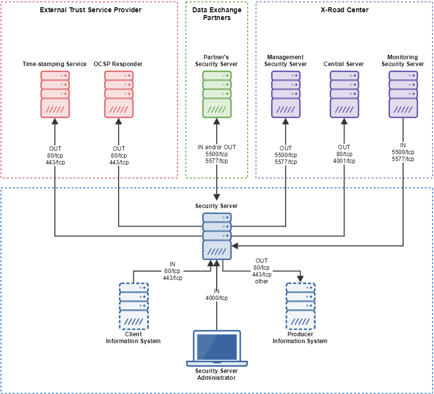
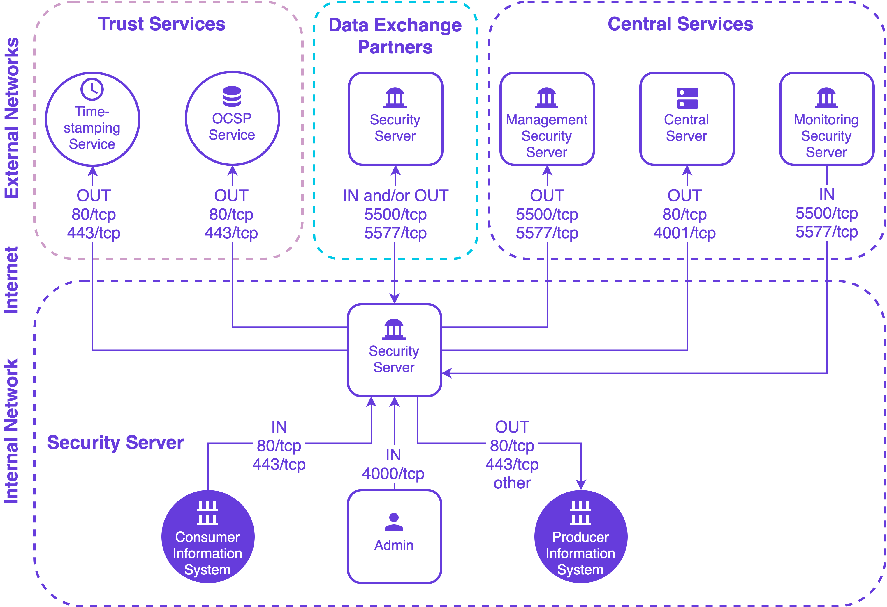

## ig-ss_x-road_v6_security_server_installation_guide: *NIIS* |	*EE*
Version: 2.47  						      |	Version: 2.45  
| Date       | Version | Description                          |	| Date       | Version | Description                         
|------------|---------|------------------------------------- |	|------------|---------|-------------------------------------
| 01.12.2014 | 1.0     | Initial version                      |	| 01.12.2014 | 1.0     | Initial version                     
| 19.01.2015 | 1.1     | License information added            |	| 19.01.2015 | 1.1     | License information added           
| 18.03.2015 | 1.2     | Meta-package for Security Server add |	| 18.03.2015 | 1.2     | Meta-package for security server add
| 02.04.2015 | 1.3     | “sdsb” change to “xroad”             |	| 02.04.2015 | 1.3     | “sdsb” change to “xroad”            
| 27.05.2015 | 1.4     | Some typos fixed                     |	| 27.05.2015 | 1.4     | Some typos fixed                    
| 30.06.2015 | 1.5     | Minor corrections done               |	| 30.06.2015 | 1.5     | Minor corrections done              
| 06.07.2015 | 1.6     | New repository address               |	| 06.07.2015 | 1.6     | New repository address              
| 18.09.2015 | 1.7     | Reference data in [3.2](#32-referenc |	| 18.09.2015 | 1.7     | Reference data in [3.2](#32-referenc
| 18.09.2015 | 2.0     | Editorial changes made               |	| 18.09.2015 | 2.0     | Editorial changes made              
| 13.10.2015 | 2.1     | Editorial changes made               |	| 13.10.2015 | 2.1     | Editorial changes made              
| 10.12.2015 | 2.2     | Updated the installing of the suppor |	| 10.12.2015 | 2.2     | Updated the installing of the suppor
| 17.12.2015 | 2.3     | Added *xroad-addon-wsdlvalidator* pa |	| 17.12.2015 | 2.3     | Added *xroad-addon-wsdlvalidator* pa
| 19.05.2016 | 2.4     | Merged changes from xtee6-doc repo.  |	| 19.05.2016 | 2.4     | Merged changes from xtee6-doc repo. 
| 30.09.2016 | 2.5     | Added chapter „[Different versions o |	| 30.09.2016 | 2.5     | Added chapter „[Different versions o
| 07.12.2016 | 2.6     | Added operational data monitoring pa |	| 07.12.2016 | 2.6     | Added operational data monitoring pa
| 23.02.2017 | 2.7     | Converted to Github flavoured Markdo |	| 23.02.2017 | 2.7     | Converted to Github flavoured Markdo
| 13.04.2017 | 2.8     | Added token ID formatting            |	| 13.04.2017 | 2.8     | Added token ID formatting           
| 25.08.2017 | 2.9     | Update environmental monitoring inst |	| 25.08.2017 | 2.9     | Update environmental monitoring inst
| 15.09.2017 | 2.10    | Added package with configuration spe |	| 15.09.2017 | 2.10    | Added package with configuration spe
| 05.03.2018 | 2.11    | Added terms and abbreviations refere |	| 05.03.2018 | 2.11    | Added terms and abbreviations refere
| 10.04.2018 | 2.12    | Updated chapter "[Installing the Sup |	| 10.04.2018 | 2.12    | Updated chapter "[Installing the Sup
| 14.10.2018 | 2.13    | Update package repository address    |	| 14.10.2018 | 2.13    | Update package repository address   
| 25.10.2018 | 2.14    | Add RHEL7 as supported platform, upd |	| 25.10.2018 | 2.14    | Add RHEL7 as supported platform, upd
| 15.11.2018 | 2.15    | Add Ubuntu 18 installation instructi |	| 15.11.2018 | 2.15    | Add Ubuntu 18 installation instructi
| 28.01.2018 | 2.16    | Update port 2080 documentation       |	| 28.01.2018 | 2.16    | Update port 2080 documentation      
| 30.05.2019 | 2.17    | Added package installation instructi |	| 30.05.2019 | 2.17    | Added package installation instructi
| 11.09.2019 | 2.18    | Remove Ubuntu 14.04 from supported p |	| 11.09.2019 | 2.18    | Remove Ubuntu 14.04 from supported p
| 20.09.2019 | 2.19    | Add instructions for using remote da |	| 20.09.2019 | 2.19    | Add instructions for using remote da
| 12.04.2020 | 2.20    | Add note about the default value of  |	| 12.04.2020 | 2.20    | Add note about the default value of 
| 29.04.2020 | 2.21    | Add instructions how to use remote d |	| 29.04.2020 | 2.21    | Add instructions how to use remote d
| 12.06.2020 | 2.22    | Update reference data regarding JMX  |	| 12.06.2020 | 2.22    | Update reference data regarding JMX 
| 24.06.2020 | 2.23    | Add repository sign key details in s |	| 24.06.2020 | 2.23    | Add repository sign key details in s
| 24.06.2020 | 2.24    | Remove environmental and operational |	| 24.06.2020 | 2.24    | Remove environmental and operational
| 09.08.2020 | 2.25    | Update ports information in section  |	| 09.08.2020 | 2.25    | Update ports information in section 
| 17.08.2020 | 2.26    | Update for RHEL 8.                   |	| 17.08.2020 | 2.26    | Update for RHEL 8.                  
| 08.09.2020 | 2.27    | Fix minimum RAM requirement.         |	| 08.09.2020 | 2.27    | Fix minimum RAM requirement.        
| 16.09.2020 | 2.28    | Describe deployment options and data |	| 16.09.2020 | 2.28    | Describe deployment options and data
| 29.09.2020 | 2.29    | Add instructions for creating databa |	| 29.09.2020 | 2.29    | Add instructions for creating databa
| 19.01.2021 | 2.30    | Add instructions for using an altern |	| 19.01.2021 | 2.30    | Add instructions for using an altern
| 04.02.2021 | 2.31    | Minor updates.                       |	| 04.02.2021 | 2.31    | Minor updates.                      
| 13.04.2021 | 2.32    | Update minimum requirements in secti |	| 13.04.2021 | 2.32    | Update minimum requirements in secti
| 16.04.2021 | 2.33    | Update remote database installation  |	| 16.04.2021 | 2.33    | Update remote database installation 
| 18.05.2021 | 2.34    | Update error handling section        |	| 18.05.2021 | 2.34    | Update error handling section       
| 02.06.2021 | 2.35    | Add backup encryption information    |	| 02.06.2021 | 2.35    | Add backup encryption information   
| 01.07.2021 | 2.36    | Update 3rd party key server          |	| 01.07.2021 | 2.36    | Update 3rd party key server         
| 11.08.2021 | 2.37    | Minor updates                        |	| 11.08.2021 | 2.37    | Minor updates                       
| 18.08.2021 | 2.38    | Minor updates to Annex D             |	| 18.08.2021 | 2.38    | Minor updates to Annex D            
| 25.08.2021 | 2.39    | Update X-Road references from versio |	| 25.08.2021 | 2.39    | Update X-Road references from versio
| 26.08.2021 | 2.40    | Add instructions how to disable the  |	| 26.08.2021 | 2.40    | Add instructions how to disable the 
| 03.08.2021 | 2.41    | Minor fixes                          |	| 03.08.2021 | 2.41    | Minor fixes                         
| 06.09.2021 | 2.42    | Update list of running services      |	| 06.09.2021 | 2.42    | Update list of running services     
| 26.09.2022 | 2.43    | Remove Ubuntu 18.04 support          |	| 26.09.2022 | 2.43    | Remove Ubuntu 18.04 support         
| 23.05.2023 | 2.44    | Minor backup encryption configuratio |	| 23.05.2023 | 2.44    | Minor backup encryption configuratio
| 01.06.2023 | 2.45    | Update references                    |	| 01.06.2023 | 2.45    | Update references                   
| 20.11.2023 | 2.46    | Update firewall configuration docume <
| 27.11.2023 | 2.47    | Updated default proxy client http(s) <
  - [3.4 Configuring firewall](#34-configuring-firewall)      |	  - [3.4 Configuring configuration backup encryption](#34-con
    - [3.4.1 Accepting Connections](#341-accepting-connection <
  - [3.5 Configuring configuration backup encryption](#35-con <
The intended audience of this Installation Guide are X-Road S |	The intended audience of this Installation Guide are X-Road S
There are multiple alternatives how the Security Server can b |	There are multiple alternatives how the security server can b
The Security Server is officially supported on the following  |	The security server is officially supported on the following 
| **Ref** |                                                   |	 **Ref** |                                                   
|---------|-------------------------------------------------- |	 ------ |----------------------------------------------------
| 1.0     | Ubuntu 20.04, Ubuntu 22.04 (x86-64) 3 GB RAM,  |	 1.0    | Ubuntu 20.04, Ubuntu 22.04 (x86-64) 3 GB RAM, 3 
| 1.1     | https://artifactory.niis.org/xroad-release-deb    |	 1.1    | https://artifactory.niis.org/xroad-release-deb     
| 1.2     | https://artifactory.niis.org/api/gpg/key/public   |	 1.2    | https://artifactory.niis.org/api/gpg/key/public    
| 1.3     |                                                   |	 1.3    |                                                    
| 1.4     | **Inbound ports from external network**           |	 1.4    | **Inbound ports from external network**            
| &nbsp;  | TCP 5500                                          |	 &nbsp; | TCP 5500                                           
| &nbsp;  | TCP 5577                                          |	 &nbsp; | TCP 5577                                           
| 1.5     | **Outbound ports to external network**            |	 1.5    | **Outbound ports to external network**             
| &nbsp;  | TCP 5500                                          |	 &nbsp; | TCP 5500                                           
| &nbsp;  | TCP 5577                                          |	 &nbsp; | TCP 5577                                           
| &nbsp;  | TCP 4001                                          |	 &nbsp; | TCP 4001                                           
| &nbsp;  | TCP 80                                            |	 &nbsp; | TCP 80                                             
| &nbsp;  | TCP 80,443                                        |	 &nbsp; | TCP 80,443                                         
| 1.6     | **Inbound ports from internal network**           |	 1.6    | **Inbound ports from internal network**            
| &nbsp;  | TCP 4000                                          |	 &nbsp; | TCP 4000                                           
| &nbsp;  | TCP 8080, 8443                                    |	 &nbsp; | TCP 80, 443                                        
| 1.7     | **Outbound ports to internal network**            |	 1.7    | **Outbound ports to internal network**             
| &nbsp;  | TCP 80, 443, *other*                              |	 &nbsp; | TCP 80, 443, *other*                               
| &nbsp;  | TCP 2080                                          |	 &nbsp; | TCP 2080                                           
| 1.8     |                                                   |	 1.8  |                                                      
| 1.9     |                                                   |	 1.9  |                                                      
| 1.10    | &lt;by default, the server’s IP addresses and nam |	 1.10 | &lt;by default, the server’s IP addresses and names a
| 1.11    | &lt;by default, the server’s IP addresses and nam |	 1.11 | &lt;by default, the server’s IP addresses and names a
							      >
							      >	It is strongly recommended to protect the security server fro
							      >
	      |	
| **Connection Type** | **Source**                            |	**Connection Type** | **Source** | **Target** | **Target Port
|---------------------|-------------------------------------- |	-----------|------------|-----------|-----------|-----------|
| Out                 | Security Server                       |	Out | Security Server | Central Server | 80, 4001 | tcp | |
| Out                 | Security Server                       |	Out | Security Server | Management Security Server | 5500, 55
| Out                 | Security Server                       |	Out | Security Server | OCSP Service | 80 / 443 | tcp | |
| Out                 | Security Server                       |	Out | Security Server | Timestamping Service | 80 / 443 | tcp
| Out                 | Security Server                       |	Out | Security Server | Data Exchange Partner Security Server
| Out                 | Security Server                       |	Out | Security Server | Producer Information System | 80, 443
| In                  | Monitoring Security Server            |	In  | Monitoring Security Server | Security Server | 5500, 55
| In                  | Data Exchange Partner Security Server |	In  | Data Exchange Partner Security Server (Service Consumer
| In                  | Consumer Information System           |	In | Consumer Information System | Security Server | 80, 443 
| In                  | Admin                                 |	In | Admin | Security Server | 4000 | tcp | Source in the int
* if the Security Server is separated from other networks by  |	* if the security server is separated from other networks by 
* if the Security Server has a private IP address, a correspo |	* if the security server has a private IP address, a correspo
Optionally, the Security Server can use a remote database ser |	Optionally, the security server can use a remote database ser
The Security Server installer can create the database and use |	The security server installer can create the database and use
For advanced setup, e.g. when using separate servers for the  |	For advanced setup, e.g. when using separate servers for the 
Issue the following command to install the Security Server pa |	Issue the following command to install the security server pa
* Ensure that the Security Server user interface at https://S |	* Ensure that the security server user interface at https://S
The support for environmental monitoring functionality on a S |	The support for environmental monitoring functionality on a s
During the Security Server initial configuration, the server’ |	During the security server initial configuration, the server’
Configuring the Security Server assumes that the Security Ser |	Configuring the security server assumes that the security ser
ATTENTION: Reference items 2.1 - 2.3 in the reference data ar |	ATTENTION: Reference items 2.1 - 2.3 in the reference data ar
The Security Server code and the software token’s PIN will be |	The security server code and the software token’s PIN will be
 2.2  | E.g. GOV - government  COM - commercial     | M |	 2.2  | E.g. GOV - government  COM - commercial     | M
 2.3  | &lt;security server owner register code&gt;       | M |	 2.3  | &lt;security server owner register code&gt;       | M
* The Security Server owner’s member class (**reference data: |	* The security server owner’s member class (**reference data:
* The Security Server owner’s member code (**reference data:  |	* The security server owner’s member code (**reference data: 
  If the member class and member code are correctly entered,  |	  If the member class and member code are correctly entered, 
* Security server code (**reference data: 2.4**), which is ch |	* Security server code (**reference data: 2.4**), which is ch
### 3.4 Configuring firewall				      |	### 3.4 Configuring configuration backup encryption
							      <
It is strongly recommended to protect the Security Server fro <
applied to both incoming and outgoing connections depending o <
							      <
**Special attention should be paid with the firewall configur <
This type of abuse could result in compromised access to the  <
							      <
It is recommended to allow incoming traffic to specific ports <
should be especially defined, as these ports are used for mak <
							      <
When installing the Security Server, it is strongly recommend <
firewall access rules for specific hosts based on their descr <
							      <
#### 3.4.1 Accepting Connections			      <
							      <
The Security Server has a special `[proxy]` parameter [connec <
the interfaces that the Security Server uses to listen for in <
which makes the Security Server accept connections from any s <
							      <
The parameter can be changed by following the [System Paramet <
							      <
### 3.5 Configuring configuration backup encryption	      <
It is possible to automatically encrypt Security Server confi |	It is possible to automatically encrypt security server confi
By default, backups are encrypted using Security Server's bac |	By default, backups are encrypted using security server's bac
consistency and decrypting backups in case Security Server's  |	consistency and decrypting backups in case security server's 
To externally verify a backup archive's consistency, Security |	To externally verify a backup archive's consistency, security
and imported into external GPG keyring. Note that this can be |	and imported into external GPG keyring. Note that this can be
Security Server backup encryption key is generated during ini |	security server backup encryption key is generated during ini
To export Security Server's backup encryption public key use  |	To export security server's backup encryption public key use 
where `AA/GOV/TS1OWNER/TS1` is the Security Server id.	      |	where `AA/GOV/TS1OWNER/TS1` is the security server id.
If the Security Server installation is aborted with the error |	If the security server installation is aborted with the error
* The PostgreSQL data cluster installed during the installati |	* The PostgreSQL data cluster installed during the installati
The following error message may come up during the Security S |	The following error message may come up during the security s
Upgrading the packages from the current version to the target |	Upgrading the packages from the current version to the target
For example, the following Security Server packages are curre |	For example, the following security server packages are curre
Now trying to upgrade the Security Server packages directly w |	Now trying to upgrade the security server packages directly w
The fix is to upgrade the Security Server in two separate ste |	The fix is to upgrade the security server in two separate ste
X-Road Security Server has multiple deployment options. The s |	X-Road security server has multiple deployment options. The s
The simplest deployment option is to use a single Security Se |	The simplest deployment option is to use a single security se
It is possible to use a remote database with Security Server. |	It is possible to use a remote database with security server.
In production systems it's rarely acceptable to have a single |	In production systems it's rarely acceptable to have a single
Busy production systems may need scalable performance in addi |	Busy production systems may need scalable performance in addi
The following table lists a summary of the Security Server de |	The following table lists a summary of the security server de
Depending on installed components, the Security Server uses o |	Depending on installed components, the security server uses o
* _serverconf_ for storing Security Server configuration (req |	* _serverconf_ for storing security server configuration (req
If necessary, customize the database and role names to suit y |	If necessary, customize the database and role names to suit y
